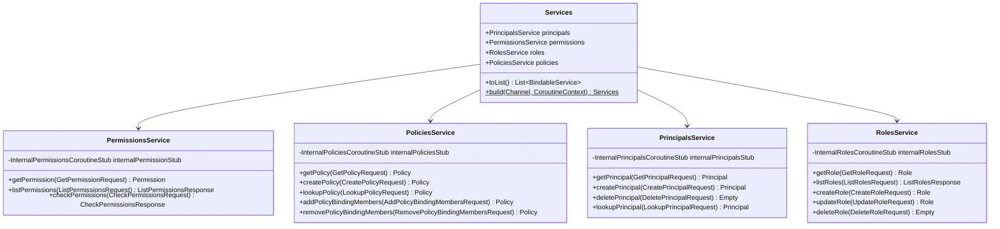

# org.wfanet.measurement.access.service.v1alpha

## Overview
Provides gRPC service implementations for the v1alpha Access Control API, managing authentication principals, permissions, roles, and policies. This package acts as a translation layer between the public v1alpha API and internal access control services, handling request validation, error translation, and resource name conversion.

## Components

### PermissionsService
gRPC service implementation for managing permissions and checking access rights.

| Method | Parameters | Returns | Description |
|--------|------------|---------|-------------|
| getPermission | `request: GetPermissionRequest` | `Permission` | Retrieves a permission by resource name |
| listPermissions | `request: ListPermissionsRequest` | `ListPermissionsResponse` | Lists all permissions with pagination support |
| checkPermissions | `request: CheckPermissionsRequest` | `CheckPermissionsResponse` | Verifies if a principal has specific permissions on a resource |

**Constructor Parameters:**
- `internalPermissionStub: InternalPermissionsCoroutineStub` - Internal gRPC client for permission operations
- `coroutineContext: CoroutineContext` - Coroutine execution context (defaults to EmptyCoroutineContext)

### PoliciesService
gRPC service implementation for managing access control policies and policy bindings.

| Method | Parameters | Returns | Description |
|--------|------------|---------|-------------|
| getPolicy | `request: GetPolicyRequest` | `Policy` | Retrieves a policy by resource name |
| createPolicy | `request: CreatePolicyRequest` | `Policy` | Creates a new policy with role bindings |
| lookupPolicy | `request: LookupPolicyRequest` | `Policy` | Finds a policy by protected resource name |
| addPolicyBindingMembers | `request: AddPolicyBindingMembersRequest` | `Policy` | Adds principals to a policy role binding |
| removePolicyBindingMembers | `request: RemovePolicyBindingMembersRequest` | `Policy` | Removes principals from a policy role binding |

**Constructor Parameters:**
- `internalPoliciesStub: InternalPoliciesCoroutineStub` - Internal gRPC client for policy operations
- `coroutineContext: CoroutineContext` - Coroutine execution context (defaults to EmptyCoroutineContext)

### PrincipalsService
gRPC service implementation for managing authentication principals (users and TLS clients).

| Method | Parameters | Returns | Description |
|--------|------------|---------|-------------|
| getPrincipal | `request: GetPrincipalRequest` | `Principal` | Retrieves a principal by resource name |
| createPrincipal | `request: CreatePrincipalRequest` | `Principal` | Creates a new user principal |
| deletePrincipal | `request: DeletePrincipalRequest` | `Empty` | Deletes a principal by resource name |
| lookupPrincipal | `request: LookupPrincipalRequest` | `Principal` | Finds a principal by user or TLS client identity |

**Constructor Parameters:**
- `internalPrincipalsStub: InternalPrincipalsCoroutineStub` - Internal gRPC client for principal operations
- `coroutineContext: CoroutineContext` - Coroutine execution context (defaults to EmptyCoroutineContext)

### RolesService
gRPC service implementation for managing roles and their associated permissions.

| Method | Parameters | Returns | Description |
|--------|------------|---------|-------------|
| getRole | `request: GetRoleRequest` | `Role` | Retrieves a role by resource name |
| listRoles | `request: ListRolesRequest` | `ListRolesResponse` | Lists all roles with pagination support |
| createRole | `request: CreateRoleRequest` | `Role` | Creates a new role with permissions |
| updateRole | `request: UpdateRoleRequest` | `Role` | Updates an existing role's permissions |
| deleteRole | `request: DeleteRoleRequest` | `Empty` | Deletes a role by resource name |

**Constructor Parameters:**
- `internalRolesStub: InternalRolesCoroutineStub` - Internal gRPC client for role operations
- `coroutineContext: CoroutineContext` - Coroutine execution context (defaults to EmptyCoroutineContext)

**Constants:**
- `DEFAULT_PAGE_SIZE: Int = 50` - Default pagination size when not specified
- `MAX_PAGE_SIZE: Int = 100` - Maximum allowed pagination size

### Services
Data class and factory for instantiating all v1alpha access service implementations.

| Property | Type | Description |
|----------|------|-------------|
| principals | `PrincipalsCoroutineImplBase` | Principals service instance |
| permissions | `PermissionsCoroutineImplBase` | Permissions service instance |
| roles | `RolesCoroutineImplBase` | Roles service instance |
| policies | `PoliciesCoroutineImplBase` | Policies service instance |

| Method | Parameters | Returns | Description |
|--------|------------|---------|-------------|
| toList | - | `List<BindableService>` | Converts service instances to bindable services list |
| build (companion) | `internalApiChannel: Channel, coroutineContext: CoroutineContext` | `Services` | Constructs all service implementations with shared configuration |

## Extension Functions

### Resource Conversion Functions

| Function | Parameters | Returns | Description |
|----------|------------|---------|-------------|
| InternalPrincipal.toPrincipal | - | `Principal` | Converts internal principal to v1alpha API format |
| InternalPrincipal.OAuthUser.toOAuthUser | - | `Principal.OAuthUser` | Converts internal OAuth user to v1alpha format |
| InternalPrincipal.TlsClient.toTlsClient | - | `Principal.TlsClient` | Converts internal TLS client to v1alpha format |
| InternalPermission.toPermission | - | `Permission` | Converts internal permission to v1alpha format |
| InternalRole.toRole | - | `Role` | Converts internal role to v1alpha format |
| InternalPolicy.toPolicy | - | `Policy` | Converts internal policy to v1alpha format |
| Principal.OAuthUser.toInternal | - | `InternalPrincipal.OAuthUser` | Converts v1alpha OAuth user to internal format |
| Principal.TlsClient.toInternal | - | `InternalPrincipal.TlsClient` | Converts v1alpha TLS client to internal format |

## Dependencies

- `org.wfanet.measurement.access.v1alpha` - Public v1alpha access control API protobuf definitions
- `org.wfanet.measurement.internal.access` - Internal access control service API and implementations
- `org.wfanet.measurement.access.service` - Core access service exception types and key utilities
- `org.wfanet.measurement.common` - Base64 encoding/decoding utilities for page tokens
- `org.wfanet.measurement.common.api` - Resource ID validation and gRPC list utilities
- `io.grpc` - gRPC framework for service implementation
- `com.google.protobuf` - Protobuf message types

## Error Handling

All service methods perform comprehensive error translation from internal status exceptions to appropriate v1alpha API exceptions:

| Internal Error | Translated Exception | gRPC Status |
|----------------|---------------------|-------------|
| PERMISSION_NOT_FOUND | PermissionNotFoundException | NOT_FOUND |
| PRINCIPAL_NOT_FOUND | PrincipalNotFoundException | NOT_FOUND |
| ROLE_NOT_FOUND | RoleNotFoundException | NOT_FOUND |
| POLICY_NOT_FOUND | PolicyNotFoundException | NOT_FOUND |
| POLICY_NOT_FOUND_FOR_PROTECTED_RESOURCE | PolicyNotFoundForProtectedResourceException | NOT_FOUND |
| PRINCIPAL_ALREADY_EXISTS | PrincipalAlreadyExistsException | ALREADY_EXISTS |
| ROLE_ALREADY_EXISTS | RoleAlreadyExistsException | ALREADY_EXISTS |
| POLICY_ALREADY_EXISTS | PolicyAlreadyExistsException | ALREADY_EXISTS |
| PRINCIPAL_TYPE_NOT_SUPPORTED | PrincipalTypeNotSupportedException | INVALID_ARGUMENT or FAILED_PRECONDITION |
| ETAG_MISMATCH | EtagMismatchException | varies |
| REQUIRED_FIELD_NOT_SET | RequiredFieldNotSetException | INVALID_ARGUMENT |
| INVALID_FIELD_VALUE | InvalidFieldValueException | INVALID_ARGUMENT |

## Validation Rules

### Resource Name Validation
- All resource names are validated using key parsers (PermissionKey, PrincipalKey, RoleKey, PolicyKey)
- Empty resource names trigger RequiredFieldNotSetException
- Malformed names trigger InvalidFieldValueException

### Resource ID Validation
- Resource IDs must conform to RFC 1034 regex pattern
- Applied during create operations for principals, roles, and policies

### Page Token Handling
- Page tokens are base64-URL encoded protobuf messages
- Invalid tokens result in InvalidFieldValueException
- Empty tokens are treated as first page request

### Pagination Constraints
- Negative page sizes are rejected
- Page sizes are coerced between DEFAULT_PAGE_SIZE (50) and MAX_PAGE_SIZE (100)

## Usage Example

```kotlin
// Initialize services with internal API channel
val internalChannel: Channel = createInternalChannel()
val services = Services.build(internalChannel)

// Check if a principal has specific permissions
val checkRequest = checkPermissionsRequest {
  principal = "principals/user-123"
  protectedResource = "measurementConsumers/mc-456"
  permissions += listOf("permissions/read", "permissions/write")
}
val response = services.permissions.checkPermissions(checkRequest)
val hasPermissions = response.permissionsList.containsAll(checkRequest.permissionsList)

// Create a policy with role bindings
val createPolicyRequest = createPolicyRequest {
  policyId = "mc-456-policy"
  policy = policy {
    protectedResource = "measurementConsumers/mc-456"
    bindings += binding {
      role = "roles/viewer"
      members += "principals/user-789"
    }
  }
}
val newPolicy = services.policies.createPolicy(createPolicyRequest)

// List all roles with pagination
val listRequest = listRolesRequest {
  pageSize = 50
}
val roles = services.roles.listRoles(listRequest)
```

## Class Diagram


