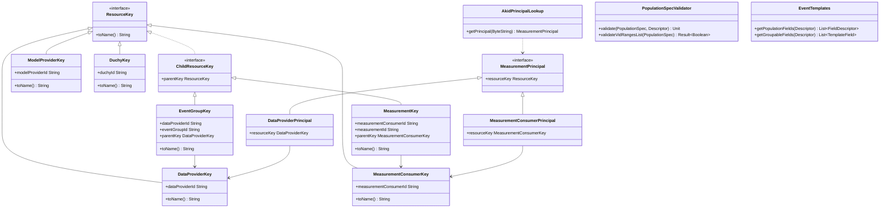

# org.wfanet.measurement.api

## Overview
The `org.wfanet.measurement.api` package provides core API infrastructure for the Cross-Media Measurement system, including authentication, authorization, resource naming, principal management, and type-safe resource key abstractions. It supports both v2alpha API version and implements gRPC-based authentication mechanisms using API keys, X.509 certificates, and OpenID Connect tokens.

## Components

### AccountConstants
Provides context keys and metadata keys for authenticated account management.

| Method | Parameters | Returns | Description |
|--------|------------|---------|-------------|
| N/A | N/A | N/A | Object with constant definitions only |

### ApiKeyConstants
Defines metadata keys for API authentication.

| Method | Parameters | Returns | Description |
|--------|------------|---------|-------------|
| N/A | N/A | N/A | Object with constant definitions only |

### ApiKeyCredentials
Implements gRPC CallCredentials for API key authentication.

| Method | Parameters | Returns | Description |
|--------|------------|---------|-------------|
| applyRequestMetadata | `requestInfo: RequestInfo, appExecutor: Executor, applier: MetadataApplier` | `Unit` | Applies API key to request metadata |
| fromHeaders | `headers: Metadata` | `ApiKeyCredentials?` | Extracts credentials from metadata headers |

### Version
Enumerates supported API versions.

| Method | Parameters | Returns | Description |
|--------|------------|---------|-------------|
| fromString | `string: String` | `Version` | Parses version from string or throws |
| fromStringOrNull | `string: String` | `Version?` | Parses version from string or returns null |
| toString | - | `String` | Returns version string representation |

## Extensions

### Account Extensions
| Function | Parameters | Returns | Description |
|----------|------------|---------|-------------|
| accountFromCurrentContext | - | `Account` | Retrieves authenticated account from gRPC context |
| withIdToken | `idToken: String?` | `T` | Attaches ID token to gRPC stub |

### API Key Extensions
| Function | Parameters | Returns | Description |
|----------|------------|---------|-------------|
| withAuthenticationKey | `authenticationKey: String?` | `T` | Attaches API key to gRPC stub |
| withApiKeyCredentials | `apiAuthenticationKey: String` | `T` | Attaches API key credentials to gRPC stub |

## Data Structures

### AccountConstants Properties
| Property | Type | Description |
|----------|------|-------------|
| CONTEXT_ACCOUNT_KEY | `Context.Key<Account>` | Context key for authenticated account |
| CONTEXT_ID_TOKEN_KEY | `Context.Key<String>` | Context key for provided ID token |
| ID_TOKEN_METADATA_KEY | `Metadata.Key<String>` | Metadata key for OpenID Connect token |

### ApiKeyConstants Properties
| Property | Type | Description |
|----------|------|-------------|
| API_AUTHENTICATION_KEY_METADATA_KEY | `Metadata.Key<String>` | Metadata key for API authentication |

### ApiKeyCredentials Properties
| Property | Type | Description |
|----------|------|-------------|
| apiAuthenticationKey | `String` | The API authentication key value |

### Version Enum Values
| Value | String | Description |
|-------|--------|-------------|
| V2_ALPHA | "v2alpha" | Version 2 Alpha API |

## Dependencies
- `io.grpc` - gRPC framework for context, metadata, and stub management
- `org.wfanet.measurement.common.grpc` - Common gRPC utilities
- `org.wfanet.measurement.internal.kingdom` - Internal Kingdom data models

## Usage Example
```kotlin
// Authenticate with API key
val stub = MyServiceGrpc.newBlockingStub(channel)
  .withApiKeyCredentials("my-api-key")

// Attach ID token to stub
val authenticatedStub = stub.withIdToken("openid-connect-token")

// Access account from context
val account = accountFromCurrentContext
```

# org.wfanet.measurement.api.v2alpha

## Overview
The v2alpha API package provides resource key abstractions, principal-based authentication, event template validation, population specification handling, and utilities for the Cross-Media Measurement system. It implements a comprehensive resource naming scheme following Google API design patterns with hierarchical resource keys for data providers, measurement consumers, model providers, duchies, and their associated resources.

## Components

### Resource Keys

#### AccountKey
Represents the resource key for an Account.

| Method | Parameters | Returns | Description |
|--------|------------|---------|-------------|
| toName | - | `String` | Converts key to resource name format |
| fromName | `resourceName: String` | `AccountKey?` | Parses resource name to key |

#### DataProviderKey
Represents the resource key for a Data Provider.

| Method | Parameters | Returns | Description |
|--------|------------|---------|-------------|
| toName | - | `String` | Converts key to resource name format |
| fromName | `resourceName: String` | `DataProviderKey?` | Parses resource name to key |

#### MeasurementConsumerKey
Represents the resource key for a Measurement Consumer.

| Method | Parameters | Returns | Description |
|--------|------------|---------|-------------|
| toName | - | `String` | Converts key to resource name format |
| fromName | `resourceName: String` | `MeasurementConsumerKey?` | Parses resource name to key |

#### ModelProviderKey
Represents the resource key for a Model Provider.

| Method | Parameters | Returns | Description |
|--------|------------|---------|-------------|
| toName | - | `String` | Converts key to resource name format |
| fromName | `resourceName: String` | `ModelProviderKey?` | Parses resource name to key |

#### DuchyKey
Represents the resource key for a Duchy.

| Method | Parameters | Returns | Description |
|--------|------------|---------|-------------|
| toName | - | `String` | Converts key to resource name format |
| fromName | `resourceName: String` | `DuchyKey?` | Parses resource name to key |

#### CertificateKey
Sealed interface for certificate resource keys across different parent types.

| Method | Parameters | Returns | Description |
|--------|------------|---------|-------------|
| fromName | `resourceName: String` | `CertificateKey?` | Parses any certificate resource name |

#### DataProviderCertificateKey
Certificate key for Data Provider certificates.

| Method | Parameters | Returns | Description |
|--------|------------|---------|-------------|
| toName | - | `String` | Converts key to resource name format |
| fromName | `resourceName: String` | `DataProviderCertificateKey?` | Parses resource name to key |

#### MeasurementKey
Represents the resource key for a Measurement.

| Method | Parameters | Returns | Description |
|--------|------------|---------|-------------|
| toName | - | `String` | Converts key to resource name format |
| fromName | `resourceName: String` | `MeasurementKey?` | Parses resource name to key |

#### EventGroupKey
Represents the resource key for an Event Group.

| Method | Parameters | Returns | Description |
|--------|------------|---------|-------------|
| toName | - | `String` | Converts key to resource name format |
| fromName | `resourceName: String` | `EventGroupKey?` | Parses resource name to key |

#### RequisitionKey
Sealed interface for requisition resource keys.

| Method | Parameters | Returns | Description |
|--------|------------|---------|-------------|
| fromName | `resourceName: String` | `RequisitionKey?` | Parses any requisition resource name |

#### CanonicalRequisitionKey
Canonical form of requisition key under a Data Provider.

| Method | Parameters | Returns | Description |
|--------|------------|---------|-------------|
| toName | - | `String` | Converts key to resource name format |
| fromName | `resourceName: String` | `CanonicalRequisitionKey?` | Parses resource name to key |

#### RecurringExchangeKey
Sealed interface for recurring exchange keys.

| Method | Parameters | Returns | Description |
|--------|------------|---------|-------------|
| fromName | `resourceName: String` | `RecurringExchangeKey?` | Parses any recurring exchange name |

#### CanonicalRecurringExchangeKey
Canonical form of recurring exchange key.

| Method | Parameters | Returns | Description |
|--------|------------|---------|-------------|
| toName | - | `String` | Converts key to resource name format |
| fromName | `resourceName: String` | `CanonicalRecurringExchangeKey?` | Parses resource name to key |

#### ExchangeKey
Sealed interface for exchange keys.

| Method | Parameters | Returns | Description |
|--------|------------|---------|-------------|
| fromName | `resourceName: String` | `ExchangeKey?` | Parses any exchange resource name |

#### CanonicalExchangeKey
Canonical form of exchange key.

| Method | Parameters | Returns | Description |
|--------|------------|---------|-------------|
| toName | - | `String` | Converts key to resource name format |
| fromName | `resourceName: String` | `CanonicalExchangeKey?` | Parses resource name to key |

#### PublicKeyKey
Sealed interface for public key resources.

| Method | Parameters | Returns | Description |
|--------|------------|---------|-------------|
| fromName | `resourceName: String` | `PublicKeyKey?` | Parses any public key resource name |

#### DataProviderPublicKeyKey
Public key resource for Data Providers.

| Method | Parameters | Returns | Description |
|--------|------------|---------|-------------|
| toName | - | `String` | Converts key to resource name format |
| fromName | `resourceName: String` | `DataProviderPublicKeyKey?` | Parses resource name to key |

#### MeasurementConsumerPublicKeyKey
Public key resource for Measurement Consumers.

| Method | Parameters | Returns | Description |
|--------|------------|---------|-------------|
| toName | - | `String` | Converts key to resource name format |
| fromName | `resourceName: String` | `MeasurementConsumerPublicKeyKey?` | Parses resource name to key |

#### PopulationKey
Represents the resource key for a Population.

| Method | Parameters | Returns | Description |
|--------|------------|---------|-------------|
| toName | - | `String` | Converts key to resource name format |
| fromName | `resourceName: String` | `PopulationKey?` | Parses resource name to key |

#### ProtocolConfigKey
Represents the resource key for a Protocol Configuration.

| Method | Parameters | Returns | Description |
|--------|------------|---------|-------------|
| toName | - | `String` | Converts key to resource name format |
| fromName | `resourceName: String` | `ProtocolConfigKey?` | Parses resource name to key |

#### ModelSuiteKey
Represents the resource key for a Model Suite.

| Method | Parameters | Returns | Description |
|--------|------------|---------|-------------|
| toName | - | `String` | Converts key to resource name format |
| fromName | `resourceName: String` | `ModelSuiteKey?` | Parses resource name to key |

#### ModelLineKey
Represents the resource key for a Model Line.

| Method | Parameters | Returns | Description |
|--------|------------|---------|-------------|
| toName | - | `String` | Converts key to resource name format |
| fromName | `resourceName: String` | `ModelLineKey?` | Parses resource name to key |

#### ApiKeyKey
Represents the resource key for an API Key.

| Method | Parameters | Returns | Description |
|--------|------------|---------|-------------|
| toName | - | `String` | Converts key to resource name format |
| fromName | `resourceName: String` | `ApiKeyKey?` | Parses resource name to key |

### Principal Management

#### MeasurementPrincipal
Sealed interface identifying the sender of inbound gRPC requests.

| Method | Parameters | Returns | Description |
|--------|------------|---------|-------------|
| fromName | `name: String` | `MeasurementPrincipal?` | Parses resource name to principal |

#### DataProviderPrincipal
Principal representing a Data Provider.

| Property | Type | Description |
|----------|------|-------------|
| resourceKey | `DataProviderKey` | The associated resource key |

#### ModelProviderPrincipal
Principal representing a Model Provider.

| Property | Type | Description |
|----------|------|-------------|
| resourceKey | `ModelProviderKey` | The associated resource key |

#### MeasurementConsumerPrincipal
Principal representing a Measurement Consumer.

| Property | Type | Description |
|----------|------|-------------|
| resourceKey | `MeasurementConsumerKey` | The associated resource key |

#### AccountPrincipal
Principal representing an Account.

| Property | Type | Description |
|----------|------|-------------|
| resourceKey | `AccountKey` | The associated resource key |

#### DuchyPrincipal
Principal representing a Duchy.

| Property | Type | Description |
|----------|------|-------------|
| resourceKey | `DuchyKey` | The associated resource key |

#### AkidPrincipalLookup
Looks up MeasurementPrincipal by authority key identifier (AKID).

| Method | Parameters | Returns | Description |
|--------|------------|---------|-------------|
| constructor | `config: AuthorityKeyToPrincipalMap` | `AkidPrincipalLookup` | Creates lookup from config |
| constructor | `textProto: File` | `AkidPrincipalLookup` | Creates lookup from file |
| getPrincipal | `lookupKey: ByteString` | `MeasurementPrincipal?` | Retrieves principal by AKID |

#### ContextKeys
Defines gRPC context keys.

| Property | Type | Description |
|----------|------|-------------|
| PRINCIPAL_CONTEXT_KEY | `Context.Key<MeasurementPrincipal>` | Context key for authenticated principal |

### Event Templates and Validation

#### EventTemplates
Utilities for event template processing.

| Method | Parameters | Returns | Description |
|--------|------------|---------|-------------|
| getPopulationFields | `eventMessageDescriptor: Descriptors.Descriptor` | `List<Descriptors.FieldDescriptor>` | Extracts population attribute fields |
| getPopulationFieldsByTemplateType | `eventMessageDescriptor: Descriptors.Descriptor` | `Map<Descriptors.Descriptor, List<Descriptors.FieldDescriptor>>` | Groups population fields by template |
| getTemplateDescriptor | `templateType: Descriptors.Descriptor` | `EventTemplateDescriptor` | Retrieves template descriptor |
| getEventDescriptor | `eventMessageDescriptor: Descriptors.Descriptor` | `EventDescriptor` | Retrieves event descriptor |
| getGroupableFields | `eventMessageDescriptor: Descriptors.Descriptor` | `List<TemplateField>` | Extracts groupable fields sorted by path |

#### EventMessageDescriptor
Wrapper around Descriptor for Event messages with reporting metadata.

| Property | Type | Description |
|----------|------|-------------|
| eventTemplateFieldsByPath | `Map<String, EventTemplateFieldInfo>` | Map of template field paths to metadata |

#### PopulationSpecValidator
Validates PopulationSpec messages.

| Method | Parameters | Returns | Description |
|--------|------------|---------|-------------|
| validate | `populationSpec: PopulationSpec, eventMessageDescriptor: Descriptors.Descriptor` | `Unit` | Validates spec or throws exception |
| validateVidRangesList | `populationSpec: PopulationSpec` | `Result<Boolean>` | Validates VID ranges are disjoint |

### Packed Messages

#### SignedMessage Extensions
| Function | Parameters | Returns | Description |
|----------|------------|---------|-------------|
| packedValue | - | `ByteString` | Extracts packed value from signed message |
| unpack | - | `T` | Unpacks protobuf message from signed message |
| setMessage | `value: ProtoAny` | `Unit` | Sets message and data fields |

#### EncryptedMessage Extensions
| Function | Parameters | Returns | Description |
|----------|------------|---------|-------------|
| isA | - | `Boolean` | Checks if message type matches type parameter |
| isA | `descriptor: Descriptors.Descriptor` | `Boolean` | Checks if message type matches descriptor |

### Principal Server Interceptor

| Function | Parameters | Returns | Description |
|----------|------------|---------|-------------|
| principalFromCurrentContext | - | `MeasurementPrincipal` | Retrieves authenticated principal from context |
| withPrincipal | `authenticatedPrincipal: MeasurementPrincipal, action: () -> R` | `R` | Executes action with principal in context |
| withDataProviderPrincipal | `dataProviderName: String, block: () -> T` | `T` | Executes block with data provider principal |
| withModelProviderPrincipal | `modelProviderName: String, block: () -> T` | `T` | Executes block with model provider principal |
| withDuchyPrincipal | `duchyName: String, block: () -> T` | `T` | Executes block with duchy principal |
| withMeasurementConsumerPrincipal | `measurementConsumerName: String, block: () -> T` | `T` | Executes block with consumer principal |
| Context.withPrincipal | `principal: MeasurementPrincipal` | `Context` | Creates context with principal |
| BindableService.withPrincipalsFromX509AuthorityKeyIdentifiers | `akidPrincipalLookup: PrincipalLookup<MeasurementPrincipal, ByteString>` | `ServerServiceDefinition` | Wraps service with AKID authentication |

### VidRange Extensions

| Function | Parameters | Returns | Description |
|----------|------------|---------|-------------|
| VidRange.size | - | `Long` | Calculates size of VID range |

## Data Structures

### AccountKey
| Property | Type | Description |
|----------|------|-------------|
| accountId | `String` | Account identifier |

### DataProviderKey
| Property | Type | Description |
|----------|------|-------------|
| dataProviderId | `String` | Data Provider identifier |

### MeasurementConsumerKey
| Property | Type | Description |
|----------|------|-------------|
| measurementConsumerId | `String` | Measurement Consumer identifier |

### ModelProviderKey
| Property | Type | Description |
|----------|------|-------------|
| modelProviderId | `String` | Model Provider identifier |

### DuchyKey
| Property | Type | Description |
|----------|------|-------------|
| duchyId | `String` | Duchy identifier |

### DataProviderCertificateKey
| Property | Type | Description |
|----------|------|-------------|
| dataProviderId | `String` | Data Provider identifier |
| certificateId | `String` | Certificate identifier |
| parentKey | `DataProviderKey` | Parent resource key |

### MeasurementKey
| Property | Type | Description |
|----------|------|-------------|
| measurementConsumerId | `String` | Measurement Consumer identifier |
| measurementId | `String` | Measurement identifier |
| parentKey | `MeasurementConsumerKey` | Parent resource key |

### EventGroupKey
| Property | Type | Description |
|----------|------|-------------|
| dataProviderId | `String` | Data Provider identifier |
| eventGroupId | `String` | Event Group identifier |
| parentKey | `DataProviderKey` | Parent resource key |

### CanonicalRequisitionKey
| Property | Type | Description |
|----------|------|-------------|
| parentKey | `DataProviderKey` | Data Provider parent key |
| requisitionId | `String` | Requisition identifier |
| dataProviderId | `String` | Data Provider identifier (derived) |

### CanonicalRecurringExchangeKey
| Property | Type | Description |
|----------|------|-------------|
| recurringExchangeId | `String` | Recurring Exchange identifier |

### CanonicalExchangeKey
| Property | Type | Description |
|----------|------|-------------|
| parentKey | `CanonicalRecurringExchangeKey` | Recurring Exchange parent key |
| exchangeId | `String` | Exchange identifier |
| recurringExchangeId | `String` | Recurring Exchange identifier (derived) |

### DataProviderPublicKeyKey
| Property | Type | Description |
|----------|------|-------------|
| parentKey | `DataProviderKey` | Data Provider parent key |
| dataProviderId | `String` | Data Provider identifier (derived) |

### MeasurementConsumerPublicKeyKey
| Property | Type | Description |
|----------|------|-------------|
| parentKey | `MeasurementConsumerKey` | Measurement Consumer parent key |
| measurementConsumerId | `String` | Measurement Consumer identifier (derived) |

### PopulationKey
| Property | Type | Description |
|----------|------|-------------|
| parentKey | `DataProviderKey` | Data Provider parent key |
| populationId | `String` | Population identifier |
| dataProviderId | `String` | Data Provider identifier (derived) |

### ProtocolConfigKey
| Property | Type | Description |
|----------|------|-------------|
| protocolConfigId | `String` | Protocol Config identifier |

### ModelSuiteKey
| Property | Type | Description |
|----------|------|-------------|
| modelProviderId | `String` | Model Provider identifier |
| modelSuiteId | `String` | Model Suite identifier |

### ModelLineKey
| Property | Type | Description |
|----------|------|-------------|
| parentKey | `ModelSuiteKey` | Model Suite parent key |
| modelLineId | `String` | Model Line identifier |
| modelProviderId | `String` | Model Provider identifier (derived) |
| modelSuiteId | `String` | Model Suite identifier (derived) |

### ApiKeyKey
| Property | Type | Description |
|----------|------|-------------|
| measurementConsumerId | `String` | Measurement Consumer identifier |
| apiKeyId | `String` | API Key identifier |

### IdVariable
Internal enum for resource name variable parsing.

| Value | Description |
|-------|-------------|
| RECURRING_EXCHANGE | Recurring exchange ID variable |
| EVENT_GROUP | Event group ID variable |
| DATA_PROVIDER | Data provider ID variable |
| MODEL_PROVIDER | Model provider ID variable |
| MEASUREMENT_CONSUMER | Measurement consumer ID variable |
| DUCHY | Duchy ID variable |
| CERTIFICATE | Certificate ID variable |
| API_KEY | API key ID variable |
| MEASUREMENT | Measurement ID variable |
| REQUISITION | Requisition ID variable |
| EXCHANGE | Exchange ID variable |
| PROTOCOL_CONFIG | Protocol config ID variable |
| ACCOUNT | Account ID variable |
| MODEL_SUITE | Model suite ID variable |
| MODEL_LINE | Model line ID variable |
| POPULATION | Population ID variable |

### EventTemplates.TemplateField
| Property | Type | Description |
|----------|------|-------------|
| descriptor | `Descriptors.FieldDescriptor` | Protobuf field descriptor |
| cmmsDescriptor | `EventFieldDescriptor` | CMMS-specific field metadata |
| path | `String` | Full path to field in template |

### EventMessageDescriptor.EventTemplateFieldInfo
| Property | Type | Description |
|----------|------|-------------|
| mediaType | `MediaType` | Media type of the template |
| isPopulationAttribute | `Boolean` | Whether field is a population attribute |
| supportedReportingFeatures | `SupportedReportingFeatures` | Reporting capabilities |
| type | `Descriptors.FieldDescriptor.Type` | Protobuf field type |
| enumType | `Descriptors.EnumDescriptor?` | Enum descriptor if applicable |

### EventMessageDescriptor.SupportedReportingFeatures
| Property | Type | Description |
|----------|------|-------------|
| groupable | `Boolean` | Supports grouping in reports |
| filterable | `Boolean` | Supports filtering in queries |
| impressionQualification | `Boolean` | Supports impression qualification |

### PopulationSpecValidationException
| Property | Type | Description |
|----------|------|-------------|
| message | `String` | Error message |
| details | `List<Detail>` | List of validation error details |

### PopulationSpecValidationException.VidRangeIndex
| Property | Type | Description |
|----------|------|-------------|
| subPopulationIndex | `Int` | Subpopulation index |
| vidRangeIndex | `Int` | VID range index within subpopulation |

## Dependencies
- `io.grpc` - gRPC context and server interceptor management
- `com.google.protobuf` - Protocol buffer descriptor and message handling
- `org.wfanet.measurement.common` - Common resource naming and parsing utilities
- `org.wfanet.measurement.common.api` - Common API resource key abstractions
- `org.wfanet.measurement.common.identity` - Duchy identity and AKID management
- `org.wfanet.measurement.config` - Authority key to principal mapping configuration

## Usage Example
```kotlin
// Parse and use resource keys
val dataProviderKey = DataProviderKey.fromName("dataProviders/123")
val eventGroupKey = EventGroupKey("123", "456")
println(eventGroupKey.toName()) // "dataProviders/123/eventGroups/456"

// Work with principals in context
withDataProviderPrincipal("dataProviders/123") {
  val principal = principalFromCurrentContext
  // principal is DataProviderPrincipal
}

// Validate population spec
val validator = PopulationSpecValidator
validator.validate(populationSpec, eventDescriptor)

// Extract event template fields
val populationFields = EventTemplates.getPopulationFields(eventDescriptor)
val groupableFields = EventTemplates.getGroupableFields(eventDescriptor)

// Work with signed messages
val message: SignedMessage = getSignedMessage()
val unpackedProto: MyProto = message.unpack()
val packedBytes = message.packedValue

// Check encrypted message types
val encrypted: EncryptedMessage = getEncryptedMessage()
if (encrypted.isA<MyMessageType>()) {
  // Handle specific type
}

// Setup principal authentication
val service: BindableService = MyService()
val authenticated = service.withPrincipalsFromX509AuthorityKeyIdentifiers(akidLookup)
```

## Class Diagram


# org.wfanet.measurement.api.v2alpha.tools

## Overview
The tools subpackage provides command-line utilities for working with encryption public keys, validating event templates, and other API-related operations. These tools support serialization, deserialization, signing, and validation workflows.

## Components

### EncryptionPublicKeys
Command-line utility for EncryptionPublicKey message operations.

| Subcommand | Description |
|------------|-------------|
| serialize | Serializes key data to EncryptionPublicKey message |
| deserialize | Extracts key data from EncryptionPublicKey message |
| sign | Signs EncryptionPublicKey message with X.509 certificate |

### EventTemplateValidator
Validates event templates used in event message types.

| Method | Parameters | Returns | Description |
|--------|------------|---------|-------------|
| run | - | `Unit` | Validates event templates from descriptor sets |

## Dependencies
- `com.google.protobuf` - Protobuf descriptor and type registry
- `picocli` - Command-line argument parsing
- `org.wfanet.measurement.common.crypto` - Cryptographic operations
- `org.wfanet.measurement.api.v2alpha` - Event annotation descriptors

## Usage Example
```bash
# Serialize encryption public key
EncryptionPublicKeys serialize --format TINK_KEYSET --data key.bin --out encrypted.pb

# Deserialize encryption public key
EncryptionPublicKeys deserialize --in encrypted.pb --out key.bin

# Sign encryption public key
EncryptionPublicKeys sign --certificate cert.pem --signing-key key.der --in encrypted.pb --out signature.bin

# Validate event templates
EventTemplateValidator --event-proto com.example.MyEvent --descriptor-set event.desc
```
