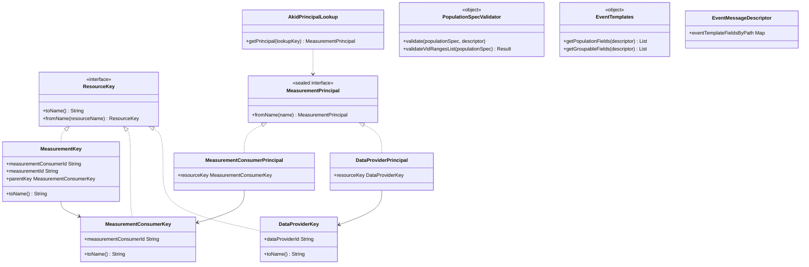

# org.wfanet.measurement.api.v2alpha

## Overview
The `org.wfanet.measurement.api.v2alpha` package provides the v2alpha API layer for the Cross-Media Measurement system. It defines resource keys for hierarchical resource naming, principal-based authentication and authorization, protobuf message utilities, validation logic for population specifications, and event template handling. This package serves as the core foundation for API interactions between measurement consumers, data providers, model providers, and duchies.

## Components

### Resource Keys

Resource keys implement hierarchical naming patterns for system entities. All keys extend `ResourceKey` and provide bidirectional conversion between object representation and resource name strings.

#### AccountKey
Represents an Account resource.

| Property | Type | Description |
|----------|------|-------------|
| accountId | `String` | Unique identifier for the account |

| Method | Parameters | Returns | Description |
|--------|------------|---------|-------------|
| toName | - | `String` | Converts key to resource name format |
| fromName | `resourceName: String` | `AccountKey?` | Parses resource name into key object |

#### ApiKeyKey
Represents an API key belonging to a measurement consumer.

| Property | Type | Description |
|----------|------|-------------|
| measurementConsumerId | `String` | Parent measurement consumer identifier |
| apiKeyId | `String` | Unique API key identifier |

| Method | Parameters | Returns | Description |
|--------|------------|---------|-------------|
| toName | - | `String` | Converts to `measurementConsumers/{id}/apiKeys/{id}` |
| fromName | `resourceName: String` | `ApiKeyKey?` | Parses resource name into key |

#### CertificateKey
Sealed interface for certificate resources across entity types.

| Method | Parameters | Returns | Description |
|--------|------------|---------|-------------|
| fromName | `resourceName: String` | `CertificateKey?` | Parses name into appropriate certificate key type |

Implementations: `DataProviderCertificateKey`, `MeasurementConsumerCertificateKey`, `DuchyCertificateKey`, `ModelProviderCertificateKey`

#### DataProviderKey
Represents a data provider entity.

| Property | Type | Description |
|----------|------|-------------|
| dataProviderId | `String` | Unique data provider identifier |

Implements: `ResourceKey`, `CertificateParentKey`, `RecurringExchangeParentKey`, `RequisitionParentKey`, `PublicKeyParentKey`

| Method | Parameters | Returns | Description |
|--------|------------|---------|-------------|
| toName | - | `String` | Converts to `dataProviders/{id}` |
| fromName | `resourceName: String` | `DataProviderKey?` | Parses resource name into key |

#### DuchyKey
Represents a duchy (computation node) in the system.

| Property | Type | Description |
|----------|------|-------------|
| duchyId | `String` | Unique duchy identifier |

| Method | Parameters | Returns | Description |
|--------|------------|---------|-------------|
| toName | - | `String` | Converts to `duchies/{id}` |
| fromName | `resourceName: String` | `DuchyKey?` | Parses resource name into key |

#### EventGroupKey
Represents an event group owned by a data provider.

| Property | Type | Description |
|----------|------|-------------|
| dataProviderId | `String` | Parent data provider identifier |
| eventGroupId | `String` | Unique event group identifier |
| parentKey | `DataProviderKey` | Parent resource key |

| Method | Parameters | Returns | Description |
|--------|------------|---------|-------------|
| toName | - | `String` | Converts to `dataProviders/{id}/eventGroups/{id}` |
| fromName | `resourceName: String` | `EventGroupKey?` | Parses resource name into key |

#### ExchangeKey
Sealed interface for exchange resources in recurring exchange workflows.

| Property | Type | Description |
|----------|------|-------------|
| parentKey | `RecurringExchangeKey` | Parent recurring exchange |
| exchangeId | `String` | Unique exchange identifier |

Implementations: `CanonicalExchangeKey`, `DataProviderExchangeKey`, `ModelProviderExchangeKey`

#### MeasurementKey
Represents a measurement resource.

| Property | Type | Description |
|----------|------|-------------|
| measurementConsumerId | `String` | Owner measurement consumer ID |
| measurementId | `String` | Unique measurement identifier |
| parentKey | `MeasurementConsumerKey` | Parent key reference |

| Method | Parameters | Returns | Description |
|--------|------------|---------|-------------|
| toName | - | `String` | Converts to `measurementConsumers/{id}/measurements/{id}` |
| fromName | `resourceName: String` | `MeasurementKey?` | Parses resource name into key |

#### MeasurementConsumerKey
Represents a measurement consumer entity.

| Property | Type | Description |
|----------|------|-------------|
| measurementConsumerId | `String` | Unique consumer identifier |

Implements: `ResourceKey`, `CertificateParentKey`, `PublicKeyParentKey`

| Method | Parameters | Returns | Description |
|--------|------------|---------|-------------|
| toName | - | `String` | Converts to `measurementConsumers/{id}` |
| fromName | `resourceName: String` | `MeasurementConsumerKey?` | Parses resource name into key |

#### ModelProviderKey
Represents a model provider entity.

| Property | Type | Description |
|----------|------|-------------|
| modelProviderId | `String` | Unique model provider identifier |

Implements: `ResourceKey`, `CertificateParentKey`, `RecurringExchangeParentKey`

| Method | Parameters | Returns | Description |
|--------|------------|---------|-------------|
| toName | - | `String` | Converts to `modelProviders/{id}` |
| fromName | `resourceName: String` | `ModelProviderKey?` | Parses resource name into key |

#### ModelSuiteKey
Represents a model suite belonging to a model provider.

| Property | Type | Description |
|----------|------|-------------|
| modelProviderId | `String` | Parent model provider identifier |
| modelSuiteId | `String` | Unique model suite identifier |

| Method | Parameters | Returns | Description |
|--------|------------|---------|-------------|
| toName | - | `String` | Converts to `modelProviders/{id}/modelSuites/{id}` |
| fromName | `resourceName: String` | `ModelSuiteKey?` | Parses resource name into key |

#### ModelLineKey
Represents a model line within a model suite.

| Property | Type | Description |
|----------|------|-------------|
| parentKey | `ModelSuiteKey` | Parent model suite key |
| modelLineId | `String` | Unique model line identifier |
| modelProviderId | `String` | Model provider ID from parent |
| modelSuiteId | `String` | Model suite ID from parent |

| Method | Parameters | Returns | Description |
|--------|------------|---------|-------------|
| toName | - | `String` | Converts to full hierarchical name |
| fromName | `resourceName: String` | `ModelLineKey?` | Parses resource name into key |

#### PopulationKey
Represents a population resource owned by a data provider.

| Property | Type | Description |
|----------|------|-------------|
| parentKey | `DataProviderKey` | Parent data provider key |
| populationId | `String` | Unique population identifier |
| dataProviderId | `String` | Data provider ID from parent |

| Method | Parameters | Returns | Description |
|--------|------------|---------|-------------|
| toName | - | `String` | Converts to `dataProviders/{id}/populations/{id}` |
| fromName | `resourceName: String` | `PopulationKey?` | Parses resource name into key |

#### RecurringExchangeKey
Sealed interface for recurring exchange resources.

| Property | Type | Description |
|----------|------|-------------|
| recurringExchangeId | `String` | Unique recurring exchange identifier |

Implementations: `CanonicalRecurringExchangeKey`, `DataProviderRecurringExchangeKey`, `ModelProviderRecurringExchangeKey`

#### RequisitionKey
Sealed interface for requisition resources.

| Property | Type | Description |
|----------|------|-------------|
| parentKey | `RequisitionParentKey` | Parent resource key |
| requisitionId | `String` | Unique requisition identifier |

Implementations: `CanonicalRequisitionKey`, `MeasurementRequisitionKey`

#### PublicKeyKey
Sealed interface for public key resources.

| Property | Type | Description |
|----------|------|-------------|
| parentKey | `PublicKeyParentKey` | Parent resource owning the key |

Implementations: `DataProviderPublicKeyKey`, `MeasurementConsumerPublicKeyKey`

### Authentication and Authorization

#### MeasurementPrincipal
Sealed interface identifying the authenticated sender of a gRPC request.

| Method | Parameters | Returns | Description |
|--------|------------|---------|-------------|
| fromName | `name: String` | `MeasurementPrincipal?` | Parses resource name into principal type |

**Principal Types:**
- `DataProviderPrincipal` - Authenticated data provider
- `ModelProviderPrincipal` - Authenticated model provider
- `MeasurementConsumerPrincipal` - Authenticated measurement consumer
- `AccountPrincipal` - Authenticated account
- `DuchyPrincipal` - Authenticated duchy

#### AkidPrincipalLookup
Looks up principals by X.509 authority key identifier (AKID).

| Method | Parameters | Returns | Description |
|--------|------------|---------|-------------|
| constructor | `config: AuthorityKeyToPrincipalMap` | `AkidPrincipalLookup` | Creates lookup from config |
| constructor | `textProto: File` | `AkidPrincipalLookup` | Creates lookup from text proto file |
| getPrincipal | `lookupKey: ByteString` | `MeasurementPrincipal?` | Retrieves principal by AKID |

#### PrincipalServerInterceptor
Utilities for installing and retrieving principals in gRPC contexts.

| Function | Parameters | Returns | Description |
|----------|------------|---------|-------------|
| principalFromCurrentContext | - | `MeasurementPrincipal` | Gets principal from current context |
| withPrincipal | `authenticatedPrincipal: MeasurementPrincipal, action: () -> R` | `R` | Executes action with principal in context |
| withDataProviderPrincipal | `dataProviderName: String, block: () -> T` | `T` | Executes block with data provider principal |
| withModelProviderPrincipal | `modelProviderName: String, block: () -> T` | `T` | Executes block with model provider principal |
| withDuchyPrincipal | `duchyName: String, block: () -> T` | `T` | Executes block with duchy principal |
| withMeasurementConsumerPrincipal | `measurementConsumerName: String, block: () -> T` | `T` | Executes block with measurement consumer principal |
| withPrincipalsFromX509AuthorityKeyIdentifiers | `akidPrincipalLookup: PrincipalLookup<MeasurementPrincipal, ByteString>` | `ServerServiceDefinition` | Adds principal interceptor to service |

### Context Management

#### ContextKeys
Defines gRPC context keys for storing contextual data.

| Constant | Type | Description |
|----------|------|-------------|
| PRINCIPAL_CONTEXT_KEY | `Context.Key<MeasurementPrincipal>` | Context key for authenticated principal |

### Protobuf Message Utilities

#### PackedMessages
Extension functions for working with `SignedMessage` and `EncryptedMessage` types.

| Extension Property | Receiver | Returns | Description |
|-------------------|----------|---------|-------------|
| packedValue | `SignedMessage` | `ByteString` | Extracts packed value from signed message |

| Extension Function | Receiver | Parameters | Returns | Description |
|-------------------|----------|------------|---------|-------------|
| unpack | `SignedMessage` | - | `T: Message` | Unpacks protobuf message from signed message |
| isA | `EncryptedMessage` | - | `Boolean` | Checks if encrypted message contains type T |
| isA | `EncryptedMessage` | `descriptor: Descriptors.Descriptor` | `Boolean` | Checks if encrypted message matches descriptor |
| setMessage | `SignedMessageKt.Dsl` | `value: ProtoAny` | `Unit` | Sets message and legacy data field |

### Validation

#### PopulationSpecValidator
Validates population specifications for VID range integrity.

| Method | Parameters | Returns | Description |
|--------|------------|---------|-------------|
| validate | `populationSpec: PopulationSpec, eventMessageDescriptor: Descriptors.Descriptor` | `Unit` | Validates population spec, throws on error |
| validateVidRangesList | `populationSpec: PopulationSpec` | `Result<Boolean>` | Validates VID ranges are valid and disjoint |

#### PopulationSpecValidationException
Exception containing structured validation error details.

| Property | Type | Description |
|----------|------|-------------|
| details | `List<Detail>` | List of specific validation failures |

**Detail Types:**
- `VidRangesNotDisjointDetail` - Two VID ranges overlap
- `StartVidNotPositiveDetail` - VID range starts at non-positive value
- `EndVidInclusiveLessThanVidStartDetail` - End VID is less than start VID
- `PopulationFieldNotSetDetail` - Required population field is missing

### Event Template Handling

#### EventTemplates
Utilities for extracting metadata from event message descriptors.

| Method | Parameters | Returns | Description |
|--------|------------|---------|-------------|
| getPopulationFields | `eventMessageDescriptor: Descriptors.Descriptor` | `List<Descriptors.FieldDescriptor>` | Extracts population attribute fields |
| getPopulationFieldsByTemplateType | `eventMessageDescriptor: Descriptors.Descriptor` | `Map<Descriptors.Descriptor, List<Descriptors.FieldDescriptor>>` | Groups population fields by template type |
| getTemplateDescriptor | `templateType: Descriptors.Descriptor` | `EventTemplateDescriptor` | Gets template descriptor from type |
| getEventDescriptor | `eventMessageDescriptor: Descriptors.Descriptor` | `EventDescriptor` | Gets event descriptor from type |
| getGroupableFields | `eventMessageDescriptor: Descriptors.Descriptor` | `List<TemplateField>` | Extracts groupable fields ordered by path |

#### EventMessageDescriptor
Wrapper providing structured access to event message metadata.

| Property | Type | Description |
|----------|------|-------------|
| eventTemplateFieldsByPath | `Map<String, EventTemplateFieldInfo>` | Maps field paths to metadata info |

**EventTemplateFieldInfo Properties:**
- `mediaType: MediaType` - Media type of the template
- `isPopulationAttribute: Boolean` - Whether field is population attribute
- `supportedReportingFeatures: SupportedReportingFeatures` - Reporting feature flags
- `type: Descriptors.FieldDescriptor.Type` - Field type
- `enumType: Descriptors.EnumDescriptor?` - Enum descriptor if applicable

### Internal Utilities

#### IdVariable
Internal enum mapping resource ID variable names to their canonical forms.

| Method | Parameters | Returns | Description |
|--------|------------|---------|-------------|
| assembleName | `idMap: Map<IdVariable, String>` | `String` | Assembles resource name from ID map |
| parseIdVars | `resourceName: String` | `Map<IdVariable, String>?` | Parses resource name into ID variable map |

## Data Structures

### VidRange Extensions

| Extension Function | Receiver | Returns | Description |
|-------------------|----------|---------|-------------|
| size | `VidRange` | `Long` | Calculates range size |

### PopulationSpecValidationException.VidRangeIndex

| Property | Type | Description |
|----------|------|-------------|
| subPopulationIndex | `Int` | Index of subpopulation |
| vidRangeIndex | `Int` | Index of VID range within subpopulation |

| Method | Parameters | Returns | Description |
|--------|------------|---------|-------------|
| compareTo | `other: VidRangeIndex` | `Int` | Compares indices lexicographically |

### EventTemplates.TemplateField

| Property | Type | Description |
|----------|------|-------------|
| descriptor | `Descriptors.FieldDescriptor` | Protobuf field descriptor |
| cmmsDescriptor | `EventFieldDescriptor` | CMMS-specific field metadata |
| path | `String` | Full path in format `templateName.fieldName` |

## Dependencies

- `org.wfanet.measurement.common` - Resource name parsing and common utilities
- `org.wfanet.measurement.common.api` - Core API abstractions (ResourceKey, Principal)
- `org.wfanet.measurement.common.identity` - Duchy identity and authority key handling
- `org.wfanet.measurement.config` - Configuration protobuf messages
- `com.google.protobuf` - Protocol buffer runtime and descriptors
- `io.grpc` - gRPC context and server interceptor support

## Usage Example

```kotlin
// Parse and validate a resource name
val dataProviderKey = DataProviderKey.fromName("dataProviders/12345")
requireNotNull(dataProviderKey) { "Invalid data provider name" }

// Create hierarchical resource key
val eventGroupKey = EventGroupKey(
  dataProviderId = "12345",
  eventGroupId = "67890"
)
val resourceName = eventGroupKey.toName()
// Result: "dataProviders/12345/eventGroups/67890"

// Use principal authentication
withDataProviderPrincipal("dataProviders/12345") {
  val principal = principalFromCurrentContext
  // principal is authenticated DataProviderPrincipal
  performAuthorizedOperation()
}

// Validate population specification
val populationSpec = buildPopulationSpec()
val eventDescriptor = MyEvent.getDescriptor()
try {
  PopulationSpecValidator.validate(populationSpec, eventDescriptor)
  // Validation passed
} catch (e: PopulationSpecValidationException) {
  e.details.forEach { detail ->
    println("Validation error: $detail")
  }
}

// Work with event templates
val groupableFields = EventTemplates.getGroupableFields(eventDescriptor)
groupableFields.forEach { field ->
  println("Groupable field: ${field.path}")
}

// Unpack signed messages
val signedMessage: SignedMessage = getSignedMessage()
val measurement: Measurement = signedMessage.unpack()
```

## Class Diagram


