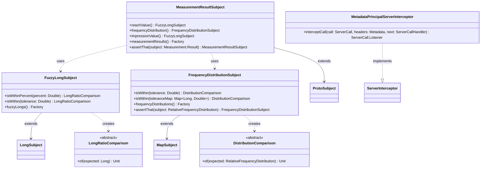

# org.wfanet.measurement.api.v2alpha.testing

## Overview
Testing utilities for the v2alpha API, providing custom Truth assertions for measurement results, frequency distributions, and fuzzy numeric comparisons. Also includes gRPC interceptors for principal authentication in test environments and factory methods for generating test provider identifiers.

## Components

### FrequencyDistributionSubject
Custom Truth Subject for asserting on relative frequency distributions with configurable tolerance levels.

| Method | Parameters | Returns | Description |
|--------|------------|---------|-------------|
| isWithin | `tolerance: Double` | `DistributionComparison` | Creates comparison with uniform tolerance across all buckets |
| isWithin | `toleranceMap: Map<Long, Double>` | `DistributionComparison` | Creates comparison with per-bucket tolerance values |
| frequencyDistributions | - | `Factory<FrequencyDistributionSubject, RelativeFrequencyDistribution>` | Factory method for creating subject instances |
| assertThat | `subject: RelativeFrequencyDistribution` | `FrequencyDistributionSubject` | Static assertion entry point for frequency distributions |

#### DistributionComparison
Abstract inner class for deferred comparison execution.

| Method | Parameters | Returns | Description |
|--------|------------|---------|-------------|
| of | `expected: RelativeFrequencyDistribution` | `Unit` | Executes comparison against expected distribution |

### FuzzyLongSubject
Truth Subject extension for Long values allowing fuzzy comparisons with percentage or absolute tolerance.

| Method | Parameters | Returns | Description |
|--------|------------|---------|-------------|
| isWithinPercent | `percent: Double` | `LongRatioComparison` | Creates percentage-based comparison |
| isWithin | `tolerance: Double` | `LongRatioComparison` | Creates absolute tolerance comparison |
| fuzzyLongs | - | `Factory<FuzzyLongSubject, Long>` | Factory method for creating subject instances |

#### LongRatioComparison
Abstract inner class for deferred comparison execution.

| Method | Parameters | Returns | Description |
|--------|------------|---------|-------------|
| of | `expected: Long` | `Unit` | Executes comparison against expected value |

### MeasurementResultSubject
Custom Truth Subject for asserting on Measurement.Result protobuf messages with fuzzy numeric comparisons.

| Method | Parameters | Returns | Description |
|--------|------------|---------|-------------|
| reachValue | - | `FuzzyLongSubject` | Returns subject for asserting on reach value |
| frequencyDistribution | - | `FrequencyDistributionSubject` | Returns subject for asserting on relative frequency distribution |
| impressionValue | - | `FuzzyLongSubject` | Returns subject for asserting on impression value |
| measurementResults | - | `Factory<MeasurementResultSubject, Measurement.Result>` | Factory method for creating subject instances |
| assertThat | `subject: Measurement.Result` | `MeasurementResultSubject` | Static assertion entry point for measurement results |

### MetadataPrincipalServerInterceptor
gRPC ServerInterceptor that extracts MeasurementPrincipal from request metadata and adds it to the gRPC Context for in-process testing.

| Method | Parameters | Returns | Description |
|--------|------------|---------|-------------|
| interceptCall | `call: ServerCall<ReqT, RespT>`, `headers: Metadata`, `next: ServerCallHandler<ReqT, RespT>` | `ServerCall.Listener<ReqT>` | Extracts principal from headers and injects into context |

## Extensions

### BindableService Extensions

| Function | Parameters | Returns | Description |
|----------|------------|---------|-------------|
| withMetadataPrincipalIdentities | - | `ServerServiceDefinition` | Installs MetadataPrincipalServerInterceptor on the service |

## Top-Level Functions

| Function | Parameters | Returns | Description |
|----------|------------|---------|-------------|
| makeDataProvider | `externalId: Long` | `String` | Converts external ID to DataProvider resource name |
| makeModelProvider | `externalId: Long` | `String` | Converts external ID to ModelProvider resource name |

## Data Structures

### RelativeFrequencyDistribution
Type alias representing frequency distributions.

| Type Alias | Target Type | Description |
|------------|-------------|-------------|
| RelativeFrequencyDistribution | `Map<Long, Double>` | Maps frequency buckets to probability values |

## Dependencies
- `com.google.common.truth` - Truth assertion framework for custom subjects
- `io.grpc` - gRPC core libraries for server interceptor functionality
- `org.wfanet.measurement.api.v2alpha` - Core v2alpha API types (DataProviderKey, ModelProviderKey, MeasurementPrincipal, ContextKeys)
- `org.wfanet.measurement.common.identity` - Identity utilities for external ID conversion and trusted principal credentials

## Usage Example
```kotlin
// Fuzzy long assertion with percentage tolerance
val result: Measurement.Result = getMeasurementResult()
MeasurementResultSubject.assertThat(result)
  .reachValue()
  .isWithinPercent(5.0)
  .of(1000000L)

// Frequency distribution assertion with uniform tolerance
val distribution: RelativeFrequencyDistribution = mapOf(1L to 0.3, 2L to 0.5, 3L to 0.2)
FrequencyDistributionSubject.assertThat(distribution)
  .isWithin(0.01)
  .of(mapOf(1L to 0.31, 2L to 0.49, 3L to 0.20))

// Setting up gRPC service with principal extraction
val service: BindableService = MyServiceImpl()
val serviceDefinition = service.withMetadataPrincipalIdentities()

// Creating test provider names
val dataProviderName = makeDataProvider(12345L)
val modelProviderName = makeModelProvider(67890L)
```

## Class Diagram

