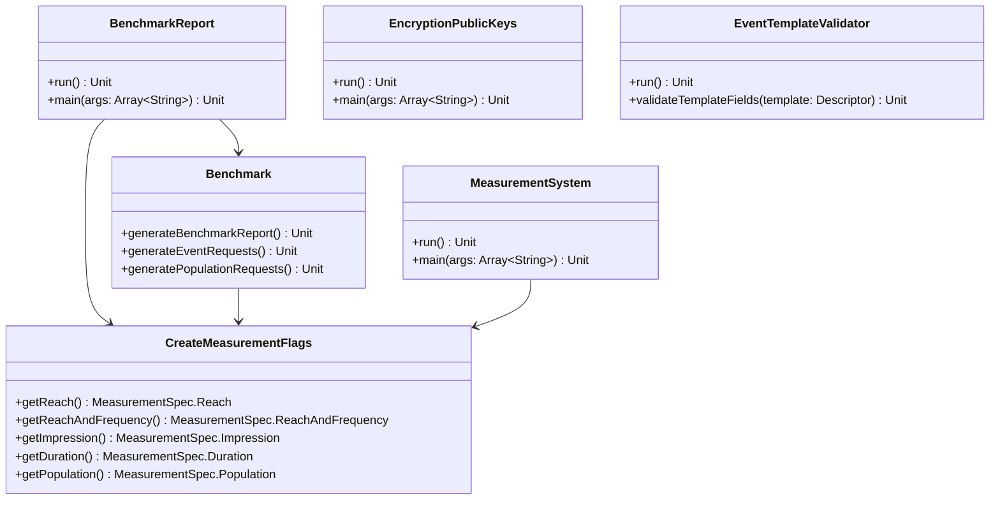

# org.wfanet.measurement.api.v2alpha.tools

## Overview
Command-line tools package providing utilities for interacting with the Cross-Media Measurement System. This package includes tools for encryption key management, event template validation, performance benchmarking, measurement creation, and comprehensive system API interaction.

## Components

### EncryptionPublicKeys
Command-line utility for manipulating EncryptionPublicKey messages with serialization, deserialization, and signing capabilities.

| Method | Parameters | Returns | Description |
|--------|------------|---------|-------------|
| main | `args: Array<String>` | `Unit` | Entry point for EncryptionPublicKey operations |

#### Subcommands

**Serialize**
| Method | Parameters | Returns | Description |
|--------|------------|---------|-------------|
| run | - | `Unit` | Serializes encryption public key data to protobuf format |

**Deserialize**
| Method | Parameters | Returns | Description |
|--------|------------|---------|-------------|
| run | - | `Unit` | Extracts key data from EncryptionPublicKey message |

**Sign**
| Method | Parameters | Returns | Description |
|--------|------------|---------|-------------|
| run | - | `Unit` | Generates digital signature for EncryptionPublicKey message |

### EventTemplateValidator
Validates event templates used in event message types according to Cross-Media Measurement specifications.

| Method | Parameters | Returns | Description |
|--------|------------|---------|-------------|
| run | - | `Unit` | Validates event template structure and annotations |
| validateTemplateFields | `template: Descriptors.Descriptor` | `Unit` | Validates individual template field constraints |
| buildTypeRegistry | - | `TypeRegistry` | Constructs type registry from descriptor sets |
| main | `args: Array<String>` | `Unit` | Entry point for template validation |

### Benchmark
Performance benchmarking tool that submits multiple identical requests to the Kingdom and generates CSV output with collected measurements.

| Method | Parameters | Returns | Description |
|--------|------------|---------|-------------|
| generateBenchmarkReport | - | `Unit` | Orchestrates request generation and result collection |
| generatePopulationRequests | `measurementConsumerStub: MeasurementConsumersCoroutineStub, measurementStub: MeasurementsCoroutineStub, dataProviderStub: DataProvidersCoroutineStub` | `Unit` | Creates population measurement requests |
| generateEventRequests | `measurementConsumerStub: MeasurementConsumersCoroutineStub, measurementStub: MeasurementsCoroutineStub, dataProviderStub: DataProvidersCoroutineStub` | `Unit` (suspend) | Creates event measurement requests in parallel |
| collectCompletedTasks | `measurementStub: MeasurementsCoroutineStub, firstInstant: Instant` | `Unit` | Polls and retrieves completed measurement results |
| generateOutput | `firstInstant: Instant` | `Unit` | Writes benchmark results to CSV file |

### BenchmarkReport
Command-line wrapper for Benchmark tool with TLS configuration and authentication.

| Method | Parameters | Returns | Description |
|--------|------------|---------|-------------|
| run | - | `Unit` | Executes benchmark report generation |
| main | `args: Array<String>` | `Unit` | Entry point for benchmark command |
| main | `args: Array<String>, clock: Clock` | `Unit` | Entry point with injectable clock for testing |

### CreateMeasurementFlags
Configuration container for measurement creation parameters supporting event-based and population-based measurements.

| Method | Parameters | Returns | Description |
|--------|------------|---------|-------------|
| getReach | - | `MeasurementSpec.Reach` | Builds reach measurement specification |
| getReachAndFrequency | - | `MeasurementSpec.ReachAndFrequency` | Builds reach and frequency specification |
| getImpression | - | `MeasurementSpec.Impression` | Builds impression measurement specification |
| getDuration | - | `MeasurementSpec.Duration` | Builds duration measurement specification |
| getPopulation | - | `MeasurementSpec.Population` | Builds population measurement specification |

### MeasurementSystem
Main CLI tool for interacting with Cross-Media Measurement System API, providing comprehensive resource management.

| Method | Parameters | Returns | Description |
|--------|------------|---------|-------------|
| run | - | `Unit` | No-op parent command dispatcher |
| main | `args: Array<String>` | `Unit` | Entry point for measurement system CLI |

#### Subcommands

**Accounts**
| Method | Parameters | Returns | Description |
|--------|------------|---------|-------------|
| authenticate | `siopKey: File` | `Unit` | Generates self-issued OpenID ID token |
| activate | `name: String, activationToken: String, idToken: String?` | `Unit` | Activates account with authentication token |

**Certificates**
| Method | Parameters | Returns | Description |
|--------|------------|---------|-------------|
| create | `parent: String, certificateFile: File` | `Unit` | Creates X.509 certificate resource |
| revoke | `name: String, revocationState: Certificate.RevocationState` | `Unit` | Revokes existing certificate |

**PublicKeys**
| Method | Parameters | Returns | Description |
|--------|------------|---------|-------------|
| update | `name: String, publicKeyFile: File, publicKeySignatureFile: File, certificate: String` | `Unit` | Updates public key with signature verification |

**MeasurementConsumers**
| Method | Parameters | Returns | Description |
|--------|------------|---------|-------------|
| create | `creationToken: String, certificateFile: File, publicKeyFile: File, publicKeySignatureFile: File, displayName: String, idToken: String?` | `Unit` | Creates measurement consumer with credentials |

**Measurements**
| Method | Parameters | Returns | Description |
|--------|------------|---------|-------------|
| printState | `measurement: Measurement` | `Unit` | Displays measurement state with error details |

**CreateMeasurement**
| Method | Parameters | Returns | Description |
|--------|------------|---------|-------------|
| run | - | `Unit` | Creates single measurement with specification |
| getPopulationDataProviderEntry | `populationDataProviderInput: PopulationDataProviderInput, populationMeasurementParams: PopulationMeasurementParams, measurementConsumerSigningKey: SigningKeyHandle, packedMeasurementEncryptionPublicKey: ProtoAny` | `Measurement.DataProviderEntry` | Builds data provider entry for population measurement |
| getEventDataProviderEntry | `eventDataProviderInput: EventDataProviderInput, measurementConsumerSigningKey: SigningKeyHandle, packedMeasurementEncryptionPublicKey: ProtoAny` | `Measurement.DataProviderEntry` | Builds data provider entry for event measurement |

**ListMeasurements**
| Method | Parameters | Returns | Description |
|--------|------------|---------|-------------|
| run | - | `Unit` | Lists measurements for consumer |

**GetMeasurement**
| Method | Parameters | Returns | Description |
|--------|------------|---------|-------------|
| run | - | `Unit` | Retrieves measurement with decrypted results |
| getMeasurementResult | `resultOutput: Measurement.ResultOutput` | `Measurement.Result` | Decrypts and verifies measurement result |
| printMeasurementResult | `result: Measurement.Result` | `Unit` | Displays measurement result values |

**CancelMeasurement**
| Method | Parameters | Returns | Description |
|--------|------------|---------|-------------|
| run | - | `Unit` | Cancels pending measurement |

**DataProviders**
| Method | Parameters | Returns | Description |
|--------|------------|---------|-------------|
| replaceRequiredDuchyList | `requiredDuchies: List<String>` | `Unit` | Updates required duchies for data provider |
| updateCapabilities | `honestMajorityShareShuffleSupported: Boolean?` | `Unit` | Modifies data provider capabilities |
| getDataProvider | - | `Unit` | Retrieves data provider resource |

**ApiKeys**
| Method | Parameters | Returns | Description |
|--------|------------|---------|-------------|
| create | `measurementConsumer: String, nickname: String, description: String?` | `Unit` | Creates API authentication key |

**ModelLines**
| Method | Parameters | Returns | Description |
|--------|------------|---------|-------------|
| create | `modelSuiteName: String, modelLineDisplayName: String, modelLineDescription: String, modelLineActiveStartTime: Instant, modelLineActiveEndTime: Instant?, modelLineType: ModelLine.Type, modelLineHoldbackModelLine: String` | `Unit` | Creates model line with active period |
| setHoldbackModelLine | `modelLineName: String, modelLineHoldbackModelLine: String` | `Unit` | Assigns holdback model line |
| setActiveEndTime | `modelLineName: String, modelLineActiveEndTime: Instant` | `Unit` | Updates model line end time |
| list | `modelSuiteName: String, listPageSize: Int, listPageToken: String, modelLineTypes: List<ModelLine.Type>?` | `Unit` | Lists model lines with filtering |

**ModelReleases**
| Method | Parameters | Returns | Description |
|--------|------------|---------|-------------|
| create | `modelSuiteName: String` | `Unit` | Creates model release |
| get | `modelReleaseName: String` | `Unit` | Retrieves model release |
| list | `modelSuiteName: String, listPageSize: Int, listPageToken: String` | `Unit` | Lists model releases with pagination |

**ModelOutages**
| Method | Parameters | Returns | Description |
|--------|------------|---------|-------------|
| create | `modelLineName: String, outageStartTime: Instant, outageEndTime: Instant` | `Unit` | Creates model outage interval |
| list | `modelLineName: String, listPageSize: Int, listPageToken: String, showDeletedOutages: Boolean, outageStartTime: Instant?, outageEndTime: Instant?` | `Unit` | Lists outages with filtering |
| delete | `modelOutageName: String` | `Unit` | Deletes model outage |

**ModelShards**
| Method | Parameters | Returns | Description |
|--------|------------|---------|-------------|
| create | `dataProviderName: String, shardModelRelease: String, shardModelBlobPath: String` | `Unit` | Creates model shard for data provider |
| list | `dataProviderName: String, listPageSize: Int, listPageToken: String` | `Unit` | Lists model shards with pagination |
| delete | `modelShardName: String` | `Unit` | Deletes model shard |

**ModelRollouts**
| Method | Parameters | Returns | Description |
|--------|------------|---------|-------------|
| create | `modelLineName: String, rolloutStartDate: LocalDate?, rolloutEndDate: LocalDate?, instantRolloutDate: LocalDate?, modelRolloutRelease: String` | `Unit` | Creates gradual or instant model rollout |
| list | `modelLineName: String, listPageSize: Int, listPageToken: String, rolloutPeriodOverlappingStartDate: LocalDate?, rolloutPeriodOverlappingEndDate: LocalDate?` | `Unit` | Lists rollouts with period filtering |
| schedule | `modelRolloutName: String, freezeDate: LocalDate` | `Unit` | Schedules rollout freeze date |
| delete | `modelRolloutName: String` | `Unit` | Deletes model rollout |

**ModelSuites**
| Method | Parameters | Returns | Description |
|--------|------------|---------|-------------|
| create | `modelProviderName: String, modelSuiteDisplayName: String, modelSuiteDescription: String` | `Unit` | Creates model suite |
| get | `modelSuiteName: String` | `Unit` | Retrieves model suite |
| list | `modelProviderName: String, listPageSize: Int, listPageToken: String` | `Unit` | Lists model suites with pagination |

## Data Structures

### BaseFlags
| Property | Type | Description |
|----------|------|-------------|
| encryptionPrivateKeyFile | `File` | Path to encryption private key |
| privateKeyHandle | `PrivateKeyHandle` | Loaded private key handle |
| vidBucketCount | `Int` | Number of VID sampling buckets |
| repetitionCount | `Int` | Benchmark repetition count |
| outputFile | `String` | Output CSV file path |
| timeout | `Long` | Request timeout in seconds |

### ApiFlags
| Property | Type | Description |
|----------|------|-------------|
| apiTarget | `String` | Kingdom public API gRPC target |
| apiCertHost | `String?` | TLS certificate expected hostname |

### MeasurementTask
| Property | Type | Description |
|----------|------|-------------|
| replicaId | `Int` | Benchmark replica identifier |
| requestTime | `Instant` | Request submission time |
| ackTime | `Instant` | Acknowledgment receipt time |
| responseTime | `Instant` | Response receipt time |
| requisitionFulfilledTime | `Instant?` | Requisition fulfillment detection time |
| elapsedTimeMillis | `Long` | Total elapsed time |
| referenceId | `String` | Client-generated measurement ID |
| measurementName | `String` | Kingdom-assigned measurement name |
| status | `String` | Completion status |
| errorMessage | `String` | Error message if failed |
| result | `Measurement.Result` | Decrypted measurement result |

### CreateMeasurementFlags.MeasurementParams.EventMeasurementParams.EventDataProviderInput
| Property | Type | Description |
|----------|------|-------------|
| name | `String` | Event data provider resource name |
| eventGroupInputs | `List<EventGroupInput>` | Event groups to include |
| eventFilters | `List<EventGroupFilter>` | CEL filter expressions |

### CreateMeasurementFlags.MeasurementParams.EventMeasurementParams.EventGroupInput
| Property | Type | Description |
|----------|------|-------------|
| name | `String` | Event group resource name |
| eventStartTime | `Instant` | Collection interval start |
| eventEndTime | `Instant` | Collection interval end |

### CreateMeasurementFlags.MeasurementParams.PopulationMeasurementParams.PopulationInput
| Property | Type | Description |
|----------|------|-------------|
| filter | `String` | CEL filter expression |
| startTime | `Instant` | Population interval start |
| endTime | `Instant` | Population interval end |

## Dependencies
- `org.wfanet.measurement.api.v2alpha` - Public API protobuf definitions
- `org.wfanet.measurement.common.crypto` - Cryptographic operations and key handling
- `org.wfanet.measurement.common.grpc` - gRPC channel management and TLS configuration
- `org.wfanet.measurement.consent.client.measurementconsumer` - Encryption and signing utilities
- `com.google.protobuf` - Protocol buffer message handling
- `io.grpc` - gRPC communication framework
- `picocli` - Command-line interface framework
- `kotlinx.coroutines` - Asynchronous operation support
- `com.google.crypto.tink` - Encryption key management

## Usage Example
```kotlin
// Benchmark reach and frequency measurements
val args = arrayOf(
    "--tls-cert-file", "mc_tls.pem",
    "--tls-key-file", "mc_tls.key",
    "--cert-collection-file", "kingdom_root.pem",
    "--kingdom-public-api-target", "localhost:8443",
    "--api-key", apiKey,
    "--measurement-consumer", mcName,
    "--private-key-der-file", "mc_cs_private.der",
    "--encryption-private-key-file", "mc_enc_private.tink",
    "--output-file", "benchmark-results.csv",
    "--timeout", "600",
    "--reach-and-frequency",
    "--rf-reach-privacy-epsilon", "0.0072",
    "--rf-reach-privacy-delta", "0.0000000001",
    "--rf-frequency-privacy-epsilon", "0.2015",
    "--rf-frequency-privacy-delta", "0.0000000001",
    "--vid-sampling-start", "0.0",
    "--vid-sampling-width", "0.016667",
    "--vid-bucket-count", "1",
    "--repetition-count", "5",
    "--event-data-provider", dataProviderName,
    "--event-group", eventGroupName,
    "--event-start-time", "2022-05-22T01:00:00.000Z",
    "--event-end-time", "2022-05-24T05:00:00.000Z",
    "--event-filter", ""
)
BenchmarkReport.main(args)

// Create measurement using MeasurementSystem CLI
val createArgs = arrayOf(
    "--kingdom-public-api-target", "localhost:8443",
    "--tls-cert-file", "mc_tls.pem",
    "--tls-key-file", "mc_tls.key",
    "--cert-collection-file", "kingdom_root.pem",
    "measurements",
    "--api-key", apiKey,
    "create",
    "--measurement-consumer", mcName,
    "--private-key-der-file", "mc_cs_private.der",
    "--reach",
    "--reach-privacy-epsilon", "0.01",
    "--reach-privacy-delta", "0.00001",
    "--vid-sampling-start", "0.0",
    "--vid-sampling-width", "1.0",
    "--event-data-provider", dataProviderName,
    "--event-group", eventGroupName,
    "--event-start-time", "2022-01-01T00:00:00Z",
    "--event-end-time", "2022-01-02T00:00:00Z",
    "--event-filter", ""
)
MeasurementSystem.main(createArgs)

// Serialize encryption public key
val keyArgs = arrayOf(
    "serialize",
    "--format", "TINK_KEYSET",
    "--data", "public_key.tink",
    "--out", "encrypted_key.pb"
)
EncryptionPublicKeys.main(keyArgs)

// Validate event template
val validateArgs = arrayOf(
    "--event-proto", "com.example.Event",
    "--descriptor-set", "event_descriptor.pb"
)
EventTemplateValidator.main(validateArgs)
```

## Class Diagram

