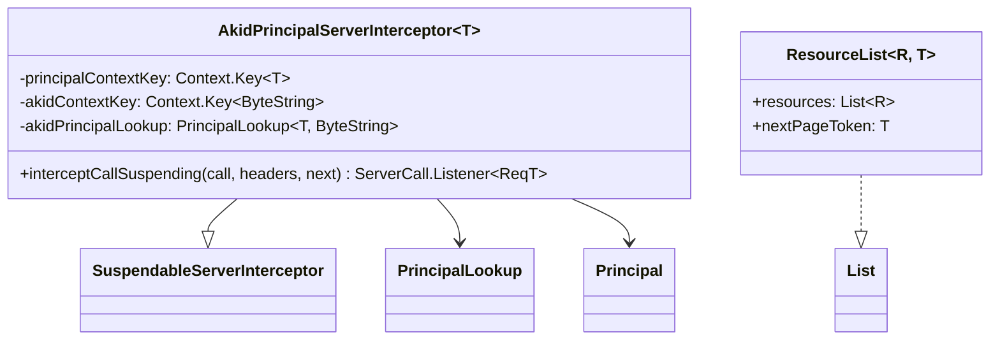

# org.wfanet.measurement.common.api.grpc

## Overview
This package provides gRPC-specific utilities for API services in the Cross-Media Measurement system. It includes server interceptors for principal authentication via certificate authority key identifiers (AKID) and helper functions for working with paginated resource listing methods.

## Components

### AkidPrincipalServerInterceptor
Server interceptor that maps authority key identifier (AKID) from client certificates to Principal objects for authentication.

| Method | Parameters | Returns | Description |
|--------|------------|---------|-------------|
| interceptCallSuspending | `call: ServerCall<ReqT, RespT>`, `headers: Metadata`, `next: ServerCallHandler<ReqT, RespT>` | `ServerCall.Listener<ReqT>` | Suspendable intercept method that looks up principal from AKID and adds it to context |

**Constructor Parameters:**
- `principalContextKey: Context.Key<T>` - Context key for storing the resolved Principal
- `akidContextKey: Context.Key<ByteString>` - Context key containing AKID from client certificate
- `akidPrincipalLookup: PrincipalLookup<T, ByteString>` - Lookup service for mapping AKID to Principal
- `coroutineContext: CoroutineContext` - Optional coroutine context (default: EmptyCoroutineContext)

### listResources (Extension Functions)
Pagination helper functions for gRPC stubs that provide Flow-based resource listing.

| Method | Parameters | Returns | Description |
|--------|------------|---------|-------------|
| listResources | `pageToken: T`, `list: suspend S.(pageToken: T) -> ResourceList<R, T>` | `Flow<ResourceList<R, T>>` | Lists all resources from a paginated List method |
| listResources | `limit: Int`, `pageToken: T`, `list: suspend S.(pageToken: T, remaining: Int) -> ResourceList<R, T>` | `Flow<ResourceList<R, T>>` | Lists up to limit resources from a paginated List method |
| flattenConcat | - | `Flow<R>` | Flattens Flow of ResourceList into Flow of individual resources |

## Data Structures

### ResourceList
| Property | Type | Description |
|----------|------|-------------|
| resources | `List<R>` | List of resources from a paginated response |
| nextPageToken | `T` | Token for retrieving the next page (empty indicates no more pages) |

**Notes:**
- Implements `List<R>` by delegating to `resources`
- `nextPageToken` type `T` can be `String` (empty = `""`) or nullable (empty = `null`)

## Dependencies
- `io.grpc.*` - gRPC core library for server interceptors, contexts, and stubs
- `com.google.protobuf.Message` - Protocol buffer message types for resources
- `kotlinx.coroutines.*` - Coroutine support for suspendable operations and Flow
- `org.wfanet.measurement.common.api.Principal` - Principal abstraction for authentication
- `org.wfanet.measurement.common.api.PrincipalLookup` - Principal lookup service interface
- `org.wfanet.measurement.common.grpc.SuspendableServerInterceptor` - Base class for suspendable interceptors

## Usage Example
```kotlin
// Setting up AKID principal interceptor
val interceptor = AkidPrincipalServerInterceptor(
  principalContextKey = PRINCIPAL_CONTEXT_KEY,
  akidContextKey = AKID_CONTEXT_KEY,
  akidPrincipalLookup = myPrincipalLookup
)

// Using listResources for pagination
val stub: MyServiceCoroutineStub = ...
val allResources: Flow<ResourceList<MyResource, String>> = stub.listResources { pageToken ->
  listMyResources(ListMyResourcesRequest.newBuilder().setPageToken(pageToken).build())
    .let { ResourceList(it.resourcesList, it.nextPageToken) }
}

// Flattening to individual resources
val individualResources: Flow<MyResource> = allResources.flattenConcat()
```

## Class Diagram

