# org.wfanet.measurement.common.api

## Overview
This package provides core API abstractions for resource-based authentication, authorization, and resource management in the Cross-Media Measurement system. It implements principal-based security using X.509 certificate authority key identifiers (AKID), resource key/name management following Google AIP standards, and utilities for entity tags and resource ID validation. The package supports both synchronous and asynchronous operations with memoization capabilities for performance optimization.

## Components

### AkidConfigPrincipalLookup
Abstract base class for looking up resource principals using authority key identifiers from X.509 certificates.

| Method | Parameters | Returns | Description |
|--------|------------|---------|-------------|
| getPrincipal | `lookupKey: ByteString` | `T?` | Resolves AKID to principal via resource name lookup |
| getPrincipal | `resourceName: String` | `T?` | Abstract method to resolve resource name to principal |

### AkidConfigResourceNameLookup
Maps X.509 certificate authority key identifiers to resource names using configuration.

| Method | Parameters | Returns | Description |
|--------|------------|---------|-------------|
| getResourceName | `lookupKey: ByteString` | `String?` | Returns resource name for given AKID or null |

**Constructor Parameters:**
- `config: AuthorityKeyToPrincipalMap` - Configuration mapping AKIDs to principal resource names

### ETags
Singleton object providing RFC 7232 entity tag generation utilities.

| Method | Parameters | Returns | Description |
|--------|------------|---------|-------------|
| computeETag | `updateTime: Instant` | `String` | Generates weak ETag from timestamp using SHA-256 hash |

### MemoizingPrincipalLookup
Caches principal lookup results in a thread-safe concurrent map using coroutine-aware deferred values.

| Method | Parameters | Returns | Description |
|--------|------------|---------|-------------|
| getPrincipal | `lookupKey: K` | `T?` | Returns cached principal or delegates and caches result |

**Extension Functions:**
- `PrincipalLookup<T, K>.memoizing(): PrincipalLookup<T, K>` - Wraps lookup with memoization if not already memoizing

### Principal
Marker interface representing an authenticated entity in the system.

### ResourcePrincipal
Principal with an associated resource key.

| Property | Type | Description |
|----------|------|-------------|
| resourceKey | `ResourceKey` | The resource key identifying this principal |

### PrincipalLookup
Interface for retrieving principals by lookup key.

| Method | Parameters | Returns | Description |
|--------|------------|---------|-------------|
| getPrincipal | `lookupKey: K` | `T?` | Asynchronously retrieves principal for given key |

### ResourceIds
Singleton providing regex patterns for validating resource identifiers.

| Property | Type | Description |
|----------|------|-------------|
| AIP_122_REGEX | `Regex` | Pattern matching AIP-122 format: lowercase, starts with letter, 1-63 chars |
| RFC_1034_REGEX | `Regex` | Pattern matching RFC-1034 labels: allows mixed case, starts with letter, 1-63 chars |

### ResourceKey
Interface representing a unique identifier for a resource following API resource naming conventions.

| Method | Parameters | Returns | Description |
|--------|------------|---------|-------------|
| toName | - | `String` | Converts this key to its resource name string representation |

**Nested Interface:**
- `ResourceKey.Factory<T>` - Factory for parsing resource names into keys
  - `fromName(resourceName: String): T?` - Parses resource name or returns null

**Constants:**
- `WILDCARD_ID: String = "-"` - Wildcard identifier for matching any resource

### ChildResourceKey
ResourceKey representing a resource nested within a parent resource.

| Property | Type | Description |
|----------|------|-------------|
| parentKey | `ResourceKey` | The parent resource's key |

### ResourceKeyLookup
Interface for asynchronously resolving lookup keys to resource keys.

| Method | Parameters | Returns | Description |
|--------|------------|---------|-------------|
| getResourceKey | `lookupKey: K` | `ResourceKey?` | Returns resource key for given lookup key or null |

### ResourceNameLookup
Interface for asynchronously resolving lookup keys to resource name strings.

| Method | Parameters | Returns | Description |
|--------|------------|---------|-------------|
| getResourceName | `lookupKey: T` | `String?` | Returns resource name for given lookup key or null |

**Extension Functions:**
- `ResourceNameLookup<K>.toResourceKeyLookup(keyFactory: ResourceKey.Factory<*>): ResourceKeyLookup<K>` - Adapts name lookup to key lookup using factory

### AkidPrincipalServerInterceptor
gRPC server interceptor that extracts AKID from context and populates principal context for authentication.

| Method | Parameters | Returns | Description |
|--------|------------|---------|-------------|
| interceptCallSuspending | `call: ServerCall<ReqT, RespT>, headers: Metadata, next: ServerCallHandler<ReqT, RespT>` | `ServerCall.Listener<ReqT>` | Intercepts call to inject principal from AKID |

**Constructor Parameters:**
- `principalContextKey: Context.Key<T>` - Context key for storing resolved principal
- `akidContextKey: Context.Key<ByteString>` - Context key containing client certificate AKID
- `akidPrincipalLookup: PrincipalLookup<T, ByteString>` - Lookup service for AKID-to-principal mapping
- `coroutineContext: CoroutineContext` - Coroutine context for suspending operations

### ResourceList
Data class representing a page of resources from a paginated API response.

| Property | Type | Description |
|----------|------|-------------|
| resources | `List<R>` | The list of resources in this page |
| nextPageToken | `T` | Token for fetching next page (empty string or null if last page) |

**Extension Functions:**
- `AbstractCoroutineStub<S>.listResources(pageToken, list): Flow<ResourceList<R, T>>` - Lists all resources with automatic pagination
- `AbstractCoroutineStub<S>.listResources(limit, pageToken, list): Flow<ResourceList<R, T>>` - Lists resources up to specified limit
- `Flow<ResourceList<R, T>>.flattenConcat(): Flow<R>` - Flattens resource lists into stream of individual resources

## Data Structures

### ResourceList
| Property | Type | Description |
|----------|------|-------------|
| resources | `List<R>` | Resources returned in this page |
| nextPageToken | `T` | Continuation token (String or nullable type) |

## Dependencies
- `com.google.protobuf` - Protocol buffer support for ByteString and Message types
- `io.grpc` - gRPC framework for server interceptors and context management
- `kotlinx.coroutines` - Coroutine support for asynchronous operations and Flow APIs
- `org.wfanet.measurement.config` - Configuration protobuf for AKID-to-principal mappings
- `org.wfanet.measurement.common` - Common utilities for hex encoding and SHA-256 hashing
- `org.wfanet.measurement.common.grpc` - Base suspendable gRPC interceptor

## Usage Example
```kotlin
// Configure AKID-based authentication
val config = authorityKeyToPrincipalMap {
  entries += entry {
    authorityKeyIdentifier = certificateAkid
    principalResourceName = "dataProviders/provider-1"
  }
}

// Create lookup chain
val resourceNameLookup = AkidConfigResourceNameLookup(config)
val principalLookup = object : AkidConfigPrincipalLookup<MyPrincipal>(resourceNameLookup) {
  override suspend fun getPrincipal(resourceName: String): MyPrincipal? {
    return MyPrincipal(MyResourceKey.fromName(resourceName) ?: return null)
  }
}.memoizing()

// Install gRPC interceptor
val interceptor = AkidPrincipalServerInterceptor(
  principalContextKey = PRINCIPAL_CONTEXT_KEY,
  akidContextKey = AKID_CONTEXT_KEY,
  akidPrincipalLookup = principalLookup
)

// Use resource listing with pagination
val stub = MyServiceCoroutineStub(channel)
stub.listResources(pageToken = "") { token ->
  val response = listMyResources(request { pageToken = token; pageSize = 50 })
  ResourceList(response.myResourcesList, response.nextPageToken)
}.flattenConcat().collect { resource ->
  println(resource.name)
}

// Validate resource IDs
val isValid = ResourceIds.AIP_122_REGEX.matches("my-resource-id")

// Generate ETags
val etag = ETags.computeETag(Instant.now())
```

## Class Diagram

```mermaid
classDiagram
    class Principal {
        <<interface>>
    }

    class ResourcePrincipal {
        <<interface>>
        +resourceKey: ResourceKey
    }

    class PrincipalLookup~T, K~ {
        <<interface>>
        +getPrincipal(lookupKey: K) T?
    }

    class ResourceKey {
        <<interface>>
        +toName() String
    }

    class ChildResourceKey {
        <<interface>>
        +parentKey: ResourceKey
    }

    class ResourceNameLookup~T~ {
        <<interface>>
        +getResourceName(lookupKey: T) String?
    }

    class ResourceKeyLookup~K~ {
        <<interface>>
        +getResourceKey(lookupKey: K) ResourceKey?
    }

    class AkidConfigResourceNameLookup {
        +getResourceName(lookupKey: ByteString) String?
    }

    class AkidConfigPrincipalLookup~T~ {
        <<abstract>>
        +getPrincipal(lookupKey: ByteString) T?
        +getPrincipal(resourceName: String) T?*
    }

    class MemoizingPrincipalLookup~T, K~ {
        -cache: ConcurrentHashMap
        -delegate: PrincipalLookup
        +getPrincipal(lookupKey: K) T?
    }

    class AkidPrincipalServerInterceptor~T~ {
        -principalContextKey: Context.Key
        -akidContextKey: Context.Key
        -akidPrincipalLookup: PrincipalLookup
        +interceptCallSuspending() ServerCall.Listener
    }

    class ResourceList~R, T~ {
        +resources: List~R~
        +nextPageToken: T
    }

    class ETags {
        <<object>>
        +computeETag(updateTime: Instant) String
    }

    class ResourceIds {
        <<object>>
        +AIP_122_REGEX: Regex
        +RFC_1034_REGEX: Regex
    }

    ResourcePrincipal --|> Principal
    ChildResourceKey --|> ResourceKey
    ResourcePrincipal --> ResourceKey

    AkidConfigResourceNameLookup ..|> ResourceNameLookup
    AkidConfigPrincipalLookup ..|> PrincipalLookup
    MemoizingPrincipalLookup ..|> PrincipalLookup

    AkidConfigPrincipalLookup --> AkidConfigResourceNameLookup
    MemoizingPrincipalLookup --> PrincipalLookup
    AkidPrincipalServerInterceptor --> PrincipalLookup
```

