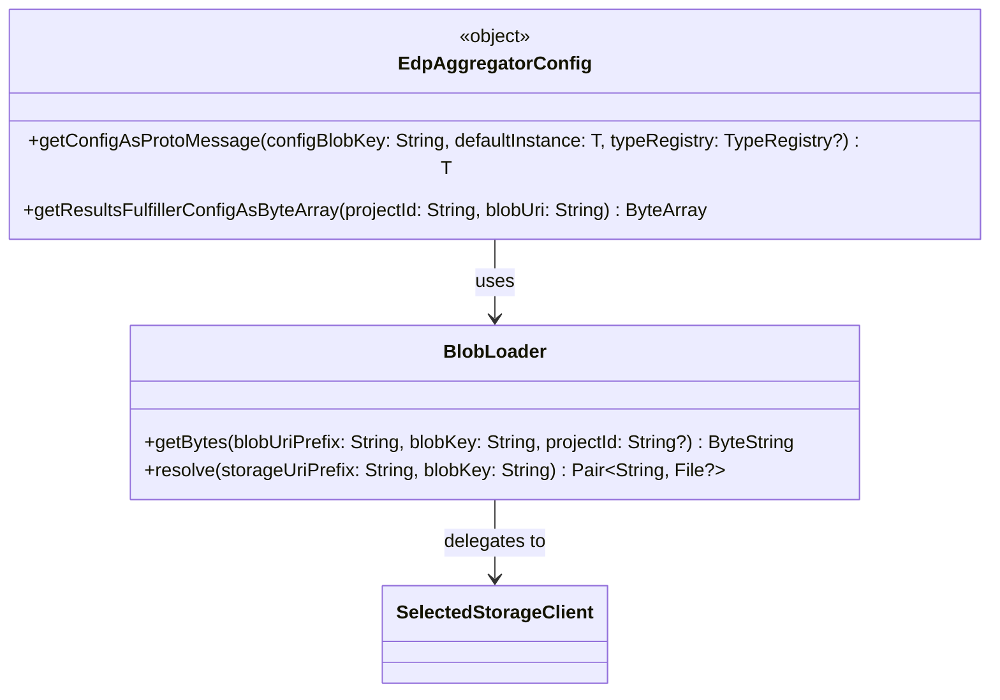

# org.wfanet.measurement.common.edpaggregator

## Overview
Provides utilities for loading configuration data from cloud storage or local filesystems. The package handles blob retrieval from multiple storage backends (Google Cloud Storage, local files) and parses UTF-8 encoded protobuf text configurations into strongly-typed message objects.

## Components

### BlobLoader
Loads raw configuration data blobs from storage using URI-based addressing. Supports both local file system (`file://`) and cloud storage backends, returning content as raw bytes.

| Method | Parameters | Returns | Description |
|--------|------------|---------|-------------|
| getBytes | `blobUriPrefix: String, blobKey: String, projectId: String?` | `ByteString` | Fetches raw bytes for the specified blob from storage |
| resolve | `storageUriPrefix: String, blobKey: String` | `Pair<String, File?>` | Resolves storage URI and blob key into full URI and optional root directory |

**Key Implementation Details:**
- `getBytes` is a suspending function that retrieves blob content via `SelectedStorageClient`
- Throws `IllegalArgumentException` if URI prefix or blob key are malformed
- Throws `IllegalStateException` if blob is not found at the resolved location
- `resolve` handles URI scheme detection and path normalization for file-based storage

### EdpAggregatorConfig
Singleton object providing environment-driven configuration loading for EDP Aggregator components. Reads configuration blobs from storage locations specified by environment variables and parses them as protobuf messages.

| Method | Parameters | Returns | Description |
|--------|------------|---------|-------------|
| getConfigAsProtoMessage | `configBlobKey: String, defaultInstance: T, typeRegistry: TypeRegistry?` | `T : Message` | Loads and parses UTF-8 protobuf text config into typed message |
| getResultsFulfillerConfigAsByteArray | `projectId: String, blobUri: String` | `ByteArray` | Fetches raw config bytes from full blob URI |

**Environment Variables:**
- `EDPA_CONFIG_STORAGE_BUCKET`: URI prefix for config blobs (required, no trailing slash)
  - Format: `gs://my-bucket/base-path` (GCS) or `file:///absolute/path` (local)
- `GOOGLE_PROJECT_ID`: GCP project ID for Cloud Storage access (optional)

**Key Implementation Details:**
- `getConfigAsProtoMessage` is a suspending function that supports optional `TypeRegistry` for `Any` field handling
- Automatically strips trailing slashes from URI prefixes
- Throws `IllegalArgumentException` if `EDPA_CONFIG_STORAGE_BUCKET` is not set
- Parses text-format protobuf using `parseTextProto` utility

## Dependencies
- `org.wfanet.measurement.storage` - `SelectedStorageClient` for multi-backend blob retrieval
- `org.wfanet.measurement.common` - `flatten()` extension for flow concatenation, `parseTextProto()` for protobuf parsing
- `com.google.protobuf` - Protobuf message types and `TypeRegistry` support

## Usage Example
```kotlin
// Loading a configuration from environment-specified storage
import org.wfanet.measurement.common.edpaggregator.EdpAggregatorConfig
import com.example.MyConfigProto

suspend fun loadConfig(): MyConfigProto {
  // Requires EDPA_CONFIG_STORAGE_BUCKET environment variable
  // e.g., "gs://my-configs/edp-aggregator" or "file:///var/configs"
  return EdpAggregatorConfig.getConfigAsProtoMessage(
    configBlobKey = "aggregator-config.textproto",
    defaultInstance = MyConfigProto.getDefaultInstance()
  )
}

// Direct blob loading with BlobLoader
import org.wfanet.measurement.common.edpaggregator.BlobLoader

suspend fun loadRawBlob(): ByteString {
  val loader = BlobLoader()
  return loader.getBytes(
    blobUriPrefix = "gs://my-bucket/configs",
    blobKey = "data.bin",
    projectId = "my-gcp-project"
  )
}

// Local filesystem example
suspend fun loadLocalFile(): ByteArray {
  return EdpAggregatorConfig.getResultsFulfillerConfigAsByteArray(
    projectId = "", // Ignored for file:// URIs
    blobUri = "file:///tmp/configs/local-config.textproto"
  )
}
```

## Class Diagram

