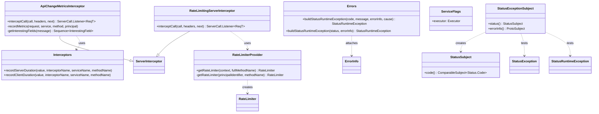

# org.wfanet.measurement.common.grpc

## Overview
This package provides gRPC infrastructure components for the Cross-Media Measurement system, including server interceptors for API metrics, rate limiting, error handling utilities, context management, and testing support. It enables monitoring of deprecated/future API changes, configurable rate limiting per principal and method, and enhanced error information propagation.

## Components

### ApiChangeMetricsInterceptor
Server interceptor that tracks usage of deprecated, future-deprecated, and future-required fields in protobuf request messages using OpenTelemetry metrics.

| Method | Parameters | Returns | Description |
|--------|------------|---------|-------------|
| interceptCall | `call: ServerCall<ReqT, RespT>`, `headers: Metadata`, `next: ServerCallHandler<ReqT, RespT>` | `ServerCall.Listener<ReqT>` | Intercepts gRPC calls to record field disposition metrics |

**Constructor Parameters:**
- `getPrincipalIdentifier: (Context) -> String?` - Function extracting principal identifier from gRPC context

**Metrics Recorded:**
- `org.wfanet.measurement.grpc.deprecated_field_set` - Count of deprecated fields set in requests
- `org.wfanet.measurement.grpc.future_deprecated_field_set` - Count of future-deprecated fields set
- `org.wfanet.measurement.grpc.future_required_field_not_set` - Count of future-required fields not set

### RateLimitingServerInterceptor
Server interceptor that enforces rate limiting on incoming gRPC requests based on configurable policies.

| Method | Parameters | Returns | Description |
|--------|------------|---------|-------------|
| interceptCall | `call: ServerCall<ReqT, RespT>`, `headers: Metadata`, `next: ServerCallHandler<ReqT, RespT>` | `ServerCall.Listener<ReqT>` | Applies rate limiting, closes call with UNAVAILABLE status if limit exceeded |

**Constructor Parameters:**
- `getRateLimiter: (context: Context, fullMethodName: String) -> RateLimiter` - Function providing rate limiter for a specific call

### RateLimiterProvider
Config-based provider of RateLimiter instances for gRPC calls, supporting per-principal and per-method overrides.

| Method | Parameters | Returns | Description |
|--------|------------|---------|-------------|
| getRateLimiter | `context: Context`, `fullMethodName: String` | `RateLimiter` | Returns appropriate rate limiter for the call |

**Constructor Parameters:**
- `config: RateLimitConfig` - Rate limiting configuration
- `timeSource: TimeSource.WithComparableMarks` - Time source for token bucket (defaults to TimeSource.Monotonic)
- `getPrincipalIdentifier: (context: Context) -> String?` - Function extracting principal identifier

**Inner Classes:**
- `RateLimit` - Manages default and per-method rate limiters with lazy initialization

### Interceptors
Singleton object providing shared interceptor utilities and metrics recording for gRPC operations.

| Method | Parameters | Returns | Description |
|--------|------------|---------|-------------|
| recordServerDuration | `value: Duration`, `interceptorName: String`, `serviceName: String`, `methodName: String` | `Unit` | Records server-side interceptor execution duration |
| recordClientDuration | `value: Duration`, `interceptorName: String`, `serviceName: String`, `methodName: String` | `Unit` | Records client-side interceptor execution duration |

**Extension Functions:**

| Function | Parameters | Returns | Description |
|----------|------------|---------|-------------|
| ServerServiceDefinition.withInterceptor | `interceptor: ServerInterceptor` | `ServerServiceDefinition` | Wraps service definition with single interceptor |
| BindableService.withInterceptor | `interceptor: ServerInterceptor` | `ServerServiceDefinition` | Wraps bindable service with single interceptor |
| BindableService.withInterceptors | `vararg interceptors: ServerInterceptor` | `ServerServiceDefinition` | Wraps bindable service with multiple interceptors |

**Attributes:**
- `INSTRUMENTATION_NAMESPACE` - Root namespace for interceptor metrics
- `GRPC_SERVICE_ATTRIBUTE` - OpenTelemetry attribute key for RPC service name
- `GRPC_METHOD_ATTRIBUTE` - OpenTelemetry attribute key for RPC method name

### ErrorInfo Extensions
Extension properties and functions for extracting and attaching `google.rpc.ErrorInfo` to gRPC exceptions.

| Function | Parameters | Returns | Description |
|----------|------------|---------|-------------|
| StatusException.errorInfo | - | `ErrorInfo?` | Extracts ErrorInfo from status exception details |
| StatusRuntimeException.errorInfo | - | `ErrorInfo?` | Extracts ErrorInfo from runtime exception details |
| Status.asRuntimeException | `errorInfo: ErrorInfo` | `StatusRuntimeException` | Converts Status to exception with ErrorInfo attached |

### Errors
Singleton object providing builders for StatusRuntimeException with ErrorInfo details.

| Method | Parameters | Returns | Description |
|--------|------------|---------|-------------|
| buildStatusRuntimeException | `code: Status.Code`, `message: String`, `errorInfo: ErrorInfo`, `cause: Throwable?` | `StatusRuntimeException` | Builds exception from status code and message |
| buildStatusRuntimeException | `status: Status`, `errorInfo: ErrorInfo` | `StatusRuntimeException` | Builds exception from existing Status |

### Context Extensions
Coroutine-friendly context management utilities for gRPC Context.

| Function | Parameters | Returns | Description |
|----------|------------|---------|-------------|
| withContext | `context: Context`, `action: () -> R` | `R` | Executes action with specified Context as current |

### ServiceFlags
Command-line flag configuration for gRPC service executor settings using PicoCLI.

| Property | Type | Description |
|----------|------|-------------|
| executor | `Executor` | Thread pool executor for gRPC services (lazy-initialized) |

**Configuration:**
- `--grpc-thread-pool-size` - Thread pool size (defaults to max of 2 or number of cores)

**Constants:**
- `THREAD_POOL_NAME` - "grpc-services"
- `DEFAULT_THREAD_POOL_SIZE` - max(2, available processors)

## Testing Support

### StatusExceptionSubject
Truth Subject for StatusException and StatusRuntimeException providing enhanced assertion capabilities.

| Method | Parameters | Returns | Description |
|--------|------------|---------|-------------|
| status | - | `StatusSubject` | Returns subject for asserting on Status |
| errorInfo | - | `ProtoSubject` | Returns subject for asserting on ErrorInfo |
| assertThat | `actual: StatusException?` | `StatusExceptionSubject` | Static factory for StatusException assertions |
| assertThat | `actual: StatusRuntimeException?` | `StatusExceptionSubject` | Static factory for StatusRuntimeException assertions |

### StatusSubject
Truth Subject for gRPC Status providing code assertions with enhanced failure messages.

| Method | Parameters | Returns | Description |
|--------|------------|---------|-------------|
| code | - | `ComparableSubject<Status.Code>` | Returns subject for asserting on status code |
| assertThat | `actual: Status?` | `StatusSubject` | Static factory for Status assertions |

## Dependencies
- `io.grpc:grpc-api` - Core gRPC types (Context, Status, Interceptor, Metadata)
- `io.grpc:grpc-protobuf` - Protobuf integration for StatusProto
- `io.opentelemetry:opentelemetry-api` - Metrics collection for API change tracking and interceptor duration
- `com.google.protobuf:protobuf-java` - Protocol buffer message handling
- `com.google.api.grpc:proto-google-common-protos` - ErrorInfo and Status protos
- `org.wfanet.measurement.common` - Instrumentation, ProtoReflection, RateLimiter utilities
- `org.wfanet.measurement.config` - RateLimitConfig protobuf messages
- `org.wfanet.measurement.type` - FutureDisposition custom field options
- `picocli:picocli` - Command-line argument parsing for ServiceFlags
- `com.google.truth:truth` - Assertion framework for testing utilities

## Usage Example

```kotlin
// Setting up a gRPC service with interceptors
import org.wfanet.measurement.common.grpc.*

// Configure rate limiting
val rateLimitConfig = RateLimitConfig.newBuilder().apply {
  rateLimitBuilder.apply {
    defaultRateLimitBuilder.apply {
      maximumRequestCount = 100
      averageRequestRate = 10.0
    }
  }
}.build()

val rateLimiterProvider = RateLimiterProvider(rateLimitConfig) { context ->
  // Extract principal from context
  PRINCIPAL_CONTEXT_KEY.get(context)
}

// Create interceptors
val rateLimitingInterceptor = RateLimitingServerInterceptor { context, methodName ->
  rateLimiterProvider.getRateLimiter(context, methodName)
}

val apiChangeMetricsInterceptor = ApiChangeMetricsInterceptor { context ->
  PRINCIPAL_CONTEXT_KEY.get(context)
}

// Apply to service
val serviceDefinition = myService
  .withInterceptors(rateLimitingInterceptor, apiChangeMetricsInterceptor)

// Build StatusRuntimeException with ErrorInfo
val errorInfo = ErrorInfo.newBuilder()
  .setReason("INVALID_ARGUMENT")
  .setDomain("measurement.wfanet.org")
  .build()

val exception = Errors.buildStatusRuntimeException(
  Status.Code.INVALID_ARGUMENT,
  "Missing required field",
  errorInfo
)

// Testing with Truth subjects
import org.wfanet.measurement.common.grpc.testing.StatusExceptionSubject.Companion.assertThat

assertThat(exception).status().code().isEqualTo(Status.Code.INVALID_ARGUMENT)
assertThat(exception).errorInfo().comparingExpectedFieldsOnly().isEqualTo(errorInfo)
```

## Class Diagram


