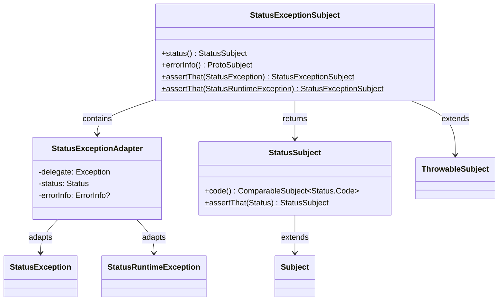

# org.wfanet.measurement.common.grpc.testing

## Overview
This package provides Truth custom subjects for testing gRPC exception types. It enables more expressive and informative assertions on `StatusException` and `StatusRuntimeException` instances, including their status codes and associated ErrorInfo metadata.

## Components

### StatusExceptionSubject
Truth Subject for asserting on `StatusException` or `StatusRuntimeException` instances with enhanced failure messages that include contextual information.

| Method | Parameters | Returns | Description |
|--------|------------|---------|-------------|
| status | - | `StatusSubject` | Returns a subject for asserting on the exception's Status |
| errorInfo | - | `ProtoSubject` | Returns a subject for asserting on the ErrorInfo metadata |
| assertThat (companion) | `actual: StatusException?` | `StatusExceptionSubject` | Creates assertion subject for StatusException |
| assertThat (companion) | `actual: StatusRuntimeException?` | `StatusExceptionSubject` | Creates assertion subject for StatusRuntimeException |

**Factories:**
- `Factory` - Subject factory for `StatusException`
- `RuntimeFactory` - Subject factory for `StatusRuntimeException`

**Internal Components:**
- `StatusExceptionAdapter` - Private adapter class that normalizes `StatusException` and `StatusRuntimeException` to a common interface

### StatusSubject
Truth Subject for asserting on gRPC `Status` objects with enhanced contextual messaging.

| Method | Parameters | Returns | Description |
|--------|------------|---------|-------------|
| code | - | `ComparableSubject<Status.Code>` | Returns comparable subject for the status code |
| assertThat (companion) | `actual: Status?` | Truth assertion | Creates assertion subject for Status |

## Dependencies
- `com.google.common.truth` - Truth assertion framework for fluent test assertions
- `com.google.common.truth.extensions.proto` - Truth extensions for Protocol Buffer message assertions
- `com.google.rpc` - gRPC ErrorInfo protobuf definitions
- `io.grpc` - gRPC core library for Status and exception types
- `org.wfanet.measurement.common.grpc` - Common gRPC utilities including errorInfo extension

## Usage Example
```kotlin
import io.grpc.StatusException
import io.grpc.Status
import org.wfanet.measurement.common.grpc.testing.StatusExceptionSubject.Companion.assertThat

// Assert on StatusException
val exception: StatusException = // ... from test
assertThat(exception).status().code().isEqualTo(Status.Code.NOT_FOUND)

// Assert on StatusRuntimeException with ErrorInfo
val runtimeException: StatusRuntimeException = // ... from test
assertThat(runtimeException)
  .errorInfo()
  .hasReason("RESOURCE_NOT_FOUND")

// Assert on Status directly
val status: Status = Status.PERMISSION_DENIED
StatusSubject.assertThat(status).code().isEqualTo(Status.Code.PERMISSION_DENIED)
```

## Class Diagram

