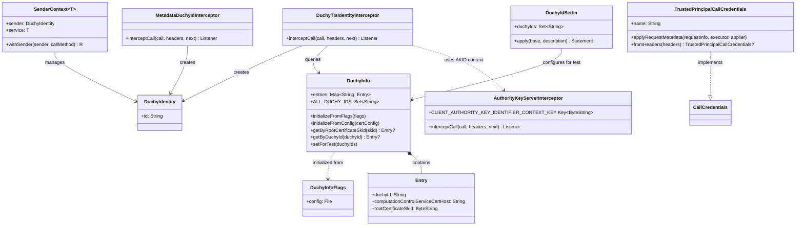

# org.wfanet.measurement.common.identity

## Overview
Provides identity management and authentication infrastructure for the Cross-Media Measurement system, focusing on Duchy identity verification through TLS certificates and principal-based authentication. This package handles gRPC interceptors for extracting and validating client identities, managing Duchy information from certificates, and providing testing utilities for identity-based workflows.

## Components

### AuthorityKeyServerInterceptor
Extracts the Authority Key Identifier (AKID) from client TLS certificates into gRPC context.

| Method | Parameters | Returns | Description |
|--------|------------|---------|-------------|
| interceptCall | `call: ServerCall<ReqT, RespT>`, `headers: Metadata`, `next: ServerCallHandler<ReqT, RespT>` | `ServerCall.Listener<ReqT>` | Extracts AKID from SSL session and stores in context |

**Context Key:**
- `CLIENT_AUTHORITY_KEY_IDENTIFIER_CONTEXT_KEY` - Stores the AKID as `ByteString`

### DuchyIdentity
Data class representing authenticated Duchy details.

| Property | Type | Description |
|----------|------|-------------|
| id | `String` | Stable identifier for a duchy, validated against known duchies |

**Top-level Functions:**
| Function | Parameters | Returns | Description |
|----------|------------|---------|-------------|
| duchyIdentityFromContext | - | `DuchyIdentity` | Retrieves duchy identity from current gRPC context |
| withDuchyId | `duchyId: String` | `T : AbstractStub<T>` | Extension function to attach duchy ID metadata to stub |
| withDuchyIdentities | - | `ServerServiceDefinition` | Extension function to wrap service with identity interceptors |

### DuchyTlsIdentityInterceptor
Server interceptor that validates client certificates and establishes Duchy identity in gRPC context.

| Method | Parameters | Returns | Description |
|--------|------------|---------|-------------|
| interceptCall | `call: ServerCall<ReqT, RespT>`, `headers: Metadata`, `next: ServerCallHandler<ReqT, RespT>` | `ServerCall.Listener<ReqT>` | Validates AKID against known Duchies and sets identity |

**Context Key:**
- `DUCHY_IDENTITY_CONTEXT_KEY` - Stores validated `DuchyIdentity`

**Metadata Key:**
- `DUCHY_ID_METADATA_KEY` - Key for duchy ID in gRPC metadata

### DuchyInfo
Singleton object managing Duchy certificate configuration and lookup operations.

| Method | Parameters | Returns | Description |
|--------|------------|---------|-------------|
| initializeFromFlags | `flags: DuchyInfoFlags` | `Unit` | Initializes from file-based configuration |
| initializeFromConfig | `certConfig: DuchyCertConfig` | `Unit` | Initializes from protobuf configuration |
| getByRootCertificateSkid | `rootCertificateSkid: ByteString` | `Entry?` | Looks up duchy by root certificate SKID |
| getByDuchyId | `duchyId: String` | `Entry?` | Looks up duchy by ID |
| setForTest | `duchyIds: Set<String>` | `Unit` | Configures test entries for unit testing |

**Properties:**
| Property | Type | Description |
|----------|------|-------------|
| entries | `Map<String, Entry>` | Map of duchy IDs to entries |
| ALL_DUCHY_IDS | `Set<String>` | Set of all known duchy IDs |

### DuchyInfo.Entry
Configuration entry for a single Duchy.

| Property | Type | Description |
|----------|------|-------------|
| duchyId | `String` | Unique duchy identifier |
| computationControlServiceCertHost | `String` | Certificate hostname for computation service |
| rootCertificateSkid | `ByteString` | Subject Key Identifier of root certificate |

### DuchyInfoFlags
Command-line flag configuration for DuchyInfo initialization.

| Property | Type | Description |
|----------|------|-------------|
| config | `File` | File containing DuchyCertConfig proto in text format |

### PrincipalIdentity
Provides trusted principal-based authentication for gRPC calls.

| Function | Parameters | Returns | Description |
|----------|------------|---------|-------------|
| withPrincipalName | `name: String` | `T : AbstractStub<T>` | Extension attaching principal credentials to stub |

### TrustedPrincipalCallCredentials
Call credentials implementation for trusted principal authentication.

| Method | Parameters | Returns | Description |
|--------|------------|---------|-------------|
| applyRequestMetadata | `requestInfo: RequestInfo`, `appExecutor: Executor`, `applier: MetadataApplier` | `Unit` | Applies principal name to request metadata |
| fromHeaders | `headers: Metadata` | `TrustedPrincipalCallCredentials?` | Static factory from metadata headers |

| Property | Type | Description |
|----------|------|-------------|
| name | `String` | Principal resource name |

**Metadata Key:**
- `PRINCIPAL_NAME_METADATA_KEY` - Key for principal name (`x-trusted-principal-name`)

## Testing Utilities (org.wfanet.measurement.common.identity.testing)

### DuchyIdSetter
JUnit test rule that configures global Duchy ID list for testing.

| Constructor | Parameters | Description |
|-------------|------------|-------------|
| DuchyIdSetter | `duchyIds: Set<String>` | Initialize with set of duchy IDs |
| DuchyIdSetter | `duchyIds: Iterable<String>` | Initialize with iterable of duchy IDs |
| DuchyIdSetter | `vararg duchyIds: String` | Initialize with vararg duchy IDs |

| Method | Parameters | Returns | Description |
|--------|------------|---------|-------------|
| apply | `base: Statement`, `description: Description` | `Statement` | Wraps test execution with duchy ID setup |

### MetadataDuchyIdInterceptor
Test interceptor that extracts Duchy identity from request metadata instead of certificates.

| Method | Parameters | Returns | Description |
|--------|------------|---------|-------------|
| interceptCall | `call: ServerCall<ReqT, RespT>`, `headers: Metadata`, `next: ServerCallHandler<ReqT, RespT>` | `ServerCall.Listener<ReqT>` | Extracts duchy ID from metadata and validates |

**Extension Function:**
| Function | Parameters | Returns | Description |
|----------|------------|---------|-------------|
| withMetadataDuchyIdentities | - | `ServerServiceDefinition` | Wraps service with metadata-based identity interceptor |

### SenderContext
Thread-safe context manager for testing service implementations with different sender identities.

| Constructor | Parameters | Description |
|-------------|------------|-------------|
| SenderContext | `serviceProvider: (DuchyIdProvider) -> T` | Creates context with service factory |

| Property | Type | Description |
|----------|------|-------------|
| sender | `DuchyIdentity` | Current sender identity |
| service | `T` | Service instance provided by factory |

| Method | Parameters | Returns | Description |
|--------|------------|---------|-------------|
| withSender | `sender: DuchyIdentity`, `callMethod: suspend T.() -> R` | `suspend R` | Executes method with specified sender identity |

## Dependencies
- `io.grpc:grpc-core` - gRPC framework for interceptors and context management
- `com.google.protobuf:protobuf-java` - Protocol buffer support for ByteString
- `org.wfanet.measurement.common.crypto` - Cryptographic utilities for certificate processing
- `org.wfanet.measurement.config` - Configuration protobuf definitions
- `picocli:picocli` - Command-line argument parsing
- `org.junit:junit` - JUnit testing framework for test utilities
- `org.jetbrains.kotlinx:kotlinx-coroutines-core` - Coroutine support for async operations

## Usage Example

```kotlin
// Server-side: Configure Duchy information and add identity interceptors
DuchyInfo.initializeFromConfig(duchyCertConfig)
val service = MyDuchyService()
  .withDuchyIdentities() // Adds AuthorityKeyServerInterceptor and DuchyTlsIdentityInterceptor

// Within service implementation, access authenticated duchy
suspend fun processRequest(request: Request): Response {
  val duchyId = duchyIdentityFromContext.id
  // Process with authenticated duchy identity
}

// Client-side: Attach duchy ID to outgoing requests
val stub = MyServiceCoroutineStub(channel)
  .withDuchyId("duchy-1")

// Principal-based authentication
val principalStub = MyServiceCoroutineStub(channel)
  .withPrincipalName("dataProviders/Ac8hsieOp")

// Testing: Set up test duchy IDs
@get:Rule
val duchyIdSetter = DuchyIdSetter("duchy-1", "duchy-2", "duchy-3")

// Testing: Use metadata-based authentication
val testService = MyService()
  .withMetadataDuchyIdentities()

// Testing: Simulate different senders
val senderContext = SenderContext { duchyIdProvider ->
  MyServiceImpl(duchyIdProvider)
}
senderContext.withSender(DuchyIdentity("duchy-1")) {
  performOperation()
}
```

## Class Diagram


