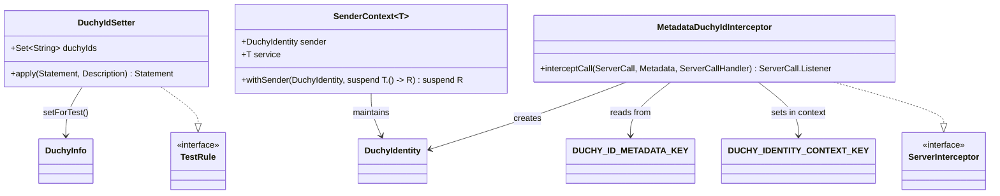

# org.wfanet.measurement.common.identity.testing

## Overview
Provides testing utilities for Duchy identity management in Cross-Media Measurement system tests. Includes JUnit rules for configuring valid Duchy IDs, gRPC interceptors for extracting Duchy identities from metadata, and coroutine-safe sender context management for simulating multi-duchy service interactions.

## Components

### DuchyIdSetter
JUnit TestRule that configures the global list of valid Duchy IDs for test execution.

**Constructors:**
- `DuchyIdSetter(duchyIds: Set<String>)` - Primary constructor accepting a set of Duchy IDs
- `DuchyIdSetter(duchyIds: Iterable<String>)` - Constructor accepting an iterable collection
- `DuchyIdSetter(vararg duchyIds: String)` - Varargs constructor for convenient inline specification

| Property | Type | Description |
|----------|------|-------------|
| duchyIds | `Set<String>` | The set of valid Duchy identifiers to configure globally |

| Method | Parameters | Returns | Description |
|--------|------------|---------|-------------|
| apply | `base: Statement, description: Description` | `Statement` | Wraps test execution to set Duchy IDs before evaluation |

### MetadataDuchyIdInterceptor
gRPC ServerInterceptor that extracts Duchy identity from request metadata and populates the gRPC context.

| Method | Parameters | Returns | Description |
|--------|------------|---------|-------------|
| interceptCall | `call: ServerCall<ReqT, RespT>, headers: Metadata, next: ServerCallHandler<ReqT, RespT>` | `ServerCall.Listener<ReqT>` | Extracts duchy-identity from metadata and sets context or closes with UNAUTHENTICATED |

### Extension Functions

| Function | Parameters | Returns | Description |
|----------|------------|---------|-------------|
| withMetadataDuchyIdentities | `this: BindableService` | `ServerServiceDefinition` | Wraps service with MetadataDuchyIdInterceptor for testing |

### SenderContext
Thread-safe context manager for maintaining sender DuchyIdentity during service method invocations in test scenarios.

**Type Parameters:**
- `T` - The service type being wrapped

**Constructors:**
- `SenderContext(serviceProvider: (DuchyIdProvider) -> T)` - Accepts a lambda that receives a DuchyIdentity provider

| Property | Type | Description |
|----------|------|-------------|
| sender | `DuchyIdentity` | Current sender identity (lateinit, set via withSender) |
| service | `T` | The service instance created by serviceProvider |

| Method | Parameters | Returns | Description |
|--------|------------|---------|-------------|
| withSender | `sender: DuchyIdentity, callMethod: suspend T.() -> R` | `suspend R` | Executes service method with specified sender identity under mutex lock |

## Dependencies
- `org.wfanet.measurement.common.identity` - Core Duchy identity types (DuchyIdentity, DuchyInfo, context keys)
- `io.grpc` - gRPC framework for interceptors and service definitions
- `org.junit` - JUnit 4 TestRule infrastructure
- `kotlinx.coroutines.sync` - Mutex for thread-safe sender context switching

## Usage Example

```kotlin
// JUnit test setup with DuchyIdSetter
class DuchyServiceTest {
  @get:Rule
  val duchyIdSetter = DuchyIdSetter("worker1", "worker2", "aggregator")

  @Test
  fun testCrossDuchyInteraction() = runBlocking {
    // Server-side: Install metadata interceptor
    val service = MyDuchyService().withMetadataDuchyIdentities()
    val server = ServerBuilder.forPort(0).addService(service).build()

    // Client-side: Send requests with Duchy ID
    val stub = MyServiceCoroutineStub(channel).withDuchyId("worker1")
    val response = stub.doSomething(request)
  }
}

// SenderContext for simulating multiple senders
val senderContext = SenderContext { duchyIdProvider ->
  MyServiceImpl(duchyIdProvider)
}

runBlocking {
  val result1 = senderContext.withSender(DuchyIdentity("worker1")) {
    processRequest(request)
  }

  val result2 = senderContext.withSender(DuchyIdentity("worker2")) {
    processRequest(request)
  }
}
```

## Class Diagram



## Security Notes
**WARNING:** MetadataDuchyIdInterceptor extracts Duchy identity from unauthenticated metadata without verification. This is intended for **testing only**. Production systems must use authentication mechanisms like TLS certificate validation (see `DuchyTlsIdentityInterceptor` in the parent package).
