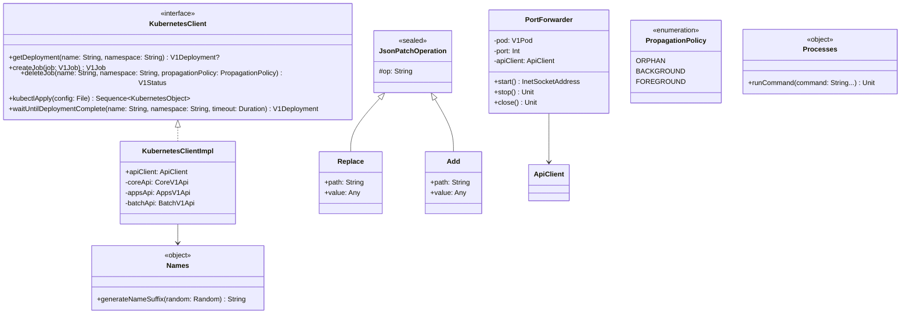

# org.wfanet.measurement.common.k8s

## Overview
This package provides a Kotlin-based client abstraction for interacting with the Kubernetes API, supporting deployment management, job orchestration, resource watching, and port forwarding. It wraps the official Kubernetes Java client with coroutine-based async operations and includes utilities for testing and name generation.

## Components

### KubernetesClient
Interface for Kubernetes API operations with coroutine-based async methods.

| Method | Parameters | Returns | Description |
|--------|------------|---------|-------------|
| getDeployment | `name: String`, `namespace: String` | `V1Deployment?` | Retrieves a deployment by name |
| getPodTemplate | `name: String`, `namespace: String` | `V1PodTemplate?` | Retrieves a pod template by name |
| getNewReplicaSet | `deployment: V1Deployment` | `V1ReplicaSet?` | Gets the current revision replica set for deployment |
| listPods | `replicaSet: V1ReplicaSet` | `V1PodList` | Lists all pods for the specified replica set |
| listJobs | `matchLabelsSelector: String`, `namespace: String` | `V1JobList` | Lists jobs matching the label selector |
| createJob | `job: V1Job` | `V1Job` | Creates a new job in the cluster |
| deleteJob | `name: String`, `namespace: String`, `propagationPolicy: PropagationPolicy` | `V1Status` | Deletes a job with specified propagation policy |
| waitUntilDeploymentComplete | `name: String`, `namespace: String`, `timeout: Duration` | `V1Deployment` | Suspends until deployment completes or timeout |
| waitForServiceAccount | `name: String`, `namespace: String`, `timeout: Duration` | `V1ServiceAccount` | Suspends until service account exists or timeout |
| kubectlApply | `config: File` | `Sequence<KubernetesObject>` | Applies Kubernetes configuration from file |
| kubectlApply | `config: String` | `Sequence<KubernetesObject>` | Applies Kubernetes configuration from string |
| kubectlApply | `k8sObjects: Iterable<KubernetesObject>` | `Sequence<KubernetesObject>` | Applies Kubernetes objects directly |
| generateNameSuffix | `random: Random` | `String` | Generates random suffix for K8s object names |

### KubernetesClientImpl
Default implementation of KubernetesClient using the Kubernetes Java client.

| Property | Type | Description |
|----------|------|-------------|
| apiClient | `ApiClient` | Underlying Kubernetes API client instance |
| coroutineContext | `CoroutineContext` | Context for blocking I/O operations |

### PortForwarder
Forwarder from a local port to a port on a Kubernetes pod for testing purposes.

| Method | Parameters | Returns | Description |
|--------|------------|---------|-------------|
| start | - | `InetSocketAddress` | Opens local socket and begins forwarding connections |
| stop | - | `Unit` | Stops port forwarding and closes connections |
| close | - | `Unit` | Implements AutoCloseable to stop and clean up |

| Property | Type | Description |
|----------|------|-------------|
| pod | `V1Pod` | Target pod for port forwarding |
| port | `Int` | Target port on the pod |
| apiClient | `ApiClient` | Kubernetes API client for forwarding |
| localAddress | `InetAddress` | Local bind address for forwarding |

### Processes
Utility object for executing external commands in tests.

| Method | Parameters | Returns | Description |
|--------|------------|---------|-------------|
| runCommand | `command: String...` | `Unit` | Executes command and waits for completion |
| runCommand | `command: String...`, `consumeOutput: (InputStream) -> T` | `T` | Executes command and processes output stream |

## Data Structures

### JsonPatchOperation
Sealed class representing JSON Patch operations for Kubernetes resources.

| Subclass | Properties | Description |
|----------|-----------|-------------|
| Replace | `path: String`, `value: Any` | Replaces value at JSON pointer path |
| Add | `path: String`, `value: Any` | Adds value at JSON pointer path |

### PropagationPolicy
Enum defining garbage collection policies for resource deletion.

| Value | Description |
|-------|-------------|
| ORPHAN | Orphans dependents |
| BACKGROUND | Deletes dependents in background |
| FOREGROUND | Deletes dependents in foreground |

### Names
Internal utility object for generating Kubernetes-compatible object name suffixes.

| Method | Parameters | Returns | Description |
|--------|------------|---------|-------------|
| generateNameSuffix | `random: Random` | `String` | Generates 5-character random suffix |

## Extension Properties

### V1Deployment Extensions
| Property | Type | Description |
|----------|------|-------------|
| complete | `Boolean` | True if deployment has NewReplicaSetAvailable condition |
| labelSelector | `String` | Comma-separated label selector string |

### V1Job Extensions
| Property | Type | Description |
|----------|------|-------------|
| failed | `Boolean` | True if job has Failed condition |
| complete | `Boolean` | True if job has Complete condition |

### V1LabelSelector Extensions
| Property | Type | Description |
|----------|------|-------------|
| matchLabelsSelector | `String` | Converts match labels to selector string |

### ApiException Extensions
| Property | Type | Description |
|----------|------|-------------|
| status | `V1Status?` | Deserializes response body to V1Status |

### V1PodTemplateSpec Extensions
| Method | Parameters | Returns | Description |
|--------|------------|---------|-------------|
| clone | - | `V1PodTemplateSpec` | Creates deep copy via JSON serialization |

## Dependencies
- `io.kubernetes.client:kubernetes-client-java` - Official Kubernetes Java client
- `kotlinx.coroutines` - Coroutine support for async operations
- `com.google.gson` - JSON serialization for patch operations
- `org.jetbrains.annotations` - Blocking operation annotations
- `org.wfanet.measurement.common` - Internal utilities for continuation handling

## Usage Example
```kotlin
// Create client
val client = KubernetesClientImpl()

// Wait for deployment
val deployment = client.waitUntilDeploymentComplete(
  name = "my-service",
  namespace = "default",
  timeout = Duration.ofMinutes(5)
)

// Create and manage jobs
val job = V1Job().apply {
  metadata = V1ObjectMeta().name("task-${KubernetesClient.generateNameSuffix(Random)}")
  spec = V1JobSpec().template(podTemplate)
}
client.createJob(job)

// Port forwarding for testing
val pod = client.listPods(replicaSet).items.first()
PortForwarder(pod, port = 8080).use { forwarder ->
  val localAddress = forwarder.start()
  // Connect to localAddress for testing
}
```

## Class Diagram

