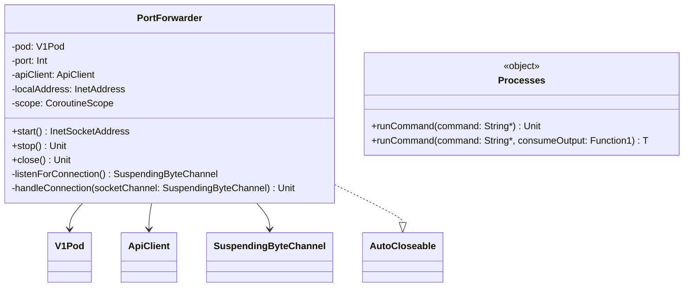

# org.wfanet.measurement.common.k8s.testing

## Overview
This package provides testing utilities for Kubernetes integration testing, specifically focused on port forwarding between local ports and Kubernetes pods, and executing system processes. It enables test environments to establish network connections to services running in Kubernetes clusters and execute external commands with proper error handling.

## Components

### PortForwarder
Manages bidirectional port forwarding from a local socket to a specified port on a Kubernetes pod using coroutines for concurrent connection handling.

| Method | Parameters | Returns | Description |
|--------|------------|---------|-------------|
| start | - | `InetSocketAddress` | Opens local socket and begins listening for connections to forward |
| stop | - | `Unit` | Cancels forwarding scope and closes server socket |
| close | - | `Unit` | Stops forwarding and waits for all coroutines to complete |

**Constructor Parameters:**
| Parameter | Type | Description |
|-----------|------|-------------|
| pod | `V1Pod` | Target Kubernetes pod for port forwarding |
| port | `Int` | Target port number on the pod |
| apiClient | `ApiClient` | Kubernetes API client (defaults to Configuration.getDefaultApiClient()) |
| localAddress | `InetAddress` | Local bind address (defaults to loopback) |
| coroutineContext | `CoroutineContext` | Coroutine context for I/O operations (defaults to Dispatchers.IO) |

**Key Features:**
- Asynchronous connection handling using coroutines
- Multiple concurrent connections supported
- Auto-closeable resource management
- Thread-safe start/stop operations

### Processes
Singleton object providing utilities for executing external system commands with output handling and error checking.

| Method | Parameters | Returns | Description |
|--------|------------|---------|-------------|
| runCommand | `vararg command: String` | `Unit` | Executes command and inherits stdout/stderr, throws on non-zero exit |
| runCommand | `vararg command: String, consumeOutput: (InputStream) -> T` | `T` | Executes command and processes stdout via consumer function |

**Behavior:**
- Both methods block until command completion
- Throw `IllegalStateException` on non-zero exit codes
- Second variant captures stdout for custom processing while preserving stderr for error reporting

## Dependencies
- `io.kubernetes.client:kubernetes-client-java` - Kubernetes API client and port forwarding
- `org.jetbrains.kotlinx:kotlinx-coroutines-core` - Coroutine infrastructure for asynchronous operations
- `org.wfanet.measurement.common` - Custom utilities (ContinuationCompletionHandler, SuspendingByteChannel)
- `org.jetbrains.annotations` - Blocking operation annotations

## Usage Example
```kotlin
import io.kubernetes.client.openapi.models.V1Pod
import org.wfanet.measurement.common.k8s.testing.PortForwarder
import org.wfanet.measurement.common.k8s.testing.Processes

// Port forwarding example
val pod: V1Pod = getPod("my-service")
val forwarder = PortForwarder(pod, port = 8080)
val localAddress = forwarder.start()
try {
  // Connect to localAddress to communicate with pod:8080
  println("Forwarding localhost:${localAddress.port} -> pod:8080")
} finally {
  forwarder.close()
}

// Process execution example
Processes.runCommand("kubectl", "get", "pods")

// Process execution with output capture
val output = Processes.runCommand("kubectl", "version", "--client") { inputStream ->
  inputStream.bufferedReader().readText()
}
```

## Class Diagram

