# org.wfanet.measurement.common

## Overview
The `org.wfanet.measurement.common` package provides core utility classes, interfaces, and functions for the Cross-Media Measurement system. It includes utilities for bitwise operations, environment variable handling, templating, coroutine flows, health monitoring, ID generation, protobuf message parsing, sorted list operations, timestamp conversions, API resource management, gRPC integrations, identity management, Kubernetes client operations, rate limiting, and throttling mechanisms.

## Components

### BitwiseOperations

#### Extensions

| Function | Parameters | Returns | Description |
|----------|------------|---------|-------------|
| xor | `other: ByteString` | `ByteString` | Performs XOR operation between two ByteStrings of equal size |

### EnvVars
Utility object for environment variable validation and retrieval.

| Method | Parameters | Returns | Description |
|--------|------------|---------|-------------|
| checkNotNullOrEmpty | `envVar: String` | `String` | Validates environment variable exists and is not blank |
| checkIsPath | `envVar: String` | `String` | Validates environment variable contains valid file path |

### FillableTemplate
String templating engine using `{{placeholder}}` syntax.

| Method | Parameters | Returns | Description |
|--------|------------|---------|-------------|
| fill | `values: Map<String, String>` | `String` | Replaces placeholders with values from map |

### Flows

#### Extensions

| Function | Parameters | Returns | Description |
|----------|------------|---------|-------------|
| singleOrNullIfEmpty | - | `T?` | Returns single value or null if empty, throws if multiple elements |

### Health
Interfaces and classes for health monitoring.

#### Health Interface

| Method | Parameters | Returns | Description |
|--------|------------|---------|-------------|
| healthy | - | `Boolean` | Current health status |
| waitUntilHealthy | - | `suspend Unit` | Suspends until healthy status is true |

#### SettableHealth

| Method | Parameters | Returns | Description |
|--------|------------|---------|-------------|
| setHealthy | `value: Boolean` | `Unit` | Updates health status to specified value |

#### FileExistsHealth
Health implementation backed by file existence on filesystem.

### IdGenerator
Functional interface for generating unique non-zero IDs.

| Method | Parameters | Returns | Description |
|--------|------------|---------|-------------|
| generateId | - | `Long` | Generates non-zero unique identifier |

#### RandomIdGenerator
Default implementation using random number generation.

#### Extensions

| Function | Parameters | Returns | Description |
|----------|------------|---------|-------------|
| generateNewId | `idExists: (Long) -> Boolean` | `Long` | Generates ID guaranteed not to exist per predicate |

### ProtobufMessages
Utility object for parsing protobuf messages from files.

| Method | Parameters | Returns | Description |
|--------|------------|---------|-------------|
| parseMessage | `file: File, messageInstance: T, typeRegistry: TypeRegistry` | `T` | Parses message from binary, JSON, or text format |

### SortedLists
Binary search utilities for sorted lists.

| Function | Parameters | Returns | Description |
|----------|------------|---------|-------------|
| lowerBound | `sortedList: List<T>, target: T` | `Int` | Finds smallest index where value >= target |
| upperBound | `sortedList: List<T>, target: T` | `Int` | Finds smallest index where value > target |

### Timestamps
Extension functions for protobuf and Java time conversions.

| Function | Parameters | Returns | Description |
|----------|------------|---------|-------------|
| DateTime.toZonedDateTime | - | `ZonedDateTime` | Converts protobuf DateTime to Java ZonedDateTime |
| DateTime.toTimestamp | - | `Timestamp` | Converts protobuf DateTime to Timestamp |
| ZonedDateTime.toProtoDateTime | - | `DateTime` | Converts Java ZonedDateTime to protobuf DateTime |
| Date.toLocalDate | - | `LocalDate` | Converts protobuf Date to Java LocalDate |

## API Package (org.wfanet.measurement.common.api)

### Principal
Base interface for authentication principals.

### ResourcePrincipal
Principal associated with a resource key.

| Property | Type | Description |
|----------|------|-------------|
| resourceKey | `ResourceKey` | Associated resource key |

### PrincipalLookup
Interface for retrieving principals by lookup key.

| Method | Parameters | Returns | Description |
|--------|------------|---------|-------------|
| getPrincipal | `lookupKey: K` | `suspend T?` | Retrieves principal for lookup key |

### ResourceKey
Interface representing API resource identifiers.

| Method | Parameters | Returns | Description |
|--------|------------|---------|-------------|
| toName | - | `String` | Converts resource key to resource name string |

#### ResourceKey.Factory

| Method | Parameters | Returns | Description |
|--------|------------|---------|-------------|
| fromName | `resourceName: String` | `T?` | Parses resource name into ResourceKey |

### ChildResourceKey
ResourceKey with parent relationship.

| Property | Type | Description |
|----------|------|-------------|
| parentKey | `ResourceKey` | Parent resource key |

### ResourceIds
Validation patterns for resource identifiers.

| Property | Type | Description |
|----------|------|-------------|
| AIP_122_REGEX | `Regex` | Pattern for AIP-122 compliant resource IDs |
| RFC_1034_REGEX | `Regex` | Pattern for RFC-1034 DNS labels |

### ETags
Utility object for HTTP entity tag generation.

| Method | Parameters | Returns | Description |
|--------|------------|---------|-------------|
| computeETag | `updateTime: Instant` | `String` | Generates RFC 7232 entity tag from timestamp |

### AkidConfigPrincipalLookup
Abstract principal lookup using authority key identifier configuration.

| Method | Parameters | Returns | Description |
|--------|------------|---------|-------------|
| getPrincipal | `lookupKey: ByteString` | `suspend T?` | Retrieves principal by AKID |
| getPrincipal | `resourceName: String` | `suspend T?` | Abstract method for resource name lookup |

### MemoizingPrincipalLookup
Caching wrapper for PrincipalLookup implementations.

| Method | Parameters | Returns | Description |
|--------|------------|---------|-------------|
| getPrincipal | `lookupKey: K` | `suspend T?` | Returns cached or fetched principal |

#### Extensions

| Function | Parameters | Returns | Description |
|----------|------------|---------|-------------|
| memoizing | - | `PrincipalLookup<T, K>` | Wraps lookup with caching layer |

### ResourceKeyLookup
Interface for retrieving resource keys.

| Method | Parameters | Returns | Description |
|--------|------------|---------|-------------|
| getResourceKey | `lookupKey: K` | `suspend ResourceKey?` | Retrieves resource key by lookup key |

## API gRPC Package (org.wfanet.measurement.common.api.grpc)

### ResourceList
Data class representing paginated list response.

| Property | Type | Description |
|----------|------|-------------|
| resources | `List<R>` | Resources in current page |
| nextPageToken | `T` | Token for next page or empty |

### ListResources Extensions

| Function | Parameters | Returns | Description |
|----------|------------|---------|-------------|
| listResources | `pageToken: T, list: suspend S.(T) -> ResourceList<R, T>` | `Flow<ResourceList<R, T>>` | Creates flow of paginated resources |
| listResources | `limit: Int, pageToken: T, list: suspend S.(T, Int) -> ResourceList<R, T>` | `Flow<ResourceList<R, T>>` | Creates limited flow of paginated resources |
| flattenConcat | - | `Flow<R>` | Flattens ResourceList flow to resource flow |

## gRPC Package (org.wfanet.measurement.common.grpc)

### Context Extensions

| Function | Parameters | Returns | Description |
|----------|------------|---------|-------------|
| withContext | `context: Context, action: () -> R` | `R` | Executes action with specified gRPC context |

### Interceptors
Utilities for gRPC server interceptors with metrics.

| Method | Parameters | Returns | Description |
|--------|------------|---------|-------------|
| recordServerDuration | `value: Duration, interceptorName: String, serviceName: String, methodName: String` | `Unit` | Records server interceptor duration metric |
| recordClientDuration | `value: Duration, interceptorName: String, serviceName: String, methodName: String` | `Unit` | Records client interceptor duration metric |

#### Extensions

| Function | Parameters | Returns | Description |
|----------|------------|---------|-------------|
| withInterceptor | `interceptor: ServerInterceptor` | `ServerServiceDefinition` | Adds interceptor to service definition |
| withInterceptors | `vararg interceptors: ServerInterceptor` | `ServerServiceDefinition` | Adds multiple interceptors to service |

### ErrorInfo Extensions

| Property | Type | Description |
|----------|------|-------------|
| StatusException.errorInfo | `ErrorInfo?` | Extracts ErrorInfo from status exception |
| StatusRuntimeException.errorInfo | `ErrorInfo?` | Extracts ErrorInfo from runtime exception |

#### Extensions

| Function | Parameters | Returns | Description |
|----------|------------|---------|-------------|
| asRuntimeException | `errorInfo: ErrorInfo` | `StatusRuntimeException` | Converts Status to exception with ErrorInfo |

### Errors
Utility object for building gRPC exceptions with error details.

| Method | Parameters | Returns | Description |
|--------|------------|---------|-------------|
| buildStatusRuntimeException | `code: Status.Code, message: String, errorInfo: ErrorInfo, cause: Throwable?` | `StatusRuntimeException` | Builds exception with ErrorInfo details |
| buildStatusRuntimeException | `status: Status, errorInfo: ErrorInfo` | `StatusRuntimeException` | Builds exception from Status with ErrorInfo |

### RateLimiterProvider
Provides rate limiter instances for gRPC methods based on configuration.

| Method | Parameters | Returns | Description |
|--------|------------|---------|-------------|
| getRateLimiter | `context: Context, fullMethodName: String` | `RateLimiter` | Returns configured rate limiter for call |

### RateLimitingServerInterceptor
Server interceptor that applies rate limiting to gRPC calls.

## Identity Package (org.wfanet.measurement.common.identity)

### DuchyIdentity
Data class representing authenticated Duchy identity.

| Property | Type | Description |
|----------|------|-------------|
| id | `String` | Stable duchy identifier |

### DuchyInfo
Singleton object managing duchy certificate configuration.

| Property | Type | Description |
|----------|------|-------------|
| entries | `Map<String, Entry>` | Map of duchy IDs to entry objects |
| ALL_DUCHY_IDS | `Set<String>` | All configured duchy identifiers |

| Method | Parameters | Returns | Description |
|--------|------------|---------|-------------|
| initializeFromFlags | `flags: DuchyInfoFlags` | `Unit` | Initializes from command-line flags |
| initializeFromConfig | `certConfig: DuchyCertConfig` | `Unit` | Initializes from protobuf configuration |
| getByRootCertificateSkid | `rootCertificateSkid: ByteString` | `Entry?` | Finds duchy by certificate key ID |
| getByDuchyId | `duchyId: String` | `Entry?` | Finds duchy by identifier |
| setForTest | `duchyIds: Set<String>` | `Unit` | Sets test duchy configuration |

#### DuchyInfo.Entry

| Property | Type | Description |
|----------|------|-------------|
| duchyId | `String` | Duchy identifier |
| computationControlServiceCertHost | `String` | Certificate hostname |
| rootCertificateSkid | `ByteString` | Root certificate subject key ID |

### DuchyTlsIdentityInterceptor
Server interceptor that extracts duchy identity from TLS certificate.

### TrustedPrincipalCallCredentials
Call credentials for trusted principal authentication.

| Property | Type | Description |
|----------|------|-------------|
| name | `String` | Principal resource name |

| Method | Parameters | Returns | Description |
|--------|------------|---------|-------------|
| fromHeaders | `headers: Metadata` | `TrustedPrincipalCallCredentials?` | Extracts credentials from metadata |

#### Extensions

| Function | Parameters | Returns | Description |
|----------|------------|---------|-------------|
| withDuchyIdentities | - | `ServerServiceDefinition` | Adds duchy identity interceptors to service |
| withDuchyId | `duchyId: String` | `T` | Attaches duchy ID to stub requests |
| withPrincipalName | `name: String` | `T` | Attaches principal name to stub requests |

## Kubernetes Package (org.wfanet.measurement.common.k8s)

### KubernetesClient
Interface for Kubernetes API operations.

| Method | Parameters | Returns | Description |
|--------|------------|---------|-------------|
| getDeployment | `name: String, namespace: String` | `suspend V1Deployment?` | Retrieves deployment by name |
| getPodTemplate | `name: String, namespace: String` | `suspend V1PodTemplate?` | Retrieves pod template by name |
| getNewReplicaSet | `deployment: V1Deployment` | `suspend V1ReplicaSet?` | Gets current replica set for deployment |
| listPods | `replicaSet: V1ReplicaSet` | `suspend V1PodList` | Lists pods for replica set |
| listJobs | `matchLabelsSelector: String, namespace: String` | `suspend V1JobList` | Lists jobs matching label selector |
| createJob | `job: V1Job` | `suspend V1Job` | Creates new job |
| deleteJob | `name: String, namespace: String, propagationPolicy: PropagationPolicy` | `suspend V1Status` | Deletes job with propagation policy |
| waitUntilDeploymentComplete | `name: String, namespace: String, timeout: Duration` | `suspend V1Deployment` | Suspends until deployment completes |
| waitForServiceAccount | `name: String, namespace: String, timeout: Duration` | `suspend V1ServiceAccount` | Suspends until service account exists |
| kubectlApply | `config: File` | `Sequence<KubernetesObject>` | Applies Kubernetes config from file |
| kubectlApply | `config: String` | `Sequence<KubernetesObject>` | Applies Kubernetes config from string |
| kubectlApply | `k8sObjects: Iterable<KubernetesObject>` | `Sequence<KubernetesObject>` | Applies Kubernetes objects |

### KubernetesClientImpl
Default implementation of KubernetesClient using official Kubernetes Java client.

### PropagationPolicy
Enum for Kubernetes garbage collection policies.

| Value | Description |
|-------|-------------|
| ORPHAN | Leave dependents orphaned |
| BACKGROUND | Delete dependents in background |
| FOREGROUND | Delete dependents in foreground |

#### Extensions

| Function | Parameters | Returns | Description |
|----------|------------|---------|-------------|
| V1LabelSelector.matchLabelsSelector | - | `String` | Converts label selector to query string |
| V1PodTemplateSpec.clone | - | `V1PodTemplateSpec` | Creates deep copy of pod template |
| V1Job.failed | - | `Boolean` | Checks if job has failed |
| V1Job.complete | - | `Boolean` | Checks if job is complete |
| ApiException.status | - | `V1Status?` | Extracts V1Status from exception |

## Media Type Package (org.wfanet.measurement.common.mediatype)

### MediaType Extensions

| Function | Parameters | Returns | Description |
|----------|------------|---------|-------------|
| toEventAnnotationMediaType | - | `EventAnnotationMediaType` | Converts reporting MediaType to event annotation MediaType |

## Rate Limit Package (org.wfanet.measurement.common.ratelimit)

### RateLimiter
Interface for rate limiting execution.

| Method | Parameters | Returns | Description |
|--------|------------|---------|-------------|
| tryAcquire | `permitCount: Int` | `Boolean` | Attempts non-blocking permit acquisition |
| acquire | `permitCount: Int` | `suspend Unit` | Suspends until permits acquired |

#### Companion Objects

| Property | Type | Description |
|----------|------|-------------|
| Unlimited | `RateLimiter` | Rate limiter allowing unlimited requests |
| Blocked | `RateLimiter` | Rate limiter blocking all requests |

#### Extensions

| Function | Parameters | Returns | Description |
|----------|------------|---------|-------------|
| withPermits | `permitCount: Int, action: () -> T` | `suspend T` | Executes action with acquired permits |

### TokenBucket
Token bucket algorithm implementation of RateLimiter.

| Constructor Parameter | Type | Description |
|----------------------|------|-------------|
| size | `Int` | Maximum tokens in bucket |
| fillRate | `Double` | Tokens refilled per second |
| timeSource | `TimeSource.WithComparableMarks` | Time source for monotonic time |

## Throttler Package (org.wfanet.measurement.common.throttler)

### MaximumRateThrottler
Throttler limiting executions to maximum rate per second.

| Constructor Parameter | Type | Description |
|----------------------|------|-------------|
| maxPerSecond | `Double` | Maximum executions per second |
| timeSource | `TimeSource.WithComparableMarks` | Time source for rate calculation |

| Method | Parameters | Returns | Description |
|--------|------------|---------|-------------|
| acquire | - | `suspend Unit` | Suspends until execution permitted |
| onReady | `block: suspend () -> T` | `suspend T` | Executes block when rate limit permits |

## Dependencies

- `com.google.protobuf` - Protocol buffer message serialization and parsing
- `io.grpc` - gRPC framework for remote procedure calls
- `io.kubernetes.client` - Kubernetes API client for cluster operations
- `kotlinx.coroutines` - Kotlin coroutines for asynchronous programming
- `com.google.type` - Google common types for dates and timestamps
- `org.wfanet.measurement.config` - Configuration protobuf messages
- `org.wfanet.measurement.api.v2alpha` - API v2 alpha definitions
- `org.wfanet.measurement.reporting.v2alpha` - Reporting API definitions

## Usage Examples

### ID Generation
```kotlin
val idGenerator = IdGenerator.Default
val newId = idGenerator.generateId()

// Generate unique ID with existence check
val uniqueId = idGenerator.generateNewId { id ->
  database.exists(id)
}
```

### Template Filling
```kotlin
val template = FillableTemplate("Hello {{name}}, you are {{age}} years old")
val result = template.fill(mapOf("name" to "Alice", "age" to "30"))
// Result: "Hello Alice, you are 30 years old"
```

### Health Monitoring
```kotlin
val health = SettableHealth(healthy = true)
health.waitUntilHealthy() // Returns immediately

health.setHealthy(false)
launch {
  health.waitUntilHealthy() // Suspends until healthy
}
```

### Rate Limiting
```kotlin
val rateLimiter = TokenBucket(size = 10, fillRate = 5.0)

// Non-blocking attempt
if (rateLimiter.tryAcquire()) {
  processRequest()
}

// Suspending acquisition
rateLimiter.withPermits(3) {
  processBatchRequest()
}
```

### gRPC Principal Authentication
```kotlin
val stub = MyServiceCoroutineStub(channel)
  .withPrincipalName("dataProviders/12345")

val response = stub.getData(request)
```

### Kubernetes Operations
```kotlin
val k8sClient = KubernetesClientImpl()

// Wait for deployment
val deployment = k8sClient.waitUntilDeploymentComplete(
  name = "my-app",
  namespace = "default",
  timeout = Duration.ofMinutes(5)
)

// Create and wait for job
val job = k8sClient.createJob(myJobSpec)
```

## Class Diagram

```mermaid
classDiagram
    class Principal {
        <<interface>>
    }
    class ResourcePrincipal {
        <<interface>>
        +resourceKey: ResourceKey
    }
    class PrincipalLookup {
        <<interface>>
        +getPrincipal(lookupKey: K) T?
    }
    class ResourceKey {
        <<interface>>
        +toName() String
    }
    class ChildResourceKey {
        <<interface>>
        +parentKey: ResourceKey
    }
    class Health {
        <<interface>>
        +healthy: Boolean
        +waitUntilHealthy()
    }
    class SettableHealth {
        +setHealthy(value: Boolean)
    }
    class FileExistsHealth {
        -file: File
    }
    class IdGenerator {
        <<interface>>
        +generateId() Long
    }
    class RandomIdGenerator {
        -random: Random
        +generateId() Long
    }
    class RateLimiter {
        <<interface>>
        +tryAcquire(permitCount: Int) Boolean
        +acquire(permitCount: Int)
    }
    class TokenBucket {
        -size: Int
        -fillRate: Double
        +tryAcquire(permitCount: Int) Boolean
        +acquire(permitCount: Int)
    }
    class KubernetesClient {
        <<interface>>
        +getDeployment(name: String, namespace: String) V1Deployment?
        +createJob(job: V1Job) V1Job
        +waitUntilDeploymentComplete(name: String, namespace: String, timeout: Duration) V1Deployment
    }
    class KubernetesClientImpl {
        -apiClient: ApiClient
        -coreApi: CoreV1Api
        -appsApi: AppsV1Api
    }
    class DuchyIdentity {
        +id: String
    }
    class MemoizingPrincipalLookup {
        -delegate: PrincipalLookup
        -cache: ConcurrentHashMap
        +getPrincipal(lookupKey: K) T?
    }
    class RateLimiterProvider {
        -config: RateLimitConfig
        +getRateLimiter(context: Context, fullMethodName: String) RateLimiter
    }

    ResourcePrincipal --|> Principal
    ChildResourceKey --|> ResourceKey
    ResourcePrincipal --> ResourceKey
    SettableHealth --|> Health
    FileExistsHealth --|> SettableHealth
    RandomIdGenerator ..|> IdGenerator
    TokenBucket ..|> RateLimiter
    KubernetesClientImpl ..|> KubernetesClient
    MemoizingPrincipalLookup ..|> PrincipalLookup
    MemoizingPrincipalLookup --> PrincipalLookup
    RateLimiterProvider --> RateLimiter
```

