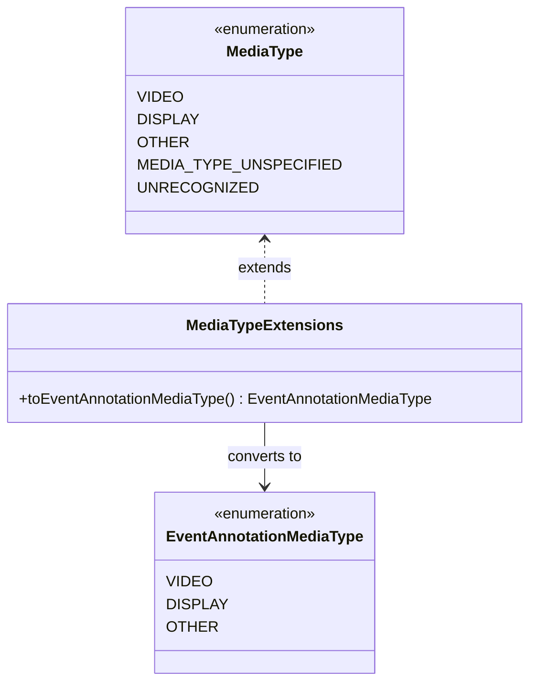

# org.wfanet.measurement.common.mediatype

## Overview
Provides conversion utilities for MediaType enumerations between different API versions. This package bridges the reporting v2alpha MediaType and the event annotation v2alpha MediaType, enabling seamless type transformations across API boundaries.

## Extensions

### MediaType Extension Functions

| Method | Parameters | Returns | Description |
|--------|------------|---------|-------------|
| toEventAnnotationMediaType | - | `EventAnnotationMediaType` | Converts reporting MediaType to event annotation MediaType |

#### Conversion Mapping
- `MediaType.VIDEO` → `EventAnnotationMediaType.VIDEO`
- `MediaType.DISPLAY` → `EventAnnotationMediaType.DISPLAY`
- `MediaType.OTHER` → `EventAnnotationMediaType.OTHER`
- `MediaType.MEDIA_TYPE_UNSPECIFIED` → `UnsupportedOperationException`
- `MediaType.UNRECOGNIZED` → `UnsupportedOperationException`

## Dependencies
- `org.wfanet.measurement.api.v2alpha.MediaType` - Event annotation API MediaType definition
- `org.wfanet.measurement.reporting.v2alpha.MediaType` - Reporting API MediaType definition

## Usage Example
```kotlin
import org.wfanet.measurement.common.mediatype.toEventAnnotationMediaType
import org.wfanet.measurement.reporting.v2alpha.MediaType

val reportingMediaType = MediaType.VIDEO
val eventAnnotationMediaType = reportingMediaType.toEventAnnotationMediaType()
// Result: EventAnnotationMediaType.VIDEO

// Unspecified types throw UnsupportedOperationException
val unspecified = MediaType.MEDIA_TYPE_UNSPECIFIED
// unspecified.toEventAnnotationMediaType() // throws UnsupportedOperationException
```

## Class Diagram

