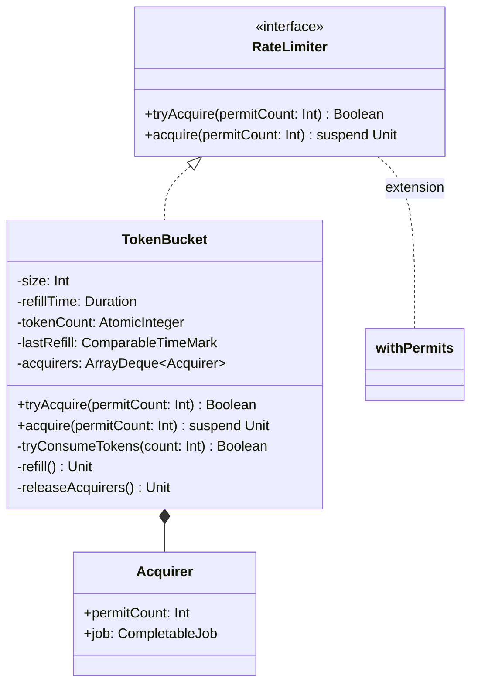

# org.wfanet.measurement.common.ratelimit

## Overview
This package provides rate limiting functionality using coroutine-based permit acquisition mechanisms. It implements the token bucket algorithm for controlling the rate of operations in concurrent environments and offers configurable rate limiting with both blocking and non-blocking acquisition semantics.

## Components

### RateLimiter
Core interface for rate limiting operations with permit-based access control.

| Method | Parameters | Returns | Description |
|--------|------------|---------|-------------|
| tryAcquire | `permitCount: Int = 1` | `Boolean` | Attempts non-blocking permit acquisition |
| acquire | `permitCount: Int = 1` | `Unit` (suspend) | Suspends until permits are acquired |

**Companion Object Instances:**

- **Unlimited**: Always grants permits immediately without rate limiting
- **Blocked**: Always denies permits and suspends indefinitely

### TokenBucket
Token bucket algorithm implementation for rate limiting with configurable capacity and refill rate.

| Method | Parameters | Returns | Description |
|--------|------------|---------|-------------|
| tryAcquire | `permitCount: Int = 1` | `Boolean` | Attempts immediate token consumption |
| acquire | `permitCount: Int = 1` | `Unit` (suspend) | Waits for token availability and consumes |

**Constructor Parameters:**

| Parameter | Type | Description |
|-----------|------|-------------|
| size | `Int` | Maximum bucket capacity (tokens) |
| fillRate | `Double` | Token refill rate per second |
| timeSource | `TimeSource.WithComparableMarks` | Time source for refill calculation (default: Monotonic) |

**Private Methods:**

| Method | Parameters | Returns | Description |
|--------|------------|---------|-------------|
| tryConsumeTokens | `count: Int` | `Boolean` | Atomically consumes tokens if available |
| refill | - | `Unit` | Adds tokens based on elapsed time |
| releaseAcquirers | - | `Unit` | Processes waiting acquirers in FIFO order |

## Extensions

### withPermits
Executes an action after acquiring permits and automatically manages permit lifecycle.

| Method | Parameters | Returns | Description |
|--------|------------|---------|-------------|
| withPermits | `permitCount: Int = 1, action: () -> T` | `T` (suspend) | Acquires permits then executes action |

## Data Structures

### Acquirer (private)
Internal data class for tracking pending permit requests in FIFO queue.

| Property | Type | Description |
|----------|------|-------------|
| permitCount | `Int` | Number of permits requested |
| job | `CompletableJob` | Coroutine job for signaling completion |

## Dependencies
- `kotlinx.coroutines` - Suspend functions, Job management, and cancellation
- `java.util.concurrent.atomic` - Thread-safe atomic operations
- `kotlin.time` - Duration and TimeSource for refill timing

## Usage Example
```kotlin
// Create a rate limiter allowing 10 requests per second with burst of 20
val rateLimiter = TokenBucket(size = 20, fillRate = 10.0)

// Non-blocking attempt
if (rateLimiter.tryAcquire(5)) {
    processRequest()
}

// Suspending acquisition
rateLimiter.acquire(3)
processRequest()

// With extension function
rateLimiter.withPermits(2) {
    performRateLimitedOperation()
}

// Use predefined instances
val unlimited = RateLimiter.Unlimited
val blocked = RateLimiter.Blocked
```

## Class Diagram


## Algorithm Details

### Token Bucket
The `TokenBucket` class implements a thread-safe token bucket algorithm with the following characteristics:

- **Refill Mechanism**: Tokens are added at a constant rate (`fillRate` per second) up to maximum `size`
- **FIFO Ordering**: Pending acquirers are served in first-in-first-out order
- **Atomic Operations**: Token consumption uses atomic compare-and-swap for thread safety
- **Time-based Refill**: Refills are calculated based on elapsed time since last refill
- **Coroutine Integration**: Uses suspend functions and Jobs for asynchronous permit waiting

### Behavior Guarantees
- Permits exceeding bucket size will never be granted (`tryAcquire` returns false, `acquire` cancels)
- Negative permit counts are rejected with `IllegalArgumentException`
- Time source must be monotonic (non-decreasing)
- Acquirers are released atomically during refill operations
