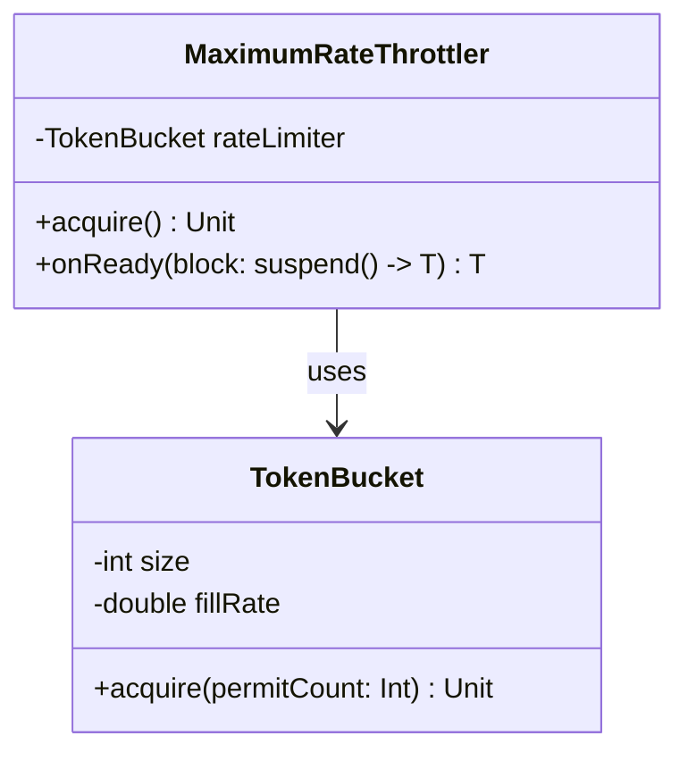

# org.wfanet.measurement.common.throttler

## Overview
This package provides rate-limiting throttler implementations that control execution frequency using token bucket algorithms. The primary component enforces maximum execution rates per second with support for concurrent operations and customizable time sources.

## Components

### MaximumRateThrottler
Rate limiter that restricts executions to a specified maximum rate per second using a token bucket algorithm. Supports concurrent executions and allows customization of the time source for testing.

**Constructor Parameters:**
| Parameter | Type | Description |
|-----------|------|-------------|
| maxPerSecond | `Double` | Maximum number of executions allowed per second (must be > 0) |
| timeSource | `TimeSource.WithComparableMarks` | Time source for marking execution times (defaults to TimeSource.Monotonic) |

**Methods:**
| Method | Parameters | Returns | Description |
|--------|------------|---------|-------------|
| acquire | None | `Unit` | Suspends until a token is available for execution |
| onReady | `block: suspend () -> T` | `T` | Acquires token then executes the provided block |

## Dependencies
- `kotlin.time.TimeSource` - Provides time marking for rate calculation
- `org.wfanet.measurement.common.ratelimit.TokenBucket` - Underlying token bucket rate limiter implementation

## Usage Example
```kotlin
// Create throttler allowing 10 executions per second
val throttler = MaximumRateThrottler(maxPerSecond = 10.0)

// Execute a rate-limited operation
throttler.onReady {
    performExpensiveOperation()
}

// Or acquire token manually
throttler.acquire()
val result = performOperation()
```

## Class Diagram

