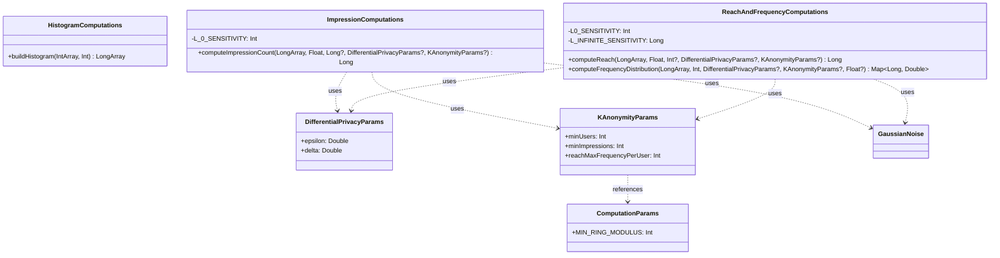

# org.wfanet.measurement.computation

## Overview

This package provides core computation utilities for privacy-preserving measurement calculations. It implements histogram-based computations for reach, frequency, and impression metrics with support for differential privacy (DP) and k-anonymity constraints. The package serves as the foundation for privacy-safe aggregation of cross-media measurement data.

## Components

### HistogramComputations

Singleton object providing histogram construction utilities from frequency vectors.

| Method | Parameters | Returns | Description |
|--------|------------|---------|-------------|
| buildHistogram | `frequencyVector: IntArray`, `maxFrequency: Int` | `LongArray` | Builds histogram from frequency vector, capping frequencies at maxFrequency |

### ImpressionComputations

Singleton object for computing impression counts with privacy guarantees.

| Method | Parameters | Returns | Description |
|--------|------------|---------|-------------|
| computeImpressionCount | `rawHistogram: LongArray`, `vidSamplingIntervalWidth: Float`, `maxFrequency: Long?`, `dpParams: DifferentialPrivacyParams?`, `kAnonymityParams: KAnonymityParams?` | `Long` | Computes impression count with optional DP noise and k-anonymity thresholding |

### ReachAndFrequencyComputations

Singleton object for computing reach and frequency distribution metrics with privacy safeguards.

| Method | Parameters | Returns | Description |
|--------|------------|---------|-------------|
| computeReach | `rawHistogram: LongArray`, `vidSamplingIntervalWidth: Float`, `vectorSize: Int?`, `dpParams: DifferentialPrivacyParams?`, `kAnonymityParams: KAnonymityParams?` | `Long` | Computes reach from histogram with optional DP noise and k-anonymity |
| computeFrequencyDistribution | `rawHistogram: LongArray`, `maxFrequency: Int`, `dpParams: DifferentialPrivacyParams?`, `kAnonymityParams: KAnonymityParams?`, `vidSamplingIntervalWidth: Float?` | `Map<Long, Double>` | Computes frequency distribution with privacy parameters |

### ComputationParams

Singleton object holding global computation configuration constants.

| Constant | Type | Value | Description |
|----------|------|-------|-------------|
| MIN_RING_MODULUS | `Int` | 127 | Minimum ring modulus for HMShuffle computations |

## Data Structures

### DifferentialPrivacyParams

| Property | Type | Description |
|----------|------|-------------|
| epsilon | `Double` | Privacy budget parameter controlling noise magnitude |
| delta | `Double` | Failure probability bound for differential privacy |

### KAnonymityParams

| Property | Type | Description |
|----------|------|-------------|
| minUsers | `Int` | Minimum unique users required for k-anonymity |
| minImpressions | `Int` | Minimum impressions required for k-anonymity |
| reachMaxFrequencyPerUser | `Int` | Maximum frequency per user for reach (default: min of Byte.MAX_VALUE and MIN_RING_MODULUS - 1) |

## Dependencies

- `com.google.privacy.differentialprivacy.GaussianNoise` - Google Differential Privacy library for noise generation
- `kotlin.math` - Standard Kotlin math utilities for min/max operations

## Usage Example

```kotlin
// Build a histogram from frequency data
val frequencies = intArrayOf(1, 2, 2, 3, 5, 5, 5)
val histogram = HistogramComputations.buildHistogram(frequencies, maxFrequency = 5)

// Configure privacy parameters
val dpParams = DifferentialPrivacyParams(epsilon = 1.0, delta = 1e-5)
val kAnonymityParams = KAnonymityParams(minUsers = 100, minImpressions = 1000)

// Compute reach with privacy guarantees
val reach = ReachAndFrequencyComputations.computeReach(
    rawHistogram = histogram,
    vidSamplingIntervalWidth = 0.1f,
    vectorSize = 10000,
    dpParams = dpParams,
    kAnonymityParams = kAnonymityParams
)

// Compute impressions with privacy
val impressions = ImpressionComputations.computeImpressionCount(
    rawHistogram = histogram,
    vidSamplingIntervalWidth = 0.1f,
    maxFrequency = 5L,
    dpParams = dpParams,
    kAnonymityParams = kAnonymityParams
)

// Compute frequency distribution
val frequencyDist = ReachAndFrequencyComputations.computeFrequencyDistribution(
    rawHistogram = histogram,
    maxFrequency = 5,
    dpParams = dpParams,
    kAnonymityParams = kAnonymityParams,
    vidSamplingIntervalWidth = 0.1f
)
```

## Class Diagram


