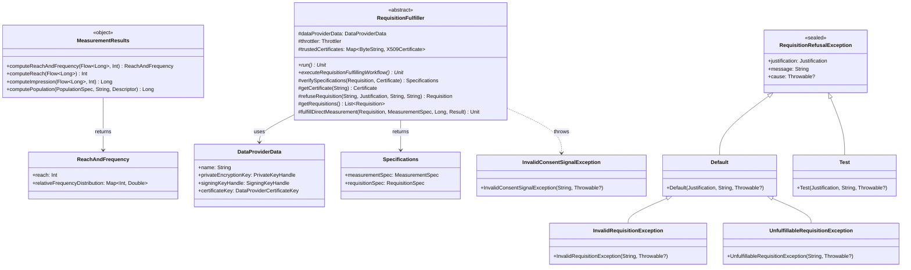

# org.wfanet.measurement.dataprovider

## Overview
This package provides core functionality for data providers in the Cross-Media Measurement system, including computation of measurement results (reach, frequency, impressions, population), requisition fulfillment workflows, cryptographic verification of consent signals, and exception handling for requisition refusal scenarios.

## Components

### MeasurementResults

Singleton object providing deterministic computation utilities for reach, frequency, impression, and population metrics.

| Method | Parameters | Returns | Description |
|--------|------------|---------|-------------|
| computeReachAndFrequency | `filteredVids: Flow<Long>`, `maxFrequency: Int` | `suspend ReachAndFrequency` | Computes reach and frequency from flow of VIDs using deterministic count distinct and distribution |
| computeReachAndFrequency | `filteredVids: Sequence<Long>`, `maxFrequency: Int` | `ReachAndFrequency` | Computes reach and frequency from sequence of VIDs |
| computeReachAndFrequency | `filteredVids: Iterable<Long>`, `maxFrequency: Int` | `ReachAndFrequency` | Computes reach and frequency from iterable of VIDs |
| computeReach | `filteredVids: Flow<Long>` | `suspend Int` | Counts distinct VIDs in flow using deterministic count distinct |
| computeReach | `filteredVids: Sequence<Long>` | `Int` | Counts distinct VIDs in sequence |
| computeReach | `filteredVids: Iterable<Long>` | `Int` | Counts distinct VIDs in iterable |
| computeImpression | `filteredVids: Flow<Long>`, `maxFrequency: Int` | `suspend Long` | Counts total impressions from flow with frequency capping |
| computeImpression | `filteredVids: Sequence<Long>`, `maxFrequency: Int` | `Long` | Counts total impressions from sequence with frequency capping |
| computeImpression | `filteredVids: Iterable<Long>`, `maxFrequency: Int` | `Long` | Counts total impressions from iterable with frequency capping |
| computePopulation | `populationSpec: PopulationSpec`, `filterExpression: String`, `eventMessageDescriptor: Descriptors.Descriptor` | `Long` | Computes sub-population size using CEL filter expression |

### RequisitionFulfiller

Abstract base class orchestrating the requisition fulfillment workflow including cryptographic verification, certificate management, and secure communication with measurement consumers.

| Method | Parameters | Returns | Description |
|--------|------------|---------|-------------|
| run | - | `suspend Unit` | Executes the simulator sequence of operations |
| executeRequisitionFulfillingWorkflow | - | `suspend Unit` | Executes the requisition fulfillment workflow |
| verifySpecifications | `requisition: Requisition`, `measurementConsumerCertificate: Certificate` | `Specifications` | Verifies and decrypts measurement and requisition specifications |
| getCertificate | `resourceName: String` | `suspend Certificate` | Retrieves certificate by resource name |
| refuseRequisition | `requisitionName: String`, `justification: Requisition.Refusal.Justification`, `message: String`, `etag: String` | `suspend Requisition` | Refuses requisition with justification and message |
| getRequisitions | - | `suspend List<Requisition>` | Retrieves unfulfilled requisitions for data provider |
| fulfillDirectMeasurement | `requisition: Requisition`, `measurementSpec: MeasurementSpec`, `nonce: Long`, `measurementResult: Measurement.Result` | `suspend Unit` | Encrypts and submits measurement result for direct requisition |

### RequisitionRefusalException

Sealed exception hierarchy for structured handling of requisition refusal scenarios with justifications.

| Type | Parameters | Description |
|------|------------|-------------|
| Default | `justification: Requisition.Refusal.Justification`, `message: String`, `cause: Throwable?` | Base implementation for general refusal cases |
| Test | `justification: Requisition.Refusal.Justification`, `message: String`, `cause: Throwable?` | Exception specific to test EventGroups |

### InvalidRequisitionException

Exception indicating specification invalidity in requisition encryption or measurement spec.

| Property | Type | Description |
|----------|------|-------------|
| message | `String` | Error message describing the invalid specification |
| cause | `Throwable?` | Root cause of the validation failure |

### UnfulfillableRequisitionException

Exception for requisitions that should be fulfillable but encounter unrecoverable system errors.

| Property | Type | Description |
|----------|------|-------------|
| message | `String` | Error message describing the system error |
| cause | `Throwable?` | Root cause of the fulfillment failure |

### InvalidConsentSignalException

Exception for cryptographic verification failures in consent signaling.

| Property | Type | Description |
|----------|------|-------------|
| message | `String` | Error message describing the verification failure |
| cause | `Throwable?` | Root cause of the cryptographic error |

## Data Structures

### ReachAndFrequency

| Property | Type | Description |
|----------|------|-------------|
| reach | `Int` | Total count of distinct VIDs |
| relativeFrequencyDistribution | `Map<Int, Double>` | Map from frequency bucket to relative proportion |

### DataProviderData

| Property | Type | Description |
|----------|------|-------------|
| name | `String` | DataProvider's public API resource name |
| privateEncryptionKey | `PrivateKeyHandle` | Decryption key for encrypted requisitions |
| signingKeyHandle | `SigningKeyHandle` | Consent signaling signing key |
| certificateKey | `DataProviderCertificateKey` | Certificate key for result signing |

### Specifications

| Property | Type | Description |
|----------|------|-------------|
| measurementSpec | `MeasurementSpec` | Verified and decrypted measurement specification |
| requisitionSpec | `RequisitionSpec` | Verified and decrypted requisition specification |

## Dependencies

- `org.wfanet.measurement.api.v2alpha` - Public API protocol buffers and gRPC stubs
- `org.wfanet.measurement.eventdataprovider.eventfiltration` - CEL-based event filtering
- `org.wfanet.measurement.consent.client.dataprovider` - Cryptographic consent signaling operations
- `org.wfanet.measurement.common.crypto` - Certificate and key management utilities
- `org.wfanet.measurement.common.throttler` - Rate limiting for API operations
- `com.google.protobuf` - Protocol buffer message handling
- `kotlinx.coroutines.flow` - Asynchronous stream processing

## Usage Example

```kotlin
// Compute reach and frequency from event data
val vids: Flow<Long> = eventStream.map { it.virtualPersonId }
val result = MeasurementResults.computeReachAndFrequency(
    filteredVids = vids,
    maxFrequency = 10
)
println("Reach: ${result.reach}")
println("Frequency distribution: ${result.relativeFrequencyDistribution}")

// Implement requisition fulfiller
class MyRequisitionFulfiller(
    dataProviderData: DataProviderData,
    certificatesStub: CertificatesCoroutineStub,
    requisitionsStub: RequisitionsCoroutineStub,
    throttler: Throttler,
    trustedCertificates: Map<ByteString, X509Certificate>
) : RequisitionFulfiller(
    dataProviderData,
    certificatesStub,
    requisitionsStub,
    throttler,
    trustedCertificates
) {
    override suspend fun run() {
        executeRequisitionFulfillingWorkflow()
    }

    override suspend fun executeRequisitionFulfillingWorkflow() {
        val requisitions = getRequisitions()
        for (requisition in requisitions) {
            try {
                val certificate = getCertificate(requisition.measurementConsumerCertificate)
                val specs = verifySpecifications(requisition, certificate)
                // Process requisition and generate result
                val result = generateMeasurementResult(specs)
                fulfillDirectMeasurement(requisition, specs.measurementSpec, nonce, result)
            } catch (e: RequisitionRefusalException) {
                refuseRequisition(requisition.name, e.justification, e.message, requisition.etag)
            }
        }
    }
}
```

## Class Diagram


