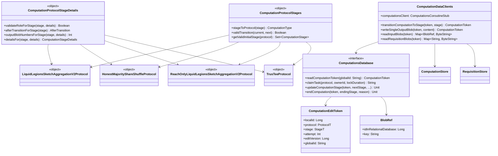

# org.wfanet.measurement.duchy.db.computation

## Overview
This package provides the database abstraction layer for managing multi-party computation (MPC) protocols within a Duchy. It defines interfaces and implementations for tracking computation stages, managing blob storage references, and coordinating distributed computation workflows across multiple protocols including Liquid Legions V2, Reach-Only Liquid Legions V2, Honest Majority Share Shuffle, and TrusTEE.

## Components

### ComputationsDatabase
Primary interface for computation database operations combining read and write capabilities.

| Method | Parameters | Returns | Description |
|--------|------------|---------|-------------|
| readComputationToken | `globalId: String` | `ComputationToken?` | Retrieves computation token by global identifier |
| readComputationToken | `externalRequisitionKey: ExternalRequisitionKey` | `ComputationToken?` | Retrieves computation token by requisition key |
| readGlobalComputationIds | `stages: Set<ComputationStage>`, `updatedBefore: Instant?` | `Set<String>` | Retrieves global IDs matching stage and time filters |
| readComputationBlobKeys | `localId: Long` | `List<String>` | Retrieves all blob keys for a computation |
| readRequisitionBlobKeys | `localId: Long` | `List<String>` | Retrieves all requisition blob keys |
| insertComputation | `globalId: String`, `protocol: ProtocolT`, `initialStage: StageT`, `stageDetails: StageDetailsT`, `computationDetails: ComputationDetailsT`, `requisitions: List<RequisitionEntry>` | `Unit` | Creates new computation and adds to work queue |
| deleteComputation | `localId: Long` | `Unit` | Removes computation and all related records |
| enqueue | `token: ComputationEditToken`, `delaySecond: Int`, `expectedOwner: String` | `Unit` | Adds computation to work queue after delay |
| claimTask | `protocol: ProtocolT`, `ownerId: String`, `lockDuration: Duration`, `prioritizedStages: List<StageT>` | `String?` | Claims and locks available computation task |
| updateComputationStage | `token: ComputationEditToken`, `nextStage: StageT`, `inputBlobPaths: List<String>`, `passThroughBlobPaths: List<String>`, `outputBlobs: Int`, `afterTransition: AfterTransition`, `nextStageDetails: StageDetailsT`, `lockExtension: Duration?` | `Unit` | Transitions computation to new stage |
| endComputation | `token: ComputationEditToken`, `endingStage: StageT`, `endComputationReason: EndComputationReason`, `computationDetails: ComputationDetailsT` | `Unit` | Moves computation to terminal state |
| updateComputationDetails | `token: ComputationEditToken`, `computationDetails: ComputationDetailsT`, `requisitions: List<RequisitionEntry>` | `Unit` | Overwrites computation details |
| writeOutputBlobReference | `token: ComputationEditToken`, `blobRef: BlobRef` | `Unit` | Records blob reference for output |
| writeRequisitionBlobPath | `token: ComputationEditToken`, `externalRequisitionKey: ExternalRequisitionKey`, `pathToBlob: String`, `publicApiVersion: String`, `protocol: RequisitionDetails.RequisitionProtocol?` | `Unit` | Records requisition blob path from fulfillment |
| insertComputationStat | `localId: Long`, `stage: StageT`, `attempt: Long`, `metric: ComputationStatMetric` | `Unit` | Inserts computation performance metric |

### ComputationDataClients
Unified client for accessing computation storage and blob storage.

| Method | Parameters | Returns | Description |
|--------|------------|---------|-------------|
| transitionComputationToStage | `computationToken: ComputationToken`, `inputsToNextStage: List<String>`, `passThroughBlobs: List<String>`, `stage: ComputationStage` | `suspend ComputationToken` | Advances computation to next stage |
| writeSingleOutputBlob | `computationToken: ComputationToken`, `content: ByteString` | `suspend ComputationToken` | Writes single output blob for current stage |
| readAllRequisitionBlobs | `token: ComputationToken`, `duchyId: String` | `suspend ByteString` | Reads and combines all requisition blobs |
| readRequisitionBlobs | `token: ComputationToken` | `suspend Map<String, ByteString>` | Returns requisition blobs mapped by ID |
| readSingleRequisitionBlob | `requisition: RequisitionMetadata` | `suspend ByteString?` | Reads single requisition blob |
| readInputBlobs | `token: ComputationToken` | `suspend Map<BlobRef, ByteString>` | Returns all input blobs for stage |
| readSingleOutputBlob | `token: ComputationToken` | `Flow<ByteString>?` | Streams single output blob content |

### ComputationProtocolStages
Object providing stage enumeration helpers for all supported protocols.

| Method | Parameters | Returns | Description |
|--------|------------|---------|-------------|
| stageToProtocol | `stage: ComputationStage` | `ComputationType` | Extracts protocol type from stage |
| computationStageEnumToLongValues | `value: ComputationStage` | `ComputationStageLongValues` | Converts stage enum to storage representation |
| longValuesToComputationStageEnum | `value: ComputationStageLongValues` | `ComputationStage` | Converts storage representation to stage enum |
| getValidInitialStage | `protocol: ComputationType` | `Set<ComputationStage>` | Returns valid initial stages for protocol |
| getValidTerminalStages | `protocol: ComputationType` | `Set<ComputationStage>` | Returns valid terminal stages for protocol |
| validInitialStage | `protocol: ComputationType`, `stage: ComputationStage` | `Boolean` | Validates stage as initial for protocol |
| validTerminalStage | `protocol: ComputationType`, `stage: ComputationStage` | `Boolean` | Validates stage as terminal for protocol |
| validTransition | `currentStage: ComputationStage`, `nextStage: ComputationStage` | `Boolean` | Validates stage transition is allowed |

### ComputationProtocolStageDetails
Object for managing protocol-specific stage details across all protocols.

| Method | Parameters | Returns | Description |
|--------|------------|---------|-------------|
| validateRoleForStage | `stage: ComputationStage`, `computationDetails: ComputationDetails` | `Boolean` | Validates duchy role matches stage requirements |
| afterTransitionForStage | `stage: ComputationStage` | `AfterTransition` | Determines post-transition behavior for stage |
| outputBlobNumbersForStage | `stage: ComputationStage`, `computationDetails: ComputationDetails` | `Int` | Returns expected output blob count |
| detailsFor | `stage: ComputationStage`, `computationDetails: ComputationDetails` | `ComputationStageDetails` | Creates stage-specific details proto |
| parseDetails | `protocol: ComputationType`, `bytes: ByteArray` | `ComputationStageDetails` | Parses stage details from bytes |
| setEndingState | `details: ComputationDetails`, `reason: EndComputationReason` | `ComputationDetails` | Sets computation ending state |
| parseComputationDetails | `bytes: ByteArray` | `ComputationDetails` | Parses computation details from bytes |

### ComputationTypes
Helper object for working with ComputationType enumerations.

| Method | Parameters | Returns | Description |
|--------|------------|---------|-------------|
| protocolEnumToLong | `value: ComputationType` | `Long` | Converts protocol enum to long value |
| longToProtocolEnum | `value: Long` | `ComputationType` | Converts long value to protocol enum |

### LiquidLegionsSketchAggregationV2Protocol
Protocol-specific helpers for Liquid Legions V2 MPC stages.

| Component | Description |
|-----------|-------------|
| EnumStages | Helper for raw LiquidLegionsSketchAggregationV2.Stage enums |
| EnumStages.Details | Creates ComputationStageDetails from stage enums |
| ComputationStages | Helper for stages wrapped in ComputationStage proto |
| ComputationStages.Details | Creates stage details from wrapped stages |

### ReachOnlyLiquidLegionsSketchAggregationV2Protocol
Protocol-specific helpers for Reach-Only Liquid Legions V2 MPC stages.

| Component | Description |
|-----------|-------------|
| EnumStages | Helper for raw ReachOnlyLiquidLegionsSketchAggregationV2.Stage enums |
| EnumStages.Details | Creates ComputationStageDetails from stage enums |
| ComputationStages | Helper for stages wrapped in ComputationStage proto |
| ComputationStages.Details | Creates stage details from wrapped stages |

### HonestMajorityShareShuffleProtocol
Protocol-specific helpers for Honest Majority Share Shuffle MPC stages.

| Component | Description |
|-----------|-------------|
| EnumStages | Helper for raw HonestMajorityShareShuffle.Stage enums |
| EnumStages.Details | Creates ComputationStageDetails from stage enums |
| ComputationStages | Helper for stages wrapped in ComputationStage proto |
| ComputationStages.Details | Creates stage details from wrapped stages |

### TrusTeeProtocol
Protocol-specific helpers for TrusTEE protocol stages.

| Component | Description |
|-----------|-------------|
| EnumStages | Helper for raw TrusTee.Stage enums |
| EnumStages.Details | Creates ComputationStageDetails from stage enums |
| ComputationStages | Helper for stages wrapped in ComputationStage proto |
| ComputationStages.Details | Creates stage details from wrapped stages |

## Data Structures

### ComputationEditToken
| Property | Type | Description |
|----------|------|-------------|
| localId | `Long` | Local database identifier for computation |
| protocol | `ProtocolT` | Protocol type being executed |
| stage | `StageT` | Current computation stage |
| attempt | `Int` | Attempt number for current stage |
| editVersion | `Long` | Monotonic version for concurrency control |
| globalId | `String` | Global computation identifier |

### BlobRef
| Property | Type | Description |
|----------|------|-------------|
| idInRelationalDatabase | `Long` | Database identifier for blob reference |
| key | `String` | Object storage key for blob retrieval |

### ComputationStatMetric
| Property | Type | Description |
|----------|------|-------------|
| name | `String` | Metric identifier |
| value | `Long` | Numerical metric value |

### ComputationStageLongValues
| Property | Type | Description |
|----------|------|-------------|
| protocol | `Long` | Protocol identifier as long |
| stage | `Long` | Stage identifier as long |

### AfterTransition (Enum)
| Value | Description |
|-------|-------------|
| CONTINUE_WORKING | Retain and extend lock for current owner |
| ADD_UNCLAIMED_TO_QUEUE | Release lock and add to work queue |
| DO_NOT_ADD_TO_QUEUE | Release lock without queueing |

### EndComputationReason (Enum)
| Value | Description |
|-------|-------------|
| SUCCEEDED | Computation completed successfully |
| FAILED | Computation failed permanently |
| CANCELED | Computation canceled without issues |

## Extension Functions

### ComputationToken Extensions
| Function | Returns | Description |
|----------|---------|-------------|
| singleOutputBlobMetadata | `ComputationStageBlobMetadata` | Retrieves single output blob metadata |
| allOutputBlobMetadataList | `List<ComputationStageBlobMetadata>` | Retrieves all output blob metadata |
| toDatabaseEditToken | `ComputationEditToken` | Converts token to database edit token |

### ComputationStage Extensions
| Function | Returns | Description |
|----------|---------|-------------|
| toComputationType | `ComputationType` | Extracts computation type from stage |

### ComputationsCoroutineStub Extensions
| Function | Parameters | Returns | Description |
|----------|------------|---------|-------------|
| advanceComputationStage | `computationToken: ComputationToken`, `inputsToNextStage: List<String>`, `passThroughBlobs: List<String>`, `stage: ComputationStage` | `suspend ComputationToken` | Advances computation stage via gRPC |

### EndComputationReason Extensions
| Function | Returns | Description |
|----------|---------|-------------|
| toCompletedReason | `ComputationDetails.CompletedReason` | Converts to proto CompletedReason |

## Exception Classes

### ComputationDataClients.TransientErrorException
Indicates retryable computation error that can be attempted again.

### ComputationDataClients.PermanentErrorException
Indicates non-retryable computation error requiring immediate failure.

## Dependencies
- `org.wfanet.measurement.duchy.storage` - ComputationStore and RequisitionStore for blob access
- `org.wfanet.measurement.storage` - StorageClient for underlying storage operations
- `org.wfanet.measurement.internal.duchy` - Protocol buffer definitions for computation state
- `org.wfanet.measurement.internal.duchy.protocol` - Protocol-specific stage and detail definitions
- `org.wfanet.measurement.common` - Utility functions for data manipulation
- `io.grpc` - gRPC stub and status handling
- `kotlinx.coroutines` - Coroutine support for asynchronous operations
- `com.google.protobuf` - Protocol buffer ByteString handling

## Usage Example
```kotlin
// Initialize clients
val computationDataClients = ComputationDataClients(
  computationStorageClient = computationsStub,
  storageClient = storageClient
)

// Claim a task
val database: ComputationsDatabase = // implementation
val globalId = database.claimTask(
  protocol = ComputationType.LIQUID_LEGIONS_SKETCH_AGGREGATION_V2,
  ownerId = "mill-worker-1",
  lockDuration = Duration.ofMinutes(5)
)

// Read computation state
val token = database.readComputationToken(globalId!!)

// Read input blobs and process
val inputBlobs = computationDataClients.readInputBlobs(token!!)

// Write output and transition
val updatedToken = computationDataClients.writeSingleOutputBlob(token, outputData)
val nextToken = computationDataClients.transitionComputationToStage(
  computationToken = updatedToken,
  stage = nextStage
)
```

## Class Diagram

