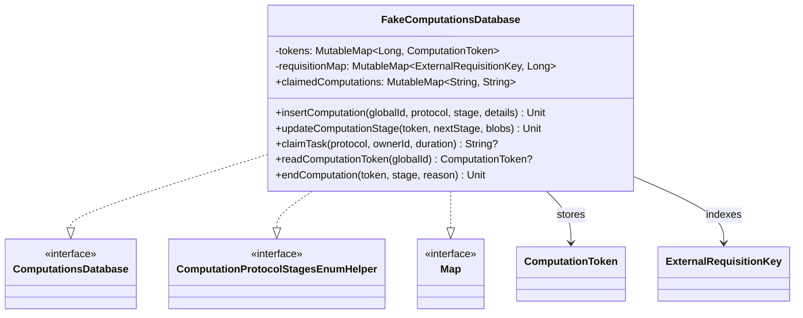

# org.wfanet.measurement.duchy.db.computation.testing

## Overview
This package provides in-memory testing implementations of the duchy computation database layer. It enables unit testing of computation workflows without requiring actual database infrastructure by maintaining computation state in memory with full transaction semantics.

## Components

### FakeComputationsDatabase
In-memory implementation of ComputationsDatabase for testing purposes that stores all computation state in mutable maps.

| Method | Parameters | Returns | Description |
|--------|------------|---------|-------------|
| insertComputation | `globalId: String, protocol: ComputationType, initialStage: ComputationStage, stageDetails: ComputationStageDetails, computationDetails: ComputationDetails, requisitions: List<RequisitionEntry>` | `Unit` | Creates new computation with specified protocol and stage |
| deleteComputation | `localId: Long` | `Unit` | Removes computation from internal storage |
| addComputation | `localId: Long, stage: ComputationStage, computationDetails: ComputationDetails, blobs: List<ComputationStageBlobMetadata>, stageDetails: ComputationStageDetails, requisitions: List<RequisitionMetadata>` | `Unit` | Adds fake computation to tokens map for testing |
| addComputation | `globalId: String, stage: ComputationStage, computationDetails: ComputationDetails, blobs: List<ComputationStageBlobMetadata>, stageDetails: ComputationStageDetails, requisitions: List<RequisitionMetadata>` | `Unit` | Adds fake computation using globalId as localId |
| updateComputationStage | `token: ComputationEditToken, nextStage: ComputationStage, inputBlobPaths: List<String>, passThroughBlobPaths: List<String>, outputBlobs: Int, afterTransition: AfterTransition, nextStageDetails: ComputationStageDetails, lockExtension: Duration?` | `Unit` | Transitions computation to next stage with updated blobs |
| updateComputationDetails | `token: ComputationEditToken, computationDetails: ComputationDetails, requisitions: List<RequisitionEntry>` | `Unit` | Updates computation details and requisition metadata |
| endComputation | `token: ComputationEditToken, endingStage: ComputationStage, endComputationReason: EndComputationReason, computationDetails: ComputationDetails` | `Unit` | Moves computation to terminal state with ending reason |
| writeOutputBlobReference | `token: ComputationEditToken, blobRef: BlobRef` | `Unit` | Records output blob storage path in computation token |
| writeRequisitionBlobPath | `token: ComputationEditToken, externalRequisitionKey: ExternalRequisitionKey, pathToBlob: String, publicApiVersion: String, protocol: RequisitionDetails.RequisitionProtocol?` | `Unit` | Associates requisition with its blob storage path |
| enqueue | `token: ComputationEditToken, delaySecond: Int, expectedOwner: String` | `Unit` | Returns computation to queue for processing |
| claimTask | `protocol: ComputationType, ownerId: String, lockDuration: Duration, prioritizedStages: List<ComputationStage>` | `String?` | Claims unclaimed computation for processing by owner |
| readComputationToken | `globalId: String` | `ComputationToken?` | Retrieves computation token by global identifier |
| readComputationToken | `externalRequisitionKey: ExternalRequisitionKey` | `ComputationToken?` | Retrieves computation token by requisition key |
| readGlobalComputationIds | `stages: Set<ComputationStage>, updatedBefore: Instant?` | `Set<String>` | Finds computation IDs in specified stages |
| insertComputationStat | `localId: Long, stage: ComputationStage, attempt: Long, metric: ComputationStatMetric` | `Unit` | Records computation metrics (no-op for testing) |
| readComputationBlobKeys | `localId: Long` | `List<String>` | Returns mock blob keys for computation |
| readRequisitionBlobKeys | `localId: Long` | `List<String>` | Returns mock blob keys for requisitions |
| remove | `localId: Long` | `ComputationToken?` | Removes and returns computation token |

### Companion Object Methods

| Method | Parameters | Returns | Description |
|--------|------------|---------|-------------|
| newPartialToken | `localId: Long, stage: ComputationStage` | `ComputationToken.Builder` | Creates builder with basic token fields initialized |

## Data Structures

### Internal State Properties

| Property | Type | Description |
|----------|------|-------------|
| tokens | `MutableMap<Long, ComputationToken>` | Maps local computation ID to token state |
| requisitionMap | `MutableMap<ExternalRequisitionKey, Long>` | Maps external requisition keys to local computation IDs |
| claimedComputations | `MutableMap<String, String>` | Maps global computation ID to lock owner identifier |

## Dependencies
- `org.wfanet.measurement.duchy.db.computation` - Core computation database interfaces and types
- `org.wfanet.measurement.duchy.service.internal` - Exception types for lock and version conflicts
- `org.wfanet.measurement.duchy.service.internal.computations` - Blob metadata factory functions
- `org.wfanet.measurement.internal.duchy` - Protocol buffer types for computation state
- `io.grpc` - Status codes for error handling
- `java.time` - Duration and Instant for temporal operations

## Usage Example
```kotlin
val database = FakeComputationsDatabase()

// Add a test computation
database.addComputation(
  globalId = "12345",
  stage = ComputationStage.newBuilder().apply {
    liquidLegionsSketchAggregationV2 =
      ComputationStage.LiquidLegionsSketchAggregationV2Stage.WAIT_TO_START
  }.build(),
  computationDetails = ComputationDetails.getDefaultInstance()
)

// Claim the computation for processing
val localId = database.claimTask(
  protocol = ComputationType.LIQUID_LEGIONS_SKETCH_AGGREGATION_V2,
  ownerId = "worker-1",
  lockDuration = Duration.ofMinutes(5),
  prioritizedStages = listOf()
)

// Read the token
val token = database.readComputationToken(localId!!)
```

## Key Features

### Version Control
The database enforces optimistic locking through token versioning. Each update increments the version number and validates the edit token version matches current state, throwing `ComputationTokenVersionMismatchException` on conflict.

### Lock Management
Computations can be claimed by workers using `claimTask`, which prevents concurrent processing. The `claimedComputations` map tracks ownership, and `enqueue` validates the expected owner before releasing the lock.

### Stage Transitions
Stage transitions are validated through `validTransition` before applying. The `updateComputationStage` method handles blob metadata reorganization based on `AfterTransition` behavior (queue, no-queue, or continue-working).

### Requisition Tracking
External requisition keys are bidirectionally mapped to local computation IDs, enabling lookup by either identifier. Requisition blob paths and protocols are updated through `writeRequisitionBlobPath`.

## Class Diagram

