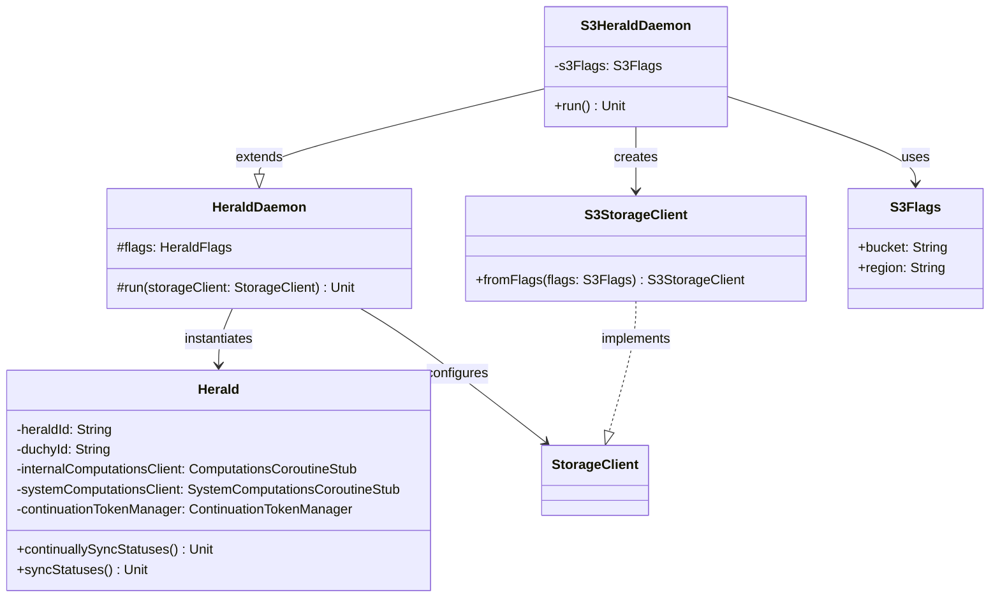

# org.wfanet.measurement.duchy.deploy.aws.daemon.herald

## Overview
AWS-specific implementation of the Herald daemon for duchy deployments. This package provides S3-backed storage integration for the Herald service, which synchronizes computation status between the Kingdom and individual duchies. The Herald monitors the Kingdom for computation updates and manages local computation lifecycle events.

## Components

### S3HeraldDaemon
Command-line daemon that runs the Herald service with S3 storage backend.

| Method | Parameters | Returns | Description |
|--------|------------|---------|-------------|
| run | - | `Unit` | Initializes S3 storage client and starts Herald |
| main | `args: Array<String>` | `Unit` | Entry point for daemon execution |

**Inheritance**: Extends `HeraldDaemon` from `org.wfanet.measurement.duchy.deploy.common.daemon.herald`

**Annotations**:
- `@CommandLine.Command` - Configures CLI with name "S3HeraldDaemon", standard help options, and default value display

**Constructor Parameters**:
| Parameter | Type | Visibility | Description |
|-----------|------|------------|-------------|
| s3Flags | `S3Flags` | private | S3 configuration flags injected via PicoCLI mixin |

## Dependencies

### Internal Dependencies
- `org.wfanet.measurement.duchy.deploy.common.daemon.herald.HeraldDaemon` - Base daemon implementation providing core Herald functionality
- `org.wfanet.measurement.aws.s3.S3Flags` - Configuration flags for S3 client setup
- `org.wfanet.measurement.aws.s3.S3StorageClient` - S3 storage client implementation

### External Dependencies
- `picocli.CommandLine` - Command-line parsing and configuration injection
- `org.wfanet.measurement.common.commandLineMain` - Standard main method wrapper for error handling

## Inherited Functionality

The `S3HeraldDaemon` inherits comprehensive Herald capabilities from `HeraldDaemon`:

### Core Responsibilities
- **Computation Synchronization**: Streams active computations from Kingdom's System API
- **Computation Lifecycle Management**: Creates, confirms, starts, and fails computations
- **Status Monitoring**: Continuously syncs computation status between Kingdom and local duchy
- **Protocol Support**: Handles multiple MPC protocols (Liquid Legions V2, Reach-Only Liquid Legions V2, Honest Majority Share Shuffle, TrusTEE)
- **Error Handling**: Implements exponential backoff and retry logic for transient failures
- **Concurrency Control**: Manages parallel computation processing with configurable semaphore

### Configuration Flags (via HeraldFlags)
| Flag | Type | Description |
|------|------|-------------|
| duchy | `CommonDuchyFlags` | Duchy identification and common settings |
| tlsFlags | `TlsFlags` | Mutual TLS configuration for secure communication |
| channelShutdownTimeout | `Duration` | gRPC channel shutdown timeout (default: 3s) |
| systemApiFlags | `SystemApiFlags` | Kingdom System API connection settings |
| computationsServiceFlags | `ComputationsServiceFlags` | Internal computations service configuration |
| protocolsSetupConfig | `File` | ProtocolsSetupConfig proto in text format |
| keyEncryptionKeyTinkFile | `File?` | Key encryption key for private key store (optional) |
| deletableComputationStates | `Set<Computation.State>` | Terminal states allowing computation deletion |
| verboseGrpcClientLogging | `Boolean` | Enable detailed gRPC request/response logging |

### Herald Service Components
- **System Computations Client**: Communicates with Kingdom's computation service
- **System Computation Participants Client**: Manages participant status updates
- **Internal Computations Client**: Interacts with duchy's local computation database
- **Continuation Token Manager**: Maintains streaming position for resumable computation sync
- **Private Key Store**: Manages cryptographic keys for non-aggregator roles (conditional)
- **Concurrency Semaphore**: Limits parallel computation processing (default: 5)

## Usage Example
```kotlin
// Command-line execution
fun main(args: Array<String>) = commandLineMain(S3HeraldDaemon(), args)

// Example CLI invocation
// java -jar herald.jar \
//   --duchy-name=worker1 \
//   --s3-bucket=computation-storage \
//   --s3-region=us-east-1 \
//   --tls-cert-file=/certs/duchy.pem \
//   --tls-private-key-file=/certs/duchy.key \
//   --tls-cert-collection-file=/certs/ca.pem \
//   --system-api-target=kingdom.example.com:8443 \
//   --computations-service-target=localhost:8080 \
//   --protocols-setup-config=/config/protocols.textproto
```

## Class Diagram


## Computation State Transitions

The Herald manages computations through the following state machine:

1. **PENDING_REQUISITION_PARAMS** → Creates new computation locally
2. **PENDING_PARTICIPANT_CONFIRMATION** → Confirms duchy participation and updates requisitions
3. **PENDING_COMPUTATION** → Starts local computation execution
4. **FAILED/CANCELLED** → Marks computation as failed locally
5. **SUCCEEDED** → No action (terminal state)

Optionally deletes computations in configured terminal states.

## Error Handling Strategy

- **Transient Errors**: Automatic retry with exponential backoff for UNAVAILABLE, DEADLINE_EXCEEDED, ABORTED, RESOURCE_EXHAUSTED
- **Non-Transient Errors**: Fail computation at both Kingdom and Duchy after max attempts
- **Stream Interruptions**: Resume from last continuation token with up to 5 streaming attempts
- **Concurrency**: Semaphore-based limiting prevents resource exhaustion

## Deployment Context

This daemon runs as a Kubernetes pod in AWS environments where:
- Blob storage is provided by Amazon S3
- The Herald ID is derived from the pod's hostname (`HOSTNAME` environment variable)
- Mutual TLS is required for all inter-service communication
- Continuation tokens enable fault-tolerant streaming across pod restarts
