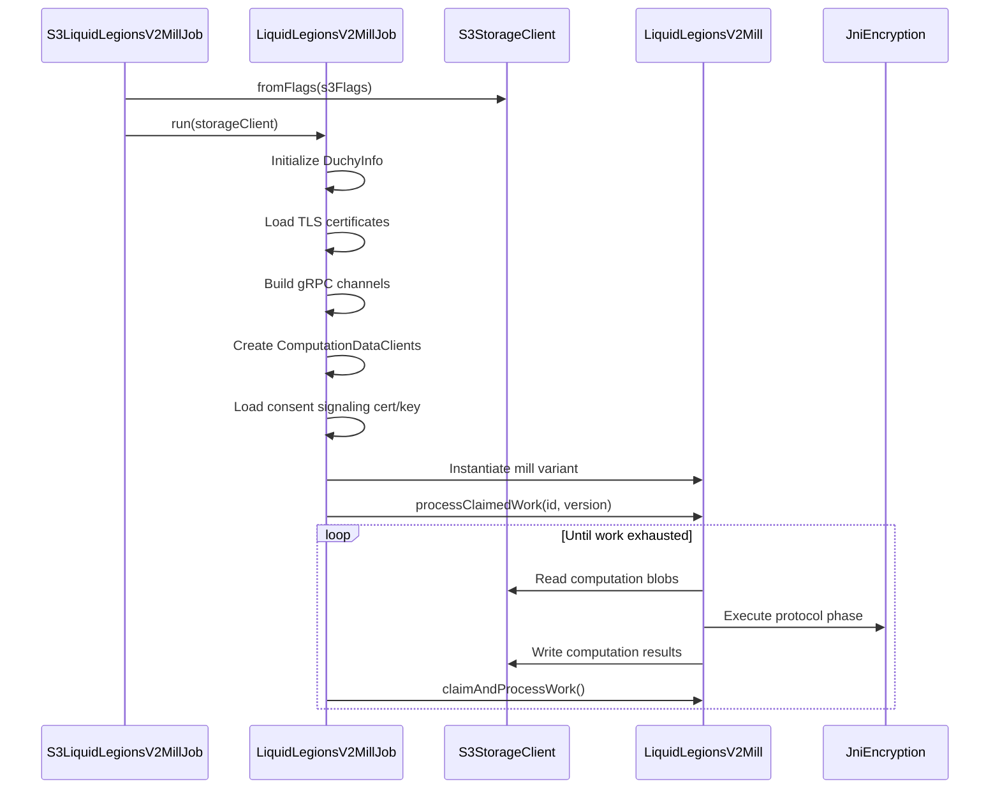
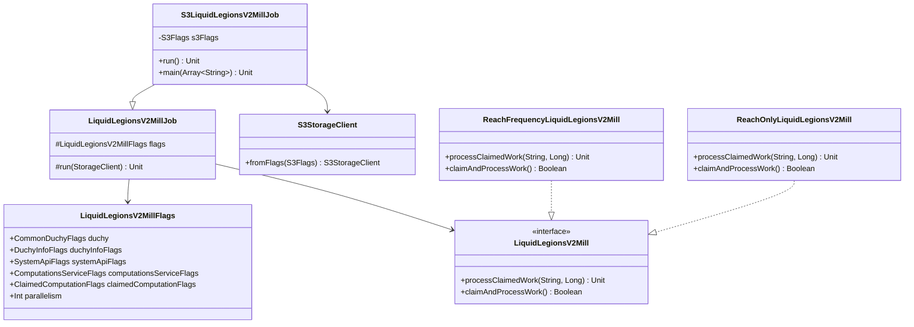

# org.wfanet.measurement.duchy.deploy.aws.job.mill.liquidlegionsv2

## Overview
AWS deployment-specific implementation for Liquid Legions V2 Mill job execution. This package provides S3-backed storage integration for running secure multi-party computation (MPC) protocols in duchy environments deployed on AWS infrastructure. The mill processes claimed computation work using the Liquid Legions V2 sketch aggregation protocol for privacy-preserving measurement.

## Components

### S3LiquidLegionsV2MillJob
AWS S3-backed command-line job for executing Liquid Legions V2 Mill computations with S3 as the storage backend.

| Method | Parameters | Returns | Description |
|--------|------------|---------|-------------|
| run | - | `Unit` | Initializes S3StorageClient and delegates to parent run method |
| main | `args: Array<String>` | `Unit` | Entry point invoking command-line main with job instance |

**Annotations:**
- `@CommandLine.Command` - Configures job as picocli command with name "S3LiquidLegionsV2MillJob"
- `@CommandLine.Mixin` - Injects S3Flags for S3 configuration

**Inheritance:**
- Extends `LiquidLegionsV2MillJob` from `org.wfanet.measurement.duchy.deploy.common.job.mill.liquidlegionsv2`

## Parent Class: LiquidLegionsV2MillJob

### Overview
Abstract base class that orchestrates Liquid Legions V2 Mill execution. Handles gRPC channel setup, certificate management, mill instantiation, and work processing loop.

| Method | Parameters | Returns | Description |
|--------|------------|---------|-------------|
| run | `storageClient: StorageClient` | `Unit` | Configures and runs the mill with specified storage backend |

### Key Responsibilities
- Initialize duchy identity from configuration flags
- Establish mutual TLS channels to computation, system API, and peer duchy services
- Load consent signaling certificates and private keys
- Instantiate appropriate mill variant (ReachFrequency or ReachOnly) based on computation type
- Process claimed computation work in continuous loop until exhausted

### Mill Variants

#### ReachFrequencyLiquidLegionsV2Mill
Handles `LIQUID_LEGIONS_SKETCH_AGGREGATION_V2` computation type for reach and frequency measurements.

**Crypto Worker:** `JniLiquidLegionsV2Encryption`

#### ReachOnlyLiquidLegionsV2Mill
Handles `REACH_ONLY_LIQUID_LEGIONS_SKETCH_AGGREGATION_V2` computation type for reach-only measurements.

**Crypto Worker:** `JniReachOnlyLiquidLegionsV2Encryption`

### Configuration Flags

#### LiquidLegionsV2MillFlags
Configuration container aggregating multiple flag mixins for mill operation.

| Property | Type | Description |
|----------|------|-------------|
| duchy | `CommonDuchyFlags` | Duchy identity configuration |
| duchyInfoFlags | `DuchyInfoFlags` | Multi-duchy environment configuration |
| systemApiFlags | `SystemApiFlags` | System API service connection parameters |
| computationsServiceFlags | `ComputationsServiceFlags` | Computations service connection parameters |
| claimedComputationFlags | `ClaimedComputationFlags` | Specific computation claim to process |
| parallelism | `Int` | Maximum threads for crypto operations (default: 1) |

**Inherits from:** `MillFlags` (provides TLS, certificate, work lock, and chunking configuration)

## Dependencies

### Storage
- `org.wfanet.measurement.aws.s3.S3Flags` - S3 connection and authentication configuration
- `org.wfanet.measurement.aws.s3.S3StorageClient` - S3-backed StorageClient implementation

### Core Mill
- `org.wfanet.measurement.duchy.deploy.common.job.mill.liquidlegionsv2.LiquidLegionsV2MillJob` - Base job implementation
- `org.wfanet.measurement.duchy.mill.liquidlegionsv2.LiquidLegionsV2Mill` - Mill interface
- `org.wfanet.measurement.duchy.mill.liquidlegionsv2.ReachFrequencyLiquidLegionsV2Mill` - Reach+frequency variant
- `org.wfanet.measurement.duchy.mill.liquidlegionsv2.ReachOnlyLiquidLegionsV2Mill` - Reach-only variant

### Cryptography
- `org.wfanet.measurement.duchy.mill.liquidlegionsv2.crypto.JniLiquidLegionsV2Encryption` - JNI crypto for reach+frequency
- `org.wfanet.measurement.duchy.mill.liquidlegionsv2.crypto.JniReachOnlyLiquidLegionsV2Encryption` - JNI crypto for reach-only
- `org.wfanet.measurement.common.crypto.SigningCerts` - Certificate management
- `org.wfanet.measurement.common.crypto.SigningKeyHandle` - Private key handling

### gRPC Services
- `org.wfanet.measurement.internal.duchy.ComputationsCoroutineStub` - Internal duchy computations API
- `org.wfanet.measurement.internal.duchy.ComputationStatsCoroutineStub` - Computation statistics tracking
- `org.wfanet.measurement.system.v1alpha.ComputationControlCoroutineStub` - Cross-duchy coordination
- `org.wfanet.measurement.system.v1alpha.ComputationsCoroutineStub` - System-level computations API
- `org.wfanet.measurement.system.v1alpha.ComputationParticipantsCoroutineStub` - Participant management
- `org.wfanet.measurement.system.v1alpha.ComputationLogEntriesCoroutineStub` - Audit logging

### Infrastructure
- `org.wfanet.measurement.duchy.db.computation.ComputationDataClients` - Data access abstraction
- `org.wfanet.measurement.common.identity.DuchyInfo` - Multi-duchy topology information
- `picocli.CommandLine` - CLI framework

## Usage Example

```kotlin
// Command-line invocation
fun main(args: Array<String>) = commandLineMain(S3LiquidLegionsV2MillJob(), args)

// Typical deployment command:
// S3LiquidLegionsV2MillJob \
//   --duchy-name=worker1 \
//   --s3-bucket=computation-storage \
//   --s3-region=us-east-1 \
//   --computations-service-target=localhost:8080 \
//   --system-api-target=localhost:8081 \
//   --claimed-global-computation-id=12345 \
//   --claimed-computation-version=1 \
//   --claimed-computation-type=LIQUID_LEGIONS_SKETCH_AGGREGATION_V2 \
//   --parallelism=4 \
//   --tls-cert-file=/certs/duchy.pem \
//   --tls-key-file=/certs/duchy.key \
//   --cert-collection-file=/certs/all_root_certs.pem \
//   --cs-certificate-der-file=/certs/consent_signaling_cert.der \
//   --cs-private-key-der-file=/certs/consent_signaling_key.der
```

## Execution Flow



## Class Diagram



## Deployment Considerations

### AWS Resources Required
- **S3 Bucket**: Storage for computation blobs, sketches, and intermediate results
- **IAM Permissions**: Read/write access to designated S3 bucket
- **Network**: Connectivity to peer duchies and kingdom system API
- **Certificates**: X.509 certificates for mutual TLS and consent signaling

### Computation Types Supported
- `LIQUID_LEGIONS_SKETCH_AGGREGATION_V2` - Full reach and frequency measurements
- `REACH_ONLY_LIQUID_LEGIONS_SKETCH_AGGREGATION_V2` - Reach-only measurements (optimized)

### Unsupported Computation Types
- `HONEST_MAJORITY_SHARE_SHUFFLE` - Handled by separate HonestMajorityShareShuffleMillJob
- `TRUS_TEE` - Trusted execution environment computations
- `UNSPECIFIED` / `UNRECOGNIZED` - Invalid computation types

### Performance Tuning
- **Parallelism**: Set `--parallelism` to number of CPU cores for crypto operations
- **Request Chunking**: Tune `--request-chunk-size-bytes` for network efficiency
- **Work Lock Duration**: Configure `--work-lock-duration` to prevent stale locks

## Security

### Certificate Requirements
1. **Duchy TLS Certificate**: Authenticates duchy to other services
2. **Consent Signaling Certificate**: Signs computation outputs for auditability
3. **Trusted Root Certificates**: Validates peer duchies and kingdom services

### Storage Security
- S3 objects should use server-side encryption (SSE-S3 or SSE-KMS)
- Bucket policies should restrict access to duchy service accounts
- Consider enabling S3 bucket versioning for audit trails

## Error Handling

The job will error and exit if:
- Unsupported computation type is claimed
- Required certificates cannot be loaded
- gRPC channels cannot be established
- S3 storage client initialization fails
- Coroutine context is cancelled externally

Transient errors during work processing are handled by the mill implementation and logged to `ComputationLogEntries`.
