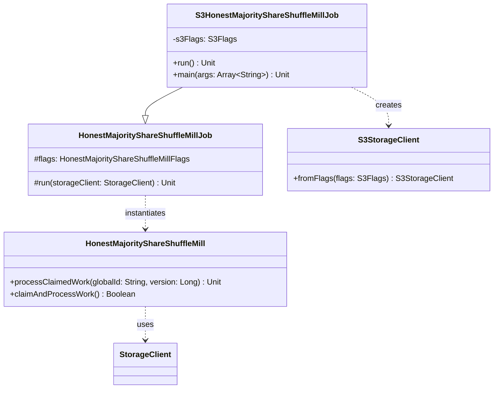

# org.wfanet.measurement.duchy.deploy.aws.job.mill.shareshuffle

## Overview
AWS S3-backed deployment package for the Honest Majority Share Shuffle Mill job. This package provides the entry point for running the mill computation worker with S3 storage backend, enabling privacy-preserving measurement computations using the Honest Majority Share Shuffle protocol on AWS infrastructure.

## Components

### S3HonestMajorityShareShuffleMillJob
Command-line job that extends the base Honest Majority Share Shuffle Mill with S3 storage integration.

| Method | Parameters | Returns | Description |
|--------|------------|---------|-------------|
| run | - | `Unit` | Initializes S3 storage client and delegates to base mill job |
| main | `args: Array<String>` | `Unit` | Entry point for command-line execution |

**Annotations:**
- `@CommandLine.Command` - Configures PicoCLI command with name "S3HonestMajorityShareShuffleMillJob"
- `@CommandLine.Mixin` - Injects S3Flags for S3 configuration

**Inheritance:**
- Extends: `HonestMajorityShareShuffleMillJob`

## Dependencies

### Internal Dependencies
- `org.wfanet.measurement.aws.s3.S3Flags` - Configuration flags for S3 connectivity
- `org.wfanet.measurement.aws.s3.S3StorageClient` - S3 storage client implementation
- `org.wfanet.measurement.duchy.deploy.common.job.mill.shareshuffle.HonestMajorityShareShuffleMillJob` - Base mill job implementation
- `org.wfanet.measurement.common.commandLineMain` - Command-line execution utility

### External Dependencies
- `picocli.CommandLine` - Command-line interface parsing framework

### Mill Job Base Class Dependencies
The parent `HonestMajorityShareShuffleMillJob` provides comprehensive mill functionality including:
- **Cryptographic Services**: Tink-based encryption, signing certificates, consent signal handling
- **gRPC Clients**: System API, Public API, Computations, Computation Control, Computation Stats, Certificates
- **Protocol Implementation**: `JniHonestMajorityShareShuffleCryptor` for share shuffle cryptographic operations
- **State Management**: Work claiming, computation version tracking, lock duration management
- **Multi-Duchy Coordination**: Inter-duchy computation control channels
- **Storage**: Private key store with optional Tink KEK encryption

## Usage Example
```kotlin
// Run via command line
fun main(args: Array<String>) =
  commandLineMain(S3HonestMajorityShareShuffleMillJob(), args)

// Execution flow:
// 1. Parse S3 flags and mill configuration from command-line arguments
// 2. Create S3StorageClient from flags
// 3. Initialize duchy infrastructure (certs, channels, clients)
// 4. Instantiate HonestMajorityShareShuffleMill with:
//    - JNI cryptographic worker
//    - Multi-duchy computation control stubs
//    - Protocol setup configuration
// 5. Process claimed computation if specified
// 6. Continuously claim and process work until exhausted
```

## Command-Line Configuration
```bash
# Example invocation (typical flags)
S3HonestMajorityShareShuffleMillJob \
  --duchy=<duchy-name> \
  --s3-region=<aws-region> \
  --s3-bucket=<storage-bucket> \
  --computations-service-target=<internal-api-host> \
  --system-api-target=<system-api-host> \
  --public-api-target=<public-api-host> \
  --cs-certificate-der-file=<cert-path> \
  --cs-private-key-der-file=<key-path> \
  --tls-cert-file=<tls-cert> \
  --tls-key-file=<tls-key> \
  --cert-collection-file=<ca-certs> \
  --protocols-setup-config=<config-file> \
  --mill-id=<unique-mill-identifier>
```

## Architecture Notes

### Storage Backend
- Replaces abstract `StorageClient` dependency with concrete `S3StorageClient`
- Storage used for: computation blobs, encrypted sketches, intermediate protocol state

### Mill Lifecycle
1. **Initialization**: Configure S3, load certificates, establish gRPC channels
2. **Claimed Work**: Process specific computation if `--claimed-global-computation-id` provided
3. **Work Loop**: Continuously claim and execute computations until queue exhausted
4. **Coordination**: Communicate with other duchies via `ComputationControlCoroutineStub`
5. **Completion**: Update computation state, log results, release work locks

### Deployment Context
- Typically deployed as Kubernetes Job/Pod
- `millId` corresponds to pod name for debugging correlation
- Supports both single-shot (claimed computation) and continuous polling modes
- Integrates with duchy-internal Postgres-backed computation database

## Class Diagram


## Protocol Overview
The Honest Majority Share Shuffle protocol is a multi-party computation (MPC) protocol that:
- Requires honest majority among participating duchies
- Performs privacy-preserving set operations and frequency counts
- Splits computation across non-aggregator and aggregator duchies
- Uses secret sharing and cryptographic shuffling for privacy
- Produces differentially private reach and frequency measurements
