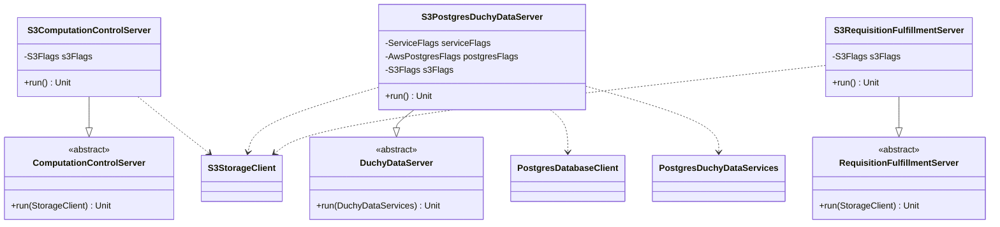

# org.wfanet.measurement.duchy.deploy.aws.server

## Overview

AWS-specific server implementations for duchy services. This package provides command-line executable servers that integrate AWS S3 for storage and AWS RDS PostgreSQL for data persistence, implementing the duchy's core computation control, data management, and requisition fulfillment services.

## Components

### S3ComputationControlServer

Command-line server daemon that implements computation control functionality using AWS S3 for blob storage. Extends the base `ComputationControlServer` to provide AWS-specific storage backend configuration.

| Method | Parameters | Returns | Description |
|--------|------------|---------|-------------|
| run | None | `Unit` | Initializes S3 storage client from flags and starts server |
| main | `args: Array<String>` | `Unit` | Entry point for command-line execution |

**Annotations:**
- `@CommandLine.Command` - Configures CLI interface with name, description, and help options

**Command-Line Flags:**
- `s3Flags` (mixin) - AWS S3 connection and bucket configuration

### S3PostgresDuchyDataServer

Command-line server daemon that implements duchy data management services using AWS RDS PostgreSQL for relational data and AWS S3 for blob storage. Extends the base `DuchyDataServer` to provide AWS-specific backend configuration.

| Method | Parameters | Returns | Description |
|--------|------------|---------|-------------|
| run | None | `Unit` | Initializes Postgres and S3 clients, creates services, and starts server |
| main | `args: Array<String>` | `Unit` | Entry point for command-line execution |

**Annotations:**
- `@CommandLine.Command` - Configures CLI interface with name, description, and help options

**Command-Line Flags:**
- `serviceFlags` (mixin) - General service configuration including executor settings
- `postgresFlags` (mixin) - AWS RDS PostgreSQL connection configuration
- `s3Flags` (mixin) - AWS S3 connection and bucket configuration

**Initialization Details:**
- Creates `RandomIdGenerator` with system UTC clock
- Builds PostgreSQL connection factory from flags
- Creates `PostgresDatabaseClient` from connection factory
- Creates `S3StorageClient` from S3 flags
- Uses coroutine dispatcher from executor for async operations

### S3RequisitionFulfillmentServer

Command-line server daemon that implements requisition fulfillment functionality using AWS S3 for blob storage. Extends the base `RequisitionFulfillmentServer` to provide AWS-specific storage backend configuration.

| Method | Parameters | Returns | Description |
|--------|------------|---------|-------------|
| run | None | `Unit` | Initializes S3 storage client from flags and starts server |
| main | `args: Array<String>` | `Unit` | Entry point for command-line execution |

**Annotations:**
- `@CommandLine.Command` - Configures CLI interface with name, description, and help options

**Command-Line Flags:**
- `s3Flags` (mixin) - AWS S3 connection and bucket configuration

## Dependencies

### AWS Infrastructure
- `org.wfanet.measurement.aws.s3` - AWS S3 storage client and configuration flags
- `org.wfanet.measurement.aws.postgres` - PostgreSQL connection factory and flags for AWS RDS

### Common Infrastructure
- `org.wfanet.measurement.common` - Command-line utilities and identity generation
- `org.wfanet.measurement.common.db.r2dbc.postgres` - R2DBC PostgreSQL database client
- `org.wfanet.measurement.common.grpc` - gRPC service configuration flags

### Duchy Common
- `org.wfanet.measurement.duchy.deploy.common.server` - Abstract base server implementations
- `org.wfanet.measurement.duchy.deploy.common.service` - PostgreSQL-backed duchy data services

### External Libraries
- `picocli.CommandLine` - Command-line argument parsing and flag injection
- `kotlinx.coroutines` - Coroutine runtime for async operations

## Usage Example

```kotlin
// Launch S3ComputationControlServer from command line
fun main(args: Array<String>) {
    commandLineMain(S3ComputationControlServer(), args)
}

// Launch S3PostgresDuchyDataServer with async initialization
fun main(args: Array<String>) = runBlocking {
    commandLineMain(S3PostgresDuchyDataServer(), args)
}

// Launch S3RequisitionFulfillmentServer
fun main(args: Array<String>) {
    commandLineMain(S3RequisitionFulfillmentServer(), args)
}
```

## Class Diagram



## Deployment Notes

### Server Responsibilities

- **S3ComputationControlServer**: Manages computation lifecycle and control operations
- **S3PostgresDuchyDataServer**: Handles duchy-specific data persistence and retrieval
- **S3RequisitionFulfillmentServer**: Processes requisition fulfillment requests

### AWS Resource Requirements

- **S3 Buckets**: Required for blob storage in all three servers
- **RDS PostgreSQL**: Required only for S3PostgresDuchyDataServer
- **IAM Permissions**: S3 read/write access; RDS connection access for data server

### Command-Line Execution

All servers are standalone executables with built-in help:
```bash
# View available options
S3ComputationControlServer --help

# Run with specific S3 configuration
S3PostgresDuchyDataServer --s3-bucket=my-bucket --postgres-host=db.example.com
```
