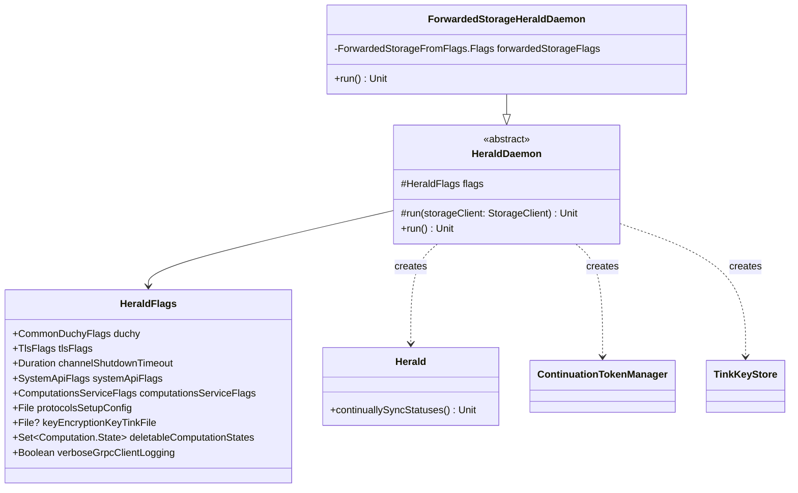

# org.wfanet.measurement.duchy.deploy.common.daemon.herald

## Overview
The Herald daemon package provides deployment infrastructure for the Herald service, which synchronizes computation states between the Kingdom (system API) and Duchy internal services. It manages gRPC connections, cryptographic key storage, and continuous status synchronization for multi-party computation workflows.

## Components

### HeraldFlags
Configuration flags container for Herald daemon initialization.

| Property | Type | Description |
|----------|------|-------------|
| duchy | `CommonDuchyFlags` | Duchy identification configuration |
| tlsFlags | `TlsFlags` | TLS certificate and key configuration |
| channelShutdownTimeout | `Duration` | gRPC channel shutdown timeout (default: 3s) |
| systemApiFlags | `SystemApiFlags` | Kingdom system API connection configuration |
| computationsServiceFlags | `ComputationsServiceFlags` | Internal computations service configuration |
| protocolsSetupConfig | `File` | ProtocolsSetupConfig proto in text format |
| keyEncryptionKeyTinkFile | `File?` | Key encryption key file for private key store |
| deletableComputationStates | `Set<Computation.State>` | Terminal states allowing computation deletion |
| verboseGrpcClientLogging | `Boolean` | Enable full gRPC request/response logging |

### HeraldDaemon
Abstract base daemon that configures and launches the Herald service.

| Method | Parameters | Returns | Description |
|--------|------------|---------|-------------|
| run | `storageClient: StorageClient` | `Unit` | Initializes Herald with gRPC channels, crypto stores, and starts status synchronization |

**Key Responsibilities:**
- Establishes mutual TLS channels to system API and internal services
- Configures continuation token management for stateful streaming
- Sets up Tink-based private key storage with AEAD encryption
- Instantiates Herald with all dependencies and starts `continuallySyncStatuses()`

### ForwardedStorageHeraldDaemon
Concrete Herald daemon implementation using forwarded storage backend.

| Method | Parameters | Returns | Description |
|--------|------------|---------|-------------|
| run | - | `Unit` | Creates forwarded storage client and delegates to base run method |
| main | `args: Array<String>` | `Unit` | Entry point for command-line execution |

**Configuration:**
- Extends `HeraldDaemon` with `ForwardedStorageFromFlags` mixin
- Provides production-ready storage implementation
- Supports picocli command-line parsing

## Data Structures

### gRPC Client Configuration
| Client | Target | Purpose |
|--------|--------|---------|
| SystemComputationsCoroutineStub | systemApiFlags.target | Fetch computations from Kingdom |
| SystemComputationParticipantsCoroutineStub | systemApiFlags.target | Manage participant states |
| ComputationsCoroutineStub | computationsServiceFlags.target | Update local Duchy computations |
| ContinuationTokensCoroutineStub | computationsServiceFlags.target | Persist streaming state |

## Dependencies

- `org.wfanet.measurement.duchy.herald` - Core Herald business logic and ContinuationTokenManager
- `org.wfanet.measurement.common.crypto.tink` - Tink cryptographic key management and storage
- `org.wfanet.measurement.common.grpc` - gRPC channel builders and utilities
- `org.wfanet.measurement.duchy.deploy.common` - Shared deployment flags and configuration
- `org.wfanet.measurement.storage` - Storage abstraction layer
- `org.wfanet.measurement.internal.duchy` - Internal Duchy service gRPC stubs
- `org.wfanet.measurement.system.v1alpha` - Kingdom system API gRPC stubs
- `com.google.crypto.tink` - Google Tink cryptographic primitives
- `io.grpc` - gRPC framework
- `picocli` - Command-line parsing framework

## Usage Example

```kotlin
// Command-line execution
fun main(args: Array<String>) {
    commandLineMain(ForwardedStorageHeraldDaemon(), args)
}

// Example command-line invocation
// java -jar herald-daemon.jar \
//   --duchy-name=worker1 \
//   --tls-cert-file=/certs/herald.pem \
//   --tls-key-file=/certs/herald.key \
//   --cert-collection-file=/certs/ca.pem \
//   --system-api-target=kingdom.example.com:8443 \
//   --system-api-cert-host=kingdom.example.com \
//   --computations-service-target=localhost:8080 \
//   --protocols-setup-config=/config/protocols.textproto \
//   --key-encryption-key-file=/keys/kek.bin \
//   --deletable-computation-state=SUCCEEDED \
//   --deletable-computation-state=FAILED \
//   --forwarded-storage-service-target=storage:8080
```

## Class Diagram



## Configuration Notes

### Private Key Storage
The daemon supports optional Tink-based private key encryption:
- Uses `FakeKmsClient` for local key management (TODO: migrate to real KMS)
- Encrypts private keys with AEAD primitive from `keyEncryptionKeyTinkFile`
- Keys stored in `TinkKeyStore` backed by provided `StorageClient`

### gRPC Channel Configuration
All channels use mutual TLS with:
- Client certificates from `tlsFlags`
- Custom service configuration from `Herald.SERVICE_CONFIG`
- Configurable shutdown timeout and request deadlines
- Optional verbose logging for debugging

### Herald Identification
- Herald ID sourced from `HOSTNAME` environment variable (typically Kubernetes pod name)
- Enables distributed Herald deployment with unique instance tracking

## Synchronization Behavior
The `continuallySyncStatuses()` method runs indefinitely:
1. Streams computations from Kingdom system API
2. Compares with local Duchy computation states
3. Updates local states and triggers protocol transitions
4. Uses continuation tokens to resume after interruptions
5. Deletes computations in configured terminal states
