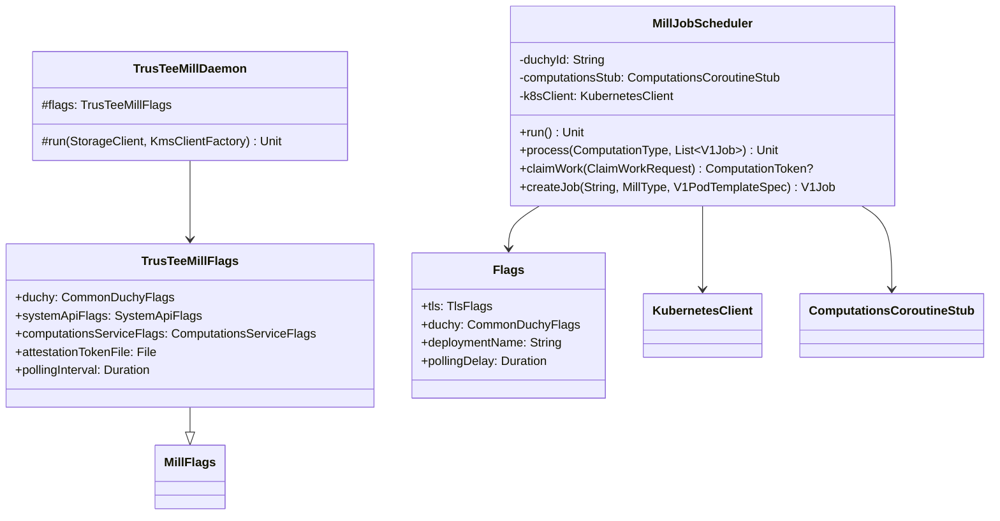

# org.wfanet.measurement.duchy.deploy.common.daemon.mill

## Overview
Provides daemon infrastructure for Mill computation processors in a Duchy deployment. The package includes a Kubernetes-based job scheduler for managing Mill work items and a TrusTEE-specific Mill daemon implementation. Mills process cryptographic Multi-Party Computation (MPC) protocols including Liquid Legions v2 and Honest Majority Share Shuffle.

## Components

### MillJobScheduler
Kubernetes job scheduler that manages Mill computation jobs across multiple protocol types with concurrency control and work claiming.

| Method | Parameters | Returns | Description |
|--------|------------|---------|-------------|
| run | - | `suspend Unit` | Continuously polls for work and schedules Kubernetes Jobs |
| process | `computationType: ComputationType`, `ownedJobs: List<V1Job>` | `suspend Unit` | Claims work and creates a Job for a computation type |
| claimWork | `request: ClaimWorkRequest` | `suspend ComputationToken?` | Claims work from the computations service |
| getOwnedJobs | `millType: MillType` | `suspend List<V1Job>` | Retrieves Jobs owned by this deployment for a mill type |
| createJob | `name: String`, `millType: MillType`, `template: V1PodTemplateSpec` | `suspend V1Job` | Creates a Kubernetes Job from a pod template |
| generateJobName | `millType: MillType` | `String` | Generates unique job name with random suffix |
| cleanUp | - | `suspend Unit` | Extension: deletes completed Jobs exceeding history limits |
| deleteOverLimit | `limit: Int`, `predicate: (V1Job) -> Boolean` | `suspend Unit` | Extension: removes Jobs over the retention limit |

#### Constructor Parameters
| Property | Type | Description |
|----------|------|-------------|
| duchyId | `String` | Identifier of the Duchy |
| computationsStub | `ComputationsGrpcKt.ComputationsCoroutineStub` | gRPC stub for claiming work |
| deploymentName | `String` | Name of the Kubernetes Deployment |
| pollingDelay | `Duration` | Delay between polling cycles |
| successfulJobHistoryLimit | `Int` | Number of successful Jobs to retain |
| failedJobHistoryLimit | `Int` | Number of failed Jobs to retain |
| liquidLegionsV2PodTemplateName | `String` | PodTemplate name for LLv2 protocol |
| liquidLegionsV2MaximumConcurrency | `Int` | Concurrency limit for LLv2 Jobs |
| liquidLegionsV2WorkLockDuration | `Duration` | Work lock duration for LLv2 |
| shareShufflePodTemplateName | `String` | PodTemplate name for HMSS protocol |
| shareShuffleMaximumConcurrency | `Int` | Concurrency limit for HMSS Jobs |
| shareShuffleWorkLockDuration | `Duration` | Work lock duration for HMSS |
| random | `Random` | Random number generator for job naming |
| k8sClient | `KubernetesClient` | Kubernetes API client |

### TrusTeeMillDaemon
Abstract daemon base class for running TrusTEE Mill processors in a continuous loop with throttling.

| Method | Parameters | Returns | Description |
|--------|------------|---------|-------------|
| run | `storageClient: StorageClient`, `kmsClientFactory: KmsClientFactory<GCloudWifCredentials>` | `Unit` | Initializes and runs the TrusTEE Mill in a loop |

### TrusTeeMillFlags
Configuration flags for TrusTEE Mill daemon deployment.

| Property | Type | Description |
|----------|------|-------------|
| duchy | `CommonDuchyFlags` | Common Duchy configuration |
| systemApiFlags | `SystemApiFlags` | System API connection settings |
| computationsServiceFlags | `ComputationsServiceFlags` | Computations service connection settings |
| attestationTokenFile | `File` | Attestation token file for KMS credential |
| pollingInterval | `Duration` | Sleep duration when computation queue is empty |

## Data Structures

### MillJobScheduler.Flags
| Property | Type | Description |
|----------|------|-------------|
| tls | `TlsFlags` | TLS certificates configuration |
| duchy | `CommonDuchyFlags` | Duchy identification settings |
| internalApi | `ComputationsServiceFlags` | Internal API connection parameters |
| channelShutdownTimeout | `Duration` | gRPC channel shutdown timeout (default: 3s) |
| deploymentName | `String` | Kubernetes Deployment name |
| pollingDelay | `Duration` | Polling cycle delay (default: 2s) |
| successfulJobsHistoryLimit | `Int` | Successful jobs retention count (default: 3) |
| failedJobsHistoryLimit | `Int` | Failed jobs retention count (default: 1) |
| liquidLegionsV2PodTemplateName | `String` | LLv2 PodTemplate name |
| liquidLegionsV2MaximumConcurrency | `Int` | LLv2 concurrency limit (default: 1) |
| liquidLegionsV2WorkLockDuration | `Duration` | LLv2 work lock duration (default: 5m) |
| shareShufflePodTemplateName | `String` | HMSS PodTemplate name |
| shareShuffleMaximumConcurrency | `Int` | HMSS concurrency limit (default: 1) |
| shareShuffleWorkLockDuration | `Duration` | HMSS work lock duration (default: 5m) |

## Dependencies
- `io.kubernetes.client.openapi` - Kubernetes API client for Job and Deployment management
- `org.wfanet.measurement.common.k8s` - Kubernetes utilities and client abstractions
- `org.wfanet.measurement.duchy.mill` - Mill type definitions and protocol prioritization
- `org.wfanet.measurement.internal.duchy` - Internal Duchy protocol buffers for work claiming
- `org.wfanet.measurement.duchy.db.computation` - Computation data access clients
- `org.wfanet.measurement.common.crypto` - Cryptographic key and certificate handling
- `org.wfanet.measurement.common.crypto.tink` - KMS integration for key management
- `org.wfanet.measurement.system.v1alpha` - System API gRPC stubs for computation coordination
- `picocli` - Command-line interface framework

## Usage Example

```kotlin
// MillJobScheduler standalone execution
fun main(args: Array<String>) {
  MillJobScheduler.main(args)
}

// TrusTEE Mill Daemon implementation
class MyTrusTeeMillDaemon : TrusTeeMillDaemon() {
  override fun run() {
    val storageClient = createStorageClient()
    val kmsClientFactory = createKmsClientFactory()
    run(storageClient, kmsClientFactory)
  }
}
```

## Architecture

### MillJobScheduler Operation Flow
1. Initialize Kubernetes client and retrieve Deployment and PodTemplate resources
2. Enter polling loop with configured delay
3. For each supported computation type (LLv2, HMSS):
   - Query owned Jobs from Kubernetes API
   - Check if active Job count is below maximum concurrency
   - Claim work from Computations service with work lock
   - Create Kubernetes Job from PodTemplate with claimed computation parameters
   - Clean up completed Jobs exceeding history limits
4. Repeat until context cancellation

### TrusTEE Mill Daemon Flow
1. Load TLS certificates and signing keys
2. Establish gRPC channels to Computations service and System API
3. Initialize TrusTeeMill with processor factory and KMS credentials
4. Run throttled loop calling `mill.claimAndProcessWork()`
5. Suppress and log exceptions to maintain continuous operation

## Class Diagram



## Supported Computation Types
- `LIQUID_LEGIONS_SKETCH_AGGREGATION_V2` - Standard LLv2 protocol
- `REACH_ONLY_LIQUID_LEGIONS_SKETCH_AGGREGATION_V2` - Reach-only variant of LLv2
- `HONEST_MAJORITY_SHARE_SHUFFLE` - HMSS protocol

## Configuration Notes
- Job names follow pattern: `{duchyId}-{protocol-prefix}-{random-suffix}`
- Job prefixes: `llv2-mill-job`, `hmss-mill-job`, `trustee-mill-job`
- Jobs are labeled with `mill-type` for filtering and ownership tracking
- OwnerReferences link Jobs to the parent Deployment for lifecycle management
- Work locks prevent duplicate processing with configurable durations per protocol
