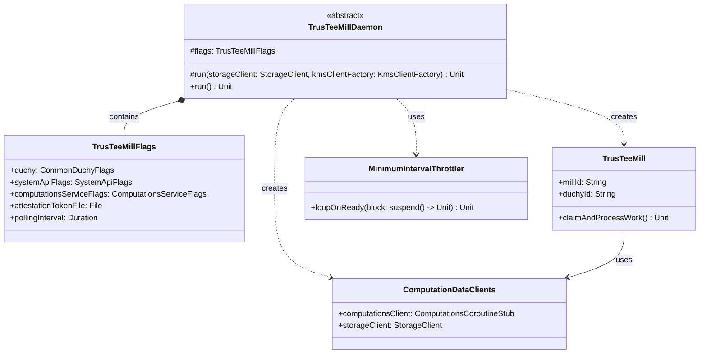

# org.wfanet.measurement.duchy.deploy.common.daemon.mill.trustee

## Overview
The trustee package provides daemon infrastructure for deploying TrusTEE-based mill instances within a duchy. It configures and runs the TrusTeeMill, which processes secure multi-party computation (MPC) workloads using trusted execution environment (TEE) technology. The daemon manages gRPC channels, cryptographic certificates, attestation tokens, and polling logic for continuous computation processing.

## Components

### TrusTeeMillDaemon
Abstract base class for running TrusTeeMill daemon instances with full infrastructure setup.

| Method | Parameters | Returns | Description |
|--------|------------|---------|-------------|
| run | `storageClient: StorageClient`, `kmsClientFactory: KmsClientFactory<GCloudWifCredentials>` | `Unit` | Initializes channels, certificates, and starts mill polling loop |

**Key Responsibilities:**
- Builds mutual TLS channels to computation services and system API
- Loads consent signaling certificates and private keys
- Instantiates TrusTeeMill with all required dependencies
- Executes polling loop with minimum interval throttling
- Manages duchy identity and mill ID configuration

**Constructor Parameters:**
- Requires `flags: TrusTeeMillFlags` mixin (injected via Picocli)

### TrusTeeMillFlags
Command-line flag configuration for TrusTeeMill daemon deployment.

| Property | Type | Description |
|----------|------|-------------|
| duchy | `CommonDuchyFlags` | Duchy identification configuration |
| systemApiFlags | `SystemApiFlags` | System API service connection settings |
| computationsServiceFlags | `ComputationsServiceFlags` | Internal computations service connection settings |
| attestationTokenFile | `File` | Path to attestation token for KMS credential |
| pollingInterval | `Duration` | Sleep duration between empty queue polls (default: 2s) |

**Inherited from MillFlags:**
- TLS certificate and key file paths
- Channel shutdown timeout configuration
- Work lock duration settings
- Mill ID and consent signaling certificate parameters

## Data Structures

### Certificate (Referenced Type)
Wrapper for consent signaling X.509 certificates used in computation signing.

| Property | Type | Description |
|----------|------|-------------|
| name | `String` | Certificate resource name identifier |
| certificate | `X509Certificate` | X.509 certificate for signature verification |

## Dependencies

### Internal Dependencies
- `org.wfanet.measurement.duchy.mill.trustee.TrusTeeMill` - Core mill implementation for TrusTEE-based computations
- `org.wfanet.measurement.duchy.mill.trustee.processor.TrusTeeProcessorImpl` - Factory for creating TrusTEE computation processors
- `org.wfanet.measurement.duchy.db.computation.ComputationDataClients` - Data layer access to computations and storage
- `org.wfanet.measurement.duchy.mill.MillBase` - Base mill configuration including gRPC service config
- `org.wfanet.measurement.duchy.deploy.common.CommonDuchyFlags` - Shared duchy configuration flags
- `org.wfanet.measurement.duchy.deploy.common.SystemApiFlags` - System API connection configuration
- `org.wfanet.measurement.duchy.deploy.common.ComputationsServiceFlags` - Computations service configuration

### External Dependencies
- `io.grpc.Channel` - gRPC communication channels
- `com.google.protobuf.ByteString` - Protocol buffer byte handling
- `kotlinx.coroutines` - Asynchronous execution and coroutine context management
- `picocli.CommandLine` - Command-line argument parsing
- `org.wfanet.measurement.common.crypto` - Cryptographic utilities for certificates and signing
- `org.wfanet.measurement.common.crypto.tink` - Cloud KMS integration with Workload Identity Federation
- `org.wfanet.measurement.common.grpc` - gRPC channel builders and interceptors
- `org.wfanet.measurement.common.throttler.MinimumIntervalThrottler` - Polling rate limiting

### gRPC Service Clients
- `ComputationsCoroutineStub` (internal) - Duchy computation management
- `ComputationStatsCoroutineStub` (internal) - Computation statistics tracking
- `SystemComputationsCoroutineStub` (system v1alpha) - Cross-duchy computation coordination
- `SystemComputationParticipantsCoroutineStub` (system v1alpha) - Participant management
- `SystemComputationLogEntriesCoroutineStub` (system v1alpha) - Computation audit logging

## Usage Example

```kotlin
import org.wfanet.measurement.common.crypto.tink.GCloudWifCredentials
import org.wfanet.measurement.common.crypto.tink.KmsClientFactory
import org.wfanet.measurement.storage.StorageClient
import picocli.CommandLine

class MyTrusTeeMillDaemon(
  private val storageClient: StorageClient,
  private val kmsClientFactory: KmsClientFactory<GCloudWifCredentials>
) : TrusTeeMillDaemon() {

  override fun run() {
    run(storageClient, kmsClientFactory)
  }
}

fun main(args: Array<String>) {
  val storageClient = createStorageClient()
  val kmsClientFactory = createKmsClientFactory()

  val daemon = MyTrusTeeMillDaemon(storageClient, kmsClientFactory)
  CommandLine(daemon).execute(*args)
}

// Command-line execution:
// --duchy-name=worker1 \
// --system-api-target=localhost:8443 \
// --system-api-cert-host=localhost \
// --computations-service-target=localhost:8444 \
// --computations-service-cert-host=localhost \
// --attestation-token-file=/path/to/attestation.token \
// --polling-interval=5s \
// --mill-id=mill-pod-1 \
// --tls-cert-file=/certs/cert.pem \
// --tls-private-key-file=/certs/key.pem \
// --cert-collection-file=/certs/ca.pem \
// --cs-certificate-der-file=/certs/consent-signal-cert.der \
// --cs-certificate-name=consentSignalingCertificates/123 \
// --cs-private-key-der-file=/certs/consent-signal-key.der
```

## Operational Flow

1. **Initialization Phase**
   - Parses command-line flags via Picocli mixins
   - Loads TLS certificates from PEM files for mutual authentication
   - Establishes gRPC channels to computations service and system API with deadlines and shutdown timeouts

2. **Certificate Configuration**
   - Reads consent signaling X.509 certificate from DER file
   - Loads corresponding private key for signing operations
   - Creates SigningKeyHandle for cryptographic operations

3. **Mill Instantiation**
   - Constructs TrusTeeMill with duchy identity, mill ID, and signing credentials
   - Injects ComputationDataClients for database and storage access
   - Provides system API stubs for cross-duchy coordination
   - Configures TrusTeeProcessorImpl factory for computation processing
   - Supplies KMS client factory and attestation token path for TEE operations

4. **Execution Loop**
   - Enters coroutine context with mill-specific name for observability
   - Creates MinimumIntervalThrottler to prevent excessive polling
   - Continuously claims and processes work from computation queue
   - Suppresses and logs exceptions to maintain daemon stability
   - Sleeps for configured polling interval when queue is empty

## Class Diagram



## Configuration Notes

- **Attestation Token**: Required for TrusTEE environments to authenticate with Cloud KMS using Workload Identity Federation
- **Polling Interval**: Balances responsiveness versus resource consumption; shorter intervals increase compute overhead
- **Work Lock Duration**: Inherited from MillFlags; determines how long a mill holds exclusive lock on a computation
- **Channel Timeouts**: System API uses MillBase.SERVICE_CONFIG for retry/timeout policies; computations service uses custom deadline configuration
- **Certificate Formats**: Consent signaling certificates use DER encoding; TLS certificates use PEM encoding
- **TODO**: Private key storage should migrate from file-based to KMS-encrypted store (line 101-102)
