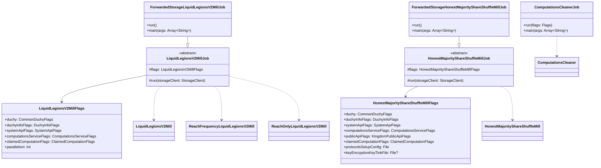

# org.wfanet.measurement.duchy.deploy.common.job

## Overview
This package provides command-line job executables for duchy deployment operations in the Cross-Media Measurement system. It includes computational processing jobs using Liquid Legions V2 and Honest Majority Share Shuffle protocols, as well as maintenance jobs for cleaning up terminal computations. These jobs are designed to run as standalone processes or Kubernetes pods.

## Components

### ComputationsCleanerJob
Command-line job that deletes terminal computations exceeding their time-to-live threshold.

| Method | Parameters | Returns | Description |
|--------|------------|---------|-------------|
| run | `flags: Flags` | `Unit` | Connects to internal API and executes cleanup |
| main | `args: Array<String>` | `Unit` | Entry point parsing command-line arguments |

**Configuration Options:**
- `--computations-time-to-live`: TTL for terminal computations (default: 90 days)
- `--dry-run`: Print deletion count without performing deletion (default: false)
- `--channel-shutdown-timeout`: gRPC channel shutdown timeout (default: 3s)
- `--rpc-deadline-duration`: RPC deadline duration (default: 5m)
- `--debug-verbose-grpc-client-logging`: Enable full gRPC logging (default: false)

### mill.liquidlegionsv2.LiquidLegionsV2MillJob
Abstract base class for processing Liquid Legions V2 protocol computations.

| Method | Parameters | Returns | Description |
|--------|------------|---------|-------------|
| run | `storageClient: StorageClient` | `Unit` | Initializes mill and processes claimed work |

**Computational Modes:**
- `LIQUID_LEGIONS_SKETCH_AGGREGATION_V2`: Reach and frequency computations
- `REACH_ONLY_LIQUID_LEGIONS_SKETCH_AGGREGATION_V2`: Reach-only computations

**Key Responsibilities:**
- Establishes mTLS channels to internal computations service and system API
- Creates computation control client map for inter-duchy communication
- Instantiates cryptographic workers (JNI-based encryption)
- Processes claimed work in continuous loop until exhausted

### mill.liquidlegionsv2.ForwardedStorageLiquidLegionsV2MillJob
Concrete implementation using forwarded storage backend.

| Method | Parameters | Returns | Description |
|--------|------------|---------|-------------|
| run | - | `Unit` | Initializes forwarded storage and delegates to base |
| main | `args: Array<String>` | `Unit` | Entry point for standalone execution |

### mill.liquidlegionsv2.LiquidLegionsV2MillFlags
Configuration flags for Liquid Legions V2 mill jobs.

| Property | Type | Description |
|----------|------|-------------|
| duchy | `CommonDuchyFlags` | Duchy identity configuration |
| duchyInfoFlags | `DuchyInfoFlags` | Multi-duchy network information |
| systemApiFlags | `SystemApiFlags` | Kingdom system API connection |
| computationsServiceFlags | `ComputationsServiceFlags` | Internal computations service target |
| claimedComputationFlags | `ClaimedComputationFlags` | Specific computation claim details |
| parallelism | `Int` | Maximum crypto action threads (default: 1) |

### mill.shareshuffle.HonestMajorityShareShuffleMillJob
Abstract base class for processing Honest Majority Share Shuffle protocol computations.

| Method | Parameters | Returns | Description |
|--------|------------|---------|-------------|
| run | `storageClient: StorageClient` | `Unit` | Initializes mill and processes claimed work |

**Key Features:**
- Supports private key encryption via Tink AEAD
- Integrates with public Kingdom API for certificate retrieval
- Uses JNI-based share shuffle cryptographic operations
- Reads protocol setup configuration from text proto file

### mill.shareshuffle.ForwardedStorageHonestMajorityShareShuffleMillJob
Concrete implementation using forwarded storage backend.

| Method | Parameters | Returns | Description |
|--------|------------|---------|-------------|
| run | - | `Unit` | Initializes forwarded storage and delegates to base |
| main | `args: Array<String>` | `Unit` | Entry point for standalone execution |

### mill.shareshuffle.HonestMajorityShareShuffleMillFlags
Configuration flags for Honest Majority Share Shuffle mill jobs.

| Property | Type | Description |
|----------|------|-------------|
| duchy | `CommonDuchyFlags` | Duchy identity configuration |
| duchyInfoFlags | `DuchyInfoFlags` | Multi-duchy network information |
| systemApiFlags | `SystemApiFlags` | Kingdom system API connection |
| computationsServiceFlags | `ComputationsServiceFlags` | Internal computations service target |
| publicApiFlags | `KingdomPublicApiFlags` | Public Kingdom API connection |
| claimedComputationFlags | `ClaimedComputationFlags` | Specific computation claim details |
| protocolsSetupConfig | `File` | ProtocolsSetupConfig proto in text format |
| keyEncryptionKeyTinkFile | `File?` | Optional KEK for private key store |

## Architectural Patterns

### Template Method Pattern
Abstract base classes (`LiquidLegionsV2MillJob`, `HonestMajorityShareShuffleMillJob`) define the execution skeleton via `run(StorageClient)`, while concrete implementations provide storage initialization.

### Dependency Injection via Flags
All configuration is externalized through PicoCLI mixins, enabling flexible deployment configurations without code changes.

### Multi-Channel Communication
Jobs establish separate mTLS channels for:
- Internal duchy computations service
- Kingdom system API
- Kingdom public API (HMSS only)
- Peer duchy computation control services

## Dependencies

- `org.wfanet.measurement.duchy.mill` - Core mill implementations for protocol execution
- `org.wfanet.measurement.duchy.service.internal.computations` - Computations cleaner service logic
- `org.wfanet.measurement.duchy.db.computation` - Data client abstractions
- `org.wfanet.measurement.storage` - Storage client interfaces
- `org.wfanet.measurement.common.crypto` - Certificate and signing key utilities
- `org.wfanet.measurement.common.grpc` - gRPC channel builders and extensions
- `org.wfanet.measurement.common.identity` - Duchy identity and DuchyInfo management
- `org.wfanet.measurement.internal.duchy` - Internal duchy gRPC stubs
- `org.wfanet.measurement.system.v1alpha` - Kingdom system API stubs
- `org.wfanet.measurement.api.v2alpha` - Kingdom public API stubs (HMSS only)
- `com.google.crypto.tink` - Key encryption and AEAD primitives (HMSS only)
- `picocli` - Command-line argument parsing

## Usage Examples

### Running ComputationsCleanerJob

```kotlin
// Dry-run mode to preview deletions
fun main(args: Array<String>) = commandLineMain(::run, arrayOf(
  "--computations-service-target=localhost:8080",
  "--tls-cert-file=/path/to/cert.pem",
  "--tls-private-key-file=/path/to/key.pem",
  "--tls-cert-collection-file=/path/to/ca.pem",
  "--computations-time-to-live=30d",
  "--dry-run=true"
))
```

### Running LiquidLegionsV2MillJob

```kotlin
fun main(args: Array<String>) = commandLineMain(
  ForwardedStorageLiquidLegionsV2MillJob(),
  arrayOf(
    "--duchy-name=worker1",
    "--duchy-info-config=/path/to/duchy-info.textproto",
    "--computations-service-target=localhost:8080",
    "--system-api-target=kingdom.example.com:443",
    "--claimed-computation-type=LIQUID_LEGIONS_SKETCH_AGGREGATION_V2",
    "--claimed-global-computation-id=12345",
    "--parallelism=4",
    "--forwarded-storage-service-target=storage:8080"
  )
)
```

### Running HonestMajorityShareShuffleMillJob

```kotlin
fun main(args: Array<String>) = commandLineMain(
  ForwardedStorageHonestMajorityShareShuffleMillJob(),
  arrayOf(
    "--duchy-name=aggregator",
    "--duchy-info-config=/path/to/duchy-info.textproto",
    "--computations-service-target=localhost:8080",
    "--system-api-target=kingdom.example.com:443",
    "--public-api-target=kingdom.example.com:443",
    "--protocols-setup-config=/path/to/protocols-setup.textproto",
    "--key-encryption-key-file=/path/to/kek.bin",
    "--claimed-computation-type=HONEST_MAJORITY_SHARE_SHUFFLE",
    "--claimed-global-computation-id=67890",
    "--forwarded-storage-service-target=storage:8080"
  )
)
```

## Class Diagram


