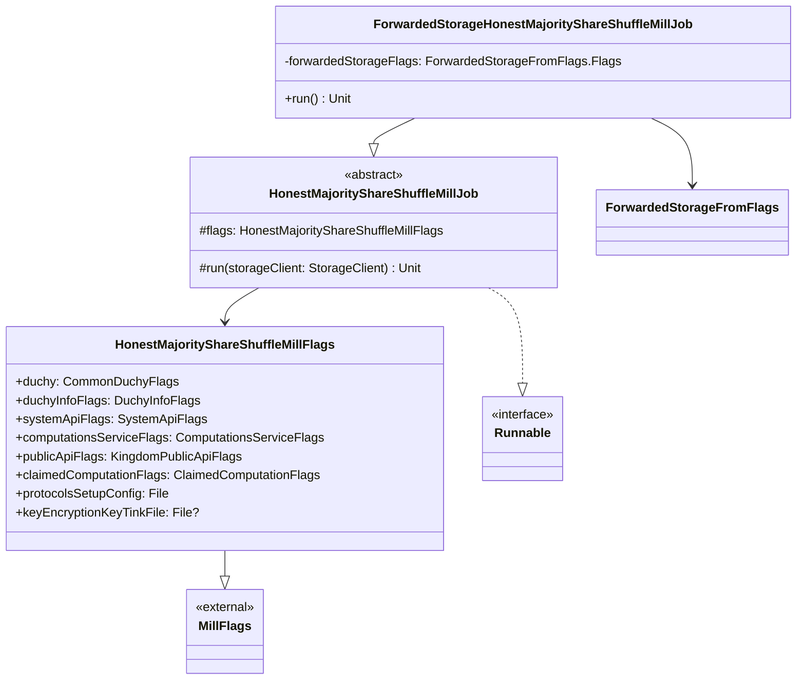

# org.wfanet.measurement.duchy.deploy.common.job.mill.shareshuffle

## Overview
This package provides deployment job implementations for the Honest Majority Share Shuffle Mill daemon. The mill processes multi-party computation (MPC) workloads using the honest majority share shuffle protocol, managing cryptographic operations, communication with system and public APIs, and coordination between duchy computation participants.

## Components

### HonestMajorityShareShuffleMillJob
Abstract base class providing core initialization and execution logic for the mill daemon.

| Method | Parameters | Returns | Description |
|--------|------------|---------|-------------|
| run | `storageClient: StorageClient` | `Unit` | Initializes mill infrastructure, establishes gRPC channels, and processes computations |

**Key Responsibilities:**
- Initializes duchy identity from configuration flags
- Establishes mutual TLS channels to computations service, system API, and public API
- Configures computation data clients for storage and state management
- Sets up inter-duchy communication channels for computation control
- Manages signing certificates and private key storage with optional encryption
- Instantiates and runs the `HonestMajorityShareShuffleMill` with configured cryptographic workers
- Processes claimed computations and claims new work until exhausted

**Constructor Parameters:**
- Uses `@CommandLine.Mixin` to inject `HonestMajorityShareShuffleMillFlags`

**Key Dependencies:**
- `DuchyInfo.entries`: Multi-duchy topology information
- `ComputationDataClients`: Manages computation state and blob storage
- `JniHonestMajorityShareShuffleCryptor`: Native cryptographic implementation
- `TinkKeyStore`: Optional encrypted private key storage using Google Tink

### ForwardedStorageHonestMajorityShareShuffleMillJob
Concrete implementation using forwarded storage backend.

| Method | Parameters | Returns | Description |
|--------|------------|---------|-------------|
| run | None | `Unit` | Delegates to parent with ForwardedStorage client |
| main | `args: Array<String>` | `Unit` | Entry point for command-line execution |

**Annotations:**
- `@CommandLine.Command`: PicoCLI command configuration with name, description, help options

**Storage Configuration:**
- Uses `ForwardedStorageFromFlags` to initialize storage client
- Supports TLS-secured forwarded storage connections

### HonestMajorityShareShuffleMillFlags
Configuration flags container for mill daemon parameters.

| Property | Type | Description |
|----------|------|-------------|
| duchy | `CommonDuchyFlags` | Common duchy configuration (name, etc.) |
| duchyInfoFlags | `DuchyInfoFlags` | Multi-duchy topology information |
| systemApiFlags | `SystemApiFlags` | System API connection parameters |
| computationsServiceFlags | `ComputationsServiceFlags` | Internal computations service configuration |
| publicApiFlags | `KingdomPublicApiFlags` | Kingdom public API connection settings |
| claimedComputationFlags | `ClaimedComputationFlags` | Flags for resuming claimed computations |
| protocolsSetupConfig | `File` | ProtocolsSetupConfig proto in text format |
| keyEncryptionKeyTinkFile | `File?` | Optional key encryption key for private key store |

**Inheritance:**
- Extends `MillFlags` for common mill configuration

**Flag Groups:**
- Claimed Computation Flags: Exclusive flag group for computation claiming

## Data Structures

### Command-Line Configuration
The package uses PicoCLI mixins to compose configuration from multiple flag sets, enabling modular configuration management across duchy, API endpoints, TLS certificates, and protocol-specific parameters.

## Dependencies

- `org.wfanet.measurement.duchy.mill.shareshuffle` - Core mill implementation and cryptographic workers
- `org.wfanet.measurement.duchy.db.computation` - Computation state and data client abstractions
- `org.wfanet.measurement.common.crypto` - Certificate handling and signing key management
- `org.wfanet.measurement.common.crypto.tink` - Google Tink integration for key storage
- `org.wfanet.measurement.storage` - Storage client abstraction layer
- `org.wfanet.measurement.storage.forwarded` - Forwarded storage implementation
- `org.wfanet.measurement.system.v1alpha` - System API gRPC stubs for inter-duchy coordination
- `org.wfanet.measurement.api.v2alpha` - Public Kingdom API gRPC stubs
- `org.wfanet.measurement.internal.duchy` - Internal duchy service stubs and configuration protos
- `picocli.CommandLine` - Command-line parsing framework
- `com.google.crypto.tink` - Cryptographic key management library

## Usage Example

```kotlin
// Command-line execution with forwarded storage
fun main(args: Array<String>) {
  commandLineMain(ForwardedStorageHonestMajorityShareShuffleMillJob(), args)
}

// Typical command-line invocation:
// --duchy-name=duchy1 \
// --duchy-info-config=duchy_info.textproto \
// --protocols-setup-config=protocols_setup.textproto \
// --computations-service-target=localhost:8080 \
// --system-api-target=kingdom-system.example.com:443 \
// --kingdom-public-api-target=kingdom-public.example.com:443 \
// --forwarded-storage-service-target=storage.example.com:443 \
// --tls-cert-file=/secrets/duchy_cert.pem \
// --tls-private-key-file=/secrets/duchy_key.pem \
// --tls-cert-collection-file=/secrets/trusted_certs.pem \
// --cs-certificate-der-file=/secrets/cs_cert.der \
// --cs-private-key-der-file=/secrets/cs_key.der \
// --mill-id=mill-pod-1 \
// --key-encryption-key-file=/secrets/kek.bin
```

## Architecture Notes

**Mill Execution Flow:**
1. Parse command-line flags and initialize duchy topology
2. Load TLS certificates and establish mutual TLS channels
3. Configure computation data clients with storage backend
4. Build inter-duchy computation control client map
5. Load consent signaling certificate and signing key
6. Initialize optional encrypted private key store
7. Instantiate `HonestMajorityShareShuffleMill` with all dependencies
8. Process any pre-claimed computation from flags
9. Enter work-claiming loop until work is exhausted or job is terminated

**Security Considerations:**
- All network communication uses mutual TLS authentication
- Private keys can be encrypted at rest using Google Tink AEAD
- Consent signaling requires dedicated certificate and signing key
- Certificate verification against trusted certificate collection

**Deployment Model:**
- Designed for Kubernetes pod deployment
- Mill ID typically set to pod name for operational visibility
- Supports both claimed computation resumption and continuous work claiming
- Work lock duration prevents duplicate processing across mill instances

## Class Diagram


