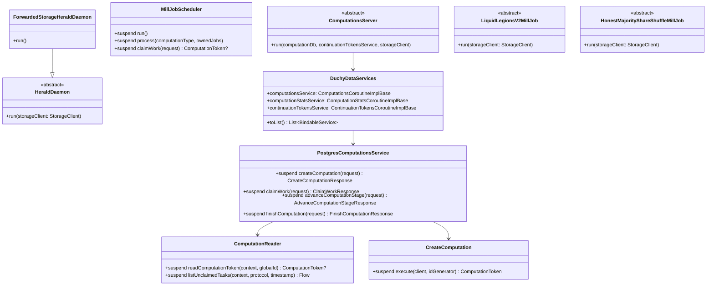

# org.wfanet.measurement.duchy.deploy.common

## Overview
This package provides common deployment infrastructure for Duchy components in the Cross-Media Measurement system. It contains configuration flags, server implementations, database services, job schedulers, and daemon processes for managing privacy-preserving multi-party computations across distributed duchy nodes.

## Components

### CommonDuchyFlags
Command-line flag definition for duchy identification.

| Property | Type | Description |
|----------|------|-------------|
| duchyName | `String` | Stable unique name for this Duchy |

### ComputationsServiceFlags
Configuration flags for internal Computations service connectivity.

| Property | Type | Description |
|----------|------|-------------|
| target | `String` | gRPC target of internal Computations API server |
| certHost | `String` | Expected hostname in server TLS certificate |
| defaultDeadlineDuration | `Duration` | Default RPC deadline duration |

### AsyncComputationControlServiceFlags
Configuration flags for AsyncComputationControl service connectivity.

| Property | Type | Description |
|----------|------|-------------|
| target | `String` | gRPC target of AsyncComputationControl service |
| certHost | `String` | Expected hostname in server TLS certificate |
| defaultDeadlineDuration | `Duration` | Default RPC deadline duration |

### SystemApiFlags
Configuration flags for Kingdom system API connectivity.

| Property | Type | Description |
|----------|------|-------------|
| target | `String` | gRPC target of Kingdom system API server |
| certHost | `String?` | Optional hostname override for TLS certificate |

### KingdomPublicApiFlags
Configuration flags for Kingdom public API connectivity.

| Property | Type | Description |
|----------|------|-------------|
| target | `String` | gRPC target of Kingdom public API server |
| certHost | `String?` | Optional hostname override for TLS certificate |

## Daemon Components

### HeraldDaemon
Abstract base class for Herald daemon implementations that synchronize computation states with the Kingdom.

| Method | Parameters | Returns | Description |
|--------|------------|---------|-------------|
| run | `storageClient: StorageClient` | `Unit` | Initializes and runs Herald synchronization loop |

### ForwardedStorageHeraldDaemon
Concrete Herald daemon implementation using forwarded storage backend.

| Method | Parameters | Returns | Description |
|--------|------------|---------|-------------|
| run | - | `Unit` | Starts Herald with forwarded storage configuration |

### MillJobScheduler
Kubernetes Job scheduler for Mill computation workers supporting Liquid Legions V2 and Honest Majority Share Shuffle protocols.

| Method | Parameters | Returns | Description |
|--------|------------|---------|-------------|
| suspend run | - | `Unit` | Continuously polls for work and schedules K8s Jobs |
| suspend process | `computationType: ComputationType, ownedJobs: List<V1Job>` | `Unit` | Claims work and creates Job if below concurrency limit |
| suspend claimWork | `request: ClaimWorkRequest` | `ComputationToken?` | Claims available computation work from internal API |
| suspend getOwnedJobs | `millType: MillType` | `List<V1Job>` | Retrieves Jobs owned by this scheduler deployment |
| suspend createJob | `name: String, millType: MillType, template: V1PodTemplateSpec` | `V1Job` | Creates Kubernetes Job from template |

### TrusTeeMillDaemon
Daemon for TrusTEE (Trusted Execution Environment) based computation processing.

| Method | Parameters | Returns | Description |
|--------|------------|---------|-------------|
| run | `storageClient: StorageClient, kmsClientFactory: KmsClientFactory<GCloudWifCredentials>` | `Unit` | Runs TrusTEE mill with continuous work claiming |

## Job Components

### ComputationsCleanerJob
Maintenance job that purges terminal computations older than configured TTL.

| Method | Parameters | Returns | Description |
|--------|------------|---------|-------------|
| run | `flags: Flags` | `Unit` | Executes computation cleanup logic |

### LiquidLegionsV2MillJob
Abstract job for processing Liquid Legions V2 protocol computations (reach and frequency or reach-only).

| Method | Parameters | Returns | Description |
|--------|------------|---------|-------------|
| run | `storageClient: StorageClient` | `Unit` | Processes claimed computation work using LLv2 protocol |

### HonestMajorityShareShuffleMillJob
Abstract job for processing Honest Majority Share Shuffle (HMSS) protocol computations.

| Method | Parameters | Returns | Description |
|--------|------------|---------|-------------|
| run | `storageClient: StorageClient` | `Unit` | Processes claimed computation work using HMSS protocol |

### ForwardedStorageLiquidLegionsV2MillJob
Concrete Liquid Legions V2 mill job using forwarded storage backend.

### ForwardedStorageHonestMajorityShareShuffleMillJob
Concrete HMSS mill job using forwarded storage backend.

## Server Components

### ComputationControlServer
Abstract gRPC server for external computation control operations from other duchies.

| Method | Parameters | Returns | Description |
|--------|------------|---------|-------------|
| run | `storageClient: StorageClient` | `Unit` | Starts gRPC server with ComputationControlService |

### AsyncComputationControlServer
gRPC server for asynchronous computation control operations.

### ComputationsServer
Abstract gRPC server for internal Computations service.

| Method | Parameters | Returns | Description |
|--------|------------|---------|-------------|
| run | `computationsDatabaseReader: ComputationsDatabaseReader, computationDb: ComputationsDb, continuationTokensService: ContinuationTokensCoroutineImplBase, storageClient: StorageClient` | `Unit` | Starts internal Computations gRPC server |

### DuchyDataServer
gRPC server aggregating all duchy data services (Computations, ComputationStats, ContinuationTokens).

### RequisitionFulfillmentServer
Abstract gRPC server for requisition fulfillment operations.

### ForwardedStorageComputationControlServer
Computation control server with forwarded storage backend.

### ForwardedStoragePostgresDuchyDataServer
Duchy data server using Postgres database and forwarded storage.

### ForwardedStorageRequisitionFulfillmentServer
Requisition fulfillment server with forwarded storage backend.

## Service Components

### DuchyDataServices
Data class aggregating core duchy internal services.

| Property | Type | Description |
|----------|------|-------------|
| computationsService | `ComputationsCoroutineImplBase` | Internal computations management service |
| computationStatsService | `ComputationStatsCoroutineImplBase` | Computation statistics service |
| continuationTokensService | `ContinuationTokensCoroutineImplBase` | Continuation token management service |

| Method | Parameters | Returns | Description |
|--------|------------|---------|-------------|
| toList | - | `List<BindableService>` | Converts services to bindable service list |

### DuchyDataServicesFactory
Factory interface for creating DuchyDataServices instances.

| Method | Parameters | Returns | Description |
|--------|------------|---------|-------------|
| create | `coroutineContext: CoroutineContext` | `DuchyDataServices` | Creates service instances with context |

### PostgresDuchyDataServices
Factory implementation using Postgres database backend.

## Postgres Database Components

### PostgresComputationsService
Postgres-backed implementation of internal Computations service.

| Method | Parameters | Returns | Description |
|--------|------------|---------|-------------|
| suspend createComputation | `request: CreateComputationRequest` | `CreateComputationResponse` | Creates new computation record |
| suspend claimWork | `request: ClaimWorkRequest` | `ClaimWorkResponse` | Claims available computation work |
| suspend getComputationToken | `request: GetComputationTokenRequest` | `GetComputationTokenResponse` | Retrieves computation token by ID or requisition |
| suspend deleteComputation | `request: DeleteComputationRequest` | `Empty` | Deletes computation and associated blobs |
| suspend purgeComputations | `request: PurgeComputationsRequest` | `PurgeComputationsResponse` | Purges terminal computations before timestamp |
| suspend finishComputation | `request: FinishComputationRequest` | `FinishComputationResponse` | Marks computation as finished with reason |
| suspend updateComputationDetails | `request: UpdateComputationDetailsRequest` | `UpdateComputationDetailsResponse` | Updates computation details |
| suspend recordOutputBlobPath | `request: RecordOutputBlobPathRequest` | `RecordOutputBlobPathResponse` | Records output blob reference |
| suspend advanceComputationStage | `request: AdvanceComputationStageRequest` | `AdvanceComputationStageResponse` | Advances computation to next stage |
| suspend getComputationIds | `request: GetComputationIdsRequest` | `GetComputationIdsResponse` | Retrieves global IDs by stage filter |
| suspend enqueueComputation | `request: EnqueueComputationRequest` | `EnqueueComputationResponse` | Enqueues computation with optional delay |
| suspend recordRequisitionFulfillment | `request: RecordRequisitionFulfillmentRequest` | `RecordRequisitionFulfillmentResponse` | Records fulfilled requisition data |

### PostgresComputationStatsService
Postgres-backed computation statistics service.

### PostgresContinuationTokensService
Postgres-backed continuation token management service.

## Postgres Readers

### ComputationReader
Performs read operations on Computations and ComputationStages tables.

| Method | Parameters | Returns | Description |
|--------|------------|---------|-------------|
| suspend readComputationToken | `readContext: ReadContext, globalComputationId: String` | `ComputationToken?` | Reads token by global ID within transaction |
| suspend readComputationToken | `client: DatabaseClient, globalComputationId: String` | `ComputationToken?` | Reads token by global ID in new transaction |
| suspend readComputationToken | `readContext: ReadContext, externalRequisitionKey: ExternalRequisitionKey` | `ComputationToken?` | Reads token by requisition key |
| suspend readGlobalComputationIds | `readContext: ReadContext, stages: List<ComputationStage>, updatedBefore: Instant?` | `Set<String>` | Reads global IDs filtered by stages and time |
| suspend listUnclaimedTasks | `readContext: ReadContext, protocol: Long, timestamp: Instant, prioritizedStages: List<ComputationStage>` | `Flow<UnclaimedTaskQueryResult>` | Lists unclaimed computation tasks with expired locks |
| suspend readLockOwner | `readContext: ReadContext, computationId: Long` | `LockOwnerQueryResult?` | Reads lock owner and update time |

### ComputationBlobReferenceReader
Reads computation blob references from database.

### ComputationStageAttemptReader
Reads computation stage attempt records.

### ContinuationTokenReader
Reads continuation tokens for Herald synchronization.

### RequisitionReader
Reads requisition metadata and blob references.

## Postgres Writers

### CreateComputation
Postgres writer that inserts new computation with initial stage and requisitions.

| Method | Parameters | Returns | Description |
|--------|------------|---------|-------------|
| suspend execute | `client: DatabaseClient, idGenerator: IdGenerator` | `ComputationToken` | Executes creation transaction |

### AdvanceComputationStage
Advances computation to next stage with blob management.

### ClaimWork
Claims available computation work with lock acquisition.

### DeleteComputation
Deletes computation record from database.

### EnqueueComputation
Enqueues computation for processing with delay.

### FinishComputation
Marks computation as finished with terminal state.

### PurgeComputations
Purges computations in terminal states before cutoff time.

### RecordOutputBlobPath
Records output blob path reference.

### RecordRequisitionData
Records requisition fulfillment data and blob path.

### UpdateComputationDetails
Updates computation details and requisitions.

### InsertComputationStat
Inserts computation statistics record.

### SetContinuationToken
Sets continuation token for Herald.

### ComputationMutations
Helper methods for computation table mutations.

### ComputationStageMutations
Helper methods for computation stage mutations.

### ComputationStageAttemptMutations
Helper methods for stage attempt mutations.

### ComputationBlobReferenceMutations
Helper methods for blob reference mutations.

### RequisitionMutations
Helper methods for requisition mutations.

## Dependencies

- `org.wfanet.measurement.common` - Common utilities, gRPC helpers, crypto support
- `org.wfanet.measurement.common.db.r2dbc` - R2DBC database abstraction
- `org.wfanet.measurement.common.identity` - Duchy identity management
- `org.wfanet.measurement.duchy.db.computation` - Computation database abstractions
- `org.wfanet.measurement.duchy.herald` - Herald synchronization logic
- `org.wfanet.measurement.duchy.mill` - Mill computation processing logic
- `org.wfanet.measurement.duchy.service.internal` - Internal service implementations
- `org.wfanet.measurement.duchy.storage` - Storage abstractions for computations
- `org.wfanet.measurement.internal.duchy` - Internal duchy protobuf messages
- `org.wfanet.measurement.system.v1alpha` - Kingdom system API client stubs
- `org.wfanet.measurement.storage` - General storage client interfaces
- `io.grpc` - gRPC framework
- `io.kubernetes.client` - Kubernetes client for Job scheduling
- `picocli` - Command-line interface framework
- `com.google.crypto.tink` - Cryptographic key management
- `kotlinx.coroutines` - Kotlin coroutines for async operations

## Usage Example

```kotlin
// Configure and start a Duchy data server with Postgres backend
val flags = PostgresDuchyDataServerFlags()
val databaseClient = PostgresDatabaseClient(config)
val storageClient = ForwardedStorageClient(storageFlags)

// Create service factory
val servicesFactory = PostgresDuchyDataServicesFactory(
  computationTypeEnumHelper = computationTypeHelper,
  protocolStagesEnumHelper = stagesHelper,
  client = databaseClient,
  idGenerator = idGenerator,
  duchyName = "worker1",
  computationStore = ComputationStore(storageClient),
  requisitionStore = RequisitionStore(storageClient)
)

// Create and bind services
val services = servicesFactory.create(Dispatchers.IO)
val server = CommonServer.fromFlags(
  flags.server,
  "DuchyDataServer",
  *services.toList().toTypedArray()
)

server.start().blockUntilShutdown()
```

## Class Diagram


