# org.wfanet.measurement.duchy.deploy.common.postgres

## Overview
Provides PostgreSQL-backed implementations of Duchy computation management services. This package implements the persistence layer for computation lifecycle management, requisition tracking, and continuation tokens using R2DBC PostgreSQL clients. It serves as the database integration layer for duchy computation workflows in the Cross-Media Measurement system.

## Components

### PostgresComputationsService
Core gRPC service implementing comprehensive computation lifecycle management with PostgreSQL persistence.

| Method | Parameters | Returns | Description |
|--------|------------|---------|-------------|
| createComputation | `request: CreateComputationRequest` | `CreateComputationResponse` | Creates new computation with requisitions and initial stage |
| claimWork | `request: ClaimWorkRequest` | `ClaimWorkResponse` | Claims available computation work and acquires lock |
| getComputationToken | `request: GetComputationTokenRequest` | `GetComputationTokenResponse` | Retrieves computation token by global ID or requisition key |
| deleteComputation | `request: DeleteComputationRequest` | `Empty` | Deletes computation and associated blob storage |
| purgeComputations | `request: PurgeComputationsRequest` | `PurgeComputationsResponse` | Removes terminal stage computations older than threshold |
| finishComputation | `request: FinishComputationRequest` | `FinishComputationResponse` | Marks computation as complete with success, failure, or cancellation |
| updateComputationDetails | `request: UpdateComputationDetailsRequest` | `UpdateComputationDetailsResponse` | Updates computation-specific protocol details |
| recordOutputBlobPath | `request: RecordOutputBlobPathRequest` | `RecordOutputBlobPathResponse` | Records output blob path for computation stage |
| advanceComputationStage | `request: AdvanceComputationStageRequest` | `AdvanceComputationStageResponse` | Transitions computation to next stage with blob management |
| getComputationIds | `request: GetComputationIdsRequest` | `GetComputationIdsResponse` | Retrieves global computation IDs by stage filter |
| enqueueComputation | `request: EnqueueComputationRequest` | `EnqueueComputationResponse` | Enqueues computation for processing with optional delay |
| recordRequisitionFulfillment | `request: RecordRequisitionFulfillmentRequest` | `RecordRequisitionFulfillmentResponse` | Records requisition fulfillment with blob path and protocol details |

**Constructor Parameters:**
- `computationTypeEnumHelper: ComputationTypeEnumHelper<ComputationType>` - Protocol type enumeration helper
- `protocolStagesEnumHelper: ComputationProtocolStagesEnumHelper<ComputationType, ComputationStage>` - Stage enumeration helper
- `computationProtocolStageDetailsHelper: ComputationProtocolStageDetailsHelper<...>` - Stage details serialization helper
- `client: DatabaseClient` - R2DBC database client
- `idGenerator: IdGenerator` - Internal ID generator
- `duchyName: String` - Duchy identifier
- `computationStore: ComputationStore` - Blob storage for computations
- `requisitionStore: RequisitionStore` - Blob storage for requisitions
- `computationLogEntriesClient: ComputationLogEntriesCoroutineStub` - Kingdom logging client
- `coroutineContext: CoroutineContext = EmptyCoroutineContext` - Coroutine execution context
- `clock: Clock = Clock.systemUTC()` - Time source
- `defaultLockDuration: Duration = Duration.ofMinutes(5)` - Default lock expiration

### PostgresComputationStatsService
Manages computation performance metrics and statistics collection.

| Method | Parameters | Returns | Description |
|--------|------------|---------|-------------|
| createComputationStat | `request: CreateComputationStatRequest` | `CreateComputationStatResponse` | Inserts computation metric for specific stage and attempt |

**Constructor Parameters:**
- `client: DatabaseClient` - R2DBC database client
- `idGenerator: IdGenerator` - Internal ID generator

### PostgresContinuationTokensService
Manages continuation tokens for streaming operations and pagination.

| Method | Parameters | Returns | Description |
|--------|------------|---------|-------------|
| getContinuationToken | `request: GetContinuationTokenRequest` | `GetContinuationTokenResponse` | Retrieves current continuation token or empty response |
| setContinuationToken | `request: SetContinuationTokenRequest` | `SetContinuationTokenResponse` | Persists continuation token with validation |

**Constructor Parameters:**
- `client: DatabaseClient` - R2DBC database client
- `idGenerator: IdGenerator` - Internal ID generator

## Data Layer Architecture

### Readers
Located in `org.wfanet.measurement.duchy.deploy.common.postgres.readers`

| Reader | Purpose |
|--------|---------|
| ComputationReader | Queries computations, tokens, and unclaimed work |
| ComputationBlobReferenceReader | Retrieves blob keys for computation artifacts |
| ComputationStageAttemptReader | Reads stage attempt history |
| ContinuationTokenReader | Fetches continuation token state |
| RequisitionReader | Queries requisition metadata and blob keys |

### Writers
Located in `org.wfanet.measurement.duchy.deploy.common.postgres.writers`

| Writer | Purpose |
|--------|---------|
| CreateComputation | Inserts new computation with initial stage |
| AdvanceComputationStage | Transitions stage with blob reference updates |
| ClaimWork | Acquires lock on available computation |
| FinishComputation | Terminates computation with reason |
| EnqueueComputation | Schedules computation for processing |
| UpdateComputationDetails | Modifies protocol-specific details |
| RecordOutputBlobPath | Persists output blob location |
| RecordRequisitionData | Records requisition fulfillment data |
| DeleteComputation | Removes computation records |
| PurgeComputations | Bulk removes terminal computations |
| InsertComputationStat | Adds performance metric |
| SetContinuationToken | Updates continuation token |
| ComputationMutations | Low-level computation table operations |
| ComputationStageMutations | Low-level stage table operations |
| ComputationStageAttemptMutations | Low-level attempt table operations |
| ComputationBlobReferenceMutations | Low-level blob reference operations |
| RequisitionMutations | Low-level requisition table operations |

## Key Functionality

### Computation Lifecycle Management
1. **Creation**: Validates initial stage, inserts computation with requisitions
2. **Work Claiming**: Prioritized stage-based work queue with lock acquisition
3. **Stage Advancement**: Atomic transitions with blob path recording and lock management
4. **Termination**: Supports success, failure, and cancellation reasons with cleanup
5. **Purging**: Bulk deletion of terminal computations with force mode

### Lock Management
- Owner-based optimistic locking with expiration timestamps
- Configurable lock duration (default 5 minutes)
- Lock extension on stage advancement with `CONTINUE_WORKING` transition
- Automatic lock release on completion or queue re-entry

### Blob Storage Integration
- Separation of computation and requisition blob stores
- Deletion of blobs on computation removal
- Input, output, and pass-through blob path tracking
- Stage-specific blob reference management

### Kingdom Integration
- Asynchronous computation log entry creation on stage transitions
- Resilient logging with graceful failure handling
- Stage attempt tracking with timestamps

### Version Control
- Optimistic concurrency via update timestamp versioning
- Token version mismatch detection (ABORTED status)
- Prevents concurrent modifications to same computation

## Dependencies

### Internal Dependencies
- `org.wfanet.measurement.common.db.r2dbc` - R2DBC database client abstractions
- `org.wfanet.measurement.common.identity` - ID generation utilities
- `org.wfanet.measurement.common.grpc` - gRPC utilities and error handling
- `org.wfanet.measurement.duchy.db.computation` - Computation protocol abstraction layer
- `org.wfanet.measurement.duchy.storage` - Blob storage interfaces
- `org.wfanet.measurement.duchy.service.internal` - Duchy exception types
- `org.wfanet.measurement.internal.duchy` - Internal Duchy protobuf definitions

### External Dependencies
- `org.wfanet.measurement.system.v1alpha` - Kingdom API for log entries
- `io.grpc` - gRPC framework for service implementation
- `com.google.protobuf` - Protocol buffer serialization
- `java.time` - Clock and duration utilities
- `kotlinx.coroutines` - Coroutine support for async operations

### Database
- PostgreSQL (via R2DBC reactive driver)
- Tables: Computations, ComputationStages, ComputationStageAttempts, ComputationBlobReferences, Requisitions, ComputationStats, ContinuationTokens

## Usage Example

```kotlin
// Service initialization
val service = PostgresComputationsService(
  computationTypeEnumHelper = protocolHelper,
  protocolStagesEnumHelper = stageHelper,
  computationProtocolStageDetailsHelper = detailsHelper,
  client = r2dbcClient,
  idGenerator = internalIdGenerator,
  duchyName = "duchy-alpha",
  computationStore = blobComputationStore,
  requisitionStore = blobRequisitionStore,
  computationLogEntriesClient = kingdomClient,
)

// Create computation
val createResponse = service.createComputation(
  createComputationRequest {
    globalComputationId = "global-123"
    computationType = ComputationType.LIQUID_LEGIONS_SKETCH_AGGREGATION_V2
    computationDetails = liquidLegionsDetails { /* ... */ }
    stageDetails = computationStageDetails { /* ... */ }
    requisitions += listOf(/* requisition entries */)
  }
)

// Claim work
val workResponse = service.claimWork(
  claimWorkRequest {
    owner = "worker-01"
    computationType = ComputationType.LIQUID_LEGIONS_SKETCH_AGGREGATION_V2
    prioritizedStages += listOf(/* stages in priority order */)
    lockDuration = duration { seconds = 300 }
  }
)

// Advance stage
val advanceResponse = service.advanceComputationStage(
  advanceComputationStageRequest {
    token = workResponse.token
    nextComputationStage = ComputationStage.NEXT_STAGE
    stageDetails = computationStageDetails { /* ... */ }
    outputBlobs = 2
    afterTransition = AfterTransition.RETAIN_AND_EXTEND_LOCK
  }
)

// Finish computation
val finishResponse = service.finishComputation(
  finishComputationRequest {
    token = advanceResponse.token
    endingComputationStage = ComputationStage.COMPLETE
    reason = ComputationDetails.CompletedReason.SUCCEEDED
  }
)
```

## Error Handling

### Exception Mapping

| Internal Exception | gRPC Status Code | Scenario |
|--------------------|------------------|----------|
| ComputationNotFoundException | NOT_FOUND | Computation does not exist |
| ComputationAlreadyExistsException | ALREADY_EXISTS | Duplicate global computation ID |
| ComputationTokenVersionMismatchException | ABORTED | Concurrent modification detected |
| ComputationInitialStageInvalidException | INVALID_ARGUMENT | Invalid initial stage for protocol |
| ComputationDetailsNotFoundException | INTERNAL | Missing computation details |
| ContinuationTokenInvalidException | FAILED_PRECONDITION | Invalid token state |
| ContinuationTokenMalformedException | INVALID_ARGUMENT | Malformed token format |

### Validation

- Global computation ID and metric names must be non-empty
- Lock duration must be positive
- Owner identification required for work claiming
- Protocol type consistency enforced on detail updates
- Terminal stage validation for purge operations
- Requisition key and blob path validation

## Class Diagram

```mermaid
classDiagram
    class PostgresComputationsService {
        +createComputation(CreateComputationRequest) CreateComputationResponse
        +claimWork(ClaimWorkRequest) ClaimWorkResponse
        +advanceComputationStage(AdvanceComputationStageRequest) AdvanceComputationStageResponse
        +finishComputation(FinishComputationRequest) FinishComputationResponse
        -computationReader: ComputationReader
        -client: DatabaseClient
    }

    class PostgresComputationStatsService {
        +createComputationStat(CreateComputationStatRequest) CreateComputationStatResponse
        -client: DatabaseClient
    }

    class PostgresContinuationTokensService {
        +getContinuationToken(GetContinuationTokenRequest) GetContinuationTokenResponse
        +setContinuationToken(SetContinuationTokenRequest) SetContinuationTokenResponse
        -client: DatabaseClient
    }

    class ComputationReader {
        +readComputationToken(DatabaseClient, String) ComputationToken
        +readGlobalComputationIds(ReadContext, List) List~String~
    }

    class CreateComputation {
        +execute(DatabaseClient, IdGenerator) ComputationToken
    }

    class AdvanceComputationStage {
        +execute(DatabaseClient, IdGenerator) ComputationToken
    }

    PostgresComputationsService --> ComputationReader
    PostgresComputationsService --> CreateComputation
    PostgresComputationsService --> AdvanceComputationStage
    PostgresComputationsService --> ComputationStore
    PostgresComputationsService --> RequisitionStore
    PostgresComputationStatsService --> InsertComputationStat
    PostgresContinuationTokensService --> ContinuationTokenReader
    PostgresContinuationTokensService --> SetContinuationToken
```


