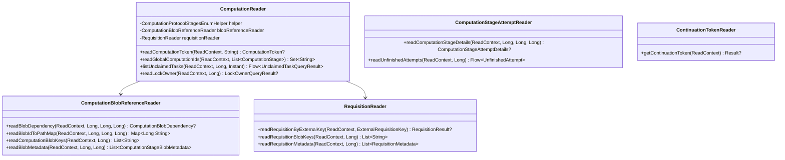

# org.wfanet.measurement.duchy.deploy.common.postgres.readers

## Overview
This package provides read-only database access layer for duchy computation management in PostgreSQL. It contains specialized reader classes that query computation state, blob references, requisitions, stage attempts, and continuation tokens using R2DBC reactive database connectivity.

## Components

### ComputationBlobReferenceReader
Manages read operations for computation blob references and metadata.

| Method | Parameters | Returns | Description |
|--------|------------|---------|-------------|
| readBlobDependency | `readContext: ReadContext`, `localId: Long`, `stage: Long`, `blobId: Long` | `ComputationBlobDependency?` | Retrieves blob dependency type for computation stage |
| readBlobIdToPathMap | `readContext: ReadContext`, `localId: Long`, `stage: Long`, `dependencyType: Long` | `Map<Long, String?>` | Maps blob IDs to storage paths by dependency type |
| readComputationBlobKeys | `readContext: ReadContext`, `localComputationId: Long` | `List<String>` | Retrieves all non-null blob paths for computation |
| readBlobMetadata | `readContext: ReadContext`, `localComputationId: Long`, `computationStage: Long` | `List<ComputationStageBlobMetadata>` | Fetches blob metadata for specific computation stage |

### ComputationReader
Primary reader for computation state, tokens, and task management queries.

| Method | Parameters | Returns | Description |
|--------|------------|---------|-------------|
| readComputationToken (by global ID) | `readContext: ReadContext`, `globalComputationId: String` | `ComputationToken?` | Retrieves computation token by global identifier |
| readComputationToken (by global ID, new txn) | `client: DatabaseClient`, `globalComputationId: String` | `ComputationToken?` | Retrieves computation token in new transaction |
| readComputationToken (by requisition key) | `readContext: ReadContext`, `externalRequisitionKey: ExternalRequisitionKey` | `ComputationToken?` | Retrieves computation token by requisition identifier |
| readComputationToken (by requisition key, new txn) | `client: DatabaseClient`, `externalRequisitionKey: ExternalRequisitionKey` | `ComputationToken?` | Retrieves computation token by requisition in new transaction |
| readGlobalComputationIds | `readContext: ReadContext`, `stages: List<ComputationStage>`, `updatedBefore: Instant?` | `Set<String>` | Queries global IDs filtered by stages and update time |
| listUnclaimedTasks | `readContext: ReadContext`, `protocol: Long`, `timestamp: Instant`, `prioritizedStages: List<ComputationStage>` | `Flow<UnclaimedTaskQueryResult>` | Streams unclaimed tasks with expired locks, ordered by priority |
| readLockOwner | `readContext: ReadContext`, `computationId: Long` | `LockOwnerQueryResult?` | Retrieves lock owner and update timestamp |

### ComputationStageAttemptReader
Queries computation stage attempt details and unfinished attempts.

| Method | Parameters | Returns | Description |
|--------|------------|---------|-------------|
| readComputationStageDetails | `readContext: ReadContext`, `localId: Long`, `stage: Long`, `currentAttempt: Long` | `ComputationStageAttemptDetails?` | Fetches details for specific computation stage attempt |
| readUnfinishedAttempts | `readContext: ReadContext`, `localComputationId: Long` | `Flow<UnfinishedAttempt>` | Streams all attempts without end time |

### ContinuationTokenReader
Manages read operations for herald continuation tokens.

| Method | Parameters | Returns | Description |
|--------|------------|---------|-------------|
| getContinuationToken | `readContext: ReadContext` | `Result?` | Retrieves the current herald continuation token |

### RequisitionReader
Performs read operations for computation requisitions and associated blobs.

| Method | Parameters | Returns | Description |
|--------|------------|---------|-------------|
| readRequisitionByExternalKey | `readContext: ReadContext`, `key: ExternalRequisitionKey` | `RequisitionResult?` | Fetches requisition by external ID and fingerprint |
| readRequisitionBlobKeys | `readContext: ReadContext`, `localComputationId: Long` | `List<String>` | Retrieves all non-null requisition blob paths |
| readRequisitionMetadata | `readContext: ReadContext`, `localComputationId: Long` | `List<RequisitionMetadata>` | Fetches complete requisition metadata for computation |

## Data Structures

### ComputationReader.Computation
| Property | Type | Description |
|----------|------|-------------|
| globalComputationId | `String` | Global identifier for computation |
| localComputationId | `Long` | Local database identifier |
| protocol | `Long` | Computation protocol type enum value |
| computationStage | `Long` | Current stage enum value |
| nextAttempt | `Int` | Next attempt number |
| computationDetails | `ComputationDetails` | Protocol buffer with computation details |
| version | `Long` | Version timestamp in epoch milliseconds |
| stageSpecificDetails | `ComputationStageDetails?` | Stage-specific protocol buffer |
| lockOwner | `String?` | Current lock owner identifier |
| lockExpirationTime | `Timestamp?` | Lock expiration timestamp |

### ComputationReader.UnclaimedTaskQueryResult
| Property | Type | Description |
|----------|------|-------------|
| computationId | `Long` | Local computation identifier |
| globalId | `String` | Global computation identifier |
| computationStage | `Long` | Current stage enum value |
| creationTime | `Instant` | Computation creation timestamp |
| updateTime | `Instant` | Last update timestamp |
| nextAttempt | `Long` | Next attempt number |

### ComputationReader.LockOwnerQueryResult
| Property | Type | Description |
|----------|------|-------------|
| lockOwner | `String?` | Current lock owner |
| updateTime | `Instant` | Last update timestamp |

### ComputationStageAttemptReader.UnfinishedAttempt
| Property | Type | Description |
|----------|------|-------------|
| computationId | `Long` | Local computation identifier |
| computationStage | `Long` | Stage enum value |
| attempt | `Long` | Attempt number |
| details | `ComputationStageAttemptDetails` | Attempt-specific protocol buffer |

### ContinuationTokenReader.Result
| Property | Type | Description |
|----------|------|-------------|
| continuationToken | `String` | Herald continuation token value |

### RequisitionReader.RequisitionResult
| Property | Type | Description |
|----------|------|-------------|
| computationId | `Long` | Associated computation identifier |
| requisitionId | `Long` | Local requisition identifier |
| requisitionDetails | `RequisitionDetails` | Requisition protocol buffer |

## Dependencies
- `org.wfanet.measurement.common.db.r2dbc` - R2DBC reactive database connectivity abstractions
- `org.wfanet.measurement.internal.duchy` - Internal duchy protocol buffer definitions
- `org.wfanet.measurement.duchy.db.computation` - Computation protocol stage enum helpers
- `kotlinx.coroutines.flow` - Reactive stream processing
- `com.google.protobuf` - Protocol buffer support

## Usage Example
```kotlin
// Initialize reader with protocol stage helper
val computationReader = ComputationReader(protocolStagesHelper)

// Read computation token in transaction
val token = databaseClient.readTransaction().use { txn ->
  computationReader.readComputationToken(txn, "global-computation-id-123")
}

// Query unclaimed tasks with expired locks
val now = Instant.now()
val tasks = computationReader.listUnclaimedTasks(
  readContext,
  protocolEnum,
  now,
  priorityStages
).collect { task ->
  // Process unclaimed task
  claimAndExecute(task)
}

// Read blob metadata for computation stage
val blobReader = ComputationBlobReferenceReader()
val blobs = blobReader.readBlobMetadata(txn, localId, stageEnum)
```

## Class Diagram

