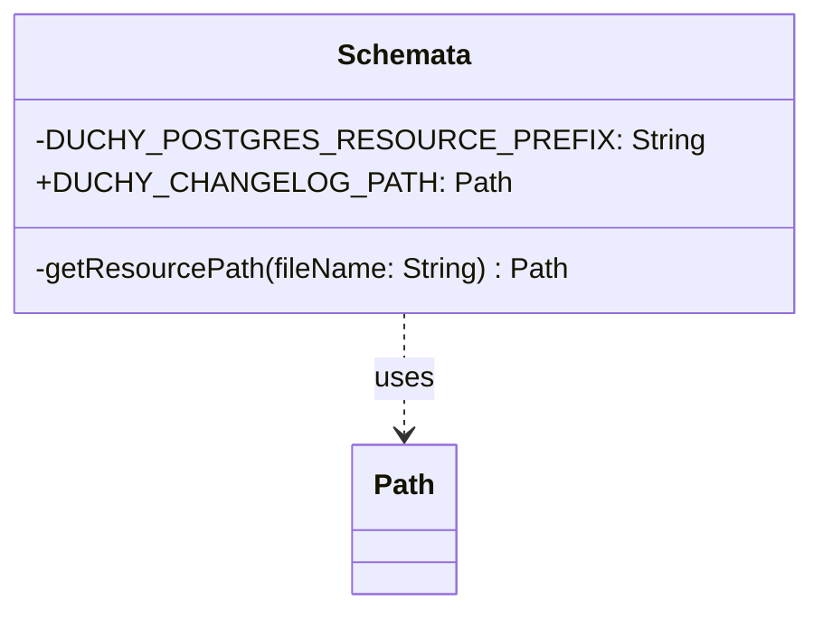

# org.wfanet.measurement.duchy.deploy.common.postgres.testing

## Overview
This package provides testing utilities for Duchy PostgreSQL database deployments. It facilitates access to database schema changelog resources required for test database initialization and migration operations. The package serves as a centralized resource accessor for Duchy PostgreSQL testing infrastructure.

## Components

### Schemata
Singleton object that provides access to Duchy PostgreSQL database schema resources.

| Method | Parameters | Returns | Description |
|--------|------------|---------|-------------|
| getResourcePath | `fileName: String` | `Path` | Resolves resource file path from JAR classpath |

| Property | Type | Description |
|----------|------|-------------|
| DUCHY_CHANGELOG_PATH | `Path` | Path to the Duchy database changelog YAML file |

## Implementation Details

### Resource Resolution
The `Schemata` object uses a classloader-based mechanism to locate database schema resources packaged within the JAR. Resources are expected to be located under the `duchy/postgres` directory prefix.

### Constants
- `DUCHY_POSTGRES_RESOURCE_PREFIX`: `"duchy/postgres"` - Base path for all Duchy PostgreSQL resources

## Dependencies
- `java.nio.file.Path` - File path representation
- `org.wfanet.measurement.common.getJarResourcePath` - Extension function for classloader resource resolution

## Usage Example
```kotlin
import org.wfanet.measurement.duchy.deploy.common.postgres.testing.Schemata

// Access the Duchy database changelog path
val changelogPath = Schemata.DUCHY_CHANGELOG_PATH

// Use the path for database migration tools (e.g., Liquibase)
val liquibase = Liquibase(changelogPath.toString(), ...)
```

## Class Diagram

