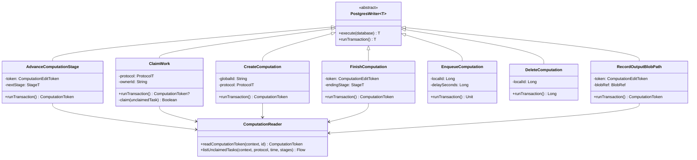

# org.wfanet.measurement.duchy.deploy.common.postgres.writers

## Overview
PostgreSQL database writers for managing duchy computation lifecycle in the Cross-Media Measurement system. Provides transactional write operations for computation state management, stage progression, work claiming, blob reference tracking, requisition handling, and data persistence using R2DBC reactive database access patterns.

## Components

### AdvanceComputationStage
Advances a computation from current stage to next stage with validation and blob management.

| Method | Parameters | Returns | Description |
|--------|------------|---------|-------------|
| runTransaction | - | `ComputationToken` | Validates transition, verifies outputs written, updates stages and blob references |

**Constructor Parameters:**
- `token: ComputationEditToken<ProtocolT, StageT>` - Current computation edit token
- `nextStage: StageT` - Target stage enum
- `nextStageDetails: StageDT` - Stage details protobuf message
- `inputBlobPaths: List<String>` - Input blob storage paths
- `passThroughBlobPaths: List<String>` - Pass-through blob paths
- `outputBlobs: Int` - Number of output blob references to create
- `afterTransition: AfterTransition` - Post-transition behavior (queue/lock/release)
- `lockExtension: Duration` - Lock extension duration
- `clock: Clock` - Time source
- `protocolStagesEnumHelper: ComputationProtocolStagesEnumHelper<ProtocolT, StageT>` - Stage enum helper
- `computationReader: ComputationReader` - Computation reader instance

### ClaimWork
Claims unclaimed computation work for a worker with lock acquisition.

| Method | Parameters | Returns | Description |
|--------|------------|---------|-------------|
| runTransaction | - | `ComputationToken?` | Claims first available prioritized task or null if none |
| claim | `unclaimedTask: UnclaimedTaskQueryResult` | `Boolean` | Attempts lock acquisition for specific computation |

**Constructor Parameters:**
- `protocol: ProtocolT` - Protocol type filter
- `prioritizedStages: List<ComputationStage>` - Stages in priority order
- `ownerId: String` - Worker identifier
- `lockDuration: Duration` - Lock hold duration
- `clock: Clock` - Time source
- `computationTypeEnumHelper: ComputationTypeEnumHelper<ProtocolT>` - Type enum helper
- `protocolStagesEnumHelper: ComputationProtocolStagesEnumHelper<ProtocolT, StageT>` - Stage enum helper
- `computationReader: ComputationReader` - Computation reader instance

**Exceptions:**
- `ComputationNotFoundException` - Computation not found
- `IllegalStateException` - Computation details missing

### CreateComputation
Inserts new computation with initial stage, details, and requisitions.

| Method | Parameters | Returns | Description |
|--------|------------|---------|-------------|
| runTransaction | - | `ComputationToken` | Creates computation with initial stage and requisitions |

**Constructor Parameters:**
- `globalId: String` - Global computation identifier
- `protocol: ProtocolT` - Protocol type
- `initialStage: StageT` - Initial stage enum
- `stageDetails: StageDT` - Initial stage details
- `computationDetails: ComputationDT` - Computation details protobuf
- `requisitions: List<RequisitionEntry>` - Requisition list
- `clock: Clock` - Time source
- `computationTypeEnumHelper: ComputationTypeEnumHelper<ProtocolT>` - Type enum helper
- `computationProtocolStagesEnumHelper: ComputationProtocolStagesEnumHelper<ProtocolT, StageT>` - Stage enum helper
- `computationProtocolStageDetailsHelper: ComputationProtocolStageDetailsHelper<ProtocolT, StageT, StageDT, ComputationDT>` - Details helper
- `computationReader: ComputationReader` - Computation reader instance

**Exceptions:**
- `ComputationInitialStageInvalidException` - Invalid initial stage
- `ComputationAlreadyExistsException` - Duplicate global ID

### DeleteComputation
Deletes computation by local identifier.

| Method | Parameters | Returns | Description |
|--------|------------|---------|-------------|
| runTransaction | - | `Long` | Deletes computation, returns rows deleted |

**Constructor Parameters:**
- `localId: Long` - Local computation identifier

### EnqueueComputation
Enqueues computation for worker claiming with optional delay.

| Method | Parameters | Returns | Description |
|--------|------------|---------|-------------|
| runTransaction | - | `Unit` | Releases lock with null owner to enable claiming |

**Constructor Parameters:**
- `localId: Long` - Local computation identifier
- `editVersion: Long` - Expected version for optimistic locking
- `delaySeconds: Long` - Delay before availability in queue
- `clock: Clock` - Time source

### FinishComputation
Terminates computation with ending reason and stage updates.

| Method | Parameters | Returns | Description |
|--------|------------|---------|-------------|
| runTransaction | - | `ComputationToken` | Marks computation complete with terminal stage |

**Constructor Parameters:**
- `token: ComputationEditToken<ProtocolT, StageT>` - Current computation token
- `endingStage: StageT` - Terminal stage enum
- `endComputationReason: EndComputationReason` - Reason (SUCCEEDED/FAILED/CANCELED)
- `computationDetails: ComputationDT` - Final computation details
- `clock: Clock` - Time source
- `protocolStagesEnumHelper: ComputationProtocolStagesEnumHelper<ProtocolT, StageT>` - Stage enum helper
- `protocolStageDetailsHelper: ComputationProtocolStageDetailsHelper<ProtocolT, StageT, StageDT, ComputationDT>` - Details helper
- `computationReader: ComputationReader` - Computation reader instance

### InsertComputationStat
Inserts performance metric for computation stage attempt.

| Method | Parameters | Returns | Description |
|--------|------------|---------|-------------|
| runTransaction | - | `Unit` | Writes metric to ComputationStats table |

**Constructor Parameters:**
- `computationId: Long` - Local computation identifier
- `computationStage: ComputationStage` - Stage enum
- `attempt: Int` - Attempt number
- `metricName: String` - Metric identifier
- `metricValue: Long` - Metric value

### PurgeComputations
Deletes computations in specified stages updated before timestamp.

| Method | Parameters | Returns | Description |
|--------|------------|---------|-------------|
| runTransaction | - | `PurgeResult` | Deletes old computations or returns samples if dry-run |

**Constructor Parameters:**
- `stages: List<ComputationStage>` - Target stages for purge
- `updatedBefore: Instant` - Cutoff timestamp
- `force: Boolean` - Execute deletion (true) or dry-run (false)
- `computationReader: ComputationReader` - Computation reader instance

### RecordOutputBlobPath
Records storage path for computation output blob.

| Method | Parameters | Returns | Description |
|--------|------------|---------|-------------|
| runTransaction | - | `ComputationToken` | Updates blob reference with storage path |

**Constructor Parameters:**
- `token: ComputationEditToken<ProtocolT, StageT>` - Current computation token
- `blobRef: BlobRef` - Blob reference with path
- `clock: Clock` - Time source
- `protocolStagesEnumHelper: ComputationProtocolStagesEnumHelper<ProtocolT, StageT>` - Stage enum helper
- `computationReader: ComputationReader` - Computation reader instance

### RecordRequisitionData
Updates requisition with blob path and protocol details.

| Method | Parameters | Returns | Description |
|--------|------------|---------|-------------|
| runTransaction | - | `ComputationToken` | Records requisition data path and metadata |

**Constructor Parameters:**
- `localId: Long` - Local computation identifier
- `externalRequisitionKey: ExternalRequisitionKey` - Requisition key
- `pathToBlob: String` - Blob storage path
- `publicApiVersion: String` - API version string
- `protocolDetails: RequisitionDetails.RequisitionProtocol?` - Optional protocol details
- `clock: Clock` - Time source
- `computationReader: ComputationReader` - Computation reader instance

### SetContinuationToken
Manages continuation token for streaming active computations.

| Method | Parameters | Returns | Description |
|--------|------------|---------|-------------|
| runTransaction | - | `Unit` | Upserts continuation token with timestamp validation |
| decodeContinuationToken | `token: String` | `StreamActiveComputationsContinuationToken` | Decodes base64url token |

**Constructor Parameters:**
- `continuationToken: String` - Base64url-encoded token

**Exceptions:**
- `ContinuationTokenMalformedException` - Invalid token format
- `ContinuationTokenInvalidException` - Token timestamp regression

### UpdateComputationDetails
Updates computation and requisition details.

| Method | Parameters | Returns | Description |
|--------|------------|---------|-------------|
| runTransaction | - | `ComputationToken` | Updates computation details and requisitions |

**Constructor Parameters:**
- `token: ComputationEditToken<ProtocolT, StageT>` - Current computation token
- `computationDetails: ComputationDT` - Updated computation details
- `requisitionEntries: List<RequisitionEntry>` - Updated requisitions
- `clock: Clock` - Time source
- `computationReader: ComputationReader` - Computation reader instance

## Extension Functions

### ComputationMutations.kt

| Function | Parameters | Returns | Description |
|----------|------------|---------|-------------|
| insertComputation | `localId: Long, creationTime: Instant?, updateTime: Instant, globalId: String, protocol: Long?, stage: Long?, lockOwner: String?, lockExpirationTime: Instant?, details: Message?` | `Unit` | Inserts new computation row |
| updateComputation | `localId: Long, updateTime: Instant, stage: Long?, creationTime: Instant?, globalComputationId: String?, protocol: Long?, lockOwner: String?, lockExpirationTime: Instant?, details: Message?` | `Unit` | Updates computation with COALESCE pattern |
| extendComputationLock | `localComputationId: Long, updateTime: Instant, lockExpirationTime: Instant` | `Unit` | Extends lock expiration without changing owner |
| releaseComputationLock | `localComputationId: Long, updateTime: Instant` | `Unit` | Clears lock owner and expiration |
| acquireComputationLock | `localId: Long, updateTime: Instant, ownerId: String?, lockExpirationTime: Instant` | `Unit` | Sets lock owner and expiration |
| checkComputationUnmodified | `localId: Long, editVersion: Long` | `Unit` | Validates optimistic lock version (etag pattern) |
| deleteComputationByLocalId | `localId: Long` | `Long` | Deletes by local ID, returns row count |
| deleteComputationByGlobalId | `globalId: String` | `Long` | Deletes by global ID, returns row count |

**Exceptions:**
- `ComputationAlreadyExistsException` - Duplicate key on insert
- `ComputationNotFoundException` - Computation not found on version check
- `ComputationTokenVersionMismatchException` - Edit version mismatch

### ComputationStageMutations.kt

| Function | Parameters | Returns | Description |
|----------|------------|---------|-------------|
| insertComputationStage | `localId: Long, stage: Long, nextAttempt: Long?, creationTime: Instant?, endTime: Instant?, previousStage: Long?, followingStage: Long?, details: Message?` | `Unit` | Inserts new computation stage row |
| updateComputationStage | `localId: Long, stage: Long, nextAttempt: Long?, creationTime: Instant?, endTime: Instant?, previousStage: Long?, followingStage: Long?, details: Message?` | `Unit` | Updates stage with COALESCE pattern |

### ComputationStageAttemptMutations.kt

| Function | Parameters | Returns | Description |
|----------|------------|---------|-------------|
| insertComputationStageAttempt | `localComputationId: Long, stage: Long, attempt: Long, beginTime: Instant, endTime: Instant?, details: ComputationStageAttemptDetails` | `Unit` | Inserts stage attempt record |
| updateComputationStageAttempt | `localId: Long, stage: Long, attempt: Long, beginTime: Instant?, endTime: Instant?, details: Message?` | `Unit` | Updates attempt with COALESCE pattern |

### ComputationBlobReferenceMutations.kt

| Function | Parameters | Returns | Description |
|----------|------------|---------|-------------|
| insertComputationBlobReference | `localId: Long, stage: Long, blobId: Long, pathToBlob: String?, dependencyType: ComputationBlobDependency` | `ComputationStageAttemptDetails?` | Inserts blob reference row |
| updateComputationBlobReference | `localId: Long, stage: Long, blobId: Long, pathToBlob: String?, dependencyType: ComputationBlobDependency?` | `Unit` | Updates blob reference with COALESCE pattern |

### RequisitionMutations.kt

| Function | Parameters | Returns | Description |
|----------|------------|---------|-------------|
| insertRequisition | `localComputationId: Long, requisitionId: Long, externalRequisitionId: String, requisitionFingerprint: ByteString, creationTime: Instant, updateTime: Instant, pathToBlob: String?, requisitionDetails: RequisitionDetails` | `Unit` | Inserts requisition row |
| updateRequisition | `localComputationId: Long, requisitionId: Long, externalRequisitionId: String, requisitionFingerprint: ByteString, updateTime: Instant, pathToBlob: String?, requisitionDetails: RequisitionDetails?` | `Unit` | Updates requisition with COALESCE pattern |

### EnqueueComputation.kt

| Function | Parameters | Returns | Description |
|----------|------------|---------|-------------|
| enqueueComputation | `localId: Long, writeTime: Instant, delaySeconds: Long` | `Unit` | Enqueues computation by setting null owner with delayed expiration |

## Data Structures

### PurgeResult
| Property | Type | Description |
|----------|------|-------------|
| purgeCount | `Int` | Number of computations purged or eligible for purge |
| purgeSamples | `Set<String>` | Sample global IDs (populated in dry-run mode) |

## Dependencies
- `org.wfanet.measurement.common.db.r2dbc.postgres` - PostgreSQL R2DBC reactive database access
- `org.wfanet.measurement.duchy.db.computation` - Computation domain models and helpers
- `org.wfanet.measurement.duchy.deploy.common.postgres.readers` - Database reader components
- `org.wfanet.measurement.duchy.service.internal` - Internal service exceptions
- `org.wfanet.measurement.internal.duchy` - Internal duchy protobuf messages
- `org.wfanet.measurement.system.v1alpha` - System API protobuf messages
- `com.google.protobuf` - Protocol buffer message framework
- `java.time` - Temporal types for timestamps and durations
- `kotlinx.coroutines.flow` - Reactive flow primitives

## Usage Example
```kotlin
// Create a new computation
val createWriter = CreateComputation(
  globalId = "global-comp-123",
  protocol = Protocol.LIQUID_LEGIONS_V2,
  initialStage = Stage.INITIALIZATION_PHASE,
  stageDetails = stageDetails,
  computationDetails = computationDetails,
  requisitions = listOf(requisitionEntry1, requisitionEntry2),
  clock = Clock.systemUTC(),
  computationTypeEnumHelper = typeHelper,
  computationProtocolStagesEnumHelper = stageHelper,
  computationProtocolStageDetailsHelper = detailsHelper,
  computationReader = reader
)
val token = createWriter.execute(database)

// Claim work for processing
val claimWriter = ClaimWork(
  protocol = Protocol.LIQUID_LEGIONS_V2,
  prioritizedStages = listOf(ComputationStage.SETUP_PHASE, ComputationStage.EXECUTION_PHASE),
  ownerId = "worker-1",
  lockDuration = Duration.ofMinutes(10),
  clock = Clock.systemUTC(),
  computationTypeEnumHelper = typeHelper,
  protocolStagesEnumHelper = stageHelper,
  computationReader = reader
)
val claimedToken = claimWriter.execute(database)

// Advance to next stage
val advanceWriter = AdvanceComputationStage(
  token = editToken,
  nextStage = Stage.EXECUTION_PHASE,
  nextStageDetails = nextDetails,
  inputBlobPaths = listOf("gs://bucket/input1", "gs://bucket/input2"),
  passThroughBlobPaths = listOf("gs://bucket/passthrough"),
  outputBlobs = 2,
  afterTransition = AfterTransition.CONTINUE_WORKING,
  lockExtension = Duration.ofMinutes(10),
  clock = Clock.systemUTC(),
  protocolStagesEnumHelper = stageHelper,
  computationReader = reader
)
val updatedToken = advanceWriter.execute(database)

// Record output blob
val recordWriter = RecordOutputBlobPath(
  token = editToken,
  blobRef = BlobRef(0, "gs://bucket/output1"),
  clock = Clock.systemUTC(),
  protocolStagesEnumHelper = stageHelper,
  computationReader = reader
)
val blobRecordedToken = recordWriter.execute(database)

// Finish computation
val finishWriter = FinishComputation(
  token = editToken,
  endingStage = Stage.COMPLETE,
  endComputationReason = EndComputationReason.SUCCEEDED,
  computationDetails = finalDetails,
  clock = Clock.systemUTC(),
  protocolStagesEnumHelper = stageHelper,
  protocolStageDetailsHelper = detailsHelper,
  computationReader = reader
)
val finalToken = finishWriter.execute(database)
```

## Class Diagram

