# org.wfanet.measurement.duchy.deploy.common.server

## Overview

This package provides server deployment infrastructure for duchy-level gRPC services in the Cross-Media Measurement system. It contains abstract base server classes and concrete implementations for computation control, data management, and requisition fulfillment, with support for various storage backends including forwarded storage and PostgreSQL.

## Components

### AsyncComputationControlServer

Standalone server daemon that hosts the AsyncComputationControl service for managing asynchronous computation operations.

| Component | Type | Description |
|-----------|------|-------------|
| `AsyncComputationControlServiceFlags` | Flags Class | Command-line configuration for server, service, duchy info, and max advance attempts |
| `run()` | Function | Initializes duchy info, builds mTLS channel, and starts server with AsyncComputationControlService |
| `main()` | Entry Point | Command-line entry point using picocli |

**Configuration Parameters:**
- `maxAdvanceAttempts`: Maximum retry attempts for Advance operation (default: `Int.MAX_VALUE`)
- Integrates with `ComputationsCoroutineStub` for internal duchy computations API

---

### ComputationControlServer

Abstract base server for hosting the system-level ComputationControl service, coordinating between async control and computations services.

| Method | Parameters | Returns | Description |
|--------|------------|---------|-------------|
| `run()` | `storageClient: StorageClient` | `Unit` | Initializes duchy, creates gRPC channels, starts ComputationControlService |

**Key Features:**
- Builds two mTLS channels: one for `AsyncComputationControlCoroutineStub`, one for `ComputationsCoroutineStub`
- Applies duchy identity interceptor via `withDuchyIdentities()`
- Uses `ServiceDispatcher` from executor configuration

**Nested Types:**
- `Flags`: Aggregates server, service, duchy, async control, and computations service flags

---

### ComputationsServer

Abstract gRPC server for the internal Computations service, managing computation state, storage, and logging.

| Method | Parameters | Returns | Description |
|--------|------------|---------|-------------|
| `run()` | `computationsDatabaseReader: ComputationsDatabaseReader, computationDb: ComputationsDb, continuationTokensService: ContinuationTokensCoroutineImplBase, storageClient: StorageClient` | `Unit` | Starts ComputationsService and ComputationStatsService |
| `newComputationsDatabase()` | `computationsDatabaseReader, computationDb` | `ComputationsDatabase` | Combines reader, transactor, and enum helper into unified database interface |

**Abstract Properties:**
- `protocolStageEnumHelper`: Enum helper for computation type/stage mapping
- `computationProtocolStageDetails`: Helper for stage-specific computation details

**Configuration:**
- Supports custom gRPC service config via JSON or protobuf textproto
- Default timeout for `CreateComputationLogEntry`: 5 seconds
- Configurable channel shutdown timeout (default: 3s)

**Services Hosted:**
- `ComputationsService`: Core computation management
- `ComputationStatsService`: Computation statistics queries
- `ContinuationTokensCoroutineImplBase`: Token management for pagination

---

### DuchyDataServer

Abstract base server for hosting duchy data services with integrated computation log entries client.

| Property | Type | Description |
|----------|------|-------------|
| `computationLogEntriesClient` | `ComputationLogEntriesCoroutineStub` | Lazy-initialized client for system API log entries |
| `defaultServiceConfig` | `ServiceConfig` | gRPC service config loaded from file or default |

| Method | Parameters | Returns | Description |
|--------|------------|---------|-------------|
| `run()` | `services: DuchyDataServices` | `suspend Unit` | Starts server with provided duchy data services |

**Configuration:**
- `channelShutdownTimeout`: Graceful shutdown duration for gRPC channels (default: 3s)
- Supports JSON or protobuf ServiceConfig files

---

### ForwardedStorageComputationControlServer

Concrete implementation of `ComputationControlServer` using forwarded storage backend.

| Method | Parameters | Returns | Description |
|--------|------------|---------|-------------|
| `run()` | - | `Unit` | Delegates to base class with ForwardedStorageFromFlags client |

**Usage:**
Suitable for development/testing environments where storage is proxied through a forwarding service rather than direct cloud storage.

---

### ForwardedStoragePostgresDuchyDataServer

Concrete implementation of `DuchyDataServer` combining PostgreSQL database with forwarded storage.

| Method | Parameters | Returns | Description |
|--------|------------|---------|-------------|
| `run()` | - | `Unit` | Creates Postgres client, initializes PostgresDuchyDataServices, starts server |

**Key Dependencies:**
- `PostgresDatabaseClient`: R2DBC-based Postgres database client
- `RandomIdGenerator`: Clock-based ID generation
- `ForwardedStorageFromFlags`: Storage client configuration

**Configuration Flags:**
- `serviceFlags`: Executor configuration
- `postgresFlags`: Database connection parameters
- `forwardedStorageFlags`: Storage service configuration

---

### ForwardedStorageRequisitionFulfillmentServer

Concrete implementation of `RequisitionFulfillmentServer` using forwarded storage backend.

| Method | Parameters | Returns | Description |
|--------|------------|---------|-------------|
| `run()` | - | `Unit` | Delegates to base class with ForwardedStorageFromFlags client |

**Purpose:**
Enables requisition fulfillment operations in development/test environments with forwarded storage.

---

### RequisitionFulfillmentServer

Abstract base server for the v2alpha RequisitionFulfillment public API service, handling data provider requisition responses.

| Method | Parameters | Returns | Description |
|--------|------------|---------|-------------|
| `run()` | `storageClient: StorageClient` | `Unit` | Initializes clients, configures auth interceptors, starts service |

**Authentication & Authorization:**
- `AuthorityKeyServerInterceptor`: Extracts authority key identifiers from mTLS certificates
- `AkidPrincipalServerInterceptor`: Maps AKIDs to principals using configured mapping file
- Supports `DataProviderPrincipal` authentication

**Metrics:**
- `ApiChangeMetricsInterceptor`: Tracks API usage by data provider

**gRPC Clients:**
- `ComputationsCoroutineStub`: Internal duchy computations service
- `SystemRequisitionsCoroutineStub`: System-level requisitions API (with duchy ID context)

**Configuration:**
- `authorityKeyIdentifierToPrincipalMap`: File mapping certificate AKIDs to principals (required)

**Nested Types:**
- `Flags`: Aggregates duchy, service, server, system API, computations service, and AKID mapping flags

---

## Data Structures

### Type Aliases

| Alias | Definition | Purpose |
|-------|------------|---------|
| `ComputationsDb` | `ComputationsDatabaseTransactor<ComputationType, ComputationStage, ComputationStageDetails, ComputationDetails>` | Simplifies generic database transactor type |

### Flag Classes

#### AsyncComputationControlServiceFlags
| Property | Type | Description |
|----------|------|-------------|
| `server` | `CommonServer.Flags` | Server configuration (TLS, port, etc.) |
| `service` | `ServiceFlags` | Service executor configuration |
| `duchy` | `CommonDuchyFlags` | Duchy name and identity |
| `duchyInfo` | `DuchyInfoFlags` | Duchy information configuration |
| `computationsServiceFlags` | `ComputationsServiceFlags` | Target and deadline for computations service |
| `maxAdvanceAttempts` | `Int` | Maximum attempts for Advance operation |

#### ComputationControlServer.Flags
| Property | Type | Description |
|----------|------|-------------|
| `server` | `CommonServer.Flags` | Server configuration |
| `service` | `ServiceFlags` | Executor configuration |
| `duchy` | `CommonDuchyFlags` | Duchy configuration |
| `asyncComputationControlServiceFlags` | `AsyncComputationControlServiceFlags` | Async control service target |
| `computationsServiceFlags` | `ComputationsServiceFlags` | Computations service target |

#### ComputationsServer.Flags
| Property | Type | Description |
|----------|------|-------------|
| `server` | `CommonServer.Flags` | Server configuration |
| `duchy` | `CommonDuchyFlags` | Duchy name |
| `service` | `ServiceFlags` | Executor settings |
| `defaultServiceConfig` | `ServiceConfig` | gRPC service configuration (lazy) |
| `channelShutdownTimeout` | `Duration` | Channel shutdown grace period |
| `systemApiFlags` | `SystemApiFlags` | System API target and cert host |

#### RequisitionFulfillmentServer.Flags
| Property | Type | Description |
|----------|------|-------------|
| `duchy` | `CommonDuchyFlags` | Duchy identifier |
| `service` | `ServiceFlags` | Executor configuration |
| `server` | `CommonServer.Flags` | Server settings |
| `systemApiFlags` | `SystemApiFlags` | System API connection |
| `computationsServiceFlags` | `ComputationsServiceFlags` | Computations service connection |
| `authorityKeyIdentifierToPrincipalMap` | `File` | AKID-to-principal mapping proto (textproto) |

---

## Dependencies

### Internal Dependencies
- `org.wfanet.measurement.common.grpc` - gRPC server infrastructure, mTLS channel builders
- `org.wfanet.measurement.common.crypto` - SigningCerts for certificate management
- `org.wfanet.measurement.common.identity` - Duchy identity and principal management
- `org.wfanet.measurement.duchy.service.internal` - Internal gRPC service implementations (computations, control)
- `org.wfanet.measurement.duchy.service.system.v1alpha` - System API service implementations
- `org.wfanet.measurement.duchy.service.api.v2alpha` - Public API service implementations
- `org.wfanet.measurement.duchy.db.computation` - Database abstraction for computation storage
- `org.wfanet.measurement.duchy.storage` - Blob storage for computations and requisitions
- `org.wfanet.measurement.duchy.deploy.common` - Shared deployment flags and configuration
- `org.wfanet.measurement.storage` - Storage client abstractions
- `org.wfanet.measurement.storage.forwarded` - Forwarded storage implementation

### External Dependencies
- `io.grpc` - gRPC framework for service hosting and client channels
- `kotlinx.coroutines` - Coroutine support for asynchronous operations
- `picocli` - Command-line parsing and configuration
- `com.google.protobuf` - Protocol buffer support for configuration

### System API Clients
- `org.wfanet.measurement.system.v1alpha.ComputationLogEntriesGrpcKt.ComputationLogEntriesCoroutineStub`
- `org.wfanet.measurement.system.v1alpha.RequisitionsGrpcKt.RequisitionsCoroutineStub`

### Internal API Clients
- `org.wfanet.measurement.internal.duchy.ComputationsGrpcKt.ComputationsCoroutineStub`
- `org.wfanet.measurement.internal.duchy.AsyncComputationControlGrpcKt.AsyncComputationControlCoroutineStub`

---

## Usage Examples

### Running AsyncComputationControlServer
```kotlin
// Command-line invocation
fun main(args: Array<String>) = commandLineMain(::run, args)

// Example command:
// AsyncComputationControlServer \
//   --tls-cert-file=/path/to/cert.pem \
//   --tls-key-file=/path/to/key.pem \
//   --cert-collection-file=/path/to/ca.pem \
//   --duchy-name=worker1 \
//   --computations-service-target=localhost:8080 \
//   --max-advance-attempts=10
```

### Implementing a Custom ComputationsServer
```kotlin
@CommandLine.Command(name = "MyComputationsServer")
class MyComputationsServer : ComputationsServer() {
  @CommandLine.Mixin
  private lateinit var dbFlags: MyDatabaseFlags

  override val protocolStageEnumHelper = MyProtocolStageEnumHelper()
  override val computationProtocolStageDetails = MyStageDetailsHelper()

  override fun run() {
    val reader = createDatabaseReader(dbFlags)
    val transactor = createDatabaseTransactor(dbFlags)
    val tokenService = MyContinuationTokensService()
    val storage = createStorageClient(flags.server.tlsFlags)

    run(reader, transactor, tokenService, storage)
  }
}
```

### Deploying ForwardedStorageRequisitionFulfillmentServer
```kotlin
// Launches server with forwarded storage backend
fun main(args: Array<String>) =
  commandLineMain(ForwardedStorageRequisitionFulfillmentServer(), args)

// Example command:
// ForwardedStorageRequisitionFulfillmentServer \
//   --duchy-name=aggregator \
//   --forwarded-storage-service-target=localhost:9000 \
//   --system-api-target=kingdom.example.com:443 \
//   --computations-service-target=localhost:8081 \
//   --authority-key-identifier-to-principal-map-file=akid_map.textproto
```

### Configuring gRPC ServiceConfig
```kotlin
// Default config (embedded in code)
val defaultConfig = ProtobufServiceConfig(
  ProtobufServiceConfig.DEFAULT.message.copy {
    methodConfig += methodConfig {
      name += MethodConfigKt.name {
        service = ComputationLogEntriesGrpc.SERVICE_NAME
        method = "CreateComputationLogEntry"
      }
      timeout = duration { seconds = 5 }
    }
  }
)

// Custom config from file
// --default-service-config=/path/to/service-config.json
// or
// --default-service-config=/path/to/service-config.textproto
```

---

## Architecture Patterns

### Template Method Pattern
All abstract servers (`ComputationControlServer`, `ComputationsServer`, `DuchyDataServer`, `RequisitionFulfillmentServer`) use the template method pattern:
- Abstract base class defines the server lifecycle (`run()` method)
- Concrete implementations provide storage/database clients
- Shared infrastructure (channels, certs, interceptors) handled in base class

### Dependency Injection via Constructor
Services are composed by passing dependencies to the `run()` method rather than constructing them internally, enabling:
- Flexible storage backend swapping
- Easier testing with mock implementations
- Clear separation of concerns

### Lazy Initialization
Several components use Kotlin's `lazy` delegation:
- `computationLogEntriesClient` in `DuchyDataServer`
- `defaultServiceConfig` in `ComputationsServer.Flags` and `DuchyDataServer`

This defers expensive initialization (mTLS channel creation, config parsing) until first use.

---

## Class Diagram

```mermaid
classDiagram
    class ComputationControlServer {
        <<abstract>>
        #Flags flags
        #run(StorageClient)
    }

    class ComputationsServer {
        <<abstract>>
        #Flags flags
        #run(ComputationsDatabaseReader, ComputationsDb, ContinuationTokensCoroutineImplBase, StorageClient)
        +protocolStageEnumHelper*
        +computationProtocolStageDetails*
    }

    class DuchyDataServer {
        <<abstract>>
        +serverFlags: CommonServer.Flags
        +duchyFlags: CommonDuchyFlags
        +computationLogEntriesClient: ComputationLogEntriesCoroutineStub
        #run(DuchyDataServices) suspend
    }

    class RequisitionFulfillmentServer {
        <<abstract>>
        #Flags flags
        #run(StorageClient)
    }

    class ForwardedStorageComputationControlServer {
        -forwardedStorageFlags: ForwardedStorageFromFlags.Flags
        +run()
    }

    class ForwardedStoragePostgresDuchyDataServer {
        -serviceFlags: ServiceFlags
        -postgresFlags: PostgresFlags
        -forwardedStorageFlags: ForwardedStorageFromFlags.Flags
        +run()
    }

    class ForwardedStorageRequisitionFulfillmentServer {
        -forwardedStorageFlags: ForwardedStorageFromFlags.Flags
        +run()
    }

    class AsyncComputationControlServer {
        <<standalone>>
    }

    ComputationControlServer <|-- ForwardedStorageComputationControlServer
    DuchyDataServer <|-- ForwardedStoragePostgresDuchyDataServer
    RequisitionFulfillmentServer <|-- ForwardedStorageRequisitionFulfillmentServer

    ComputationControlServer ..> ComputationControlService : hosts
    ComputationsServer ..> ComputationsService : hosts
    ComputationsServer ..> ComputationStatsService : hosts
    RequisitionFulfillmentServer ..> RequisitionFulfillmentService : hosts
    AsyncComputationControlServer ..> AsyncComputationControlService : hosts

    ForwardedStorageComputationControlServer ..> ForwardedStorageFromFlags : uses
    ForwardedStoragePostgresDuchyDataServer ..> ForwardedStorageFromFlags : uses
    ForwardedStoragePostgresDuchyDataServer ..> PostgresDatabaseClient : uses
    ForwardedStorageRequisitionFulfillmentServer ..> ForwardedStorageFromFlags : uses
```


