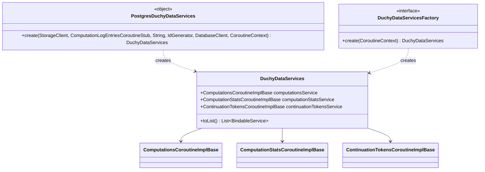

# org.wfanet.measurement.duchy.deploy.common.service

## Overview
This package provides service composition and factory abstractions for duchy data layer services. It defines a container for the three core duchy internal gRPC services (computations, computation stats, and continuation tokens) along with factory patterns for creating these services with different backend implementations, specifically PostgreSQL.

## Components

### DuchyDataServices
Data class that aggregates the three core duchy internal gRPC service implementations.

| Property | Type | Description |
|----------|------|-------------|
| computationsService | `ComputationsCoroutineImplBase` | Service for managing computation lifecycle and state |
| computationStatsService | `ComputationStatsCoroutineImplBase` | Service for tracking computation statistics |
| continuationTokensService | `ContinuationTokensCoroutineImplBase` | Service for managing pagination tokens |

### DuchyDataServicesFactory
Interface defining the factory contract for creating duchy data services.

| Method | Parameters | Returns | Description |
|--------|------------|---------|-------------|
| create | `coroutineContext: CoroutineContext` | `DuchyDataServices` | Creates a new instance of duchy data services |

### PostgresDuchyDataServices
Singleton object providing PostgreSQL-backed implementation of duchy data services.

| Method | Parameters | Returns | Description |
|--------|------------|---------|-------------|
| create | `storageClient: StorageClient`, `computationLogEntriesClient: ComputationLogEntriesCoroutineStub`, `duchyName: String`, `idGenerator: IdGenerator`, `client: DatabaseClient`, `coroutineContext: CoroutineContext` | `DuchyDataServices` | Creates PostgreSQL-backed duchy data services |

## Extension Functions

### toList
Converts a DuchyDataServices instance to a list of bindable gRPC services.

| Method | Parameters | Returns | Description |
|--------|------------|---------|-------------|
| toList | (receiver: `DuchyDataServices`) | `List<BindableService>` | Extracts all service implementations as bindable services |

## Data Structures

### DuchyDataServices
| Property | Type | Description |
|----------|------|-------------|
| computationsService | `ComputationsCoroutineImplBase` | Manages computation state transitions and queries |
| computationStatsService | `ComputationStatsCoroutineImplBase` | Provides computation metrics and statistics |
| continuationTokensService | `ContinuationTokensCoroutineImplBase` | Handles pagination token persistence |

## Dependencies
- `org.wfanet.measurement.internal.duchy` - Provides gRPC service base classes for duchy internal APIs
- `org.wfanet.measurement.duchy.deploy.common.postgres` - Contains PostgreSQL-specific service implementations
- `org.wfanet.measurement.duchy.db.computation` - Provides computation protocol type helpers and enum mappings
- `org.wfanet.measurement.duchy.storage` - Defines storage abstractions for computations and requisitions
- `org.wfanet.measurement.common.db.r2dbc` - Provides reactive database client for R2DBC
- `org.wfanet.measurement.common.identity` - Supplies ID generation utilities
- `org.wfanet.measurement.storage` - Core storage client abstraction
- `org.wfanet.measurement.system.v1alpha` - System API for computation log entries
- `io.grpc` - gRPC framework for service binding
- `kotlin.coroutines` - Coroutine context support
- `kotlin.reflect` - Reflection for property extraction
- `java.time` - Clock for timestamp generation

## Usage Example
```kotlin
// Create PostgreSQL-backed services
val services = PostgresDuchyDataServices.create(
  storageClient = storageClient,
  computationLogEntriesClient = logEntriesStub,
  duchyName = "worker1",
  idGenerator = idGenerator,
  client = databaseClient,
  coroutineContext = coroutineContext
)

// Convert to bindable services for gRPC server
val bindableServices: List<BindableService> = services.toList()

// Register with gRPC server
bindableServices.forEach { service ->
  grpcServer.addService(service)
}

// Access individual services
val computations = services.computationsService
val stats = services.computationStatsService
val tokens = services.continuationTokensService
```

## Class Diagram

