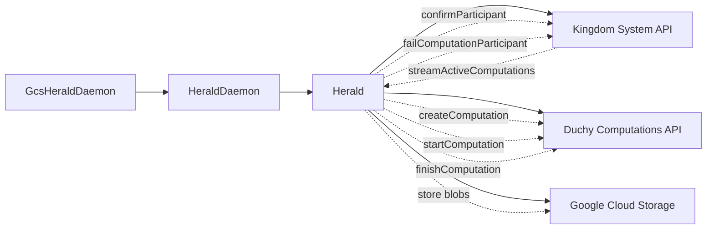
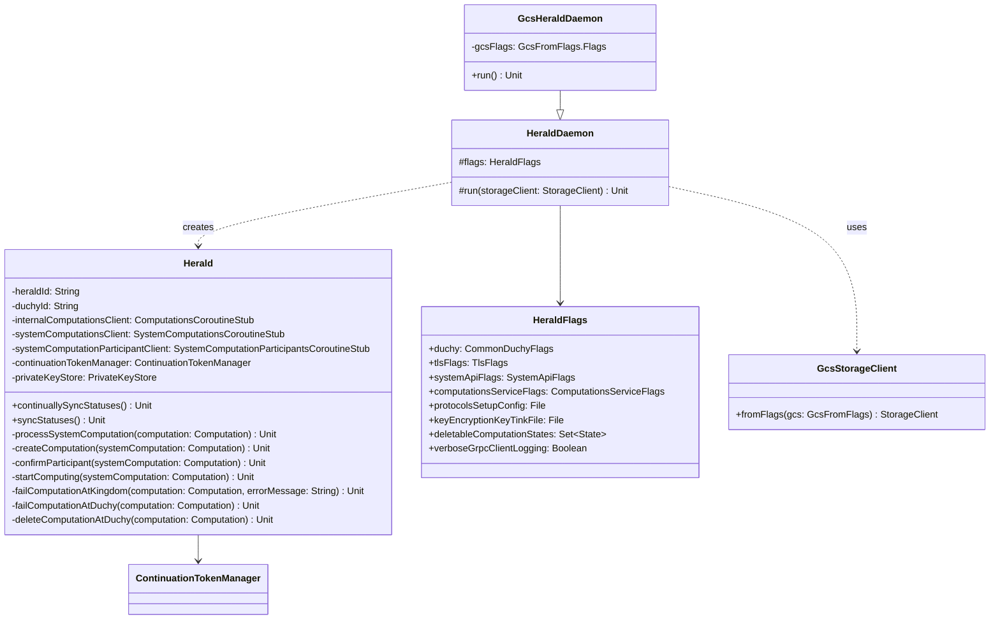

# org.wfanet.measurement.duchy.deploy.gcloud.daemon.herald

## Overview
This package provides a Google Cloud Storage (GCS) implementation of the Herald daemon for duchy deployments. The Herald daemon synchronizes computation states between the Kingdom's system API and the duchy's internal computation storage, managing the lifecycle of multi-party computation (MPC) protocols. This GCS-specific implementation configures the Herald to use Google Cloud Storage as the underlying blob storage backend.

## Components

### GcsHeraldDaemon
Command-line daemon that extends HeraldDaemon to configure GCS as the storage backend for Herald operations.

| Method | Parameters | Returns | Description |
|--------|------------|---------|-------------|
| run | - | `Unit` | Initializes GCS client from flags and delegates to parent run method |
| main | `args: Array<String>` | `Unit` | Entry point that launches the daemon with command-line arguments |

**Annotations:**
- `@CommandLine.Command` - Configures PicoCLI with name "GcsHeraldDaemon", enables help options and default value display

**Properties:**
| Property | Type | Description |
|----------|------|-------------|
| gcsFlags | `GcsFromFlags.Flags` | Mixin for GCS configuration flags (bucket, credentials, etc.) |

## Parent Class: HeraldDaemon

### HeraldDaemon (from org.wfanet.measurement.duchy.deploy.common.daemon.herald)
Abstract base class providing common Herald daemon functionality across different storage backends.

| Method | Parameters | Returns | Description |
|--------|------------|---------|-------------|
| run | `storageClient: StorageClient` | `Unit` | Configures and starts Herald with given storage client |

**Core Herald Responsibilities:**
- Creates and manages gRPC channels to Kingdom system API and internal duchy services
- Instantiates Herald with configured clients and storage
- Configures TLS mutual authentication using certificate files
- Sets up continuation token management for streaming computation updates
- Initializes private key store for cryptographic operations (if configured)
- Launches Herald's continuous status synchronization loop

### HeraldFlags (Configuration Structure)
| Flag | Type | Description |
|------|------|-------------|
| duchy | `CommonDuchyFlags` | Duchy identification (duchy name) |
| tlsFlags | `TlsFlags` | TLS certificates for mutual authentication |
| channelShutdownTimeout | `Duration` | gRPC channel shutdown timeout (default: 3s) |
| systemApiFlags | `SystemApiFlags` | Kingdom system API target and cert host |
| computationsServiceFlags | `ComputationsServiceFlags` | Internal computations service configuration |
| protocolsSetupConfig | `File` | ProtocolsSetupConfig proto in text format |
| keyEncryptionKeyTinkFile | `File?` | Key encryption key for private key store (optional) |
| deletableComputationStates | `Set<Computation.State>` | Terminal states allowing computation deletion |
| verboseGrpcClientLogging | `Boolean` | Enable full gRPC request/response logging (default: false) |

## Herald Core Functionality

### Herald (from org.wfanet.measurement.duchy.herald)
The Herald class performs the core computation lifecycle management. Key operations include:

| Operation | Trigger State | Description |
|-----------|---------------|-------------|
| createComputation | PENDING_REQUISITION_PARAMS | Creates new computation in duchy database for supported protocols |
| confirmParticipant | PENDING_PARTICIPANT_CONFIRMATION | Updates requisitions and key sets after duchy confirmation |
| startComputing | PENDING_COMPUTATION | Transitions computation from WAIT_TO_START to active processing |
| failComputationAtKingdom | Error conditions | Reports computation failure to Kingdom via failComputationParticipant |
| failComputationAtDuchy | FAILED/CANCELLED | Marks local computation as failed with terminal stage |
| deleteComputationAtDuchy | Configurable terminal states | Removes computation from duchy storage |

**Supported MPC Protocols:**
- Liquid Legions V2
- Reach-Only Liquid Legions V2
- Honest Majority Share Shuffle
- TrusTEE

**Streaming & Retry Logic:**
- Continuously streams active computations from Kingdom using continuation tokens
- Implements exponential backoff for transient gRPC errors (UNAVAILABLE, DEADLINE_EXCEEDED, ABORTED, RESOURCE_EXHAUSTED)
- Concurrent processing with configurable semaphore (default: 5 concurrent computations)
- Maximum 5 streaming attempts, 5 computation start attempts by default
- Persists continuation tokens to resume from last processed computation after restarts

## Dependencies

### Internal Duchy Services
- `org.wfanet.measurement.internal.duchy.ComputationsGrpcKt` - Local computation state management
- `org.wfanet.measurement.internal.duchy.ContinuationTokensGrpcKt` - Token persistence for streaming
- `org.wfanet.measurement.duchy.herald` - Herald core logic and protocol starters

### Kingdom System API
- `org.wfanet.measurement.system.v1alpha.ComputationsGrpcKt` - System-level computation state
- `org.wfanet.measurement.system.v1alpha.ComputationParticipantsGrpcKt` - Participant status updates

### Storage & Cryptography
- `org.wfanet.measurement.gcloud.gcs` - Google Cloud Storage client implementation
- `org.wfanet.measurement.storage.StorageClient` - Abstract storage interface
- `org.wfanet.measurement.duchy.storage.TinkKeyStore` - Private key storage using Tink
- `com.google.crypto.tink` - Cryptographic key management (Aead, KeysetHandle)

### gRPC & Configuration
- `org.wfanet.measurement.common.grpc` - TLS channel building, deadline management
- `org.wfanet.measurement.common.crypto` - Certificate handling (SigningCerts)
- `picocli.CommandLine` - Command-line argument parsing

### Kotlin Coroutines
- `kotlinx.coroutines` - Asynchronous processing, flow collection, structured concurrency

## Usage Example

```kotlin
// Command-line invocation with required flags
fun main(args: Array<String>) = commandLineMain(GcsHeraldDaemon(), args)

// Example arguments:
// --duchy-name=worker1
// --protocols-setup-config=/etc/duchy/protocols-setup.textproto
// --tls-cert-file=/etc/certs/duchy.pem
// --tls-key-file=/etc/certs/duchy.key
// --cert-collection-file=/etc/certs/ca.pem
// --system-api-target=kingdom.example.com:8443
// --system-api-cert-host=kingdom.example.com
// --computations-service-target=localhost:8080
// --computations-service-cert-host=localhost
// --gcs-bucket=duchy-computations
// --gcs-project=my-gcp-project
// --deletable-computation-state=SUCCEEDED
// --deletable-computation-state=FAILED
```

## Deployment Architecture



## Class Diagram



## Error Handling

### Transient Error Retry Logic
The Herald implements sophisticated retry mechanisms for transient failures:

- **Status Codes Retried**: ABORTED, DEADLINE_EXCEEDED, RESOURCE_EXHAUSTED, UNKNOWN, UNAVAILABLE
- **Exponential Backoff**: Configurable backoff strategy between retry attempts
- **Max Attempts**: 3 attempts for computation processing, 5 for streaming, 5 for computation starts
- **Non-Transient Failures**: Reports to Kingdom and marks local computation as failed

### Failure Reporting
When Herald exhausts retry attempts:
1. Calls `failComputationParticipant` at Kingdom with error message and timestamp
2. Calls `finishComputation` at duchy with FAILED reason and terminal stage
3. Logs detailed error information with computation global ID

## Continuation Token Management

Herald uses continuation tokens to ensure reliable streaming:
- Tokens contain `updateTimeSince` and `lastSeenExternalComputationId`
- Persisted to duchy database via `ContinuationTokensCoroutineStub`
- Enables resume from last processed computation after crashes or restarts
- Prevents duplicate processing of computations
- Supports concurrent processing with ordered token completion tracking
