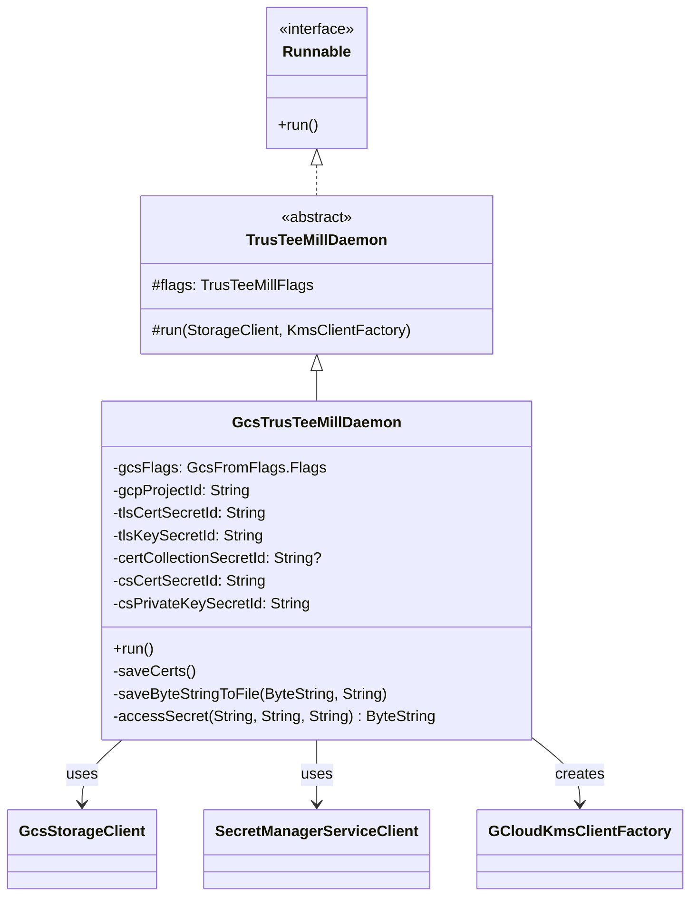

# org.wfanet.measurement.duchy.deploy.gcloud.daemon.mill.trustee

## Overview
This package provides the Google Cloud Platform deployment implementation for the TrusTEE (Trusted Execution Environment) Mill daemon. It extends the common TrusTEE Mill daemon with GCP-specific functionality for secret management via Google Secret Manager and blob storage via Google Cloud Storage.

## Components

### GcsTrusTeeMillDaemon
Main entry point for running TrusTEE Mill daemon on GCP infrastructure with integrated secret and storage management.

| Method | Parameters | Returns | Description |
|--------|------------|---------|-------------|
| run | None | `Unit` | Retrieves secrets from GCP Secret Manager, saves certificates to disk, initializes GCS storage client and KMS factory |
| main | `args: Array<String>` | `Unit` | Command-line entry point that instantiates and runs the daemon |

**Private Methods:**

| Method | Parameters | Returns | Description |
|--------|------------|---------|-------------|
| saveCerts | None | `Unit` | Fetches and persists all TLS and consent signaling certificates from Secret Manager |
| saveByteStringToFile | `bytes: ByteString`, `path: String` | `Unit` | Writes ByteString content to file system with parent directory creation |
| accessSecret | `projectId: String`, `secretId: String`, `version: String` | `ByteString` | Retrieves secret payload from Google Cloud Secret Manager |

## Data Structures

### Command-Line Arguments

| Parameter | Type | Description |
|-----------|------|-------------|
| gcsFlags | `GcsFromFlags.Flags` | Configuration mixin for Google Cloud Storage connection parameters |
| google-project-id | `String` | GCP project ID for Secret Manager and other cloud services |
| tls-cert-secret-id | `String` | Secret Manager ID containing the mill's TLS certificate |
| tls-key-secret-id | `String` | Secret Manager ID containing the mill's TLS private key |
| cert-collection-secret-id | `String?` | Optional Secret Manager ID for trusted root CA collection |
| cs-cert-secret-id | `String` | Secret Manager ID containing consent signaling certificate |
| cs-private-key-secret-id | `String` | Secret Manager ID containing consent signaling private key |

## Dependencies

- `org.wfanet.measurement.duchy.deploy.common.daemon.mill.trustee` - Parent `TrusTeeMillDaemon` abstract class providing core mill logic
- `org.wfanet.measurement.gcloud.gcs` - Google Cloud Storage client implementation (`GcsStorageClient`, `GcsFromFlags`)
- `org.wfanet.measurement.gcloud.kms` - Google Cloud KMS client factory for cryptographic operations
- `com.google.cloud.secretmanager.v1` - Google Secret Manager client for retrieving secrets
- `com.google.protobuf` - Protocol Buffer support for secret data handling
- `picocli` - Command-line argument parsing framework

## Inheritance Hierarchy



## Execution Flow

The daemon follows this initialization sequence:

1. **Secret Retrieval**: Accesses Google Secret Manager to fetch all required secrets (TLS certificates, private keys, consent signaling credentials)
2. **Certificate Persistence**: Saves retrieved secrets to local file system at paths specified in parent flags
3. **Storage Initialization**: Creates `GcsStorageClient` from command-line flags
4. **KMS Setup**: Instantiates `GCloudKmsClientFactory` for cryptographic operations
5. **Mill Execution**: Delegates to parent `TrusTeeMillDaemon.run()` which:
   - Builds mutual TLS channels to computation services and system API
   - Creates `TrusTeeMill` instance with computation data clients
   - Enters polling loop to claim and process computation work

## Usage Example

```kotlin
// Command-line invocation (typically via deployment script)
fun main(args: Array<String>) {
    commandLineMain(GcsTrusTeeMillDaemon(), args)
}

// Example command-line arguments:
// --google-project-id=my-gcp-project
// --tls-cert-secret-id=mill-tls-cert
// --tls-key-secret-id=mill-tls-key
// --cs-cert-secret-id=consent-signal-cert
// --cs-private-key-secret-id=consent-signal-key
// --gcs-bucket=computation-storage
// --duchy-name=worker1
// --mill-id=mill-instance-1
// --computations-service-target=localhost:8080
// --system-api-target=localhost:8081
```

## Security Considerations

- All secrets are retrieved from Google Secret Manager with version pinned to "latest"
- TLS certificates and private keys are written to local file system with restricted permissions
- Mutual TLS is used for all gRPC channel communications
- Consent signaling uses dedicated certificate and private key for signing operations
- KMS operations use attestation tokens for secure key access in trusted execution environments
