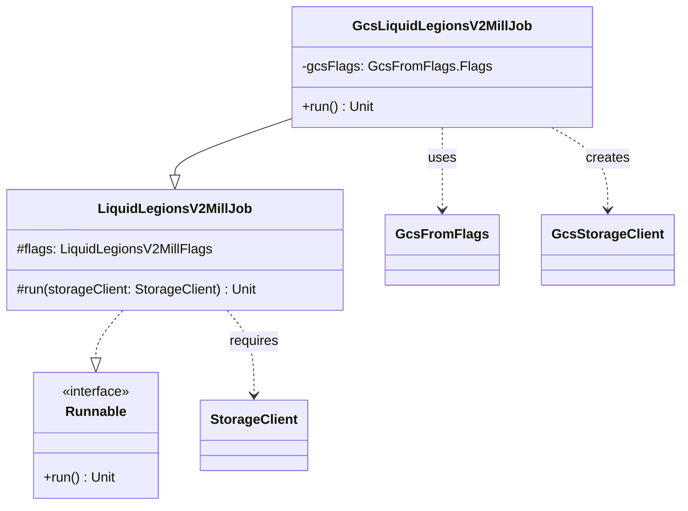

# org.wfanet.measurement.duchy.deploy.gcloud.job.mill.liquidlegionsv2

## Overview
This package provides the Google Cloud Storage (GCS) deployment implementation for the Liquid Legions V2 Mill job. It extends the common Liquid Legions V2 Mill job functionality with GCS-specific storage configuration, enabling duchy computation processing using the Liquid Legions V2 protocol on GCP infrastructure.

## Components

### GcsLiquidLegionsV2MillJob
Command-line executable that processes claimed work for Liquid Legions V2 computations using GCS for storage.

| Method | Parameters | Returns | Description |
|--------|------------|---------|-------------|
| run | None | `Unit` | Initializes GCS storage client and executes mill job |
| main | `args: Array<String>` | `Unit` | Entry point for command-line execution |

**Annotations:**
- `@CommandLine.Command` - Configures PicoCLI command with name, description, and help options

**Properties:**
| Property | Type | Description |
|----------|------|-------------|
| gcsFlags | `GcsFromFlags.Flags` | Mixin containing GCS configuration flags |

## Class Hierarchy



## Dependencies

### Internal Dependencies
- `org.wfanet.measurement.duchy.deploy.common.job.mill.liquidlegionsv2.LiquidLegionsV2MillJob` - Base abstract implementation providing core mill job logic, duchy initialization, gRPC channel setup, and computation processing workflow
- `org.wfanet.measurement.common.commandLineMain` - Command-line bootstrapping utility for Kotlin applications
- `org.wfanet.measurement.gcloud.gcs.GcsFromFlags` - GCS configuration builder from command-line flags
- `org.wfanet.measurement.gcloud.gcs.GcsStorageClient` - GCS storage client implementation

### External Dependencies
- `picocli.CommandLine` - Command-line parsing framework for declarative CLI configuration

## Parent Class Functionality

The parent class `LiquidLegionsV2MillJob` provides extensive functionality:

### Configuration Management
- **Duchy Information**: Initializes duchy identity from flags
- **TLS Certificates**: Loads client certificates for mutual TLS authentication
- **Service Channels**: Builds gRPC channels for computations service, computation control service, and system API
- **Cryptographic Keys**: Loads consent signaling certificate and private signing key

### Computation Processing
- **Mill Instantiation**: Creates either `ReachFrequencyLiquidLegionsV2Mill` or `ReachOnlyLiquidLegionsV2Mill` based on computation type
- **Work Processing**: Processes claimed computations and continues claiming new work until exhausted
- **Cryptographic Operations**: Integrates JNI-based encryption for Liquid Legions V2 protocol operations

### Service Clients
- `ComputationsCoroutineStub` - Internal duchy computations service
- `ComputationStatsCoroutineStub` - Computation statistics tracking
- `ComputationControlCoroutineStub` - Inter-duchy computation coordination (map to all other duchies)
- `SystemComputationsCoroutineStub` - System-level computation management
- `SystemComputationParticipantsCoroutineStub` - Participant tracking
- `SystemComputationLogEntriesCoroutineStub` - Audit logging

### Supported Computation Types
| Type | Mill Implementation | Crypto Worker |
|------|---------------------|---------------|
| `LIQUID_LEGIONS_SKETCH_AGGREGATION_V2` | `ReachFrequencyLiquidLegionsV2Mill` | `JniLiquidLegionsV2Encryption` |
| `REACH_ONLY_LIQUID_LEGIONS_SKETCH_AGGREGATION_V2` | `ReachOnlyLiquidLegionsV2Mill` | `JniReachOnlyLiquidLegionsV2Encryption` |

## Usage Example

```kotlin
// Command-line execution
fun main(args: Array<String>) = commandLineMain(GcsLiquidLegionsV2MillJob(), args)

// Typical deployment command:
// java -jar mill-job.jar \
//   --duchy=worker1 \
//   --gcs-project=my-project \
//   --gcs-bucket=computation-storage \
//   --tls-cert-file=/etc/certs/cert.pem \
//   --tls-private-key-file=/etc/certs/key.pem \
//   --computations-service-target=localhost:8080 \
//   --system-api-target=kingdom.example.com:443 \
//   --claimed-global-computation-id=12345 \
//   --claimed-computation-version=2
```

## Configuration Flags

The job inherits extensive configuration from parent classes:

### GCS Flags (GcsLiquidLegionsV2MillJob)
- GCS project ID
- GCS bucket name
- GCS credentials configuration

### Mill Flags (LiquidLegionsV2MillFlags)
- `--duchy` - Duchy identifier
- `--duchy-info-flags` - Duchy information configuration
- `--system-api-flags` - System API endpoint configuration
- `--computations-service-flags` - Internal computations service configuration
- `--claimed-computation-flags` - Specific computation to process (ID, version, type)
- `--parallelism` - Maximum number of threads for crypto operations (default: 1)

### Additional Inherited Flags (MillFlags)
- TLS certificate paths
- Consent signaling certificate
- Work lock duration
- Request chunk size
- Channel shutdown timeout

## Architecture Notes

1. **Deployment Pattern**: This class serves as the GCP-specific entry point, delegating core logic to the platform-agnostic `LiquidLegionsV2MillJob`
2. **Storage Abstraction**: Uses `StorageClient` interface, allowing the parent class to remain cloud-agnostic
3. **Single Responsibility**: Only responsible for GCS client instantiation; all mill logic resides in parent class
4. **Command-Line First**: Designed as a standalone executable for Kubernetes Job deployments
5. **Coroutine-Based**: Parent class uses `runBlocking` with coroutine context for async computation processing
