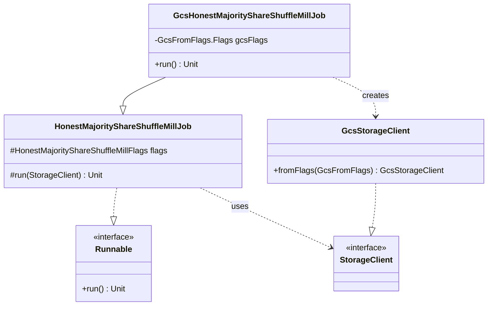

# org.wfanet.measurement.duchy.deploy.gcloud.job.mill.shareshuffle

## Overview
This package provides the Google Cloud Storage (GCS) implementation for the Honest Majority Share Shuffle Mill job deployment. It serves as the entry point for executing Honest Majority Share Shuffle cryptographic computations on duchy infrastructure using GCS as the underlying storage backend for computation artifacts and intermediate data.

## Components

### GcsHonestMajorityShareShuffleMillJob
Command-line executable mill job that processes Honest Majority Share Shuffle computations using GCS storage.

| Method | Parameters | Returns | Description |
|--------|------------|---------|-------------|
| run | - | `Unit` | Initializes GCS storage client and invokes parent mill execution |
| main | `args: Array<String>` | `Unit` | Entry point for command-line execution |

**Annotations:**
- `@CommandLine.Command` - Configures Picocli command-line interface with name "GcsHonestMajorityShareShuffleMillJob"
- `@CommandLine.Mixin` - Injects GCS configuration flags from `GcsFromFlags.Flags`

**Inheritance:** Extends `HonestMajorityShareShuffleMillJob` from `org.wfanet.measurement.duchy.deploy.common.job.mill.shareshuffle`

## Key Functionality

### Storage Integration
The class bridges GCS-specific deployment concerns with the generic Honest Majority Share Shuffle mill implementation by:
1. Reading GCS configuration from command-line flags
2. Constructing a `GcsStorageClient` instance
3. Delegating to the parent class's `run(StorageClient)` method with the GCS-backed storage

### Command-Line Interface
Provides a runnable entry point that:
- Accepts standard help options (`--help`, `-h`)
- Shows default values for all parameters
- Integrates GCS-specific flags (bucket names, credentials, etc.)
- Supports all mill-specific flags from parent class

## Dependencies

### Internal Dependencies
- `org.wfanet.measurement.common.commandLineMain` - Command-line application bootstrap utilities
- `org.wfanet.measurement.duchy.deploy.common.job.mill.shareshuffle.HonestMajorityShareShuffleMillJob` - Abstract parent mill implementation containing core computation logic
- `org.wfanet.measurement.gcloud.gcs.GcsFromFlags` - Flag parsing utilities for GCS configuration
- `org.wfanet.measurement.gcloud.gcs.GcsStorageClient` - GCS-backed storage client implementation

### External Dependencies
- `picocli.CommandLine` - Command-line parsing and annotation framework

## Parent Class Capabilities

The inherited `HonestMajorityShareShuffleMillJob` provides:
- Mill initialization with duchy identity and cryptographic keys
- gRPC channel setup for system API and computation services
- Certificate management for consent signals
- Computation claiming and processing workflow
- Integration with `HonestMajorityShareShuffleMill` for protocol execution

### Configuration Flags (Inherited)
The mill job accepts configuration for:
- Duchy identification and role assignment
- TLS certificates for mutual authentication
- System API endpoints (computations, participants, control)
- Public API endpoints (certificates)
- Protocol setup configuration
- Computation claiming parameters
- Work lock duration and chunk sizes
- Optional key encryption key for private key storage

## Usage Example

```kotlin
// Command-line invocation
fun main(args: Array<String>) =
  commandLineMain(GcsHonestMajorityShareShuffleMillJob(), args)

// Example command-line arguments:
// --duchy-name=worker1
// --gcs-bucket=duchy-computations
// --gcs-project=my-gcp-project
// --protocols-setup-config=/etc/protocols.textproto
// --cs-certificate-der-file=/etc/certs/cs-cert.der
// --cs-private-key-der-file=/etc/keys/cs-key.der
// --computations-service-target=localhost:8080
// --system-api-target=kingdom.example.com:443
// --public-api-target=public-api.example.com:443
```

## Deployment Context

This implementation is specifically designed for Google Cloud Platform deployments where:
- Computation data must be persisted to GCS buckets
- Storage must be shared across mill instances for work distribution
- High durability and availability are required for computation artifacts
- Integration with GCP IAM and service accounts is needed

## Class Diagram



## Related Components

- **HonestMajorityShareShuffleMill** - Core mill implementation that executes the cryptographic protocol
- **JniHonestMajorityShareShuffleCryptor** - Native cryptographic operations implementation
- **ComputationDataClients** - Abstraction for reading/writing computation state
- **ForwardedStorageHonestMajorityShareShuffleMillJob** - Alternative storage implementation for forwarded storage

## Protocol Overview

The Honest Majority Share Shuffle protocol executed by this mill involves:
1. **Setup Phase** - Duchy role assignment (aggregator, first non-aggregator, second non-aggregator)
2. **Shuffle Phase** - Cryptographic shuffling and sharing of encrypted event data
3. **Aggregation Phase** - Combining shares to produce frequency counts
4. **Result Computation** - Computing reach and frequency metrics with differential privacy

Each duchy processes work items asynchronously, coordinating through the system API and exchanging encrypted protocol messages.
