# org.wfanet.measurement.duchy.deploy.gcloud.server

## Overview
This package provides Google Cloud Platform (GCP) deployment implementations for duchy server components in the Cross-Media Measurement system. Each server class implements a specific duchy service using GCP infrastructure services (Cloud Spanner, Cloud Storage, Cloud Postgres) as backing stores. The servers are command-line applications that initialize GCP clients and wire them to their respective service implementations.

## Components

### ForwardedStorageSpannerComputationServer
Command-line server implementing the Computations service using Cloud Spanner for database operations and forwarded storage for blob storage.

| Method | Parameters | Returns | Description |
|--------|------------|---------|-------------|
| run | - | `Unit` | Initializes Spanner and forwarded storage clients and starts server |

**Command-Line Mixins:**
- `spannerFlags: SpannerFlags` - Spanner database configuration
- `forwardedStorageFlags: ForwardedStorageFromFlags.Flags` - Forwarded storage configuration

**Properties:**
| Property | Type | Description |
|----------|------|-------------|
| protocolStageEnumHelper | `ComputationProtocolStages` | Helper for computation protocol stage enums |
| computationProtocolStageDetails | `ComputationProtocolStageDetails` | Details about computation protocol stages |

### GcsComputationControlServer
Command-line server implementing the Computation Control service using Google Cloud Storage for blob operations.

| Method | Parameters | Returns | Description |
|--------|------------|---------|-------------|
| run | - | `Unit` | Initializes GCS client and starts server |

**Command-Line Mixins:**
- `gcsFlags: GcsFromFlags.Flags` - Google Cloud Storage configuration

### GcsPostgresDuchyDataServer
Command-line server implementing the Duchy Data service using Cloud Postgres for relational data and GCS for blob storage.

| Method | Parameters | Returns | Description |
|--------|------------|---------|-------------|
| run | - | `Unit` | Initializes Postgres and GCS clients and starts server |

**Command-Line Mixins:**
- `serviceFlags: ServiceFlags` - General service configuration
- `gcsFlags: GcsFromFlags.Flags` - Google Cloud Storage configuration
- `gCloudPostgresFlags: GCloudPostgresFlags` - Google Cloud Postgres configuration

### GcsRequisitionFulfillmentServer
Command-line server implementing the Requisition Fulfillment service using Google Cloud Storage for requisition data.

| Method | Parameters | Returns | Description |
|--------|------------|---------|-------------|
| run | - | `Unit` | Initializes GCS client and starts server |

**Command-Line Mixins:**
- `gcsFlags: GcsFromFlags.Flags` - Google Cloud Storage configuration

### GcsSpannerComputationsServer
Command-line server implementing the Computations service using Cloud Spanner for database operations and GCS for blob storage.

| Method | Parameters | Returns | Description |
|--------|------------|---------|-------------|
| run | - | `Unit` | Initializes Spanner and GCS clients and starts server |

**Command-Line Mixins:**
- `spannerFlags: SpannerFlags` - Spanner database configuration
- `gcsFlags: GcsFromFlags.Flags` - Google Cloud Storage configuration

**Properties:**
| Property | Type | Description |
|----------|------|-------------|
| protocolStageEnumHelper | `ComputationProtocolStages` | Helper for computation protocol stage enums |
| computationProtocolStageDetails | `ComputationProtocolStageDetails` | Details about computation protocol stages |

## Dependencies

### GCP Infrastructure
- `org.wfanet.measurement.gcloud.spanner` - Cloud Spanner database client and utilities
- `org.wfanet.measurement.gcloud.gcs` - Google Cloud Storage client and flag parsing
- `org.wfanet.measurement.gcloud.postgres` - Cloud Postgres connection factories and flags
- `org.wfanet.measurement.storage.forwarded` - Forwarded storage abstraction for testing

### Duchy Core Services
- `org.wfanet.measurement.duchy.deploy.common.server` - Base server implementations (ComputationsServer, ComputationControlServer, DuchyDataServer, RequisitionFulfillmentServer)
- `org.wfanet.measurement.duchy.deploy.common.service` - Duchy service implementations
- `org.wfanet.measurement.duchy.deploy.gcloud.spanner.computation` - Spanner-based computation database layer
- `org.wfanet.measurement.duchy.deploy.gcloud.spanner.continuationtoken` - Spanner continuation token service
- `org.wfanet.measurement.duchy.db.computation` - Computation database abstractions

### Common Libraries
- `org.wfanet.measurement.common` - Shared utilities (IdGenerator, commandLineMain)
- `org.wfanet.measurement.common.identity` - ID generation utilities
- `org.wfanet.measurement.common.db.r2dbc.postgres` - Reactive Postgres client
- `picocli` - Command-line argument parsing framework
- `kotlinx.coroutines` - Kotlin coroutines for async operations

## Usage Example

```kotlin
// Launch the GCS Spanner Computations Server
fun main(args: Array<String>) =
  commandLineMain(GcsSpannerComputationsServer(), args)

// Example command-line invocation:
// java -jar server.jar \
//   --spanner-project=my-project \
//   --spanner-instance=my-instance \
//   --spanner-database=my-database \
//   --gcs-bucket=my-bucket
```

## Class Diagram

```mermaid
classDiagram
    class ComputationsServer {
        <<abstract>>
        +run()
    }
    class ComputationControlServer {
        <<abstract>>
        +run()
    }
    class DuchyDataServer {
        <<abstract>>
        +run()
    }
    class RequisitionFulfillmentServer {
        <<abstract>>
        +run()
    }

    class ForwardedStorageSpannerComputationServer {
        -spannerFlags: SpannerFlags
        -forwardedStorageFlags: ForwardedStorageFromFlags.Flags
        +run() Unit
    }
    class GcsSpannerComputationsServer {
        -spannerFlags: SpannerFlags
        -gcsFlags: GcsFromFlags.Flags
        +run() Unit
    }
    class GcsComputationControlServer {
        -gcsFlags: GcsFromFlags.Flags
        +run() Unit
    }
    class GcsPostgresDuchyDataServer {
        -serviceFlags: ServiceFlags
        -gcsFlags: GcsFromFlags.Flags
        -gCloudPostgresFlags: GCloudPostgresFlags
        +run() Unit
    }
    class GcsRequisitionFulfillmentServer {
        -gcsFlags: GcsFromFlags.Flags
        +run() Unit
    }

    ComputationsServer <|-- ForwardedStorageSpannerComputationServer
    ComputationsServer <|-- GcsSpannerComputationsServer
    ComputationControlServer <|-- GcsComputationControlServer
    DuchyDataServer <|-- GcsPostgresDuchyDataServer
    RequisitionFulfillmentServer <|-- GcsRequisitionFulfillmentServer

    ForwardedStorageSpannerComputationServer --> GcpSpannerComputationsDatabaseReader
    ForwardedStorageSpannerComputationServer --> GcpSpannerComputationsDatabaseTransactor
    ForwardedStorageSpannerComputationServer --> SpannerContinuationTokensService

    GcsSpannerComputationsServer --> GcpSpannerComputationsDatabaseReader
    GcsSpannerComputationsServer --> GcpSpannerComputationsDatabaseTransactor
    GcsSpannerComputationsServer --> SpannerContinuationTokensService
    GcsSpannerComputationsServer --> GcsStorageClient

    GcsComputationControlServer --> GcsStorageClient
    GcsPostgresDuchyDataServer --> GcsStorageClient
    GcsPostgresDuchyDataServer --> PostgresDatabaseClient
    GcsRequisitionFulfillmentServer --> GcsStorageClient
```



## Architecture Notes

### Storage Backend Variants
The package provides two variants for the Computations server:
- **GcsSpannerComputationsServer**: Production configuration using real GCS for blob storage
- **ForwardedStorageSpannerComputationServer**: Testing/development configuration using forwarded storage that can proxy to remote storage services

### Command-Line Interface
All servers use the PicoCLI framework with:
- Standard help options (`--help`, `--version`)
- Default value display in help text
- Mixin-based flag composition for modular configuration
- Type-safe command-line argument parsing

### Initialization Pattern
Each server follows the same initialization pattern:
1. Parse command-line flags via PicoCLI mixins
2. Initialize GCP clients (Spanner, GCS, Postgres) from flags
3. Wire clients to service implementations
4. Delegate to base class `run()` method with initialized dependencies
