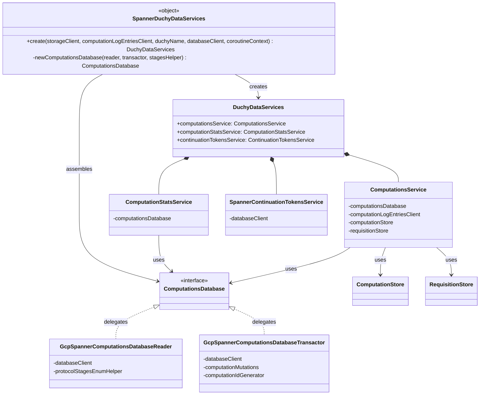

# org.wfanet.measurement.duchy.deploy.gcloud.service

## Overview
This package provides Google Cloud Platform-specific service implementations for duchy data operations. It acts as a factory layer that wires together Spanner-backed database clients, storage systems, and internal services to create a complete duchy data services infrastructure for managing distributed cryptographic computations.

## Components

### SpannerDuchyDataServices
Factory object that creates and configures duchy data services using Google Cloud Spanner as the backend persistence layer.

| Method | Parameters | Returns | Description |
|--------|------------|---------|-------------|
| create | `storageClient: StorageClient`, `computationLogEntriesClient: ComputationLogEntriesCoroutineStub`, `duchyName: String`, `databaseClient: AsyncDatabaseClient`, `coroutineContext: CoroutineContext` | `DuchyDataServices` | Constructs fully configured duchy data services with Spanner backend |

#### Private Methods
| Method | Parameters | Returns | Description |
|--------|------------|---------|-------------|
| newComputationsDatabase | `computationsDatabaseReader: ComputationsDatabaseReader`, `computationDb: ComputationsDb`, `protocolStagesEnumHelper: ComputationProtocolStagesEnumHelper<ComputationTypeEnum.ComputationType, ComputationStage>` | `ComputationsDatabase` | Creates database instance by delegating to reader, transactor, and enum helper |

## Type Aliases

| Alias | Target Type | Description |
|-------|-------------|-------------|
| ComputationsDb | `ComputationsDatabaseTransactor<ComputationTypeEnum.ComputationType, ComputationStage, ComputationStageDetails, ComputationDetails>` | Simplifies complex generic transactor type for internal use |

## Dependencies

### Core GCP Infrastructure
- `org.wfanet.measurement.gcloud.spanner` - Async Spanner database client for GCP integration
- `org.wfanet.measurement.storage` - Abstract storage client interface for blob storage

### Spanner-Specific Implementations
- `org.wfanet.measurement.duchy.deploy.gcloud.spanner.computation` - Spanner-backed computation database reader, transactor, and mutation operations
- `org.wfanet.measurement.duchy.deploy.gcloud.spanner.continuationtoken` - Spanner-backed continuation token service for streaming operations

### Database Abstraction Layer
- `org.wfanet.measurement.duchy.db.computation` - Protocol-agnostic computation database interfaces, type helpers, stage helpers, and protocol stage details

### Service Layer
- `org.wfanet.measurement.duchy.service.internal.computations` - Internal computations service for computation lifecycle management
- `org.wfanet.measurement.duchy.service.internal.computationstats` - Internal computation statistics service
- `org.wfanet.measurement.duchy.deploy.common.service` - Common duchy data services aggregation interface

### Storage Layer
- `org.wfanet.measurement.duchy.storage` - Computation and requisition blob storage abstractions

### External System Integration
- `org.wfanet.measurement.system.v1alpha` - gRPC stub for computation log entries client
- `org.wfanet.measurement.common` - ID generator for computation identifiers

### Protocol Definitions
- `org.wfanet.measurement.internal.duchy` - Protocol buffer definitions for computation details, stages, and type enums

## Usage Example
```kotlin
import org.wfanet.measurement.duchy.deploy.gcloud.service.SpannerDuchyDataServices
import org.wfanet.measurement.gcloud.spanner.AsyncDatabaseClient
import org.wfanet.measurement.storage.StorageClient
import kotlinx.coroutines.Dispatchers

// Configure dependencies
val databaseClient: AsyncDatabaseClient = // ... Spanner client
val storageClient: StorageClient = // ... GCS or blob storage
val logEntriesClient: ComputationLogEntriesCoroutineStub = // ... gRPC stub
val duchyName = "duchy-1"

// Create duchy data services
val duchyDataServices = SpannerDuchyDataServices.create(
  storageClient = storageClient,
  computationLogEntriesClient = logEntriesClient,
  duchyName = duchyName,
  databaseClient = databaseClient,
  coroutineContext = Dispatchers.Default
)

// Access individual services
val computationsService = duchyDataServices.computationsService
val computationStatsService = duchyDataServices.computationStatsService
val continuationTokensService = duchyDataServices.continuationTokensService
```

## Architecture Notes

### Service Composition
The `create` method assembles three distinct internal services into a `DuchyDataServices` container:
1. **ComputationsService** - Manages computation lifecycle, state transitions, blob storage, and logging
2. **ComputationStatsService** - Provides computation statistics and metrics
3. **SpannerContinuationTokensService** - Handles streaming pagination tokens

### Database Layer Strategy
The factory uses a dual-layer database abstraction:
- **Reader Layer**: `GcpSpannerComputationsDatabaseReader` for read-only queries
- **Transactor Layer**: `GcpSpannerComputationsDatabaseTransactor` for write operations with mutation support

These are combined via delegation in `newComputationsDatabase` to produce a unified `ComputationsDatabase` interface that implements both reading and transactional capabilities.

### Type System
Computation protocols are parameterized by four generic types that are bound to specific protocol buffer implementations:
- **ComputationType**: Enum distinguishing MPC protocol variants
- **ComputationStage**: Enum representing protocol state machine stages
- **ComputationStageDetails**: Protocol-specific metadata for each stage
- **ComputationDetails**: Overall computation configuration and parameters

## Class Diagram

