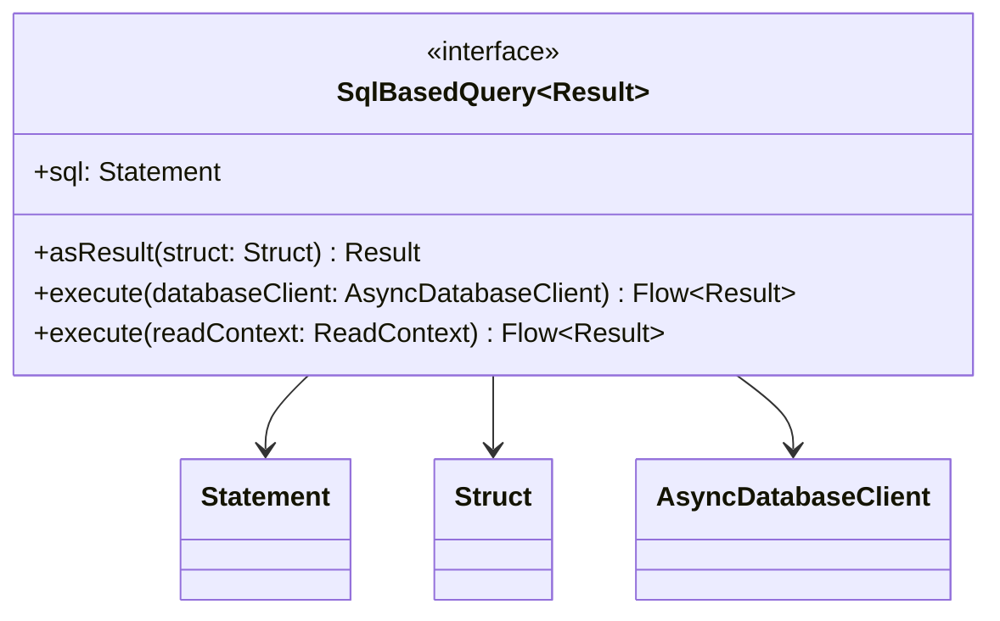

# org.wfanet.measurement.duchy.deploy.gcloud.spanner.common

## Overview
This package provides abstractions for executing SQL-based queries against Google Cloud Spanner databases. It wraps Spanner result sets and structs to simplify query execution patterns, enabling type-safe mapping of database rows to domain objects through coroutine-based asynchronous flows.

## Components

### SqlBasedQuery<Result>
Generic interface for executing SQL queries against Spanner and transforming results into domain objects.

| Method | Parameters | Returns | Description |
|--------|------------|---------|-------------|
| asResult | `struct: Struct` | `Result` | Transforms a single Spanner row struct into the result type |
| execute | `databaseClient: AsyncDatabaseClient` | `Flow<Result>` | Executes query using single-use read context |
| execute | `readContext: AsyncDatabaseClient.ReadContext` | `Flow<Result>` | Executes query using provided read context with query tagging |

## Data Structures

### SqlBasedQuery Properties

| Property | Type | Description |
|----------|------|-------------|
| sql | `Statement` | The SQL statement to execute against Spanner |

## Dependencies
- `com.google.cloud.spanner` - Provides Spanner client types (Statement, Struct, Options)
- `kotlinx.coroutines.flow` - Enables asynchronous streaming of query results
- `org.wfanet.measurement.gcloud.spanner` - Supplies AsyncDatabaseClient for async Spanner operations

## Usage Example
```kotlin
// Implement SqlBasedQuery for a specific domain object
data class ComputationRow(val id: String, val status: String)

class FetchComputations : SqlBasedQuery<ComputationRow> {
    override val sql = Statement.of("SELECT ComputationId, Status FROM Computations")

    override fun asResult(struct: Struct): ComputationRow {
        return ComputationRow(
            id = struct.getString("ComputationId"),
            status = struct.getString("Status")
        )
    }
}

// Execute the query
val query = FetchComputations()
val results: Flow<ComputationRow> = query.execute(databaseClient)
results.collect { row ->
    println("Computation ${row.id}: ${row.status}")
}
```

## Class Diagram

