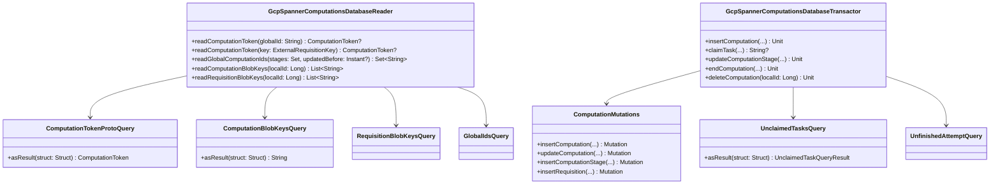

# org.wfanet.measurement.duchy.deploy.gcloud.spanner.computation

## Overview
This package provides Google Cloud Spanner database implementation for duchy computation persistence. It handles database read/write operations for computation lifecycle management, including task claiming, stage transitions, blob references, and requisitions through SQL queries and mutations.

## Components

### GcpSpannerComputationsDatabaseReader
Implementation of database reader interface using GCP Spanner for read-only computation operations.

| Method | Parameters | Returns | Description |
|--------|------------|---------|-------------|
| readComputationToken | `globalId: String` | `ComputationToken?` | Retrieves computation token by global ID |
| readComputationToken | `externalRequisitionKey: ExternalRequisitionKey` | `ComputationToken?` | Retrieves computation token by requisition key |
| readGlobalComputationIds | `stages: Set<ComputationStage>`, `updatedBefore: Instant?` | `Set<String>` | Fetches global IDs filtered by stage and time |
| readComputationBlobKeys | `localId: Long` | `List<String>` | Retrieves blob storage keys for computation |
| readRequisitionBlobKeys | `localId: Long` | `List<String>` | Retrieves blob storage keys for requisitions |

### GcpSpannerComputationsDatabaseTransactor
Implementation of database transactor interface for transactional computation state mutations.

| Method | Parameters | Returns | Description |
|--------|------------|---------|-------------|
| insertComputation | `globalId: String`, `protocol: ProtocolT`, `initialStage: StageT`, `stageDetails: StageDT`, `computationDetails: ComputationDT`, `requisitions: List<RequisitionEntry>` | `Unit` | Creates new computation with initial stage |
| enqueue | `token: ComputationEditToken<ProtocolT, StageT>`, `delaySecond: Int`, `expectedOwner: String` | `Unit` | Enqueues computation with delay for processing |
| claimTask | `protocol: ProtocolT`, `ownerId: String`, `lockDuration: Duration`, `prioritizedStages: List<StageT>` | `String?` | Claims computation task with distributed locking |
| updateComputationStage | `token: ComputationEditToken<ProtocolT, StageT>`, `nextStage: StageT`, `inputBlobPaths: List<String>`, `passThroughBlobPaths: List<String>`, `outputBlobs: Int`, `afterTransition: AfterTransition`, `nextStageDetails: StageDT`, `lockExtension: Duration?` | `Unit` | Transitions computation to next stage |
| endComputation | `token: ComputationEditToken<ProtocolT, StageT>`, `endingStage: StageT`, `endComputationReason: EndComputationReason`, `computationDetails: ComputationDT` | `Unit` | Finalizes computation with terminal status |
| updateComputationDetails | `token: ComputationEditToken<ProtocolT, StageT>`, `computationDetails: ComputationDT`, `requisitions: List<RequisitionEntry>` | `Unit` | Updates computation and requisition details |
| writeOutputBlobReference | `token: ComputationEditToken<ProtocolT, StageT>`, `blobRef: BlobRef` | `Unit` | Records output blob reference path |
| writeRequisitionBlobPath | `token: ComputationEditToken<ProtocolT, StageT>`, `externalRequisitionKey: ExternalRequisitionKey`, `pathToBlob: String`, `publicApiVersion: String`, `protocol: RequisitionDetails.RequisitionProtocol?` | `Unit` | Writes blob path for requisition data |
| insertComputationStat | `localId: Long`, `stage: StageT`, `attempt: Long`, `metric: ComputationStatMetric` | `Unit` | Records computation performance metric |
| deleteComputation | `localId: Long` | `Unit` | Removes computation from database |

### ComputationMutations
Generic factory for Spanner mutations targeting computation-related tables.

| Method | Parameters | Returns | Description |
|--------|------------|---------|-------------|
| insertComputation | `localId: Long`, `creationTime: Timestamp`, `updateTime: Timestamp`, `globalId: String`, `protocol: ProtocolT`, `stage: StageT`, `lockOwner: String`, `lockExpirationTime: Timestamp`, `details: ComputationDT` | `Mutation` | Creates Computations table insert mutation |
| updateComputation | `localId: Long`, `updateTime: Timestamp`, `stage: StageT?`, `lockOwner: String?`, `lockExpirationTime: Timestamp?`, `details: ComputationDT?` | `Mutation` | Creates Computations table update mutation |
| insertComputationStage | `localId: Long`, `stage: StageT`, `nextAttempt: Long`, `creationTime: Timestamp`, `endTime: Timestamp?`, `previousStage: StageT?`, `followingStage: StageT?`, `details: StageDT` | `Mutation` | Creates ComputationStages table insert mutation |
| updateComputationStage | `localId: Long`, `stage: StageT`, `nextAttempt: Long?`, `creationTime: Timestamp?`, `endTime: Timestamp?`, `previousStage: StageT?`, `followingStage: StageT?`, `details: StageDT?` | `Mutation` | Creates ComputationStages table update mutation |
| insertComputationStageAttempt | `localId: Long`, `stage: StageT`, `attempt: Long`, `beginTime: Timestamp`, `endTime: Timestamp?`, `details: ComputationStageAttemptDetails` | `Mutation` | Creates ComputationStageAttempts table insert mutation |
| updateComputationStageAttempt | `localId: Long`, `stage: StageT`, `attempt: Long`, `beginTime: Timestamp?`, `endTime: Timestamp?`, `details: ComputationStageAttemptDetails?` | `Mutation` | Creates ComputationStageAttempts table update mutation |
| insertComputationBlobReference | `localId: Long`, `stage: StageT`, `blobId: Long`, `pathToBlob: String?`, `dependencyType: ComputationBlobDependency` | `Mutation` | Creates ComputationBlobReferences table insert mutation |
| updateComputationBlobReference | `localId: Long`, `stage: StageT`, `blobId: Long`, `pathToBlob: String?`, `dependencyType: ComputationBlobDependency?` | `Mutation` | Creates ComputationBlobReferences table update mutation |
| insertComputationStat | `localId: Long`, `stage: StageT`, `attempt: Long`, `metricName: String`, `metricValue: Long` | `Mutation` | Creates ComputationStats table insert mutation |
| insertRequisition | `localComputationId: Long`, `requisitionId: Long`, `externalRequisitionId: String`, `requisitionFingerprint: ByteString`, `pathToBlob: String?`, `requisitionDetails: RequisitionDetails` | `Mutation` | Creates Requisitions table insert mutation |
| updateRequisition | `localComputationId: Long`, `requisitionId: Long`, `externalRequisitionId: String`, `requisitionFingerprint: ByteString`, `pathToBlob: String?`, `requisitionDetails: RequisitionDetails?` | `Mutation` | Creates Requisitions table update mutation |

### ComputationTokenProtoQuery
Query for constructing ComputationToken protobuf from Spanner database by global ID or requisition key.

| Method | Parameters | Returns | Description |
|--------|------------|---------|-------------|
| asResult | `struct: Struct` | `ComputationToken` | Transforms Spanner result into token protobuf |

### ComputationBlobKeysQuery
Query for retrieving blob storage paths associated with a computation.

| Method | Parameters | Returns | Description |
|--------|------------|---------|-------------|
| asResult | `struct: Struct` | `String` | Extracts PathToBlob from query result |

### RequisitionBlobKeysQuery
Query for retrieving blob storage paths associated with requisitions.

| Method | Parameters | Returns | Description |
|--------|------------|---------|-------------|
| asResult | `struct: Struct` | `String` | Extracts PathToBlob from query result |

### GlobalIdsQuery
Query for filtering global computation IDs by stage and update timestamp.

| Method | Parameters | Returns | Description |
|--------|------------|---------|-------------|
| asResult | `struct: Struct` | `String` | Extracts GlobalComputationId from result |

### UnclaimedTasksQuery
Query for finding claimable computation tasks ordered by priority and creation time.

| Method | Parameters | Returns | Description |
|--------|------------|---------|-------------|
| asResult | `struct: Struct` | `UnclaimedTaskQueryResult<StageT>` | Transforms result to task query result |

### UnfinishedAttemptQuery
Query for retrieving stage attempts without end times for a computation.

| Method | Parameters | Returns | Description |
|--------|------------|---------|-------------|
| asResult | `struct: Struct` | `UnfinishedAttemptQueryResult<StageT>` | Transforms result to attempt query result |

## Data Structures

### UnclaimedTaskQueryResult
| Property | Type | Description |
|----------|------|-------------|
| computationId | `Long` | Local computation identifier |
| globalId | `String` | Global computation identifier |
| computationStage | `StageT` | Current computation stage |
| creationTime | `Timestamp` | Computation creation timestamp |
| updateTime | `Timestamp` | Last update timestamp |
| nextAttempt | `Long` | Next attempt number for stage |

### UnfinishedAttemptQueryResult
| Property | Type | Description |
|----------|------|-------------|
| computationId | `Long` | Local computation identifier |
| stage | `StageT` | Computation stage type |
| attempt | `Long` | Attempt number |
| details | `ComputationStageAttemptDetails` | Attempt details protobuf |

## Dependencies
- `com.google.cloud.spanner` - Google Cloud Spanner client for database operations
- `org.wfanet.measurement.duchy.db.computation` - Computation database interfaces and helpers
- `org.wfanet.measurement.gcloud.spanner` - Spanner utility extensions and helpers
- `org.wfanet.measurement.internal.duchy` - Internal duchy protocol buffers for computation state
- `org.wfanet.measurement.common` - Common utilities for ID generation

## Usage Example
```kotlin
// Initialize database reader
val reader = GcpSpannerComputationsDatabaseReader(
  databaseClient = asyncDatabaseClient,
  computationProtocolStagesHelper = stagesHelper
)

// Read computation token
val token = reader.readComputationToken(globalId = "computation-123")

// Initialize database transactor with mutations factory
val mutations = ComputationMutations(
  computationTypeEnumHelper,
  computationProtocolStagesEnumHelper,
  computationProtocolStageDetailsHelper
)

val transactor = GcpSpannerComputationsDatabaseTransactor(
  databaseClient = asyncDatabaseClient,
  computationMutations = mutations,
  computationIdGenerator = idGenerator
)

// Claim a task
val claimedGlobalId = transactor.claimTask(
  protocol = ComputationType.LIQUID_LEGIONS_V2,
  ownerId = "worker-1",
  lockDuration = Duration.ofMinutes(5),
  prioritizedStages = listOf(ComputationStage.SETUP_PHASE)
)
```

## Class Diagram

