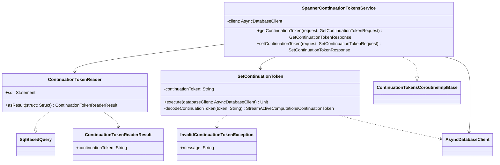

# org.wfanet.measurement.duchy.deploy.gcloud.spanner.continuationtoken

## Overview
This package provides Cloud Spanner-backed persistence for continuation tokens used by the Herald service to track streaming computation state. It implements a gRPC service for reading and writing continuation tokens with timestamp-based validation to ensure monotonic progression through computation streams.

## Components

### ContinuationTokenReader
SQL-based query class that retrieves the current continuation token from Spanner.

| Method | Parameters | Returns | Description |
|--------|------------|---------|-------------|
| asResult | `struct: Struct` | `ContinuationTokenReaderResult` | Converts Spanner row to result object |

**Inherited from SqlBasedQuery:**
| Property | Type | Description |
|----------|------|-------------|
| sql | `Statement` | SQL query to fetch continuation token from HeraldContinuationTokens table |

### ContinuationTokenReaderResult
Data class holding the query result.

| Property | Type | Description |
|----------|------|-------------|
| continuationToken | `String` | Base64-encoded continuation token retrieved from database |

### SetContinuationToken
Command class that updates the continuation token in Spanner with timestamp validation.

| Method | Parameters | Returns | Description |
|--------|------------|---------|-------------|
| execute | `databaseClient: AsyncDatabaseClient` | `suspend Unit` | Validates and persists new continuation token |
| decodeContinuationToken | `token: String` | `StreamActiveComputationsContinuationToken` | Decodes base64-encoded token to protobuf message |

**Constructor Parameters:**
| Parameter | Type | Description |
|-----------|------|-------------|
| continuationToken | `String` | Base64-encoded continuation token to set |

**Behavior:**
- Reads existing token from database
- Decodes both old and new tokens to compare timestamps
- Throws `InvalidContinuationTokenException` if new token has older timestamp than existing
- Performs insert-or-update mutation with commit timestamp

### InvalidContinuationTokenException
Exception thrown when attempting to set a continuation token with a timestamp older than the current token.

### SpannerContinuationTokensService
gRPC service implementation for continuation token operations.

| Method | Parameters | Returns | Description |
|--------|------------|---------|-------------|
| getContinuationToken | `request: GetContinuationTokenRequest` | `suspend GetContinuationTokenResponse` | Retrieves current continuation token or empty response if none exists |
| setContinuationToken | `request: SetContinuationTokenRequest` | `suspend SetContinuationTokenResponse` | Validates and stores new continuation token |

**Constructor Parameters:**
| Parameter | Type | Description |
|-----------|------|-------------|
| client | `AsyncDatabaseClient` | Spanner database client for persistence operations |
| coroutineContext | `CoroutineContext` | Coroutine context for async operations |

**Error Handling:**
- Returns `FAILED_PRECONDITION` status for timestamp validation failures
- Returns `INVALID_ARGUMENT` status for malformed protobuf tokens

## Data Structures

### ContinuationTokenReaderResult
| Property | Type | Description |
|----------|------|-------------|
| continuationToken | `String` | Base64-encoded continuation token string |

## Dependencies
- `com.google.cloud.spanner` - Cloud Spanner client library for database operations
- `org.wfanet.measurement.gcloud.spanner` - Custom Spanner utilities for async transactions and mutations
- `org.wfanet.measurement.duchy.deploy.gcloud.spanner.common` - Base query classes (SqlBasedQuery)
- `org.wfanet.measurement.internal.duchy` - Internal gRPC service definitions for continuation tokens
- `org.wfanet.measurement.system.v1alpha` - Protobuf definitions for StreamActiveComputationsContinuationToken
- `org.wfanet.measurement.common` - Base64 URL encoding utilities
- `com.google.protobuf` - Protocol buffer utilities for timestamp comparison

## Usage Example
```kotlin
// Create the service
val service = SpannerContinuationTokensService(
  client = asyncDatabaseClient,
  coroutineContext = Dispatchers.Default
)

// Get current continuation token
val getRequest = GetContinuationTokenRequest.getDefaultInstance()
val getResponse = service.getContinuationToken(getRequest)
val currentToken = getResponse.token

// Set new continuation token
val setRequest = setContinuationTokenRequest {
  token = encodedNewToken
}
val setResponse = service.setContinuationToken(setRequest)
```

## Class Diagram

