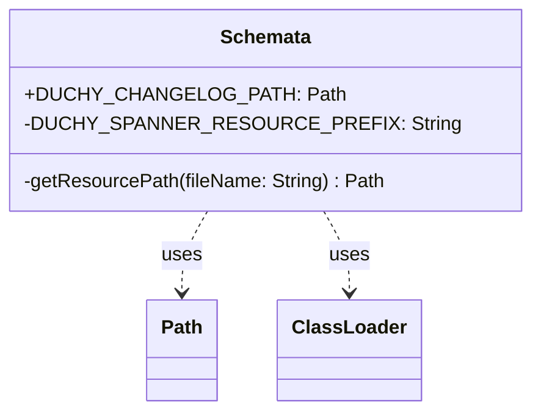

# org.wfanet.measurement.duchy.deploy.gcloud.spanner.testing

## Overview
This package provides testing utilities for Duchy Spanner database schema management. It exposes Spanner schema definitions as classpath resources to enable integration testing with the Google Cloud Spanner emulator and test database initialization.

## Components

### Schemata
Singleton object that provides access to Duchy Spanner database schema resources for testing purposes.

| Method | Parameters | Returns | Description |
|--------|------------|---------|-------------|
| getResourcePath | `fileName: String` | `Path` | Resolves resource file path from classpath using thread context class loader |

### Constants

| Property | Type | Description |
|----------|------|-------------|
| DUCHY_CHANGELOG_PATH | `Path` | Path to Liquibase changelog YAML file for Duchy Spanner schema |
| DUCHY_SPANNER_RESOURCE_PREFIX | `String` | Internal constant defining resource directory prefix ("duchy/spanner") |

## Dependencies
- `java.nio.file.Path` - File path representation for schema resources
- `org.wfanet.measurement.common.getJarResourcePath` - Extension function to resolve JAR resources

## Usage Example
```kotlin
import org.wfanet.measurement.duchy.deploy.gcloud.spanner.testing.Schemata
import org.wfanet.measurement.gcloud.spanner.testing.SpannerEmulatorDatabaseRule

// In a test class
val spannerDatabase = SpannerEmulatorDatabaseRule(
  spannerEmulator,
  Schemata.DUCHY_CHANGELOG_PATH
)
```

## Integration Testing Context
This package is used by multiple test suites to bootstrap Spanner database schemas:
- `SpannerComputationsServiceTest` - Tests for computation service persistence
- `SpannerComputationStatsServiceTest` - Tests for computation statistics
- `GcpSpannerComputationsDatabaseTransactorTest` - Tests for database transactions
- `GcpSpannerComputationsDatabaseReaderTest` - Tests for database read operations
- `SpannerContinuationTokensServiceTest` - Tests for continuation token management
- `ComputationsSchemaTest` - Schema validation tests
- `SpannerDuchyDependencyProviderRule` - Integration test dependency injection

## Class Diagram

