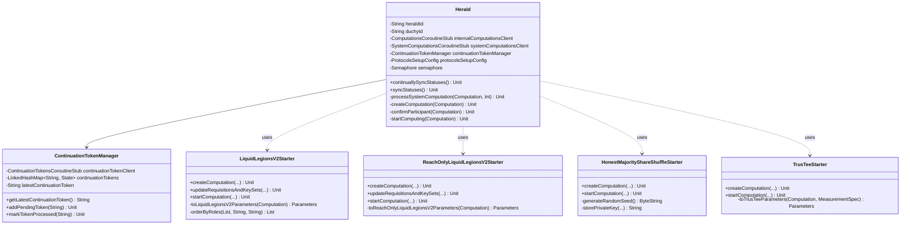

# org.wfanet.measurement.duchy.herald

## Overview
The herald package manages computation lifecycle synchronization between duchy nodes and the Kingdom system. It monitors Kingdom-side computation states, creates and initializes local duchy computations, and orchestrates protocol-specific computation startup across multiple MPC protocols (Liquid Legions V2, Reach-Only Liquid Legions V2, Honest Majority Share Shuffle, and TrusTEE).

## Components

### Herald
Main orchestrator that syncs computation states between Kingdom and duchy storage, creating and advancing computations based on Kingdom notifications.

| Method | Parameters | Returns | Description |
|--------|------------|---------|-------------|
| continuallySyncStatuses | - | `Unit` (suspend) | Continuously syncs computation statuses in loop with retry logic |
| syncStatuses | - | `Unit` (suspend) | Streams active computations from Kingdom and processes them |
| processSystemComputation | `computation: Computation`, `maxAttempts: Int` | `Unit` (suspend) | Processes a system computation with retry handling |
| createComputation | `systemComputation: Computation` | `Unit` (suspend) | Creates new computation based on protocol type |
| confirmParticipant | `systemComputation: Computation` | `Unit` (suspend) | Updates requisitions and key sets during confirmation phase |
| startComputing | `systemComputation: Computation` | `Unit` (suspend) | Starts computation from WAIT_TO_START stage |
| failComputationAtKingdom | `computation: Computation`, `errorMessage: String` | `Unit` (suspend) | Reports computation failure to Kingdom system |
| failComputationAtDuchy | `computation: Computation` | `Unit` (suspend) | Marks local computation as failed |
| deleteComputationAtDuchy | `computation: Computation` | `Unit` (suspend) | Deletes terminal computation from local storage |
| runWithRetries | `systemComputation: Computation`, `block: suspend (Computation) -> R` | `R` (suspend) | Executes block with exponential backoff retry logic |

#### Constructor Parameters
| Property | Type | Description |
|----------|------|-------------|
| heraldId | `String` | Unique identifier for this herald instance |
| duchyId | `String` | Identifier of the duchy this herald serves |
| internalComputationsClient | `ComputationsCoroutineStub` | Client for duchy internal computation service |
| systemComputationsClient | `SystemComputationsCoroutineStub` | Client for Kingdom system computation service |
| systemComputationParticipantClient | `SystemComputationParticipantsCoroutineStub` | Client for computation participant operations |
| continuationTokenManager | `ContinuationTokenManager` | Manages streaming continuation tokens |
| protocolsSetupConfig | `ProtocolsSetupConfig` | Configuration for all supported MPC protocols |
| clock | `Clock` | Clock for timestamp generation |
| privateKeyStore | `PrivateKeyStore<TinkKeyId, TinkPrivateKeyHandle>?` | Store for HMSS private keys (required for non-aggregators) |
| blobStorageBucket | `String` | Blob storage path prefix (default: "computation-blob-storage") |
| maxAttempts | `Int` | Maximum retry attempts for computation start (default: 5) |
| maxStreamingAttempts | `Int` | Maximum retry attempts for streaming (default: 5) |
| maxConcurrency | `Int` | Maximum concurrent computation processing (default: 5) |
| retryBackoff | `ExponentialBackoff` | Backoff strategy for retries |
| deletableComputationStates | `Set<State>` | Terminal states allowing deletion |

### ContinuationTokenManager
Manages continuation tokens for streaming active computations, ensuring in-order processing and persistence.

| Method | Parameters | Returns | Description |
|--------|------------|---------|-------------|
| getLatestContinuationToken | - | `String` (suspend) | Retrieves latest continuation token for streaming |
| addPendingToken | `continuationToken: String` | `Unit` | Adds token to pending queue in order |
| markTokenProcessed | `continuationToken: String` | `Unit` (suspend) | Marks token as processed and persists if leading |

#### Constructor Parameters
| Property | Type | Description |
|----------|------|-------------|
| continuationTokenClient | `ContinuationTokensCoroutineStub` | Client for persisting continuation tokens |

### HonestMajorityShareShuffleStarter
Protocol starter for Honest Majority Share Shuffle computations with encryption key generation for non-aggregators.

| Method | Parameters | Returns | Description |
|--------|------------|---------|-------------|
| createComputation | `duchyId: String`, `computationStorageClient: ComputationsCoroutineStub`, `systemComputation: Computation`, `protocolSetupConfig: HonestMajorityShareShuffleSetupConfig`, `blobStorageBucket: String`, `privateKeyStore: PrivateKeyStore?` | `Unit` (suspend) | Creates HMSS computation with encryption keys and random seed |
| startComputation | `token: ComputationToken`, `computationStorageClient: ComputationsCoroutineStub` | `Unit` (suspend) | Starts computation for FIRST_NON_AGGREGATOR role |

### LiquidLegionsV2Starter
Protocol starter for Liquid Legions V2 sketch aggregation computations supporting reach and frequency measurements.

| Method | Parameters | Returns | Description |
|--------|------------|---------|-------------|
| createComputation | `duchyId: String`, `computationStorageClient: ComputationsCoroutineStub`, `systemComputation: Computation`, `liquidLegionsV2SetupConfig: LiquidLegionsV2SetupConfig`, `blobStorageBucket: String` | `Unit` (suspend) | Creates LLv2 computation with parameters extracted from measurement spec |
| updateRequisitionsAndKeySets | `token: ComputationToken`, `computationStorageClient: ComputationsCoroutineStub`, `systemComputation: Computation`, `aggregatorId: String` | `Unit` (suspend) | Updates computation with participant ElGamal keys ordered by role |
| startComputation | `token: ComputationToken`, `computationStorageClient: ComputationsCoroutineStub` | `Unit` (suspend) | Advances non-aggregator computation to SETUP_PHASE |

### ReachOnlyLiquidLegionsV2Starter
Protocol starter for reach-only variant of Liquid Legions V2 optimized for reach measurements.

| Method | Parameters | Returns | Description |
|--------|------------|---------|-------------|
| createComputation | `duchyId: String`, `computationStorageClient: ComputationsCoroutineStub`, `systemComputation: Computation`, `reachOnlyLiquidLegionsV2SetupConfig: LiquidLegionsV2SetupConfig`, `blobStorageBucket: String` | `Unit` (suspend) | Creates reach-only LLv2 computation without frequency parameters |
| updateRequisitionsAndKeySets | `token: ComputationToken`, `computationStorageClient: ComputationsCoroutineStub`, `systemComputation: Computation`, `aggregatorId: String` | `Unit` (suspend) | Updates requisitions and ElGamal public keys for participants |
| startComputation | `token: ComputationToken`, `computationStorageClient: ComputationsCoroutineStub` | `Unit` (suspend) | Starts computation with output paths from previous stage |

### TrusTeeStarter
Protocol starter for TrusTEE (Trusted Execution Environment) computations with aggregator role requirement.

| Method | Parameters | Returns | Description |
|--------|------------|---------|-------------|
| createComputation | `duchyId: String`, `computationStorageClient: ComputationsCoroutineStub`, `systemComputation: Computation`, `protocolSetupConfig: TrusTeeSetupConfig`, `blobStorageBucket: String` | `Unit` (suspend) | Creates TrusTEE computation for aggregator role only |
| startComputation | `token: ComputationToken`, `computationStorageClient: ComputationsCoroutineStub` | `Unit` (suspend) | Advances computation from WAIT_TO_START to COMPUTING |

## Data Structures

### Herald.AttemptsExhaustedException
| Property | Type | Description |
|----------|------|-------------|
| cause | `Throwable` | Original exception that caused retry failure |

### ContinuationTokenManager.SetContinuationTokenException
| Property | Type | Description |
|----------|------|-------------|
| message | `String` | Error message describing token persistence failure |

### ContinuationTokenManager.State (private enum)
| Value | Description |
|-------|-------------|
| PENDING | Token received but computation not yet processed |
| PROCESSED | Token's computation successfully processed |

## Dependencies
- `org.wfanet.measurement.system.v1alpha` - Kingdom system API for computation and participant services
- `org.wfanet.measurement.internal.duchy` - Duchy internal services for computation storage and tokens
- `org.wfanet.measurement.common.crypto` - Cryptographic key storage for HMSS protocol
- `org.wfanet.measurement.duchy.db.computation` - Database operations for computation advancement
- `org.wfanet.measurement.api.v2alpha` - Public API for measurement specifications
- `kotlinx.coroutines` - Asynchronous processing with concurrency control
- `io.grpc` - gRPC communication with Kingdom and internal services

## Usage Example
```kotlin
// Initialize Herald with dependencies
val herald = Herald(
  heraldId = "herald-001",
  duchyId = "worker1",
  internalComputationsClient = internalComputationsStub,
  systemComputationsClient = systemComputationsStub,
  systemComputationParticipantClient = systemParticipantStub,
  continuationTokenManager = tokenManager,
  protocolsSetupConfig = protocolsConfig,
  clock = Clock.systemUTC(),
  privateKeyStore = tinkKeyStore,
  maxConcurrency = 10,
  deletableComputationStates = setOf(State.SUCCEEDED, State.FAILED)
)

// Start continuous sync loop
herald.continuallySyncStatuses()
```

## Protocol State Transitions

### Liquid Legions V2 / Reach-Only Liquid Legions V2
1. **PENDING_REQUISITION_PARAMS** → Herald creates computation → **INITIALIZATION_PHASE**
2. **PENDING_PARTICIPANT_CONFIRMATION** → Herald updates keys → **WAIT_REQUISITIONS_AND_KEY_SET** → **CONFIRMATION_PHASE**
3. **PENDING_COMPUTATION** → Herald starts computation → **WAIT_TO_START** → **SETUP_PHASE**

### Honest Majority Share Shuffle
1. **PENDING_REQUISITION_PARAMS** → Herald creates computation with encryption keys → **INITIALIZED**
2. **PENDING_COMPUTATION** → Herald starts (FIRST_NON_AGGREGATOR only) → **WAIT_TO_START** → **SETUP_PHASE**

### TrusTEE
1. **PENDING_REQUISITION_PARAMS** → Herald creates computation → **INITIALIZED**
2. **PENDING_COMPUTATION** → Herald starts aggregator → **WAIT_TO_START** → **COMPUTING**

## Error Handling

### Transient Errors
Herald retries operations on these gRPC status codes:
- `ABORTED` - Conflict with concurrent operation
- `DEADLINE_EXCEEDED` - Timeout on RPC call
- `RESOURCE_EXHAUSTED` - Temporary resource limitation
- `UNKNOWN` - Unclassified transient error
- `UNAVAILABLE` - Service temporarily unavailable

Retry attempts use exponential backoff with configurable maximum attempts.

### Non-Transient Errors
Herald fails the computation at both Kingdom and duchy level:
- Reports failure to Kingdom via `failComputationParticipant`
- Marks local computation as failed via `finishComputation` with TERMINAL_STAGE
- Includes error message and timestamp in failure record

## Class Diagram

