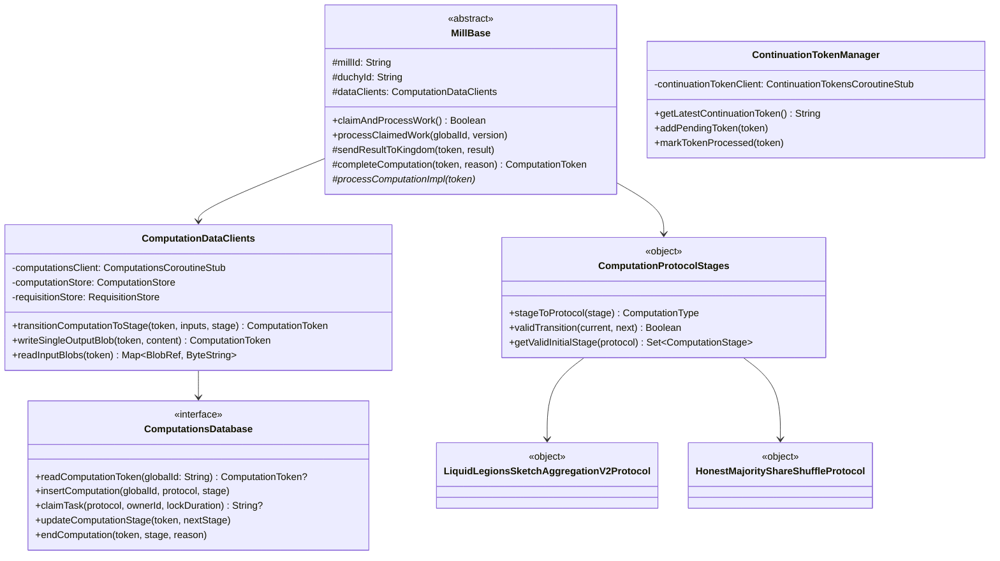

# org.wfanet.measurement.duchy

## Overview

The duchy package implements the core functionality for a Duchy (Data Computation Unit) in the Cross-Media Measurement System. It manages multi-party computation (MPC) protocols, computation lifecycle management, storage operations, and coordination between duchies. The package supports multiple MPC protocols including Liquid Legions V2, Honest Majority Share Shuffle, and TrusTEE.

## Components

### ComputationStage Extensions

Extension functions for working with `ComputationStage` protocol buffers.

| Method | Parameters | Returns | Description |
|--------|------------|---------|-------------|
| name | - | `String` | Extracts stage name from protocol-specific stage enum |
| number | - | `Int` | Extracts stage number from protocol-specific stage enum |
| toProtocolStage | `this: LiquidLegionsSketchAggregationV2.Stage` | `ComputationStage` | Converts LLv2 stage to ComputationStage proto |
| toProtocolStage | `this: ReachOnlyLiquidLegionsSketchAggregationV2.Stage` | `ComputationStage` | Converts RoLLv2 stage to ComputationStage proto |
| toProtocolStage | `this: HonestMajorityShareShuffle.Stage` | `ComputationStage` | Converts HMSS stage to ComputationStage proto |
| toProtocolStage | `this: TrusTee.Stage` | `ComputationStage` | Converts TrusTEE stage to ComputationStage proto |
| toComputationStage | `this: SystemComputationStage` | `ComputationStage` | Converts system API stage to internal stage representation |

### ETags

Utility object for generating entity tags for versioning.

| Method | Parameters | Returns | Description |
|--------|------------|---------|-------------|
| computeETag | `version: Long` | `String` | Generates RFC 7232 weak entity tag from version number |

### ComputationDataClients

Storage clients providing access to computations and blob storage.

| Method | Parameters | Returns | Description |
|--------|------------|---------|-------------|
| transitionComputationToStage | `computationToken: ComputationToken`, `inputsToNextStage: List<String>`, `passThroughBlobs: List<String>`, `stage: ComputationStage` | `ComputationToken` | Advances computation to next stage with specified inputs |
| writeSingleOutputBlob | `computationToken: ComputationToken`, `content: ByteString` | `ComputationToken` | Writes single output blob for current stage |
| readAllRequisitionBlobs | `token: ComputationToken`, `duchyId: String` | `ByteString` | Reads and combines all requisition blobs from duchy |
| readRequisitionBlobs | `token: ComputationToken` | `Map<String, ByteString>` | Returns map of requisition IDs to blob content |
| readSingleRequisitionBlob | `requisition: RequisitionMetadata` | `ByteString?` | Reads single requisition blob by metadata |
| readInputBlobs | `token: ComputationToken` | `Map<BlobRef, ByteString>` | Returns map of blob references to content for inputs |
| readSingleOutputBlob | `token: ComputationToken` | `Flow<ByteString>?` | Reads single output blob as flow or null |

#### Nested Classes

**TransientErrorException**: Indicates retryable computation error
**PermanentErrorException**: Indicates non-retryable computation error requiring failure

### ComputationEditToken

Encapsulates information needed to edit a computation safely.

| Property | Type | Description |
|----------|------|-------------|
| localId | `Long` | Local database identifier for computation |
| protocol | `ProtocolT` | Protocol used for computation |
| stage | `StageT` | Current computation stage |
| attempt | `Int` | Current attempt number for stage |
| editVersion | `Long` | Monotonically increasing version for concurrency control |
| globalId | `String` | Global identifier for computation |

### ComputationsDatabase

Primary interface for computation database operations combining read and write capabilities.

**Extends**: `ComputationsDatabaseReader`, `ComputationsDatabaseTransactor`, `ComputationProtocolStagesEnumHelper`

#### ComputationsDatabaseReader Methods

| Method | Parameters | Returns | Description |
|--------|------------|---------|-------------|
| readComputationToken | `globalId: String` | `ComputationToken?` | Retrieves current computation token by global ID |
| readComputationToken | `externalRequisitionKey: ExternalRequisitionKey` | `ComputationToken?` | Retrieves token by requisition key |
| readGlobalComputationIds | `stages: Set<ComputationStage>`, `updatedBefore: Instant?` | `Set<String>` | Queries computation IDs by stage and update time |
| readComputationBlobKeys | `localId: Long` | `List<String>` | Retrieves all blob keys for computation |
| readRequisitionBlobKeys | `localId: Long` | `List<String>` | Retrieves all requisition blob keys |

#### ComputationsDatabaseTransactor Methods

| Method | Parameters | Returns | Description |
|--------|------------|---------|-------------|
| insertComputation | `globalId: String`, `protocol: ProtocolT`, `initialStage: StageT`, `stageDetails: StageDetailsT`, `computationDetails: ComputationDetailsT`, `requisitions: List<RequisitionEntry>` | `Unit` | Creates new computation and adds to queue |
| deleteComputation | `localId: Long` | `Unit` | Removes computation and all related records |
| enqueue | `token: ComputationEditToken`, `delaySecond: Int`, `expectedOwner: String` | `Unit` | Adds computation to work queue with delay |
| claimTask | `protocol: ProtocolT`, `ownerId: String`, `lockDuration: Duration`, `prioritizedStages: List<StageT>` | `String?` | Claims next available work item with lock |
| updateComputationStage | `token: ComputationEditToken`, `nextStage: StageT`, `inputBlobPaths: List<String>`, `passThroughBlobPaths: List<String>`, `outputBlobs: Int`, `afterTransition: AfterTransition`, `nextStageDetails: StageDetailsT`, `lockExtension: Duration?` | `Unit` | Transitions computation to new stage |
| endComputation | `token: ComputationEditToken`, `endingStage: StageT`, `endComputationReason: EndComputationReason`, `computationDetails: ComputationDetailsT` | `Unit` | Moves computation to terminal state |
| updateComputationDetails | `token: ComputationEditToken`, `computationDetails: ComputationDetailsT`, `requisitions: List<RequisitionEntry>` | `Unit` | Updates computation details |
| writeOutputBlobReference | `token: ComputationEditToken`, `blobRef: BlobRef` | `Unit` | Records blob reference for output |
| writeRequisitionBlobPath | `token: ComputationEditToken`, `externalRequisitionKey: ExternalRequisitionKey`, `pathToBlob: String`, `publicApiVersion: String`, `protocol: RequisitionDetails.RequisitionProtocol?` | `Unit` | Writes requisition blob path from fulfillment |
| insertComputationStat | `localId: Long`, `stage: StageT`, `attempt: Long`, `metric: ComputationStatMetric` | `Unit` | Inserts computation statistic metric |

### ComputationProtocolStageDetails

Object that handles stage-specific details for all computation protocols.

| Method | Parameters | Returns | Description |
|--------|------------|---------|-------------|
| validateRoleForStage | `stage: ComputationStage`, `computationDetails: ComputationDetails` | `Boolean` | Validates if computation role can execute stage |
| afterTransitionForStage | `stage: ComputationStage` | `AfterTransition` | Determines post-transition action for stage |
| outputBlobNumbersForStage | `stage: ComputationStage`, `computationDetails: ComputationDetails` | `Int` | Returns expected output blob count for stage |
| detailsFor | `stage: ComputationStage`, `computationDetails: ComputationDetails` | `ComputationStageDetails` | Creates stage-specific details proto |
| parseDetails | `protocol: ComputationType`, `bytes: ByteArray` | `ComputationStageDetails` | Parses stage details from bytes |
| setEndingState | `details: ComputationDetails`, `reason: EndComputationReason` | `ComputationDetails` | Sets completion reason in details |
| parseComputationDetails | `bytes: ByteArray` | `ComputationDetails` | Parses computation details from bytes |

### ComputationProtocolStages

Object providing protocol stage enumeration operations.

| Method | Parameters | Returns | Description |
|--------|------------|---------|-------------|
| stageToProtocol | `stage: ComputationStage` | `ComputationType` | Extracts protocol type from stage |
| computationStageEnumToLongValues | `value: ComputationStage` | `ComputationStageLongValues` | Converts stage enum to long values |
| longValuesToComputationStageEnum | `value: ComputationStageLongValues` | `ComputationStage` | Converts long values to stage enum |
| getValidInitialStage | `protocol: ComputationType` | `Set<ComputationStage>` | Returns valid initial stages for protocol |
| getValidTerminalStages | `protocol: ComputationType` | `Set<ComputationStage>` | Returns valid terminal stages for protocol |
| validInitialStage | `protocol: ComputationType`, `stage: ComputationStage` | `Boolean` | Checks if stage is valid initial stage |
| validTerminalStage | `protocol: ComputationType`, `stage: ComputationStage` | `Boolean` | Checks if stage is valid terminal stage |
| validTransition | `currentStage: ComputationStage`, `nextStage: ComputationStage` | `Boolean` | Validates stage transition is allowed |

### ComputationTypes

Helper object for working with `ComputationType` enums.

| Method | Parameters | Returns | Description |
|--------|------------|---------|-------------|
| protocolEnumToLong | `value: ComputationType` | `Long` | Converts protocol enum to long value |
| longToProtocolEnum | `value: Long` | `ComputationType` | Converts long value to protocol enum |
| toComputationType | `this: ComputationStage` | `ComputationType` | Extracts computation type from stage |

### MillBase

Abstract base class for computation processing mills.

| Method | Parameters | Returns | Description |
|--------|------------|---------|-------------|
| processClaimedWork | `globalComputationId: String`, `version: Long` | `Unit` | Processes previously claimed work item |
| claimAndProcessWork | - | `Boolean` | Claims next available work and processes it |
| sendRequisitionParamsToKingdom | `token: ComputationToken`, `requisitionParams: ComputationParticipant.RequisitionParams` | `Unit` | Sends requisition parameters to Kingdom |
| sendResultToKingdom | `token: ComputationToken`, `computationResult: ComputationResult` | `Unit` | Sends encrypted computation result to Kingdom |
| updateComputationParticipant | `token: ComputationToken`, `callKingdom: suspend (ComputationParticipant) -> Unit` | `Unit` | Updates participant at Kingdom with retry logic |
| existingOutputOr | `token: ComputationToken`, `block: suspend () -> ByteString` | `EncryptedComputationResult` | Returns cached result or computes new one |
| existingOutputAnd | `token: ComputationToken`, `block: suspend () -> ByteString` | `EncryptedComputationResult` | Executes block but returns cached result if exists |
| readAndCombineAllInputBlobs | `token: ComputationToken`, `count: Int` | `ByteString` | Reads and combines all input blobs |
| completeComputation | `token: ComputationToken`, `reason: CompletedReason` | `ComputationToken` | Completes computation with specified reason |
| sendAdvanceComputationRequest | `header: AdvanceComputationRequest.Header`, `content: Flow<ByteString>`, `stub: ComputationControlCoroutineStub` | `Unit` | Sends computation advancement to other duchy |
| updateComputationDetails | `request: UpdateComputationDetailsRequest` | `ComputationToken` | Updates computation details via gRPC |
| getComputationStageInOtherDuchy | `globalComputationId: String`, `otherDuchyId: String`, `stub: ComputationControlCoroutineStub` | `ComputationStage` | Retrieves current stage from another duchy |
| logStageDurationMetric | `token: ComputationToken`, `metricName: String`, `metricValue: Duration`, `histogram: DoubleHistogram` | `Unit` | Logs and records duration metric |
| logWallClockDuration | `token: ComputationToken`, `metricName: String`, `histogram: DoubleHistogram`, `block: suspend () -> T` | `T` | Executes block and logs wall clock duration |
| addLoggingHook | `token: ComputationToken`, `bytes: Flow<ByteString>` | `Flow<ByteString>` | Adds logging for bytes sent in RPC |
| processComputationImpl | `token: ComputationToken` | `Unit` | Abstract method for protocol-specific processing |

### MillType

Enumeration of mill types for different protocols.

| Value | Description |
|-------|-------------|
| LIQUID_LEGIONS_V2 | Liquid Legions V2 and Reach-only variant |
| HONEST_MAJORITY_SHARE_SHUFFLE | Honest Majority Share Shuffle protocol |
| TRUS_TEE | TrusTEE protocol |

**Extension Properties**:
- `ComputationType.millType`: Returns corresponding mill type
- `ComputationType.prioritizedStages`: Returns prioritized stages for claiming

### ContinuationTokenManager

Manages continuation tokens for streaming computations.

| Method | Parameters | Returns | Description |
|--------|------------|---------|-------------|
| getLatestContinuationToken | - | `String` | Retrieves latest continuation token |
| addPendingToken | `continuationToken: String` | `Unit` | Adds token to pending queue |
| markTokenProcessed | `continuationToken: String` | `Unit` | Marks token as processed and updates if sequential |

### LiquidLegionsSketchAggregationV2Protocol

Protocol implementation for Liquid Legions V2 MPC.

**Nested Objects**:

**EnumStages**: Stage management for raw enum values
- `validInitialStages`: Set of valid starting stages
- `validTerminalStages`: Set of valid ending stages
- `validSuccessors`: Map of valid stage transitions
- `enumToLong()`: Converts stage to long
- `longToEnum()`: Converts long to stage

**ComputationStages**: Stage management for wrapped stages
- Implements `ProtocolStageEnumHelper<ComputationStage>`
- Wraps `EnumStages` functionality for `ComputationStage` protos

**Details**: Stage details management
- `validateRoleForStage()`: Validates role for stage execution
- `afterTransitionForStage()`: Determines post-transition action
- `outputBlobNumbersForStage()`: Calculates expected output count
- `detailsFor()`: Creates stage-specific details

### HonestMajorityShareShuffleProtocol

Protocol implementation for Honest Majority Share Shuffle MPC.

**Nested Objects**:

**EnumStages**: Stage management for raw enum values
- `validInitialStages`: Set containing `INITIALIZED`
- `validTerminalStages`: Set containing `COMPLETE`
- `validSuccessors`: Map defining valid stage progressions
- `enumToLong()`: Converts stage to long value
- `longToEnum()`: Converts long to stage enum

**ComputationStages**: Stage management for wrapped stages
- Delegates to `EnumStages` for stage validation and transitions

**Details**: Stage details management
- `validateRoleForStage()`: Checks role compatibility with stage
- `afterTransitionForStage()`: Determines queue behavior after transition
- `outputBlobNumbersForStage()`: Returns expected blob output count
- `detailsFor()`: Constructs stage-specific detail protos

## Data Structures

### BlobRef

Reference to blob storage location.

| Property | Type | Description |
|----------|------|-------------|
| idInRelationalDatabase | `Long` | Blob identifier in database |
| key | `String` | Object key for blob retrieval |

### ComputationStatMetric

Metric captured during computation processing.

| Property | Type | Description |
|----------|------|-------------|
| name | `String` | Metric identifier |
| value | `Long` | Numerical metric value |

### ComputationStageLongValues

Long value representation of computation stage.

| Property | Type | Description |
|----------|------|-------------|
| protocol | `Long` | Protocol identifier as long |
| stage | `Long` | Stage identifier as long |

### EncryptedComputationResult

Result of computation with encryption.

| Property | Type | Description |
|----------|------|-------------|
| bytes | `Flow<ByteString>` | Encrypted result byte stream |
| token | `ComputationToken` | Updated computation token |

### Certificate

X.509 certificate wrapper.

| Property | Type | Description |
|----------|------|-------------|
| name | `String` | Public API certificate name |
| value | `X509Certificate` | Certificate instance |

## Enumerations

### AfterTransition

Specifies lock behavior after stage transition.

| Value | Description |
|-------|-------------|
| CONTINUE_WORKING | Retain and extend lock for current owner |
| ADD_UNCLAIMED_TO_QUEUE | Release lock and add to unclaimed queue |
| DO_NOT_ADD_TO_QUEUE | Release lock without queueing |

### EndComputationReason

Reason for computation termination.

| Value | Description |
|-------|-------------|
| SUCCEEDED | Computation completed successfully |
| FAILED | Computation failed permanently |
| CANCELED | Computation canceled without issues |

## Interfaces

### ComputationProtocolStageDetailsHelper

Interface for managing protocol-specific stage details.

| Method | Parameters | Returns | Description |
|--------|------------|---------|-------------|
| detailsFor | `stage: StageT`, `computationDetails: ComputationDetailsT` | `StageDetailsT` | Creates stage-specific details |
| parseDetails | `protocol: ProtocolT`, `bytes: ByteArray` | `StageDetailsT` | Parses details from bytes |
| validateRoleForStage | `stage: StageT`, `computationDetails: ComputationDetailsT` | `Boolean` | Validates role for stage |
| afterTransitionForStage | `stage: StageT` | `AfterTransition` | Returns post-transition action |
| outputBlobNumbersForStage | `stage: StageT`, `computationDetails: ComputationDetailsT` | `Int` | Returns expected output blob count |
| setEndingState | `details: ComputationDetailsT`, `reason: EndComputationReason` | `ComputationDetailsT` | Sets ending state |
| parseComputationDetails | `bytes: ByteArray` | `ComputationDetailsT` | Parses computation details |

### ComputationProtocolStagesEnumHelper

Interface for stage enumeration operations.

| Method | Parameters | Returns | Description |
|--------|------------|---------|-------------|
| stageToProtocol | `stage: StageT` | `ProtocolT` | Extracts protocol from stage |
| computationStageEnumToLongValues | `value: StageT` | `ComputationStageLongValues` | Converts stage to long values |
| longValuesToComputationStageEnum | `value: ComputationStageLongValues` | `StageT` | Converts long values to stage |
| getValidInitialStage | `protocol: ProtocolT` | `Set<StageT>` | Returns valid initial stages |
| getValidTerminalStages | `protocol: ProtocolT` | `Set<StageT>` | Returns valid terminal stages |
| validInitialStage | `protocol: ProtocolT`, `stage: StageT` | `Boolean` | Validates initial stage |
| validTerminalStage | `protocol: ProtocolT`, `stage: StageT` | `Boolean` | Validates terminal stage |
| validTransition | `currentStage: StageT`, `nextStage: StageT` | `Boolean` | Validates transition |

### ComputationTypeEnumHelper

Converter between computation types and long values.

| Method | Parameters | Returns | Description |
|--------|------------|---------|-------------|
| protocolEnumToLong | `value: T` | `Long` | Converts enum to long |
| longToProtocolEnum | `value: Long` | `T` | Converts long to enum |

### ProtocolStageDetails

Interface for protocol-specific stage detail operations.

| Method | Parameters | Returns | Description |
|--------|------------|---------|-------------|
| detailsFor | `stage: StageT`, `computationDetails: ComputationDetailsT` | `StageDetailsT` | Creates stage details |
| parseDetails | `bytes: ByteArray` | `StageDetailsT` | Parses details from bytes |
| validateRoleForStage | `stage: StageT`, `details: ComputationDetailsT` | `Boolean` | Validates role for stage |
| afterTransitionForStage | `stage: StageT` | `AfterTransition` | Returns post-transition behavior |
| outputBlobNumbersForStage | `stage: StageT`, `computationDetails: ComputationDetailsT` | `Int` | Returns blob output count |

### ProtocolStageEnumHelper

Interface for protocol stage enumeration helpers.

| Property/Method | Type/Parameters | Returns | Description |
|-----------------|-----------------|---------|-------------|
| validInitialStages | - | `Set<StageT>` | Valid initial stages |
| validTerminalStages | - | `Set<StageT>` | Valid terminal stages |
| validSuccessors | - | `Map<StageT, Set<StageT>>` | Valid stage transitions |
| enumToLong | `value: StageT` | `Long` | Converts stage to long |
| longToEnum | `value: Long` | `StageT` | Converts long to stage |

## Dependencies

- `org.wfanet.measurement.internal.duchy` - Internal Duchy protocol definitions
- `org.wfanet.measurement.system.v1alpha` - System API for Kingdom communication
- `org.wfanet.measurement.storage` - Blob storage abstraction
- `org.wfanet.measurement.common` - Common utilities and cryptography
- `org.wfanet.measurement.consent.client.duchy` - Consent signaling clients
- `com.google.protobuf` - Protocol buffer support
- `io.grpc` - gRPC communication
- `io.opentelemetry` - Observability and metrics
- `kotlinx.coroutines` - Coroutine support for async operations

## Usage Example

```kotlin
// Initialize computation data clients
val dataClients = ComputationDataClients(
  computationStorageClient = computationsStub,
  storageClient = blobStorageClient
)

// Transition computation to next stage
val updatedToken = dataClients.transitionComputationToStage(
  computationToken = currentToken,
  inputsToNextStage = listOf("blob-key-1", "blob-key-2"),
  stage = nextStage
)

// Process computation in a mill
abstract class MyMill(
  millId: String,
  duchyId: String,
  // ... other parameters
) : MillBase(millId, duchyId, /* ... */) {

  override suspend fun processComputationImpl(token: ComputationToken) {
    when (token.computationStage.stageCase) {
      ComputationStage.StageCase.LIQUID_LEGIONS_SKETCH_AGGREGATION_V2 -> {
        processLiquidLegionsStage(token)
      }
      // Handle other protocols
    }
  }
}

// Validate stage transition
val isValid = ComputationProtocolStages.validTransition(
  currentStage = currentStage,
  nextStage = proposedStage
)
```

## Class Diagram


